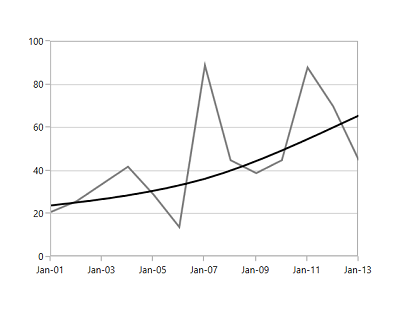
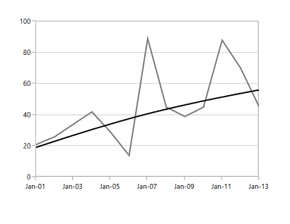
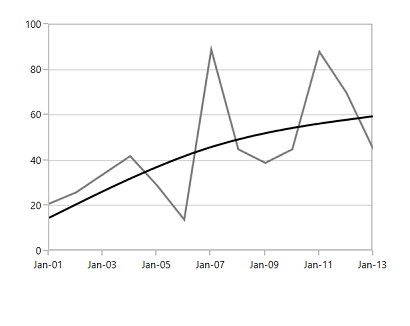
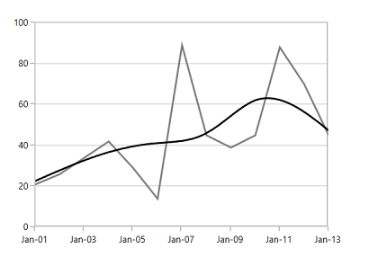
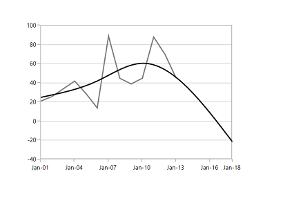
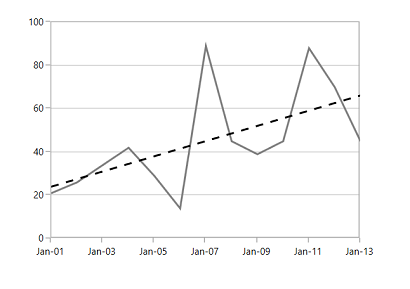

# Trendlines in WPF Charts (SfChart)

Trendlines are used to analyze and display the trends in the data graphically. They are built on assumptions based on current and past price trends.

The following code examples illustrate how to add trendlines to the chart.




<syncfusion:ScatterSeries Interior="#4A4A4A" 
                         XBindingPath="Year" 
                         Label="Series"
                         ItemsSource="{Binding List}" 
                         YBindingPath="India"
                         ScatterHeight="15" 
                         ScatterWidth="15">
    <syncfusion:ScatterSeries.Trendlines>
        <syncfusion:Trendline Label="Trend" />
    </syncfusion:ScatterSeries.Trendlines>
</syncfusion:ScatterSeries>



ScatterSeries scatterSeries = new ScatterSeries()
{
    ItemsSource = new ViewModel().List,
    XBindingPath = "Year",
    YBindingPath = "India",
    ScatterHeight = 15,
    ScatterWidth = 15,
    Interior = new SolidColorBrush(Color.FromRgb(0x4A, 0x4A, 0x4A)),
    Label = "Series"
};

Trendline trendline = new Trendline()
{
    Label = "Trend"
};
scatterSeries.Trendlines.Add(trendline);

chart.Series.Add(scatterSeries);




You can get the [`Slope`](https://help.syncfusion.com/cr/wpf/Syncfusion.UI.Xaml.Charts.TrendlineBase.html#Syncfusion_UI_Xaml_Charts_TrendlineBase_Slope) and [`Intercept`](https://help.syncfusion.com/cr/wpf/Syncfusion.UI.Xaml.Charts.TrendlineBase.html#Syncfusion_UI_Xaml_Charts_TrendlineBase_Intercept) of the drawn trendline.

The visibility of the trendline is defined using the [`IsTrendlineVisible`](https://help.syncfusion.com/cr/wpf/Syncfusion.UI.Xaml.Charts.TrendlineBase.html#Syncfusion_UI_Xaml_Charts_TrendlineBase_IsTrendlineVisible) property as shown in the following code examples.




<syncfusion:ScatterSeries Interior="#4A4A4A" 
                         XBindingPath="Year" 
                         Label="Series"
                         ItemsSource="{Binding List}" 
                         YBindingPath="India"
                         ScatterHeight="15" 
                         ScatterWidth="15">
    <syncfusion:ScatterSeries.Trendlines>
        <syncfusion:Trendline Label="Trend" IsTrendlineVisible="False"/>
    </syncfusion:ScatterSeries.Trendlines>
</syncfusion:ScatterSeries>



ScatterSeries scatterSeries = new ScatterSeries()
{
    ItemsSource = new ViewModel().List,
    XBindingPath = "Year",
    YBindingPath = "India",
    ScatterHeight = 15,
    ScatterWidth = 15,
    Interior = new SolidColorBrush(Color.FromRgb(0x4A, 0x4A, 0x4A)),
    Label = "Series"
};

Trendline trendline = new Trendline()
{
    Label = "Trend",
    IsTrendlineVisible = false
};

scatterSeries.Trendlines.Add(trendline);

chart.Series.Add(scatterSeries);




N> Here we have enabled the [`CheckBoxVisibility`](https://help.syncfusion.com/cr/wpf/Syncfusion.UI.Xaml.Charts.ChartLegend.html#Syncfusion_UI_Xaml_Charts_ChartLegend_CheckBoxVisibility) for the Legend. The CheckBox state indicates that trendline is not visible. You can enable trendline dynamically using this checkbox.

## Types of Trendlines

SfChart supports the following types of Trendlines:

* [`Linear`](https://help.syncfusion.com/cr/wpf/Syncfusion.UI.Xaml.Charts.TrendlineType.html)
* [`Exponential`](https://help.syncfusion.com/cr/wpf/Syncfusion.UI.Xaml.Charts.TrendlineType.html)
* [`Power`](https://help.syncfusion.com/cr/wpf/Syncfusion.UI.Xaml.Charts.TrendlineType.html)
* [`Logarithmic`](https://help.syncfusion.com/cr/wpf/Syncfusion.UI.Xaml.Charts.TrendlineType.html)
* [`Polynomial`](https://help.syncfusion.com/cr/wpf/Syncfusion.UI.Xaml.Charts.TrendlineType.html)

### Linear

This shows when something is increasing or decreasing at a steady rate. This is the default trendline drawn for the chart.

The linear trendline is calculated using the following formula:

yValue = Intercept + Slope * xValue (where xValue is the underlying x value).

The following is the code example of this trendline:




<syncfusion:FastLineSeries XBindingPath="Date"
                          YBindingPath="Value" 
                          Interior="#7F7F7F"
                          ItemsSource="{Binding StockPriceDetails}">
    <syncfusion:FastLineSeries.Trendlines>
        <syncfusion:Trendline Stroke="Black" Type="Linear"/>
    </syncfusion:FastLineSeries.Trendlines>
</syncfusion:FastLineSeries>



FastLineSeries fastSeries = new FastLineSeries()
{
    ItemsSource = new ViewModel().StockPriceDetails,
    XBindingPath = "Date",
    YBindingPath = "Value",
    Interior = new SolidColorBrush(Color.FromRgb(0x7f, 0x7f, 0x7f)),
    Label = "Stock Price"
};

Trendline trendline = new Trendline()
{
    Label = "Trend",
    Stroke = new SolidColorBrush(Colors.Black),
    Type = TrendlineType.Linear
};

fastSeries.Trendlines.Add(trendline);
chart.Series.Add(fastSeries);




### Exponential

This trendline is used when there is a constant increase or decrease in values. This is a curved line.

The exponential trendline is calculated using the following formula:

(Intercept*Math.Exp(Slope*xValue)) (where xValue is the underlying x value).

The following code example defines the exponential trendline:




<syncfusion:FastLineSeries XBindingPath="Date"
                          YBindingPath="Value" 
                          Interior="#7F7F7F"
                          ItemsSource="{Binding StockPriceDetails}">
    <syncfusion:FastLineSeries.Trendlines>
        <syncfusion:Trendline Stroke="Black" Type="Exponential"/>
    </syncfusion:FastLineSeries.Trendlines>
</syncfusion:FastLineSeries>



FastLineSeries fastSeries = new FastLineSeries()
{
    ItemsSource = new ViewModel().StockPriceDetails,
    XBindingPath = "Date",
    YBindingPath = "Value",
    Interior = new SolidColorBrush(Color.FromRgb(0x7f, 0x7f, 0x7f)),
    Label = "Stock Price"
};

Trendline trendline = new Trendline()
{
    Label = "Trend",
    Stroke = new SolidColorBrush(Colors.Black),
    Type = TrendlineType.Exponential
};

fastSeries.Trendlines.Add(trendline);
chart.Series.Add(fastSeries);




N> This is not recommended for data values having zero or negative values.

### Power

This trendline is used for comparing multiple sets of data that increase at a specific rate.

This is calculated using the following formula:

(Intercept*Math.Pow(xValue,Slope)) (where xValue is the underlying x value).

The following code example explains how to define the power trendline:




<syncfusion:FastLineSeries XBindingPath="Date"
                          YBindingPath="Value" 
                          Interior="#7F7F7F"
                          ItemsSource="{Binding StockPriceDetails}">
    <syncfusion:FastLineSeries.Trendlines>
        <syncfusion:Trendline Stroke="Black" Type="Power"/>
    </syncfusion:FastLineSeries.Trendlines>
</syncfusion:FastLineSeries>



FastLineSeries fastSeries = new FastLineSeries()
{
    ItemsSource = new ViewModel().StockPriceDetails,
    XBindingPath = "Date",
    YBindingPath = "Value",
    Interior = new SolidColorBrush(Color.FromRgb(0x7f, 0x7f, 0x7f)),
    Label = "Stock Price"
};

Trendline trendline = new Trendline()
{
    Label = "Trend",
    Stroke = new SolidColorBrush(Colors.Black),
    Type = TrendlineType.Power
};

fastSeries.Trendlines.Add(trendline);
chart.Series.Add(fastSeries);




### Logarithmic

This is used when there is a quick change in the data, either increasing or decreasing, and then levels out.

This is calculated using the following formula:

Intercept+Slope * Math.Log(xValue) (where xValue is the underlying x value).

The following code example illustrates the use of logarithmic trendline:




<syncfusion:FastLineSeries XBindingPath="Date"
                          YBindingPath="Value" 
                          Interior="#7F7F7F"
                          ItemsSource="{Binding StockPriceDetails}">
    <syncfusion:FastLineSeries.Trendlines>
        <syncfusion:Trendline Stroke="Black" Type="Logarithmic"/>
    </syncfusion:FastLineSeries.Trendlines>
</syncfusion:FastLineSeries>



FastLineSeries fastSeries = new FastLineSeries()
{
    ItemsSource = new ViewModel().StockPriceDetails,
    XBindingPath = "Date",
    YBindingPath = "Value",
    Interior = new SolidColorBrush(Color.FromRgb(0x7f, 0x7f, 0x7f)),
    Label = "Stock Price"
};

Trendline trendline = new Trendline()
{
    Label = "Trend",
    Stroke = new SolidColorBrush(Colors.Black),
    Type = TrendlineType.Logarithmic
};

fastSeries.Trendlines.Add(trendline);
chart.Series.Add(fastSeries);




### Polynomial

The polynomial trendline is a curved line that is used when there are more data fluctuations.

The polynomial trendline is calculated using the following formula:

PolynomialSlopes.Select((value,index)=>value*Math.Pow(xValue,(double)index)).Sum() (where xValue is the underlying x value)

To define the polynomial trendline, you can use the following code example:




<syncfusion:FastLineSeries XBindingPath="Date"
                          YBindingPath="Value" 
                          Interior="#7F7F7F"
                          ItemsSource="{Binding StockPriceDetails}">
    <syncfusion:FastLineSeries.Trendlines>
        <syncfusion:Trendline Stroke="Black" Type="Polynomial"/>
    </syncfusion:FastLineSeries.Trendlines>
</syncfusion:FastLineSeries>



FastLineSeries fastSeries = new FastLineSeries()
{
    ItemsSource = new ViewModel().StockPriceDetails,
    XBindingPath = "Date",
    YBindingPath = "Value",
    Interior = new SolidColorBrush(Color.FromRgb(0x7f, 0x7f, 0x7f)),
    Label = "Stock Price"
};

Trendline trendline = new Trendline()
{
    Label = "Trend",
    Stroke = new SolidColorBrush(Colors.Black),
    Type = TrendlineType.Polynomial
};

fastSeries.Trendlines.Add(trendline);
chart.Series.Add(fastSeries);




#### Polynomial Order

You can set the Polynomial order for this trendline. Polynomial order calculates order based on the equation, and this value should fall between 2 and 6.




<syncfusion:FastLineSeries XBindingPath="Date"
                          YBindingPath="Value" 
                          Interior="#7F7F7F"
                          ItemsSource="{Binding StockPriceDetails}">
    <syncfusion:FastLineSeries.Trendlines>
        <syncfusion:Trendline Stroke="Black" 
                             Type="Polynomial"
                             PolynomialOrder="5"/>
    </syncfusion:FastLineSeries.Trendlines>
</syncfusion:FastLineSeries>



FastLineSeries fastSeries = new FastLineSeries()
{
    ItemsSource = new ViewModel().StockPriceDetails,
    XBindingPath = "Date",
    YBindingPath = "Value",
    Interior = new SolidColorBrush(Color.FromRgb(0x7f, 0x7f, 0x7f)),
    Label = "Stock Price"
};

Trendline trendline = new Trendline()
{
    Label = "Trend",
    Stroke = new SolidColorBrush(Colors.Black),
    Type = TrendlineType.Polynomial,
    PolynomialOrder = 5
};

fastSeries.Trendlines.Add(trendline);
chart.Series.Add(fastSeries);




## Forecasting

Chart supports forecasting for the trendline, which is used to display trends about the future and the past.

The following two types of forecasting are available in SfChart:

* Forward Forecasting
* Backward Forecasting

### Forward Forecast

For determining future trends (in the forward direction). The following code example explains how to set the value for [`ForwardForecast`](https://help.syncfusion.com/cr/wpf/Syncfusion.UI.Xaml.Charts.TrendlineBase.html#Syncfusion_UI_Xaml_Charts_TrendlineBase_ForwardForecast):




<syncfusion:FastLineSeries XBindingPath="Date" 
                          YBindingPath="Value" 
                          Label="Stock Price"   
                          Interior="#7F7F7F"
                          ItemsSource="{Binding StockPriceDetails}">
    <syncfusion:FastLineSeries.Trendlines>
        <syncfusion:Trendline Stroke="Black"
                             Type="Polynomial" 
                             PolynomialOrder="3" 
                             ForwardForecast="5" />
    </syncfusion:FastLineSeries.Trendlines>
</syncfusion:FastLineSeries>



FastLineSeries fastSeries = new FastLineSeries()
{
    ItemsSource = new ViewModel().StockPriceDetails,
    XBindingPath = "Date",
    YBindingPath = "Value",
    Interior = new SolidColorBrush(Color.FromRgb(0x7f, 0x7f, 0x7f)),
    Label = "Stock Price"
};

Trendline trendline = new Trendline()
{
    Label = "Trend",
    Stroke = new SolidColorBrush(Colors.Black),
    Type = TrendlineType.Polynomial,
    PolynomialOrder = 3,
    ForwardForecast = 5
};

fastSeries.Trendlines.Add(trendline);
chart.Series.Add(fastSeries);




### Backward Forecast

For determining past trends (in the backward direction). The following code example explains how to set the value for [`BackwardForecast`](https://help.syncfusion.com/cr/wpf/Syncfusion.UI.Xaml.Charts.TrendlineBase.html#Syncfusion_UI_Xaml_Charts_TrendlineBase_BackwardForecast):




<syncfusion:FastLineSeries XBindingPath="Date" 
                          YBindingPath="Value" 
                          Label="Stock Price"   
                          Interior="#7F7F7F"
                          ItemsSource="{Binding StockPriceDetails}">
    <syncfusion:FastLineSeries.Trendlines>
        <syncfusion:Trendline Stroke="Black"
                             Type="Polynomial" 
                             PolynomialOrder="3"  
                             BackwardForecast="5" />
    </syncfusion:FastLineSeries.Trendlines>
</syncfusion:FastLineSeries>



FastLineSeries fastSeries = new FastLineSeries()
{
    ItemsSource = new ViewModel().StockPriceDetails,
    XBindingPath = "Date",
    YBindingPath = "Value",
    Interior = new SolidColorBrush(Color.FromRgb(0x7f, 0x7f, 0x7f)),
    Label = "Stock Price"
};

Trendline trendline = new Trendline()
{
    Label = "Trend",
    Stroke = new SolidColorBrush(Colors.Black),
    Type = TrendlineType.Polynomial,
    PolynomialOrder = 3,
    BackwardForecast = 5
};

fastSeries.Trendlines.Add(trendline);
chart.Series.Add(fastSeries);




## Customization 

You can customize the trendline [`Stroke`](https://help.syncfusion.com/cr/wpf/Syncfusion.UI.Xaml.Charts.TrendlineBase.html#Syncfusion_UI_Xaml_Charts_TrendlineBase_Stroke), [`StrokeThickness`](https://help.syncfusion.com/cr/wpf/Syncfusion.UI.Xaml.Charts.TrendlineBase.html#Syncfusion_UI_Xaml_Charts_TrendlineBase_StrokeThickness), and [`StrokeDashArray`](https://help.syncfusion.com/cr/wpf/Syncfusion.UI.Xaml.Charts.TrendlineBase.html#Syncfusion_UI_Xaml_Charts_TrendlineBase_StrokeDashArray) as shown in the following code example:




<syncfusion:FastLineSeries XBindingPath="Date" 
                          YBindingPath="Value" 
                          Label="Stock Price"   
                          Interior="#7F7F7F"
                          ItemsSource="{Binding StockPriceDetails}">
    <syncfusion:FastLineSeries.Trendlines>
        <syncfusion:Trendline Stroke="Black" 
                             Type="Linear"  
                             StrokeDashArray="4,4" 
                             StrokeThickness="2" />
    </syncfusion:FastLineSeries.Trendlines>
</syncfusion:FastLineSeries>



FastLineSeries fastSeries = new FastLineSeries()
{
    ItemsSource = new ViewModel().StockPriceDetails,
    XBindingPath = "Date",
    YBindingPath = "Value",
    Interior = new SolidColorBrush(Color.FromRgb(0x7f, 0x7f, 0x7f)),
    Label = "Stock Price"
};

Trendline trendline = new Trendline()
{
    Label = "Trend",
    Stroke = new SolidColorBrush(Colors.Black),
    Type = TrendlineType.Linear,
    StrokeThickness = 2,
    StrokeDashArray = new DoubleCollection() { 4, 4 }
};

fastSeries.Trendlines.Add(trendline);
chart.Series.Add(fastSeries);




N> You can refer to our [WPF Charts](https://www.syncfusion.com/wpf-controls/charts) feature tour page for its groundbreaking feature representations. You can also explore our [WPF Charts example](https://github.com/syncfusion/wpf-demos) to know various chart types and how to easily configure them with built-in support for creating stunning visual effects.

## See also

[`Chart with average line`](https://support.syncfusion.com/kb/article/2804/how-to-get-line-graph-average-for-wpf-chart-sfchart)