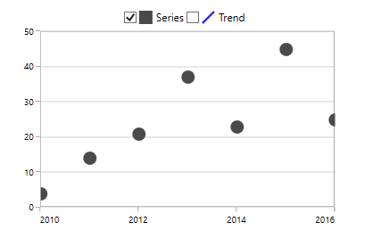
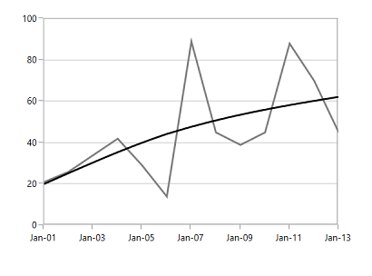
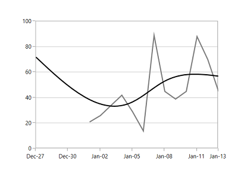

# Trendlines in WPF Charts (SfChart)

Trendlines are used to analyze and display the trends in the data graphically. It is built on the assumptions based on current and past price trends. 

The following code examples illustrate how to add trend lines to the chart.





<syncfusion:ScatterSeries Interior="#4A4A4A" XBindingPath="Year" Label="Series"

ItemsSource="{Binding List}" YBindingPath="India"

ScatterHeight="15" ScatterWidth="15">

<syncfusion:ScatterSeries.Trendlines>

<syncfusion:Trendline Label="Trend" />

</syncfusion:ScatterSeries.Trendlines>

</syncfusion:ScatterSeries>





ScatterSeries scatterSeries = new ScatterSeries()
{

    ItemsSource = new ViewModel().List,

    XBindingPath = "Year",

    YBindingPath = "India",

    ScatterHeight = 15,

    ScatterWidth = 15,

    Interior = new SolidColorBrush(Color.FromRgb(0x4A, 0x4A, 0x4A)),

    Label = "Series"

};

Trendline trendline = new Trendline()
{

    Label ="Trend"

};
scatterSeries.Trendlines.Add(trendline);

chart.Series.Add(scatterSeries);





You can get the [`Slope`](https://help.syncfusion.com/cr/wpf/Syncfusion.UI.Xaml.Charts.TrendlineBase.html#Syncfusion_UI_Xaml_Charts_TrendlineBase_Slope) and [`Intercept`](https://help.syncfusion.com/cr/wpf/Syncfusion.UI.Xaml.Charts.TrendlineBase.html#Syncfusion_UI_Xaml_Charts_TrendlineBase_Intercept) of the drawn trend line. 

The visibility of the trend line is defined using [`IsTrendlineVisible`](https://help.syncfusion.com/cr/wpf/Syncfusion.UI.Xaml.Charts.TrendlineBase.html#Syncfusion_UI_Xaml_Charts_TrendlineBase_IsTrendlineVisible) property as in the following code examples.





<syncfusion:ScatterSeries Interior="#4A4A4A" XBindingPath="Year" Label="Series"

ItemsSource="{Binding List}" YBindingPath="India"

ScatterHeight="15" ScatterWidth="15">

<syncfusion:ScatterSeries.Trendlines>

<syncfusion:Trendline Label="Trend" IsTrendlineVisible="False"/>

</syncfusion:ScatterSeries.Trendlines>

</syncfusion:ScatterSeries>





ScatterSeries scatterSeries = new ScatterSeries()
{

    ItemsSource = new ViewModel().List,

    XBindingPath = "Year",

    YBindingPath = "India",

    ScatterHeight = 15,

    ScatterWidth = 15,

    Interior = new SolidColorBrush(Color.FromRgb(0x4A, 0x4A, 0x4A)),

    Label = "Series"

};

Trendline trendline = new Trendline()
{

    Label ="Trend",

    IsTrendlineVisible = true

};

scatterSeries.Trendlines.Add(trendline);

chart.Series.Add(scatterSeries);





N> Here we have enabled the [`CheckBoxVisibility`](https://help.syncfusion.com/cr/wpf/Syncfusion.UI.Xaml.Charts.ChartLegend.html#Syncfusion_UI_Xaml_Charts_ChartLegend_CheckBoxVisibility) for the Legend. The CheckBox state indicates that trendline is not visible. You can enable trendline dynamically using this checkbox.

## Types of Trendlines

SfChart supports the following type of Trendlines.

* [`Linear`](https://help.syncfusion.com/cr/wpf/Syncfusion.UI.Xaml.Charts.TrendlineType.html)
* [`Exponential`](https://help.syncfusion.com/cr/wpf/Syncfusion.UI.Xaml.Charts.TrendlineType.html)
* [`Power`](https://help.syncfusion.com/cr/wpf/Syncfusion.UI.Xaml.Charts.TrendlineType.html)
* [`Logarithmic`](https://help.syncfusion.com/cr/wpf/Syncfusion.UI.Xaml.Charts.TrendlineType.html)
* [`Polynomial`](https://help.syncfusion.com/cr/wpf/Syncfusion.UI.Xaml.Charts.TrendlineType.html)

### Linear

This shows when something is increasing or decreasing at a steady rate. This is the default trend line to be drawn for the chart.

The linear trend line will be calculated using the below formula:

yValue = Intercept + Slope * xValue ( where xValue is underlying x value).

The following is the code example of this trend line.





<syncfusion:FatLineSeries XBindingPath="Date"

YBindingPath="Value" 

Interior="#7F7F7F"

ItemsSource="{Binding StockPriceDetails}">

<syncfusion:FastLineSeries.Trendlines>

<syncfusion:Trendline Stroke="Black" Type="Linear"/>

</syncfusion:FastLineSeries.Trendlines>

</syncfusion:FastLineSeries>





FastLineSeries fastSeries = new FastLineSeries()
{

    ItemsSource = new ViewModel().StockPriceDetails,

    XBindingPath = "Date",

    YBindingPath = "Value",

    Interior = new SolidColorBrush(Color.FromRgb(0x7f, 0x7f, 0x7f)),

    Label = "Stock Price"

};

Trendline trendline = new Trendline()
{

    Label = "Trend",

    Stroke =new SolidColorBrush(Colors.Black),

    Type = TrendlineType.Linear

};

fastSeries.Trendlines.Add(trendline);

chart.Series.Add(fastS





### Exponential

This trend line is used when there is a constant increasing or decreasing in values. This is a curved line.

The linear trend line will be calculated using the below formula:

(Intercept*Math.Exp(Slope*xValue)) (where xValue is underlying x value).

The following code example defines the exponential trendline.





<syncfusion:FastLineSeries XBindingPath="Date"

YBindingPath="Value" 

Interior="#7F7F7F"

ItemsSource="{Binding StockPriceDetails}">

<syncfusion:FastLineSeries.Trendlines>

<syncfusion:Trendline Stroke="Black" Type="Exponential"/>

</syncfusion:FastLineSeries.Trendlines>

</syncfusion:FastLineSeries>





FastLineSeries fastSeries = new FastLineSeries()
{

    ItemsSource = new ViewModel().StockPriceDetails,

    XBindingPath = "Date",

    YBindingPath = "Value",

    Interior = new SolidColorBrush(Color.FromRgb(0x7f, 0x7f, 0x7f)),

    Label = "Stock Price"

};

Trendline trendline = new Trendline()
{

    Label = "Trend",

    Stroke =new SolidColorBrush(Colors.Black),

    Type = TrendlineType.Exponential

};

fastSeries.Trendlines.Add(trendline);

chart.Series.Add(fastS





N> This is not recommended for the data values having zero and negative value.

### Power

This trend line is used for comparing multiple sets of data that increase at specific rate. 

This will be calculated using the following formula:

(Intercept*Math.Pow(xValue,Slope)) (Where xValue is underlying x value).

The following code example explains how to define the power trendline.





<syncfusion:FastLineSeries XBindingPath="Date"

YBindingPath="Value" 

Interior="#7F7F7F"

ItemsSource="{Binding StockPriceDetails}">

<syncfusion:FastLineSeries.Trendlines>

<syncfusion:Trendline Stroke="Black" Type="Power"/>

</syncfusion:FastLineSeries.Trendlines>

</syncfusion:FastLineSeries>





FastLineSeries fastSeries = new FastLineSeries()
{

    ItemsSource = new ViewModel().StockPriceDetails,

    XBindingPath = "Date",

    YBindingPath = "Value",

    Interior = new SolidColorBrush(Color.FromRgb(0x7f, 0x7f, 0x7f)),

    Label = "Stock Price"

};

Trendline trendline = new Trendline()
{

    Label = "Trend",

    Stroke =new SolidColorBrush(Colors.Black),

    Type = TrendlineType.Power

};

fastSeries.Trendlines.Add(trendline);

chart.Series.Add(fastS





### Logarithmic

This is used when there is a quick change in the data, either increasing or decreasing and then levels out. 

The will be calculated using the below formula:

Intercept+Slope * Math.Log(xValue) (where xValue is underlying x value).

The following code example illustrates the use of logarithmic trend line.





<syncfusion:FastLineSeries XBindingPath="Date"

YBindingPath="Value" 

Interior="#7F7F7F"

ItemsSource="{Binding StockPriceDetails}">

<syncfusion:FastLineSeries.Trendlines>

<syncfusion:Trendline Stroke="Black" Type="Logarithmic"/>

</syncfusion:FastLineSeries.Trendlines>

</syncfusion:FastLineSeries>





FastLineSeries fastSeries = new FastLineSeries()
{

    ItemsSource = new ViewModel().StockPriceDetails,

    XBindingPath = "Date",

    YBindingPath = "Value",

    Interior = new SolidColorBrush(Color.FromRgb(0x7f, 0x7f, 0x7f)),

    Label = "Stock Price"

};

Trendline trendline = new Trendline()
{

    Label = "Trend",

    Stroke =new SolidColorBrush(Colors.Black),

    Type = TrendlineType.Logarithmic

};

fastSeries.Trendlines.Add(trendline);

chart.Series.Add(fastS





### Polynomial

The polynomial trendline is a curved line that is used when there are more data fluctuations. 

The polynomial trendline is calculated using the below formula:

PolynomialSlopes.Select( ( value,index)=>value*Math.Pow (xValue,(double)index)).Sum() (where xValue is underlying x value)

To define the polynomial trendline, you can use the following code example.





<syncfusion:FastLineSeries XBindingPath="Date"

YBindingPath="Value" 

Interior="#7F7F7F"

ItemsSource="{Binding StockPriceDetails}">

<syncfusion:FastLineSeries.Trendlines>

<syncfusion:Trendline Stroke="Black" Type="Polynomial"/>

</syncfusion:FastLineSeries.Trendlines>

</syncfusion:FastLineSeries>





FastLineSeries fastSeries = new FastLineSeries()
{

    ItemsSource = new ViewModel().StockPriceDetails,

    XBindingPath = "Date",

    YBindingPath = "Value",

    Interior = new SolidColorBrush(Color.FromRgb(0x7f, 0x7f, 0x7f)),

    Label = "Stock Price"

};

Trendline trendline = new Trendline()
{

    Label = "Trend",

    Stroke =new SolidColorBrush(Colors.Black),

    Type = TrendlineType.Polynomial

};

fastSeries.Trendlines.Add(trendline);

chart.Series.Add(fastS





#### Polynomial Order

You can set the Polynomial order for this trendline. Polynomial order calculates order based on the equation and this value should fall between 2 and 6.





<syncfusion:FastLineSeries XBindingPath="Date"

YBindingPath="Value" 

Interior="#7F7F7F"

ItemsSource="{Binding StockPriceDetails}">

<syncfusion:FastLineSeries.Trendlines>

<syncfusion:Trendline Stroke="Black" Type="Polynomial"

PolynomialOrder="5"/>

</syncfusion:FastLineSeries.Trendlines>

</syncfusion:FastLineSeries>





FastLineSeries fastSeries = new FastLineSeries()
{

    ItemsSource = new ViewModel().StockPriceDetails,

    XBindingPath = "Date",

    YBindingPath = "Value",

    Interior = new SolidColorBrush(Color.FromRgb(0x7f, 0x7f, 0x7f)),

    Label = "Stock Price"

};

Trendline trendline = new Trendline()
{

    Label = "Trend",

    Stroke =new SolidColorBrush(Colors.Black),

    Type = TrendlineType.Polynomial,

    PolynomialOrder = 5

};

fastSeries.Trendlines.Add(trendline);

chart.Series.Add(fastSeries);





## Forecasting

Chart supports forecasting for the trendline, which is used to display trends about the future and the past. 

The following two types of forecasting available in SfChart:

* Forward Forecasting
* Backward Forecasting

### Forward Forecast

For determining the future trends (in forward direction). The following code example explains the how to set the value for [`ForwardForecast`](https://help.syncfusion.com/cr/wpf/Syncfusion.UI.Xaml.Charts.TrendlineBase.html#Syncfusion_UI_Xaml_Charts_TrendlineBase_ForwardForecast).





<syncfusion:FastLineSeries XBindingPath="Date" YBindingPath="Value" 

Label="Stock Price"   Interior="#7F7F7F"

ItemsSource="{Binding StockPriceDetails}">

<syncfusion:FastLineSeries.Trendlines>

<syncfusion:Trendline Stroke="Black"

Type="Polynomial" PolynomialOrder="3" ForwardForecast="5" />

</syncfusion:FastLineSeries.Trendlines>

</syncfusion:FastLineSeries>





FastLineSeries fastSeries = new FastLineSeries()
{

    ItemsSource = new ViewModel().StockPriceDetails,

    XBindingPath = "Date",

    YBindingPath = "Value",

    Interior = new SolidColorBrush(Color.FromRgb(0x7f, 0x7f, 0x7f)),

    Label = "Stock Price"

};

Trendline trendline = new Trendline()
{

    Label = "Trend",

    Stroke =new SolidColorBrush(Colors.Black),

    Type = TrendlineType.Polynomial,

    PolynomialOrder = 3,

    ForwardForecast = 5

};

fastSeries.Trendlines.Add(trendline);

chart.Series.Add(fastSeries);





### Backward Forecast

For determining the past trends (in backward direction). The following code example explains the how to set the value for [`BackwardForecast`](https://help.syncfusion.com/cr/wpf/Syncfusion.UI.Xaml.Charts.TrendlineBase.html#Syncfusion_UI_Xaml_Charts_TrendlineBase_BackwardForecast).





<syncfusion:FastLineSeries XBindingPath="Date" YBindingPath="Value" 

Label="Stock Price"   Interior="#7F7F7F"

ItemsSource="{Binding StockPriceDetails}">

<syncfusion:FastLineSeries.Trendlines>

<syncfusion:Trendline Stroke="Black"

Type="Polynomial" PolynomialOrder="3"  BackwardForecast="5"  />

</syncfusion:FastLineSeries.Trendlines>

</syncfusion:FastLineSeries>





FastLineSeries fastSeries = new FastLineSeries()
{

    ItemsSource = new ViewModel().StockPriceDetails,

    XBindingPath = "Date",

    YBindingPath = "Value",

    Interior = new SolidColorBrush(Color.FromRgb(0x7f, 0x7f, 0x7f)),

    Label = "Stock Price"

};

Trendline trendline = new Trendline()
{

    Label = "Trend",

    Stroke =new SolidColorBrush(Colors.Black),

    Type = TrendlineType.Polynomial,

    PolynomialOrder = 3,

    BackwardForecast = 5

};

fastSeries.Trendlines.Add(trendline);

chart.Series.Add(fastSeries);





## Customization 

You can customize the trendline [`Stroke`](https://help.syncfusion.com/cr/wpf/Syncfusion.UI.Xaml.Charts.TrendlineBase.html#Syncfusion_UI_Xaml_Charts_TrendlineBase_Stroke), [`StrokeThickness`](https://help.syncfusion.com/cr/wpf/Syncfusion.UI.Xaml.Charts.TrendlineBase.html#Syncfusion_UI_Xaml_Charts_TrendlineBase_StrokeDashArray) and [`StrokeDashArray`](https://help.syncfusion.com/cr/wpf/Syncfusion.UI.Xaml.Charts.TrendlineBase.html#Syncfusion_UI_Xaml_Charts_TrendlineBase_StrokeThickness) as in below code example.





<syncfusion:FastLineSeries XBindingPath="Date" YBindingPath="Value" 

Label="Stock Price"   Interior="#7F7F7F"

ItemsSource="{Binding StockPriceDetails}">

<syncfusion:FastLineSeries.Trendlines>

<syncfusion:Trendline Stroke="Black" Type="Linear"  

StrokeDashArray="4,4" StrokeThickness="2" />

</syncfusion:FastLineSeries.Trendlines>

</syncfusion:FastLineSeries>





FastLineSeries fastSeries = new FastLineSeries()
{

    ItemsSource = new ViewModel().StockPriceDetails,

    XBindingPath = "Date",

    YBindingPath = "Value",

    Interior = new SolidColorBrush(Color.FromRgb(0x7f, 0x7f, 0x7f)),

    Label = "Stock Price"

};

Trendline trendline = new Trendline()
{

    Label = "Trend",

    Stroke = new SolidColorBrush(Colors.Black),

    Type = TrendlineType.Linear,

    StrokeThickness = 2,

    StrokeDashArray = new DoubleCollection() { 4, 4 }

};

fastSeries.Trendlines.Add(trendline);

chart.Series.Add(fastSeries);





## See also

[`Chart with average line`](https://www.syncfusion.com/kb/2558/chart-with-average-line)
