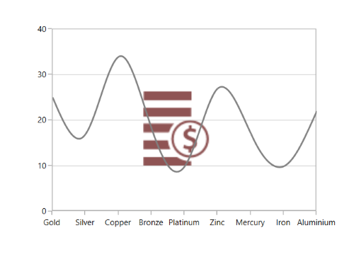

# Watermark in WPF Charts (SfChart)

SfChart provides watermark support which is used to add text or images to the chart area. The major application of watermark is to define the copyright information of the user it belongs to.

This section is to help you understand how to use the [`Watermark`](https://help.syncfusion.com/cr/wpf/Syncfusion.UI.Xaml.Charts.SfChart.html#Syncfusion_UI_Xaml_Charts_SfChart_Watermark) in your chart.

## Adding text watermark

You can add the text to chart background using the Content property of Watermark.

The following code example explains how to set your custom text as Watermark.





<chart:SfChart.Watermark>

<chart:Watermark VerticalAlignment="Center"         

HorizontalAlignment="Center" >

<chart:Watermark.Content>

<TextBlock Text="Metals"  

FontSize="70"

Foreground="Black" >

</TextBlock>

</chart:Watermark.Content>

</chart:Watermark>

</chart:SfChart.Watermark>





chart.Watermark = new Watermark()
{

       HorizontalAlignment = HorizontalAlignment.Center,

       VerticalAlignment = VerticalAlignment.Center

};

chart.Watermark.Content = new TextBlock()
{

       Text = "Metals",

       FontSize = 70,

       Foreground = new SolidColorBrush(Colors.Black)

};





## Adding image watermark

You can also set images as Watermark as in below code snippet.





<chart:SfChart.Watermark>

<chart:Watermark VerticalAlignment="Center"               

HorizontalAlignment="Center" >

<chart:Watermark.Content>

<Image Source="demands.png" Height="175" Width="175"/>

</chart:Watermark.Content>

</chart:Watermark>

</chart:SfChart.Watermark>





chart.Watermark = new Watermark()
{

       HorizontalAlignment = HorizontalAlignment.Center,

       VerticalAlignment = VerticalAlignment.Center

};

chart.Watermark.Content = new Image()
{

       Height = 175,

       Width = 175,

       Source = new BitmapImage(new Uri(@"demands.png", UriKind.RelativeOrAbsolute))

};





N> You can refer to our [WPF Charts](https://www.syncfusion.com/wpf-controls/charts) feature tour page for its groundbreaking feature representations. You can also explore our [WPF Charts example](https://github.com/syncfusion/wpf-demos) to knows various chart types and how to easily configured with built-in support for creating stunning visual effects.

## See also

[`How to add watermark to chart`](https://www.syncfusion.com/kb/5225/how-to-add-watermark-to-chart)

