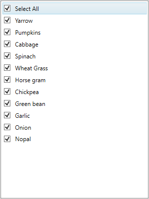
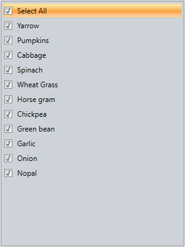
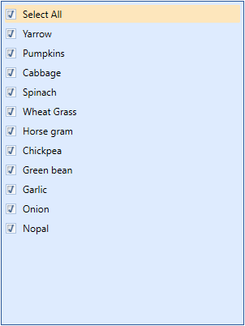
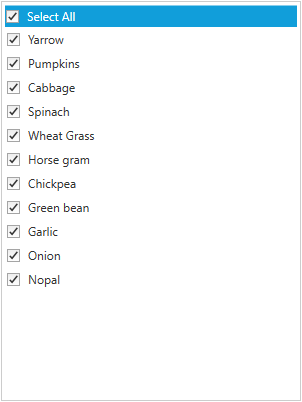
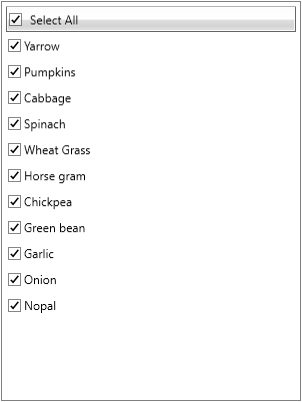

# Appearance

## Item Template

The Item template is used set DataTemplate which is used to display each item.




<syncfusion:CheckListBox  Grid.Row="1" 
            IsSelectAllEnabled="True" 
            Width="200" Height="180"
            HorizontalAlignment="Center" 
            VerticalAlignment="Center"
            x:Name="ListBox" ItemsSource="{Binding Country}"/>

<syncfusion:CheckListBox.ItemTemplate>
    <DataTemplate>
        <StackPanel Orientation="Horizontal">
            <Image Source="{Binding Image}" Width="20" Height="20"></Image>
            <TextBlock Text="{Binding Name}" Margin="5"></TextBlock>
        </StackPanel>
    </DataTemplate>
</syncfusion:CheckListBox.ItemTemplate>

</syncfusion:CheckListBox>




## GroupTemplate

The GroupTemplate is used to set DataTemplate for the group header.




<syncfusion:CheckListBox 
            Grid.Row="1"
            DisplayMemberPath="Name"
            Width="300" Height="400"
            HorizontalAlignment="Center" 
            VerticalAlignment="Center"
            Margin="10" 
            ItemsSource="{Binding Vegetables}"/>

<syncfusion:CheckListBox.GroupTemplate>
    <DataTemplate>
        <TextBlock Text="{Binding Name}" FontWeight="Bold">
        </TextBlock>
    </DataTemplate>
</syncfusion:CheckListBox.GroupTemplate>

</syncfusion:CheckListBox>




## SelectAllTemplate

The SelectAllTemplate is used to set DataTemplate for the SelectAll item.




<syncfusion:CheckListBox 
            Grid.Row="1"
            DisplayMemberPath="Name"
            Width="300" Height="400"
            HorizontalAlignment="Center" 
            VerticalAlignment="Center"
            Margin="10" 
            ItemsSource="{Binding Vegetables}"/>

<syncfusion:CheckListBox.SelectAllTemplate>
    <DataTemplate>
        <TextBlock Text="Select All" FontStyle="Italic"></TextBlock>
    </DataTemplate>
</syncfusion:CheckListBox.SelectAllTemplate>







## ItemContainerStyle

The ItemContainerStyle is the style that is applied to the container element generated for each item. Its default value is null.




<Window.Resources>
        
</Window.Resources>

<syncfusion:CheckListBox 
            Grid.Row="1"
            Width="300" 
            Height="400"
            HorizontalAlignment="Center" 
            VerticalAlignment="Center"
            Margin="10" 
            ItemsSource="{Binding Vegetables}" 
            ItemContainerStyle="{StaticResource ItemStyle}"
            x:Name="ListBox"/>




## ItemTemplateSelector

The ItemTemplateSelector is used to return a DataTemplate based on the provided logic.




<Window.Resources>
       <local:MyTemplateSelector x:Key="Mytemplate">
            <local:MyTemplateSelector.groupTemplate>
                <DataTemplate>
                    <TextBlock Text="{Binding Name}"></TextBlock>
                </DataTemplate>
            </local:MyTemplateSelector.groupTemplate>
            <local:MyTemplateSelector.itemTemplate>
                <DataTemplate>
                    <TextBlock Text="{Binding Name}" FontStyle="Italic"></TextBlock>
                </DataTemplate>
            </local:MyTemplateSelector.itemTemplate>
        </local:MyTemplateSelector>
</Window.Resources>





public class MyTemplateSelector : DataTemplateSelector
{
    public DataTemplate Template { get; set; }
    public DataTemplate itemTemplate { get; set; }

    public override DataTemplate SelectTemplate(object item, DependencyObject container)
    {
        if (item is Vegetable && (item as Vegetable).Category== "Leafy and Salad")
            return itemTemplate;
        else
            return Template;
    }

}


  

## ItemContainerStyleSelection

The ItemContainerStyleSelector is used to choose the style to use as ItemContainerStyle based on the provided logic.




<local:VegetableStyleSelector x:Key="StyleSelector" GroupStyle="{StaticResource Groupstyle}" ItemStyle="{StaticResource ItemStyle}">
</local:VegetableStyleSelector>

<syncfusion:CheckListBox 
            Grid.Row="1"
            DisplayMemberPath="Name"
            Width="300" Height="400"
            HorizontalAlignment="Center" 
            VerticalAlignment="Center"
            Margin="10" 
            ItemsSource="{Binding Vegetables}" 
            ItemContainerStyleSelector="{StaticResource StyleSelector}"/>




    public class VegetableStyleSelector : StyleSelector
    {
        private Style groupStyle;
        private Style itemStyle;
        public override Style SelectStyle(object item, DependencyObject container)
        {
            if (item is Vegetable)
                return ItemStyle;
            else
                return GroupStyle;
        }

        public Style GroupStyle
        {
            get
            {
                return groupStyle;
            }
            set
            {
                groupStyle = value;
            }
        }

        public Style ItemStyle
        {
            get
            {
                return itemStyle;
            }
            set
            {
                itemStyle = value;
            }
        }
    }




## Right to Left

The CheckListBox controls provides RTL support for users working in languages such as Hebrew, Arabic, or Persian. This support aligns the control in right-to-left direction.




<syncfusion:CheckListBox  Grid.Row="1" 
            IsSelectAllEnabled="True" 
            Width="200" Height="180"
            HorizontalAlignment="Center" 
            VerticalAlignment="Center"
            x:Name="ListBox" FlowDirection="RightToLeft">
           
</syncfusion:CheckListBox>




## Set VisualStyle for CheckListBox

The appearance of the CheckListBox control is customized by applying a suitable style using the VisualStyle property.

Property table

<table>
<tr>
<th>
Property</th><th>
Description</th></tr>
<tr>
<td>
VisualStyle</td><td>
Sets the visual style for the CheckListBox control. The options provided are as follows.
<ul>
<li>BlendOffice2003</li>
<li>Office2007Blue</li>
<li>Office2007Black</li>
<li>Office2007Silver</li>
<li>ShinyBlue</li>
<li>ShinyRed</li>
<li>SyncOrange</li>
<li>VS2010</li>
<li>Metro</li>
<li>Transparent</li>
</ul>
</td></tr>
</table>

For setting Blend style, refer the below code snippet.




<!-- Adding CheckListBox with Visual Style as Blend -->
<syncfusion:CheckListBox 
            Grid.Row="1"
            DisplayMemberPath="Name"
            Width="300" Height="400"
            HorizontalAlignment="Center" 
            VerticalAlignment="Center"
            Margin="10" 
            ItemsSource="{Binding Vegetables}"
            syncfusion:SkinStorage.VisualStyle="Blend">
 




// Setting the visual style as Blend.
SkinStorage.SetVisualStyle(checkListBox, "Blend"); 




CheckListBox with "Blend" Visual Style

CheckListBox with "Default" Visual Style
{:.caption}

CheckListBox with "Office2007Black" Visual Style
{:.caption}

CheckListBox with "Office2003" Visual Style
{:.caption}

CheckListBox with "Metro" Visual Style
{:.caption}

CheckListBox with "Transparent" Visual Style
{:.caption}

