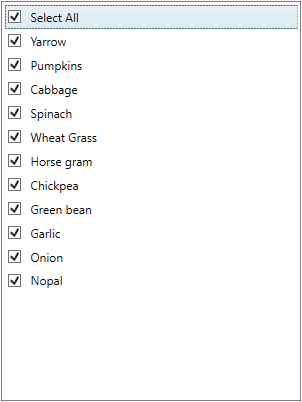

# Check or uncheck all items in WPF CheckedListBox (CheckListBox)

The [CheckListBox](https://www.syncfusion.com/wpf-ui-controls/CheckedListBox) allows the users to check or uncheck all the items by a single click on the `SelectAll` option. The `SelectAll` option can be enabled or disabled using the [IsSelectAllEnabled](https://help.syncfusion.com/cr/wpf/Syncfusion.Windows.Tools.Controls.CheckListBox.html#Syncfusion_Windows_Tools_Controls_CheckListBox_IsSelectAllEnabled) property. Selection mode of the `SelectAll` item varies based on the checked state of the `CheckListBox` items. Initially, the `SelectAll` is unchecked because of no item is checked. It is checked only on when all items are checked, otherwise it is in intermediate state.



 
//ViewModel.cs

class ViewModel { 
    public ObservableCollection<string> DaysCollection { get; set; }

    public ViewModel() {
        //Days added in the collection
        DaysCollection = new ObservableCollection<string>();
        DaysCollection.Add("Sunday");
        DaysCollection.Add("Monday");
        DaysCollection.Add("Tuesday");
        DaysCollection.Add("Wednesday");
        DaysCollection.Add("Thursday");
        DaysCollection.Add("Friday");
        DaysCollection.Add("Saturday");
    }
}







<syncfusion:CheckListBox IsSelectAllEnabled="False"
                         ItemsSource="{Binding DaysCollection}"                 
                         Name="checkListBox">
    <syncfusion:CheckListBox.DataContext>
        <local:ViewModel></local:ViewModel>
    </syncfusion:CheckListBox.DataContext>
</syncfusion:CheckListBox>




CheckListBox checkListBox = new CheckListBox();
checkListBox.DataContext = new ViewModel();
checkListBox.ItemsSource = (checkListBox.DataContext as ViewModel).DaysCollection;




Click [here](https://github.com/SyncfusionExamples/wpf-checked-listbox-examples/tree/master/Samples/SelectAll) to download the sample that showcases the SelectAll option in the `CheckListBox`.
