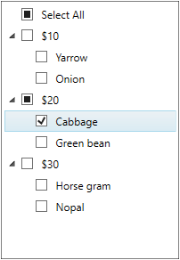
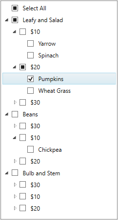
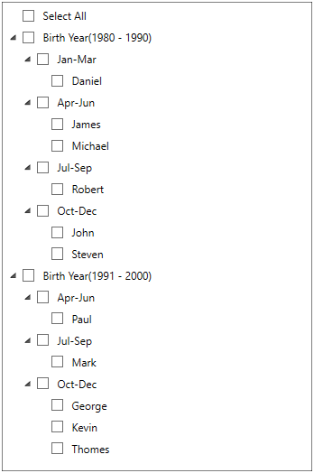

# Grouping Items in WPF CheckedListBox (CheckListBox)

 By default, the [CheckListBox](https://www.syncfusion.com/wpf-ui-controls/CheckedListBox) items are in the listed view. We can group the `CheckListBox` items by adding the group description to the `CollectionView.GroupDescriptions` collection.

 The selection state of group header varies based on the checked or unchecked state of the child items. Group can be expanded or collapsed and the child items present in the group can be checked or unchecked based on the user’s perspective.




//Model.cs
class Vegetable {
    public string Category { get; set; }
    public int Price { get; set; }
    public string Name { get; set; }
}

//ViewModel.cs
class ViewModel {
    public ObservableCollection<Vegetable> Vegetables { get; set; }
    public ICommand LoadedCommand { get; set; }
    public void OnLoaded(object param) {
        CollectionView view = (CollectionView)CollectionViewSource.GetDefaultView(Vegetables);
       
        //Adding group description
            view.GroupDescriptions.Add(new PropertyGroupDescription("Price"));
    }
    public ViewModel() {
        Vegetables = new ObservableCollection<Vegetable>();
        Vegetables.Add(new Vegetable { Price=10, Name="Yarrow", Category="Leafy and Salad"});
        Vegetables.Add(new Vegetable { Price=20, Name="Cabbage", Category="Leafy and Salad"});
        Vegetables.Add(new Vegetable { Price=30, Name="Horse gram", Category="Beans"});
        Vegetables.Add(new Vegetable { Price=20, Name="Green bean", Category="Beans"});
        Vegetables.Add(new Vegetable { Price=10, Name="Onion", Category="Bulb and Stem"});
        Vegetables.Add(new Vegetable { Price=30, Name="Nopal", Category="Bulb and Stem"});

        //Initialize the CheckListBox LoadedCommand
        LoadedCommand = new DelegateCommand<object>(OnLoaded);
    }
}







<syncfusion:CheckListBox ItemsSource="{Binding Vegetables}" DisplayMemberPath="Name"
                         Name="checkListBox">
    <syncfusion:CheckListBox.DataContext>
        <local:ViewModel></local:ViewModel>
    </syncfusion:CheckListBox.DataContext>
    <i:Interaction.Triggers>
        <i:EventTrigger EventName="Loaded">
            <i:InvokeCommandAction Command="{Binding LoadedCommand}" />
        </i:EventTrigger>
    </i:Interaction.Triggers>
</syncfusion:CheckListBox>




Here, the `Vegetables` items are grouped based on their price.

Click [here](https://github.com/SyncfusionExamples/wpf-checked-listbox-examples/tree/master/Samples/Grouping) to download the sample that showcases the grouping support in the `CheckListBox`.

## Nested Grouping

 We can create a multi-level nested groups for the `CheckListBox` items by adding the two or more group descriptions to the `CollectionView.GroupDescriptions` collection. Child level groups are created by order of group descriptions added to the collection.




//Model.cs
class Vegetable {
    public string Category { get; set; }
    public int Price { get; set; }
    public string Name { get; set; }
}

//ViewModel.cs
class ViewModel {
    public ObservableCollection<Vegetable> Vegetables { get; set; }
    public ICommand LoadedCommand { get; set; }
    public void OnLoaded(object param) {
        CollectionView view = (CollectionView)CollectionViewSource.GetDefaultView(Vegetables);
       
        //Adding the multiple group description
            view.GroupDescriptions.Add(new PropertyGroupDescription("Category"));
            view.GroupDescriptions.Add(new PropertyGroupDescription("Price"));
    }
    public ViewModel() {
        Vegetables = new ObservableCollection<Vegetable>();
        Vegetables.Add(new Vegetable { Price=10, Name="Yarrow", Category="Leafy and Salad"});
        Vegetables.Add(new Vegetable { Price=20", Name="Pumpkins", Category="Leafy and Salad"});
        Vegetables.Add(new Vegetable { Price=30, Name="Cabbage", Category="Leafy and Salad"});
        Vegetables.Add(new Vegetable { Price=10, Name="Spinach", Category="Leafy and Salad"});
        Vegetables.Add(new Vegetable { Price=20, Name="Wheat Grass", Category="Leafy and Salad"});
        Vegetables.Add(new Vegetable { Price=10, Name="Horse gram", Category="Beans"});
        Vegetables.Add(new Vegetable { Price=20, Name="Chickpea", Category="Beans"});
        Vegetables.Add(new Vegetable { Price=30, Name="Green bean", Category="Beans"});
        Vegetables.Add(new Vegetable { Price=10, Name="Garlic", Category="Bulb and Stem"});
        Vegetables.Add(new Vegetable { Price=20, Name="Onion", Category="Bulb and Stem"});
        Vegetables.Add(new Vegetable { Price=30, Name="Nopal", Category="Bulb and Stem"});

        //Initialize the checklistbox LoadedCommand
        LoadedCommand = new DelegateCommand<object>(OnLoaded);
    }
}







<syncfusion:CheckListBox ItemsSource="{Binding Vegetables}" DisplayMemberPath="Name"
                         Name="checkListBox">
    <syncfusion:CheckListBox.DataContext>
        <local:ViewModel></local:ViewModel>
    </syncfusion:CheckListBox.DataContext>
    <i:Interaction.Triggers>
        <i:EventTrigger EventName="Loaded">
            <i:InvokeCommandAction Command="{Binding LoadedCommand}" />
        </i:EventTrigger>
    </i:Interaction.Triggers>
</syncfusion:CheckListBox>




Here, the `Vegetables` items are grouped based on their Category and then, the categorized properties are grouped by price.

Click [here](https://github.com/SyncfusionExamples/wpf-checked-listbox-examples/tree/master/Samples/NestedGrouping) to download the sample that showcases the nested grouping support in the `CheckListBox`.

## Custom grouping

`CheckListBox` allows you to group the items based on custom logic when the common grouping functionality doesn’t meet your requirement. We can achieve this by using the `IValueConverter`.




//Model.cs
public class Employee {
    public string Name { get; set; }
    public int Age { get; set; }
    public DateTime DOB { get; set; }
}

//EmployeesCollection.cs
public class EmployeesCollection : ObservableCollection<Employee> {
}

//ViewModel.cs
public class ViewModel : NotificationObject {
    private ObservableCollection<GroupDescription> groupDescriptions;
    private EmployeesCollection employeesCollection;

    public ObservableCollection<GroupDescription> GroupDescriptions {
        get {
            return groupDescriptions;
        }
        set {
            groupDescriptions = value;
            RaisePropertyChanged("GroupDescriptions");
        }
    }

    public EmployeesCollection EmployeesCollection {
        get {
            return employeesCollection;
        }
        set {
            employeesCollection = value;
            RaisePropertyChanged("EmployeesCollection");
        }
    }

    public ViewModel() {
        EmployeesCollection = new EmployeesCollection();
        GroupDescriptions = new ObservableCollection<GroupDescription>();
    }
}   







//Converter for the Custom Grouping 
public class DateConverter : IValueConverter {
    public string Category { get; set; }

    public object Convert(object value, Type targetType, object parameter, CultureInfo culture) {
        DateTime result;
        string MyString = value.ToString();
        DateTime.TryParse(MyString, out result);

        if (Category == "Year") {
            //Grouping the employee who are all born on 1980-1990 
            if ((DateTime.Compare(new DateTime(1980, 01, 01), result)) <= 0 &&
                (DateTime.Compare(new DateTime(1990, 12, 31), result)) >= 0)
            {
                return "Birth Year(1980 - 1990)";
            }
            //Grouping the employee who are all born on 1990-2000 
            else if ((DateTime.Compare(new DateTime(1991, 01, 01), result)) <= 0 &&
                (DateTime.Compare(new DateTime(2000, 12, 31), result)) >= 0)
            {
                return "Birth Year(1991 - 2000)";
            }
        }
        else if (Category == "Month") {
            //Sub-Grouping the employee who are all born on Jan-Mar 
            if (result.Month >= 1 && result.Month <= 3) {
                return "Quarter-1";
            }
            //Sub-Grouping the employee who are all born on Apr-Jun
            else if (result.Month >= 4 && result.Month <= 6) {
                return "Quarter-2";
            }
            //Sub-Grouping the employee who are all born on Jul-Sep
            else if (result.Month >= 7 && result.Month <= 9) {
                return "Quarter-3";
            }
            //Sub-Grouping the employee who are all born on Oct-Dec
            else {
                return "Quarter-4";
            }
        }
        return "Others";
    }
   
    public object ConvertBack(object value, Type targetType, object parameter, CultureInfo culture) {
        throw new NotImplementedException();
    }
}







<Window.Resources>
    <!-- Define employee details-->
    <local:EmployeesCollection x:Key="employees">
        <local:Employee Name="Daniel" DOB="02/15/1983" Age="37"/>
        <local:Employee Name="James" DOB="06/29/1988" Age="32"/>
        <local:Employee Name="Michael" DOB="06/10/1987" Age="33"/>
        <local:Employee Name="Daniel" DOB="08/23/1980" Age="40"/>
        <local:Employee Name="John" DOB="12/22/1990" Age="30"/>
        <local:Employee Name="Paul" DOB="04/08/1997" Age="23"/>
        <local:Employee Name="Mark" DOB="08/05/1994" Age="26"/>
        <local:Employee Name="George" DOB="10/01/1998" Age="22"/>
        <local:Employee Name="Daniel" DOB="10/01/1998" Age="24"/>
        <local:Employee Name="Thomes" DOB="10/08/1995" Age="25"/>
        <local:Employee Name="Steven" DOB="12/15/1982" Age="38"/>
    </local:EmployeesCollection>
    
    <!-- Define view model with group description -->
    <local:DateConverter Category="Year" x:Key="year"/>
    <local:DateConverter Category="Month"  x:Key="month"/>
    <local:ViewModel x:Key="viewModel">
        <local:ViewModel.GroupDescriptions>
            <PropertyGroupDescription PropertyName="DOB" 
                                      Converter="{StaticResource year}"/>
            <PropertyGroupDescription PropertyName="DOB"
                                      Converter="{StaticResource month}"/>
        </local:ViewModel.GroupDescriptions>
    </local:ViewModel>
</Window.Resources>
<Grid>
    <syncfusion:CheckListBox ItemsSource="{StaticResource ResourceKey=employees}"
                             GroupDescriptions="{Binding GroupDescriptions}"
                             DataContext="{StaticResource viewModel}"
                             DisplayMemberPath="Name"
                             Name="checkListBox"
                             Margin="20"/>
</Grid>




Click [here](https://github.com/SyncfusionExamples/wpf-checked-listbox-examples/tree/master/Samples/Custom-Grouping) to download the sample that showcases the custom grouping support.
