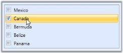

# Item Selection in WPF CheckListBox Control

In CheckListBox, selection of item can be done by single click using the property [IsCheckOnFirstClick](https://help.syncfusion.com/cr/wpf/Syncfusion.Windows.Tools.Controls.CheckListBox.html#Syncfusion_Windows_Tools_Controls_CheckListBox_IsCheckOnFirstClick). If it is false, then the selection is done when double click is detected. By default, the value of this property is “True”.

Here is the code for setting this property.




<!-- Adding CheckListBox -->
<syncfusion:CheckListBox Name="checkListBox" IsCheckOnFirstClick="True"> 
<!-- Adding CheckListBox items -->  
<syncfusion:CheckListBoxItem Content="Mexico"/>
<syncfusion:CheckListBoxItem Content="Canada" /> 
<syncfusion:CheckListBoxItem Content="Bermuda" /> 
<syncfusion:CheckListBoxItem Content="Belize" />  
<syncfusion:CheckListBoxItem Content="Panama" />
</syncfusion:CheckListBox></td></tr>
  




// Enable the IsCheckOnFirstClick property.
checkListBox.IsCheckOnFirstClick = true;  </td></tr>




IsCheckOnFirstClick = "True"
{:.caption}