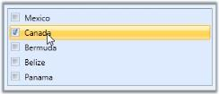

# Item Selection in WPF CheckListBox

In `CheckListBox`, checking of an item can be done with a single click using the [IsCheckOnFirstClick](https://help.syncfusion.com/cr/wpf/Syncfusion.Windows.Tools.Controls.CheckListBox.html#Syncfusion_Windows_Tools_Controls_CheckListBox_IsCheckOnFirstClick) property. If this property is set to `false`, the item is checked only when a double click is detected. By default, the value of this property is `True`.

Here is the code for setting this property.




<!-- Adding CheckListBox -->
<syncfusion:CheckListBox Name="checkListBox" IsCheckOnFirstClick="True"> 
<!-- Adding CheckListBox items -->  
<syncfusion:CheckListBoxItem Content="Mexico"/>
<syncfusion:CheckListBoxItem Content="Canada" /> 
<syncfusion:CheckListBoxItem Content="Bermuda" /> 
<syncfusion:CheckListBoxItem Content="Belize" />  
<syncfusion:CheckListBoxItem Content="Panama" />
</syncfusion:CheckListBox>
  




// Enable the IsCheckOnFirstClick property.
checkListBox.IsCheckOnFirstClick = true;




IsCheckOnFirstClick = "True"
{:.caption}