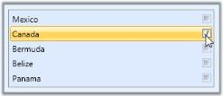
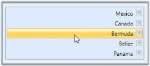
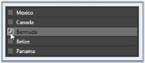
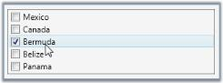
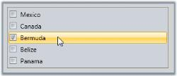
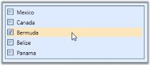
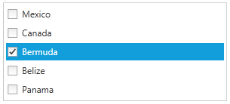
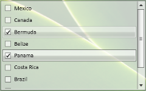

# Layout Related Features in WPF CheckedListBoxWPF CheckListBox

This section illustrates the layout-related features of the `WPF CheckedListBox` control. The following features are discussed:

## Alignment for WPF CheckedListBox

The check box in the `WPF CheckedListBox` item can be aligned to the left or right side of the control by using the `CheckBoxAlignment` property. This dependency property sets the alignment of the check box for the items. The following are the alignment options:

* `Left`: The check box in the `WPF CheckedListBox` item is aligned to the left.
* `Right`: The check box in the `WPF CheckedListBox` item is aligned to the right.

The default value of `CheckBoxAlignment` is `Left`. To set the `CheckBoxAlignment` to `Right`, use the following code.




<!-- Adding CheckListBox with CheckBoxAlignment -->
<syncfusion:CheckListBox Name="checkListBox" CheckBoxAlignment="Right"> 
<!-- Adding CheckListBox items -->   
<syncfusion:CheckListBoxItem Content="Mexico"/> 
<syncfusion:CheckListBoxItem Content="Canada" />
<syncfusion:CheckListBoxItem Content="Bermuda" />
<syncfusion:CheckListBoxItem Content="Belize" /> 
<syncfusion:CheckListBoxItem Content="Panama" />
</syncfusion:CheckListBox>
   




// Align the Check Box.
checkListBox.CheckBoxAlignment = CheckBoxAlignment.Right;




CheckBoxAlignment = "Right"
{:.caption}

## Flow direction

The flow direction for the WPF CheckedListBox control is set through the [FlowDirection](https://learn.microsoft.com/en-us/dotnet/api/system.windows.frameworkelement.flowdirection?view=netframework-4.7.2) property.

To set the FlowDirection to RightToLeft, use the below code:




<!-- Adding CheckListBox with FlowDirection as right  -->
<syncfusion:CheckListBox Name="checkListBox" FlowDirection="RightToLeft"> 
<!-- Adding CheckListBox items --> 
<syncfusion:CheckListBoxItem Content="Mexico"/>  
<syncfusion:CheckListBoxItem Content="Canada" />  
<syncfusion:CheckListBoxItem Content="Bermuda" />  
<syncfusion:CheckListBoxItem Content="Belize" />  
<syncfusion:CheckListBoxItem Content="Panama" />
</syncfusion:CheckListBox>
   




// Set FlowDirection property as RightToLeft.
checkListBox.FlowDirection = FlowDirection.RightToLeft;




FlowDirection = "RightToLeft"
{:.caption}

## Set VisualStyle for WPF CheckedListBox

The appearance of the `WPF CheckedListBox` control is customized by applying a suitable style using the `VisualStyle` property.

Property table

<table>
<tr>
<th>
Property</th><th>
Description</th></tr>
<tr>
<td>
VisualStyle</td><td>
Sets the visual style for the WPF CheckedListBox control. The options provided are as follows.
<ul>
<li>Blend</li>
<li>Office2007Blue</li>
<li>Office2007Black</li>
<li>Office2007Silver</li>
<li>ShinyBlue</li>
<li>ShinyRed</li>
<li>SyncOrange</li>
<li>VS2010</li>
<li>Metro</li>
<li>Transparent</li>
</ul>

N> The legacy `BlendOffice2003` style has been deprecated. Use `Blend` instead.
</td></tr>
</table>

For setting Blend style, refer the below code snippet.




<!-- Adding CheckListBox with Visual Style as Blend -->
<syncfusion:CheckListBox Name="checkListBox" syncfusion:SkinStorage.VisualStyle="Blend">   
<!-- Adding CheckListBox items -->    
<syncfusion:CheckListBoxItem Content="Mexico"/> 
<syncfusion:CheckListBoxItem Content="Canada" />  
<syncfusion:CheckListBoxItem Content="Bermuda" />  
<syncfusion:CheckListBoxItem Content="Belize" />  
<syncfusion:CheckListBoxItem Content="Panama" />
</syncfusion:CheckListBox>
 




// Setting the visual style as Blend.
SkinStorage.SetVisualStyle(checkListBox, "Blend"); 




WPF CheckedListBox with "Blend" Visual Style

WPF CheckedListBox with "Default" Visual Style
{:.caption}

WPF CheckedListBox with "Office2007Black" Visual Style
{:.caption}

WPF CheckedListBox with "Office2003" Visual Style
{:.caption}

WPF CheckedListBox with "Metro" Visual Style
{:.caption}

WPF CheckedListBox with "Transparent" Visual Style
{:.caption}