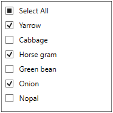

# WPF CheckedListBox (CheckListBox) Overview

The [CheckListBox](https://www.syncfusion.com/wpf-controls/checkedlistbox) control implements a classic list box with check list box items. The control displays items with a check box to enable multiple selection of items. Custom templates are defined to customize its appearance.

## Features

* Select items on first mouse click
* Align the check box to the right or left side of the CheckListBox Item
* Grouping and Sorting support
* SelectAll support
* Built-in Visual Styles and Themes support
