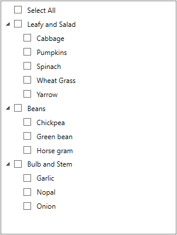

# Sorting Items in WPF CheckedListBox (CheckListBox)

 By default, the [CheckListBox](https://www.syncfusion.com/wpf-ui-controls/CheckedListBox) are arranged based on the order they added in to the `Items`  collection. We can sort the `CheckListBox` items by adding the sorting direction to the `CollectionView.SortDescriptions` collection. The `CheckListBox` items can be sorted either in ascending or descending order based on the user’s perspective.




//Model.cs
class Vegetable {
    public string Category { get; set; }
    public int Price { get; set; }
    public string Name { get; set; }
}

//ViewModel.cs
class ViewModel {
    public ObservableCollection<Vegetable> Vegetables { get; set; }
    public ICommand LoadedCommand { get; set; }
    public void OnLoaded(object param) {
        CollectionView view = (CollectionView)CollectionViewSource.GetDefaultView(Vegetables);
       
        //Adding sort description
        view.SortDescriptions.Add(new SortDescription
        { 
            PropertyName = "Name",
            Direction = ListSortDirection.Ascending 
        });
    }
    public ViewModel() {
        Vegetables = new ObservableCollection<Vegetable>();
        Vegetables.Add(new Vegetable { Price = 10, Name = "Yarrow", Category = "Leafy and Salad" });
        Vegetables.Add(new Vegetable { Price = 20, Name = "Cabbage", Category = "Leafy and Salad" });
        Vegetables.Add(new Vegetable { Price = 30, Name = "Horse gram", Category = "Beans" });
        Vegetables.Add(new Vegetable { Price = 20, Name = "Green bean", Category = "Beans" });
        Vegetables.Add(new Vegetable { Price = 10, Name = "Onion", Category = "Bulb and Stem" });
        Vegetables.Add(new Vegetable { Price = 30, Name = "Nopal", Category = "Bulb and Stem" });

        //Initialize the CheckListBox LoadedCommand
        LoadedCommand = new DelegateCommand<object>(OnLoaded);
    }
}







<syncfusion:CheckListBox ItemsSource="{Binding Vegetables}" DisplayMemberPath="Name"
                         Name="checkListBox">
    <syncfusion:CheckListBox.DataContext>
        <local:ViewModel></local:ViewModel>
    </syncfusion:CheckListBox.DataContext>
    <i:Interaction.Triggers>
        <i:EventTrigger EventName="Loaded">
            <i:InvokeCommandAction Command="{Binding LoadedCommand}" />
        </i:EventTrigger>
    </i:Interaction.Triggers>
</syncfusion:CheckListBox>




Here, the `Vegetables` items are sorted in ascending order based on their name.

Click [here](https://github.com/SyncfusionExamples/wpf-checked-listbox-examples/tree/master/Samples/Sorting) to download the sample that showcases the sorting support in the `CheckListBox`.
