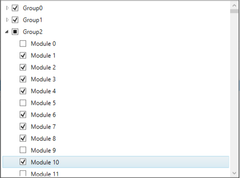

# Virtualization in WPF CheckedListBox (CheckListBox)

UI Virtualization support is enabled by default in [CheckListBox](https://www.syncfusion.com/wpf-ui-controls/CheckedListBox), which allows the users to load large sets of data without affecting loading or scrolling performance. This feature allows users to reduce the loading time of `CheckListBox` items regardless of items count.




//Model.cs 
public class Model {
    public string Name { get; set; }
    public string GroupName { get; set; }
}

//ViewModel.cs
public class ViewModel : NotificationObject    {
    private ObservableCollection<GroupDescription> groupDescriptions;
    private ObservableCollection<Model> collection = new ObservableCollection<Model>();
    public ObservableCollection<Model> Collection {
        get { 
            return collection;
        }
        set { 
            collection = value; 
        }
    }

    public ObservableCollection<GroupDescription> GroupDescriptions {
        get {
            return groupDescriptions;
        }
        set {
            groupDescriptions = value;
            RaisePropertyChanged("GroupDescriptions");
        }
    }

    public ViewModel() {
        GroupDescriptions = new ObservableCollection<GroupDescription>();

        //Define virtualisation items
        Collection = new ObservableCollection<Model>();
        for (int i = 0; i < 1000; i++) {
            for (int j = 0; j < 10; j++) {                  
                Collection.Add( new Model()
                {
                    Name = "Module " + i.ToString(),
                    GroupName = "Group" + j.ToString() 
                });
            }
        }
    }
}







<Window.Resources>
    <local:ViewModel x:Key="viewModel">
        <local:ViewModel.GroupDescriptions>
            <PropertyGroupDescription PropertyName="GroupName" />
        </local:ViewModel.GroupDescriptions>
    </local:ViewModel>
</Window.Resources>
<Grid>
    <syncfusion:CheckListBox ItemsSource="{Binding Collection}" 
                             GroupDescriptions="{Binding GroupDescriptions}"
                             DataContext="{StaticResource viewModel}"
                             DisplayMemberPath="Name" 
                             Name="checkListBox"
                             Margin="20">
    </syncfusion:CheckListBox>
</Grid>




Click [here](https://github.com/SyncfusionExamples/wpf-checked-listbox-examples/tree/master/Samples/Virtualization) to download the sample that showcases the virtualization support in the `CheckListBox`.

## Disable the Virtualization

We can only load the particular items to visible at a time. If we want to make some items as checked that are not in view, then we need to disable the virtualization, otherwise the items will not be checked until they are in view. We can disable the virtualization by using the `ItemsPanel` template.




<syncfusion:CheckListBox Name="checkListBox">
    <syncfusion:CheckListBox.ItemsPanel>
        <ItemsPanelTemplate>
            <StackPanel></StackPanel>
        </ItemsPanelTemplate>
    </syncfusion:CheckListBox.ItemsPanel>      
</syncfusion:CheckListBox>




CheckListBox checkListBox = new CheckListBox();
checkListBox.ItemsPanel = new ItemsPanelTemplate(new FrameworkElementFactory(typeof(StackPanel)));




Click [here](https://github.com/SyncfusionExamples/wpf-checked-listbox-examples/tree/master/Samples/CheckItem-By-Property) to download the sample that showcases disable the virtualization.
