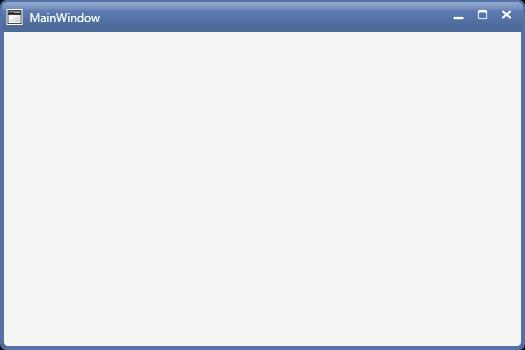

# Getting Started

This section explains how to implement the ChromelessWindow control. It describes the following:

## Add ChromelessWindow 

The following steps will helps to add ChromelessWindow 

1) Create WPF project and refer the following assemblies

Syncfusion.Shared.WPF.dll

2) Include an xml namespace for the above assemblies to the Main window.





<Window x:Class="Chromelesswindow.MainWindow"

xmlns="http://schemas.microsoft.com/winfx/2006/xaml/presentation"

xmlns:x="http://schemas.microsoft.com/winfx/2006/xaml"

Title="MainWindow" Height="350" Width="525"    xmlns:syncfusion="clr-namespace:Syncfusion.Windows.Shared;assembly=Syncfusion.Shared.WPF" >

</Window>





3) Change the Window as ChromelessWindow.





<syncfusion:ChromelessWindow x:Class="Chromelesswindow.MainWindow"

xmlns="http://schemas.microsoft.com/winfx/2006/xaml/presentation"

xmlns:x="http://schemas.microsoft.com/winfx/2006/xaml"

Title="MainWindow" Height="350" Width="525"    xmlns:syncfusion="clr-namespace:Syncfusion.Windows.Shared;assembly=Syncfusion.Shared.WPF" >

</syncfusion:ChromelessWindow>





4) Add following namespace and Inherit MainWindow from ChromelessWindow in code behind





using Syncfusion.Windows.Shared;

public partial class MainWindow : ChromelessWindow

{

public MainWindow()

{

InitializeComponent();             

} 

}





