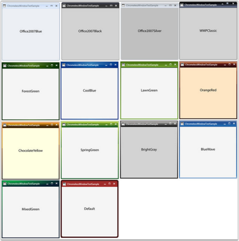
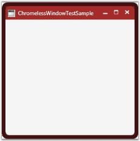

# Layout Related Features

This section illustrates the Layout-related features of ChromelessWindow control. The following features are discussed:

## Setting Corner Radius for ChromelessWindow

You can create curved borders for the windows by using the CornerRadius property of ChromelessWindow. The default radius is 0, which implies sharp corners.

To set this property, use the below code.


[XAML]<shared:ChromelessWindow x:Class="TestChromeless.Window1"xmlns="http://schemas.microsoft.com/winfx/2006/xaml/presentation"xmlns:x="http://schemas.microsoft.com/winfx/2006/xaml"xmlns:shared="clr-namespace:Syncfusion.Windows.Shared;assembly=Syncfusion.Shared.WPF"Title="ChromelessWindowTestSample"  Height="300" Width="300" ResizeBorderThickness="1" shared:SkinStorage.VisualStyle="Default"  CornerRadius= "8"></ shared:ChromelessWindow>


[C#]CornerRadius = new CornerRadius(8);


## Setting VisualStyle for ChromelessWindow

The visual style for the ChromelessWindow control is set using the VisualStyle property. ChromelessWindow supports the following built-in visual styles.  

_Properties table_

<table>
<tr>
<th>
Property</th><th>
Description</th></tr>
<tr>
<td>
VisualStyle</td><td>
Sets the visual style for the ChromelessWindow control. The options provided are as follows.BlendOffice2003Office2007BlueOffice2007BlackOffice2007SilverOffice2010BlueOffice2010BlackOffice2010SilverShinyBlueShinyRedSyncOrangeVS2010WMPClassicForestGreenCoolBlueLawnGreenOrangeRedChocolateYellowSpringGreenBrightGrayBlueWaveMixedGreenDefaultMetroTransparent</td></tr>
</table>

The below screenshot shows ChromelessWindow applied with all the above mentioned visual styles.

Example

To set _Office2007Blue_ Visual Style, use the following code.


[XAML]<shared:ChromelessWindow x:Class="TestChromeless.Window1"xmlns="http://schemas.microsoft.com/winfx/2006/xaml/presentation"xmlns:x="http://schemas.microsoft.com/winfx/2006/xaml"xmlns:shared="clr-namespace:Syncfusion.Windows.Shared;assembly=Syncfusion.Shared.WPF"Title="ChromelessWindowTestSample"  Height="300" Width="300" shared:SkinStorage.VisualStyle="Office2007Blue" ></shared:ChromelessWindow>


[C#]SkinStorage.SetVisualStyle(this, "Office2007Blue");


To set _MixedGreen_ Visual Style, use the following code.


[XAML]<shared:ChromelessWindow x:Class="TestChromeless.Window1"xmlns="http://schemas.microsoft.com/winfx/2006/xaml/presentation"xmlns:x="http://schemas.microsoft.com/winfx/2006/xaml"xmlns:shared="clr-namespace:Syncfusion.Windows.Shared;assembly=Syncfusion.Shared.WPF"Title="ChromelessWindowTestSample"  Height="300" Width="300" shared:SkinStorage.VisualStyle="MixedGreen" ></shared:ChromelessWindow>


[C#]SkinStorage.SetVisualStyle(this, "MixedGreen");


## Setting Title Bar Background for ChromelessWindow

ChromelessWindow enables the user to create custom TitleBars with custom backgrounds. TitleBarBackground property can be used to set the background for the TitleBar. 

Here is the code snippet for setting the TitleBarBackground property.


[XAML]<shared:ChromelessWindow x:Class="TestChromeless.Window1"xmlns="http://schemas.microsoft.com/winfx/2006/xaml/presentation"xmlns:x="http://schemas.microsoft.com/winfx/2006/xaml"xmlns:shared="clr-namespace:Syncfusion.Windows.Shared;assembly=Syncfusion.Shared.WPF"Title="ChromelessWindowTestSample"  Height="300" Width="300" shared:SkinStorage.VisualStyle="Default"                 	TitleBarBackground="Green" ></ shared:ChromelessWindow></td></tr>


[C#]SkinStorage.SetVisualStyle(this, "Default");this.TitleBarBackground = new SolidColorBrush((Color)ColorConverter.ConvertFromString("Green"));


The following screenshots illustrate the title bar background changes.

## Customizing the border of the ChromelessWindow

ChromelessWindow enables the user to create resizable windows. It provides a ResizeBorderBrush property to paint the borders of the resizable window. 

To set the ResizeBorderBrush property, use the below code


[XAML]<shared:ChromelessWindow x:Class="TestChromeless.Window1"xmlns="http://schemas.microsoft.com/winfx/2006/xaml/presentation"xmlns:x="http://schemas.microsoft.com/winfx/2006/xaml"xmlns:shared="http://schemas.syncfusion.com/wpf"Title="ChromelessWindowTestSample" Height="300" Width="300" ResizeBorderBrush="Maroon" ></shared:ChromelessWindow>


[C#]this.ResizeBorderBrush = new SolidColorBrush((Color)ColorConverter.ConvertFromString("Maroon"));


### Border Thickness

ChromelessWindow provides a ResizeBorderThickness property, which is used to set the thickness of the resizable border. The larger the thickness value, easier it is to resize. In other words, this property virtually sets the region for the resize pointer to appear. Hence, greater the region, easier it is to resize.

To set this property, use the following code.


[XAML]<shared:ChromelessWindow x:Class="TestChromeless.Window1"xmlns="http://schemas.microsoft.com/winfx/2006/xaml/presentation"xmlns:x="http://schemas.microsoft.com/winfx/2006/xaml"xmlns:shared="clr-namespace:Syncfusion.Windows.Shared;assembly=Syncfusion.Shared.WPF"Title="ChromelessWindowTestSample"  Height="300" Width="300" ResizeBorderThickness="8" ></ shared:ChromelessWindow>


[C#]this.ResizeBorderThickness = new Thickness(8);


## Customizing the ChromelessWindow

You can customize the ChromelessWindow only when its Visual Style is set to "Default". All the properties are applied and tested on this Default style. The default Visual Style is set by using the following code.


[XAML]<shared:ChromelessWindow x:Class="TestChromeless.Window1"xmlns="http://schemas.microsoft.com/winfx/2006/xaml/presentation"xmlns:x="http://schemas.microsoft.com/winfx/2006/xaml"xmlns:shared="clr-namespace:Syncfusion.Windows.Shared;assembly=Syncfusion.Shared.WPF"Title="ChromelessWindowTestSample" Height="300" Width="300"shared:SkinStorage.VisualStyle="Default" TitleBarBackground="White" ResizeBorderBrush="Black" ResizeBorderThickness="6" CornerRadius="6"></shared:ChromelessWindow>


[C#]SkinStorage.SetVisualStyle(this, "Default");this.ResizeBorderBrush = new SolidColorBrush((Color)ColorConverter.ConvertFromString("Black"));this.ResizeBorderThickness =new Thickness(6);this.TitleBarBackground = new SolidColorBrush((Color)ColorConverter.ConvertFromString("White"));CornerRadius = new CornerRadius(6);



> Note: The other built-in styles will not reflect any changes with the above property settings. 

See Also

Visual Style

