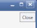
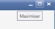
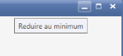
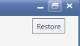
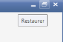

# Localization

Syncfusion Tools allow you to set custom resource through the Resx file. You can simply provide the string values in the resource file for a specific culture and set the culture in the application. The given string values are set to the Tools control without modifying the code examples. This table shows the localization of the ChromelessWindow control property. 

<table>
<tr>
<th>
Property</th><th>
Description</th></tr>
<tr>
<td>
CloseTooltip</td><td>
Sets the string for the ToolTip of Close button in the ChromelessWindow.</td></tr>
<tr>
<td colspan = "1">
{{''| markdownify}}
</td>
<td>
{{''| markdownify}}

</td></tr>
<tr>
<td>
MaximizeTooltip</td><td>
Sets the string for the ToolTip of Maximize button in the ChromelessWindow.</td></tr>
<tr>
<td colspan = "1">
{{''| markdownify}}
</td>
<td>
{{''| markdownify}}

</td></tr>
<tr>
<td>
MinimizeTooltip</td><td>
Sets the string for the ToolTip of Minimize button in the ChromelessWindow.</td></tr>
<tr>
<td colspan = "1">
{{''| markdownify}}
</td>
<td>
{{''| markdownify}}

</td></tr>
<tr>
<td>
RestoreTooltip</td><td>
Sets the string for the ToolTip of Restore button in the ChromelessWindow.</td></tr>
<tr>
<td colspan = "1">
{{''| markdownify}}
</td>
<td>
{{''| markdownify}}

</td></tr>
</table>