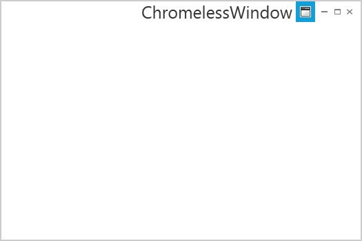

# TitleFontSize Support

The FontSize of the ChromelessWindow title can be changed by using **TitleFontSize** property. By default its value is 12, to enable this functionality, change its value as desired

To set this property, use the below code





<syncfusion:ChromelessWindow x:Class="Chromelesswindow.MainWindow"
xmlns="http://schemas.microsoft.com/winfx/2006/xaml/presentation"
xmlns:x="http://schemas.microsoft.com/winfx/2006/xaml"
Title="ChromelessWindow" Height="350" Width="525" TitleFontSize="25" syncfusion:SkinStorage.VisualStyle="Metro"     
x:Name="_chromelessWindow" xmlns:syncfusion="clr-namespace:Syncfusion.Windows.Shared;assembly=Syncfusion.Shared.WPF" >
<Grid>
</Grid>
</syncfusion:ChromelessWindow>





this.TitleFontSize = 25;





Me.TitleFontSize = 25





