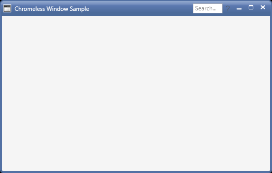
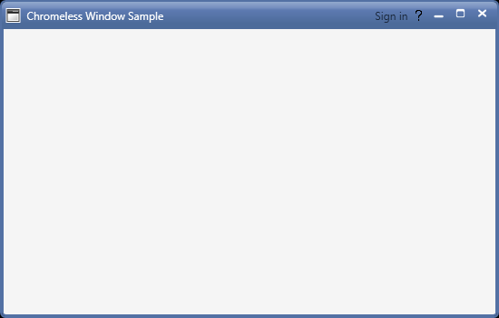

# Adding controls in the Title bar in WPF Chromeless Window

Provided the option to add adaptive controls such as Button, TextBox, Label, etc on either side of the title bar in the Chromeless Window. The [`LeftHeaderItemsSource`](https://help.syncfusion.com/cr/wpf/Syncfusion.Windows.Shared.ChromelessWindow.html#Syncfusion_Windows_Shared_ChromelessWindow_LeftHeaderItemsSource) property holds the controls to be shown on the left side of the title bar likewise the [`RightHeaderItemsSource`](https://help.syncfusion.com/cr/wpf/Syncfusion.Windows.Shared.ChromelessWindow.html#Syncfusion_Windows_Shared_ChromelessWindow_RightHeaderItemsSource) property holds the controls to be shown on the right side of the title bar.



<syncfusion:ChromelessWindow x:Class="Chromeless_Window_Sample.MainWindow"
        xmlns="http://schemas.microsoft.com/winfx/2006/xaml/presentation"
        xmlns:x="http://schemas.microsoft.com/winfx/2006/xaml"
        xmlns:d="http://schemas.microsoft.com/expression/blend/2008"
        xmlns:mc="http://schemas.openxmlformats.org/markup-compatibility/2006"
        xmlns:local="clr-namespace:Chromeless_Window_Sample"
        mc:Ignorable="d" xmlns:syncfusion="http://schemas.syncfusion.com/wpf"
        xmlns:skin="clr-namespace:Syncfusion.SfSkinManager;assembly=Syncfusion.SfSkinManager.WPF"
        skin:SfSkinManager.VisualStyle="Office2016Colorful" TitleTextAlignment="Left"
        Title="Chromeless Window Sample" IconAlignment="Left" Height="350" Width="550" x:Name="window"
         RightHeaderItemsSource="{DynamicResource rightHeaderItems}">
    <syncfusion:ChromelessWindow.Resources>
        <local:MyObservableCollection x:Key="rightHeaderItems">
            <syncfusion:SfTextBoxExt Watermark="Search..." Width="60" Height="20"/>
            <Button x:Name="help" Width="22" Height="22" Background="Transparent" Command="{Binding Path=HelpCommand, ElementName=window}" BorderThickness="0" >
                <Path Data="M3.9400001,13.238 L5.5349999,13.238 5.5349999,14.833 3.9400001,14.833 z M4.7539988,0 C6.2060028,8.8817842E-16 7.3750015,0.39599991 8.2300044,1.1770003 9.0749989,1.9500008 9.5039998,2.8959999 9.5039998,3.9900017 9.5039998,4.6220016 9.3539982,5.2110023 9.0599995,5.743 8.7549992,6.2900009 8.1419993,6.9750023 7.2350021,7.7770004 6.5800033,8.3570023 6.1620041,8.7770004 5.9580017,9.0590019 5.7429972,9.3530006 5.5830012,9.6930008 5.4789973,10.070999 5.3929988,10.394001 5.3399974,10.871002 5.3170024,11.521999 L4.0500041,11.521999 C4.0479975,11.409 4.0459986,11.316002 4.0459986,11.244999 4.0459986,10.528 4.1480036,9.9029999 4.3499995,9.387001 4.4899989,9.0110016 4.7289973,8.618 5.0599986,8.2180023 5.310998,7.9189987 5.7679992,7.4770012 6.4180008,6.9049988 7.1190048,6.2859993 7.5660034,5.7989998 7.7829991,5.4169998 8.0100032,5.0200005 8.1240016,4.5839996 8.1240016,4.1189995 8.1240016,3.288002 7.796999,2.5480003 7.1510025,1.9220008 6.5110031,1.2989998 5.7139979,0.98400116&#xd;&#xa;4.784997,0.9840011 3.8870018,0.98400116 3.1250005,1.2709999 2.5199972,1.8380011 1.9710011,2.3500004 1.5930027,3.1230011 1.3939974,4.1389999 L0,3.9729996 C0.19999708,2.7350006 0.6869967,1.7670002 1.4499972,1.0950012 2.2720037,0.36900139 3.3850029,8.8817842E-16 4.7539988,0 z" 
                      Fill="#FF595858" HorizontalAlignment="Left" Height="11" Stretch="Fill" VerticalAlignment="Top" Width="7.504" />
            </Button>
        </local:MyObservableCollection>
    </syncfusion:ChromelessWindow.Resources>
    <Grid>
    </Grid>
</syncfusion:ChromelessWindow>



public class MyObservableCollection : ObservableCollection<object> { }

/// 

/// Commmand for the help button.
/// 

public DelegateCommand HelpCommand
{
    get
    {
        return new DelegateCommand(HelpCommandAction);
    }
}

/// 

/// Action that is performed when clicking the help button.
/// 

private void HelpCommandAction(object param)
{
    System.Diagnostics.Process.Start("https://help.syncfusion.com/wpf/chromeless-window/adding-controls-in-the-titlebar");
}

/// 

/// A class that defines the interface for the command.
/// 

public class DelegateCommand : ICommand
{
    private readonly Action<object> _execute;
    /// 

    /// Raises when changes occur and specifies whether or not the command should be executed.
    /// 

    public event EventHandler CanExecuteChanged;

    /// 

    /// Constrcutor of the delegate command.
    /// 

    /// <param name="execute"></param>
    public DelegateCommand(Action<object> execute)
    {
        _execute = execute;
    }

    /// 

    ///  Defines the method that determines whether the command can be executed in its current state.
    /// 

    public bool CanExecute(object parameter)
    {
            return true;
    }

    /// 

    ///  Defines the method to be called when the command is invoked.
    /// 

    public void Execute(object parameter)
    {
        _execute(parameter);
    }

    /// 

    /// Defines the method to be called when changes occur that affect the command.
    /// 

    public void RaiseCanExecuteChanged()
    {
        if (CanExecuteChanged != null)
        {
            CanExecuteChanged(this, EventArgs.Empty);
        }
    }
}




We can also apply data template in-order to define the visual appearance of the items stored in the [`LeftHeaderItemsSource`](https://help.syncfusion.com/cr/wpf/Syncfusion.Windows.Shared.ChromelessWindow.html#Syncfusion_Windows_Shared_ChromelessWindow_LeftHeaderItemsSource) and [`RightHeaderItemsSource`](https://help.syncfusion.com/cr/wpf/Syncfusion.Windows.Shared.ChromelessWindow.html#Syncfusion_Windows_Shared_ChromelessWindow_RightHeaderItemsSource). The [`LeftHeaderItemTemplate`](https://help.syncfusion.com/cr/wpf/Syncfusion.Windows.Shared.ChromelessWindow.html#Syncfusion_Windows_Shared_ChromelessWindow_LeftHeaderItemTemplate) is used to define the visual appearance of the items stored in the [`LeftHeaderItemsSource`](https://help.syncfusion.com/cr/wpf/Syncfusion.Windows.Shared.ChromelessWindow.html#Syncfusion_Windows_Shared_ChromelessWindow_LeftHeaderItemsSource) while the [`RightHeaderItemTemplate`](https://help.syncfusion.com/cr/wpf/Syncfusion.Windows.Shared.ChromelessWindow.html#Syncfusion_Windows_Shared_ChromelessWindow_RightHeaderItemTemplate) is used to define the visual appearance of the items stored in the [`RightHeaderItemsSource`](https://help.syncfusion.com/cr/wpf/Syncfusion.Windows.Shared.ChromelessWindow.html#Syncfusion_Windows_Shared_ChromelessWindow_RightHeaderItemsSource).

In the illustration below, we have defined the [`RightHeaderItemTemplate`](https://help.syncfusion.com/cr/wpf/Syncfusion.Windows.Shared.ChromelessWindow.html#Syncfusion_Windows_Shared_ChromelessWindow_RightHeaderItemTemplate) with a button control and set the **"Utilities"** collection holding sign-in and help details to the[`RightHeaderItemsSource`](https://help.syncfusion.com/cr/wpf/Syncfusion.Windows.Shared.ChromelessWindow.html#Syncfusion_Windows_Shared_ChromelessWindow_RightHeaderItemsSource). Now, the properties of the button are mapped to the properties of the **"Item"** class objects maintained in the **"Utilities"** collection to create a visual appearance. When this is done, the items in the **"Utilities"** collection are visually converted as a sign-in and help button's and are added to the right side of the title bar.



<syncfusion:ChromelessWindow x:Class="Chromeless_Window_Sample.MainWindow"
        xmlns="http://schemas.microsoft.com/winfx/2006/xaml/presentation"
        xmlns:x="http://schemas.microsoft.com/winfx/2006/xaml"
        xmlns:d="http://schemas.microsoft.com/expression/blend/2008"
        xmlns:mc="http://schemas.openxmlformats.org/markup-compatibility/2006"
        xmlns:local="clr-namespace:Chromeless_Window_Sample"
        mc:Ignorable="d" xmlns:syncfusion="http://schemas.syncfusion.com/wpf"
        xmlns:skin="clr-namespace:Syncfusion.SfSkinManager;assembly=Syncfusion.SfSkinManager.WPF"
        skin:SfSkinManager.VisualStyle="Office2016Colorful" TitleTextAlignment="Left"
        Title="Chromeless Window Sample" IconAlignment="Left" Height="350" Width="550"
        RightHeaderItemsSource="{Binding Utilities}" RightHeaderItemTemplate="{DynamicResource Part_RightItemsTemplate}">
    <syncfusion:ChromelessWindow.DataContext>
        <local:UtilityViewModel/>
    </syncfusion:ChromelessWindow.DataContext>
    <syncfusion:ChromelessWindow.Resources>
        <DataTemplate x:Key="Part_RightItemsTemplate">
            <Grid>
                <syncfusion:ButtonAdv SmallIcon="{Binding Path = Icon, Mode = TwoWay}" Label="{Binding Path= Text, Mode=TwoWay}" SizeMode="{Binding Path=Mode}" Command="{Binding Path=Command}" Background="Transparent" BorderThickness="0" />
            </Grid>
        </DataTemplate>
    </syncfusion:ChromelessWindow.Resources>
    <Grid>
    </Grid>
</syncfusion:ChromelessWindow>



/// 

/// A model class view containing the details of the items to be bound in the title bar.
/// 

public class UtilityViewModel
{
    /// 

    /// Constructor of the UtilityViewModel class.
    /// 

    public UtilityViewModel()
    {
        LoadUtilities();
    }

    /// 

    /// Collection containing the complete details of the items to be bound in the title bar.
    /// 

    public ObservableCollection<Item> Utilities
    {
        get;
        set;
    }

    /// 

    /// Commmand for the Help button.
    /// 

    public DelegateCommand HelpCommand
    {
        get
        {
            return new DelegateCommand(HelpCommandAction);
        }
    }

    /// 

    /// Action that is performed when clicking the help button.
    /// 

    private void HelpCommandAction(object param)
    {
        System.Diagnostics.Process.Start("https://help.syncfusion.com/wpf/chromeless-window/adding-controls-in-the-titlebar");
    }

    /// 

    /// Commmand for the Sign in button.
    /// 

    public DelegateCommand SignInCommand
    {
        get
        {
            return new DelegateCommand(SignInCommandAction);
        }
    }

    /// 

    /// Action that is performed when clicking the Sign in button.
    /// 

    private void SignInCommandAction(object param)
    {
        MessageBox.Show("Sign in successful");
    }

    /// 

    /// Create and add items along with the necessary details for the collection.
    /// 

    public void LoadUtilities()
    {
        ObservableCollection<Item> utilities = new ObservableCollection<Item>();
        var outPutDirectory = System.IO.Path.GetDirectoryName(Assembly.GetExecutingAssembly().CodeBase);
        var logoimage = System.IO.Path.Combine(outPutDirectory, "Images\\Help.png");
        utilities.Add(new Item { Name = "Account", Icon = null, Text = "Sign in", Mode = SizeMode.Normal, Command=SignInCommand });
        utilities.Add(new Item { Name = "Help", Icon = new BitmapImage(new Uri(logoimage.ToString())), Text="", Mode = SizeMode.Small, Command=HelpCommand });
        Utilities = utilities;
    }
}

/// 

/// A model class that shows the outline of items, such as the name of the item, the source path of the icon, the text display, the size and the command of the image.
/// 

public class Item
{
    public string Name
    {
        get; set;
    }
    public ImageSource Icon
    {
        get; set;
    }
    public string Text
    {
        get; set;
    }
    public SizeMode Mode
    {
        get; set;
    }
    public ICommand Command
    {
        get; set;
    }
}

/// 

/// A class that defines the interface for the command.
/// 

public class DelegateCommand : ICommand
{
    private readonly Action<object> _execute;
    /// 

    /// Raises when changes occur and specifies whether or not the command should be executed.
    /// 

    public event EventHandler CanExecuteChanged;

    /// 

    /// Constrcutor of the Delegate command
    /// 

    /// <param name="execute"></param>
    public DelegateCommand(Action<object> execute)
    {
        _execute = execute;
    }

    /// 

    ///  Defines the method that determines whether the command can be executed in its current state.
    /// 

    public bool CanExecute(object parameter)
    {
            return true;
    }

    /// 

    ///  Defines the method to be called when the command is invoked.
    /// 

    public void Execute(object parameter)
    {
        _execute(parameter);
    }

    /// 

    /// Defines the method to be called when changes occur that affect the command.
    /// 

    public void RaiseCanExecuteChanged()
    {
        if (CanExecuteChanged != null)
        {
            CanExecuteChanged(this, EventArgs.Empty);
        }
    }
}




