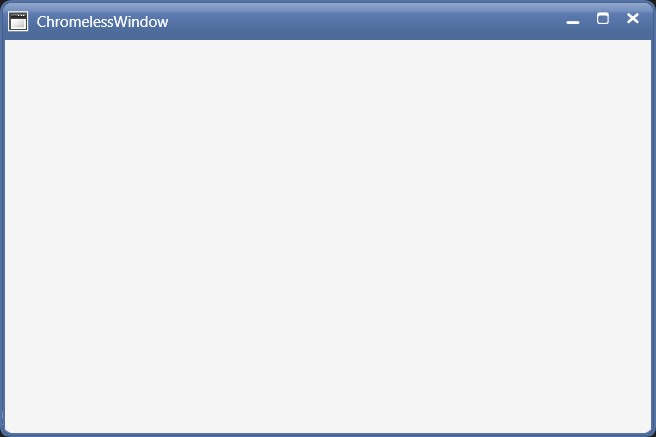

# Corner Radius in WPF Chromeless Window

Corner Radius indicates the degree to which the corners of the border can be rounded. To create curved borders for the windows, use **CornerRadius** property of the ChromelessWindow.

The default value is zero, which implies sharp corners





<syncfusion:ChromelessWindow x:Class="Chromelesswindow.MainWindow"
xmlns="http://schemas.microsoft.com/winfx/2006/xaml/presentation"
xmlns:x="http://schemas.microsoft.com/winfx/2006/xaml"
Title="ChromelessWindow" Height="350" Width="525"  CornerRadius="8"  AllowsTransparency="True" 
syncfusion:SkinStorage.VisualStyle="Metro" x:Name="_chromelessWindow"    
xmlns:syncfusion="clr-namespace:Syncfusion.Windows.Shared;assembly=Syncfusion.Shared.WPF"  >
</syncfusion:ChromelessWindow>





_chromelessWindow.CornerRadius = new CornerRadius(8);





_chromelessWindow.CornerRadius = New CornerRadius(8)





