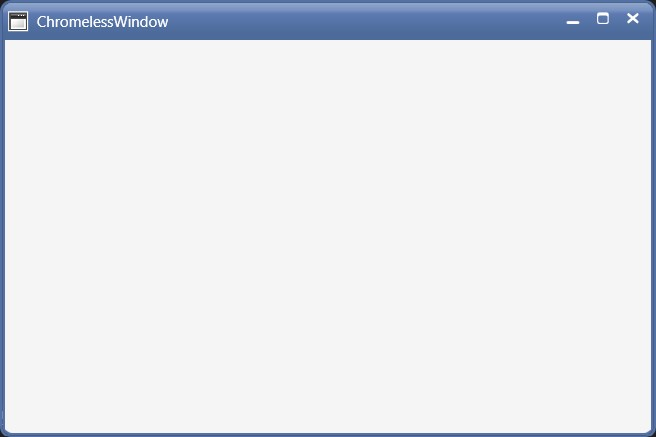

# Corner Radius in WPF Chromeless Window

The corner radius indicates the degree to which the corners of the border can be rounded. To create curved borders for the window, use the `CornerRadius` property of the ChromelessWindow.

The default value is `0`, which implies sharp corners.

N> `AllowsTransparency` must be set to `True` for the rounded corners to be visible. Without it, the non-client area of the window clips the rounded corners.





<syncfusion:ChromelessWindow x:Class="Chromelesswindow.MainWindow"
xmlns="http://schemas.microsoft.com/winfx/2006/xaml/presentation"
xmlns:x="http://schemas.microsoft.com/winfx/2006/xaml"
Title="ChromelessWindow" Height="350" Width="525"  CornerRadius="8"  AllowsTransparency="True" 
syncfusion:SkinStorage.VisualStyle="Metro" x:Name="_chromelessWindow"    
xmlns:syncfusion="clr-namespace:Syncfusion.Windows.Shared;assembly=Syncfusion.Shared.WPF"  >
</syncfusion:ChromelessWindow>





_chromelessWindow.CornerRadius = new CornerRadius(8);





_chromelessWindow.CornerRadius = New CornerRadius(8)





