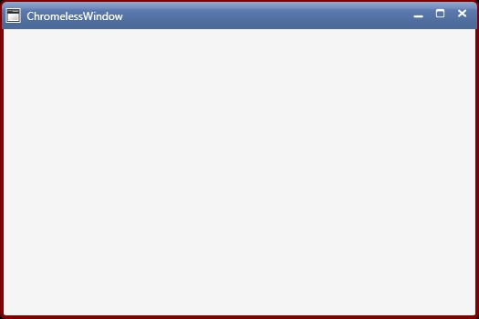
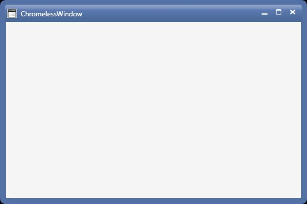

# Customizing Border of the ChromelessWindow in WPF Chromeless Window

This section describes the properties that can be used to customize the resize border of a ChromelessWindow.

## BorderBrush

The borders of the resizable window can be painted by using the [`ResizeBorderBrush`](https://help.syncfusion.com/cr/wpf/Syncfusion.Windows.Shared.ChromelessWindow.html#Syncfusion_Windows_Shared_ChromelessWindow_ResizeBorderBrush) property. The default value is `null`.

To set the `ResizeBorderBrush` property, use the code below.





<syncfusion:ChromelessWindow x:Class="Chromelesswindow.MainWindow"
xmlns="http://schemas.microsoft.com/winfx/2006/xaml/presentation"
xmlns:x="http://schemas.microsoft.com/winfx/2006/xaml"
Title="ChromelessWindow" Height="350" Width="525" ResizeBorderBrush="Maroon" syncfusion:SkinStorage.VisualStyle="Metro"     
x:Name="_chromelessWindow"    xmlns:syncfusion="clr-namespace:Syncfusion.Windows.Shared;assembly=Syncfusion.Shared.WPF" >
<Grid>
</Grid>
</syncfusion:ChromelessWindow>





this.ResizeBorderBrush = new SolidColorBrush(Colors.Maroon);





Me.ResizeBorderBrush = New SolidColorBrush(Colors.Maroon)



 

## BorderThickness

To set the thickness for the resize border, use the [`ResizeBorderThickness`](https://help.syncfusion.com/cr/wpf/Syncfusion.Windows.Shared.ChromelessWindow.html#Syncfusion_Windows_Shared_ChromelessWindow_ResizeBorderThickness) property of the ChromelessWindow. The default value is `4`. This property virtually sets the region for the resize pointer to appear. Hence, a larger region makes it easier to resize the window.

To set this property, use the following code.





<syncfusion:ChromelessWindow x:Class="Chromelesswindow.MainWindow"
xmlns="http://schemas.microsoft.com/winfx/2006/xaml/presentation"
xmlns:x="http://schemas.microsoft.com/winfx/2006/xaml"
Title="ChromelessWindow" Height="350" Width="525" ResizeBorderThickness="8"  syncfusion:SkinStorage.VisualStyle="Metro"     
x:Name="_chromelessWindow"    xmlns:syncfusion="clr-namespace:Syncfusion.Windows.Shared;assembly=Syncfusion.Shared.WPF" >
<Grid>
</Grid>
</syncfusion:ChromelessWindow>





this.ResizeBorderThickness = new Thickness(8);





Me.ResizeBorderThickness = New Thickness(8)





