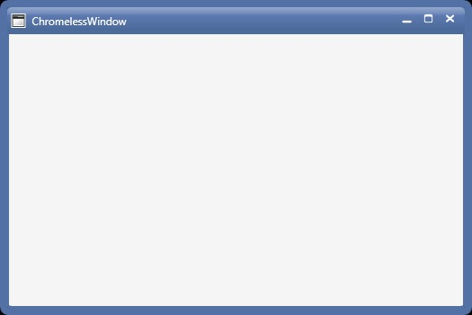

# Customizing Border of the ChromelessWindow in WPF Chromeless Window

**BorderBrush**

The Borders of the resizable window can be painted by using the **ResizeBorderBrush** property.

To set the ResizeBorderBrush property, use the below code





<syncfusion:ChromelessWindow x:Class="Chromelesswindow.MainWindow"
xmlns="http://schemas.microsoft.com/winfx/2006/xaml/presentation"
xmlns:x="http://schemas.microsoft.com/winfx/2006/xaml"
Title="ChromelessWindow" Height="350" Width="525" ResizeBorderBrush="Maroon" syncfusion:SkinStorage.VisualStyle="Metro"     
x:Name="_chromelessWindow"    xmlns:syncfusion="clr-namespace:Syncfusion.Windows.Shared;assembly=Syncfusion.Shared.WPF" >
<Grid>
</Grid>
</syncfusion:ChromelessWindow>





this.ResizeBorderBrush = new SolidColorBrush(Colors.Maroon);





Me.ResizeBorderBrush = New SolidColorBrush(Colors.Maroon)



 

**BorderThickness**

To set the thickness for the Resizable border, use **ResizableBorderThickness** property of the ChromelessWindow. This property virtually sets the region for the resize pointer to appear. Hence, greater the region, easier it is to resize.

To set this property, use the following code.





<syncfusion:ChromelessWindow x:Class="Chromelesswindow.MainWindow"
xmlns="http://schemas.microsoft.com/winfx/2006/xaml/presentation"
xmlns:x="http://schemas.microsoft.com/winfx/2006/xaml"
Title="ChromelessWindow" Height="350" Width="525" ResizeBorderThickness="8"  syncfusion:SkinStorage.VisualStyle="Metro"     
x:Name="_chromelessWindow"    xmlns:syncfusion="clr-namespace:Syncfusion.Windows.Shared;assembly=Syncfusion.Shared.WPF" >
<Grid>
</Grid>
</syncfusion:ChromelessWindow>





this.ResizeBorderThickness = new Thickness(8);





Me.ResizeBorderThickness = New Thickness(8)





