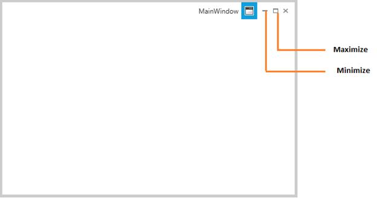

# End user capabilities in WPF Chromeless Window

The user can perform the below listed operations through the UI provided by the ChromelessWindow. 

1. Maximize/Minimize

2. Restore

3. Close

4. Resize

## Maximize/Minimize

The end user can maximize or minimize the buttons by using the Maximize and Minimize Buttons at the Top-Right corner of the ChromelessWindow

## Restore

After minimized or maximized the respective button is replaced by a **Restore** button. By clicking on this restore button the user can bring the **ChromelessWindow** to its **Normal** state.

## Close

The user can close the Window by using the Close Button at the Top-Right Corner of the ChromelessWindow

## Resize

The Window can be resize by clicking and dragging the Resizable Border

ChromelessWindow supports the following four Resize Modes

1. NoResize

2. CanMinimize

3. CanResize

4. CanResizeWithGrip

**NoResize**

In NoResize mode, the window cannot able to resize. The Minimize and Maximize buttons are not displayed in the title bar

**CanMinimize**

In this mode the window can only be minimize, since the Minimize button alone enabled.  

**CanResize**

In CanResize Mode, a window can be resized. The Minimize and Maximize buttons are both shown and enabled

**CanResizeWithGrip**

In CanResizeWithGrip mode, a window can be resized. A resize grip appears in the bottom-right corner of the window. The Minimize and Maximize buttons are both shown and enabled

