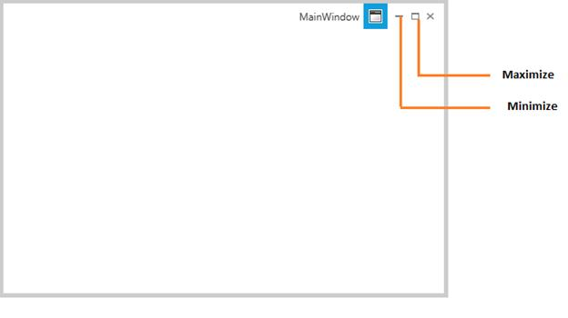
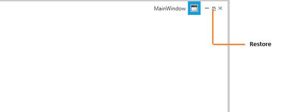
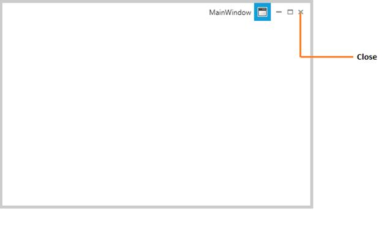

# End user capabilities in WPF Chromeless Window

The user can perform the operations listed below through the UI provided by the ChromelessWindow.

1. Maximize/Minimize

2. Restore

3. Close

4. Resize

## Maximize/Minimize

The end user can maximize or minimize the window by using the Maximize and Minimize buttons at the top-right corner of the ChromelessWindow.

## Restore

After the window is minimized or maximized, the respective button is replaced by a **Restore** button. By clicking this restore button, the user can bring the **ChromelessWindow** to its **Normal** state.

## Close

The user can close the window by using the Close button at the top-right corner of the ChromelessWindow.

## Resize

The window can be resized by clicking and dragging the resize border.

ChromelessWindow supports the following four resize modes (see the WPF [`ResizeMode`](https://learn.microsoft.com/en-us/dotnet/api/system.windows.resizemode) enumeration). The default value is `CanResize`.

* `NoResize`
* `CanMinimize`
* `CanResize`
* `CanResizeWithGrip`

### NoResize

In `NoResize` mode, the window cannot be resized. The Minimize and Maximize buttons are not displayed in the title bar.

### CanMinimize

In `CanMinimize` mode, the window can only be minimized, since only the Minimize button is enabled.

### CanResize

In `CanResize` mode, a window can be resized. The Minimize and Maximize buttons are both shown and enabled.

### CanResizeWithGrip

In `CanResizeWithGrip` mode, a window can be resized. A resize grip appears in the bottom-right corner of the window. The Minimize and Maximize buttons are both shown and enabled.

