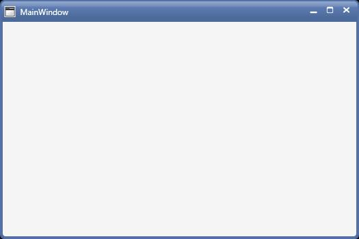
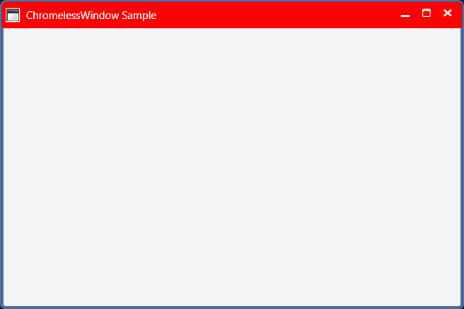
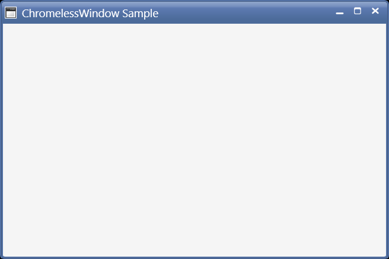
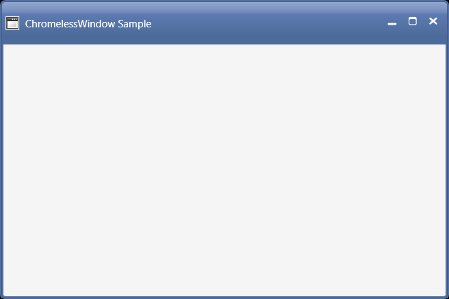
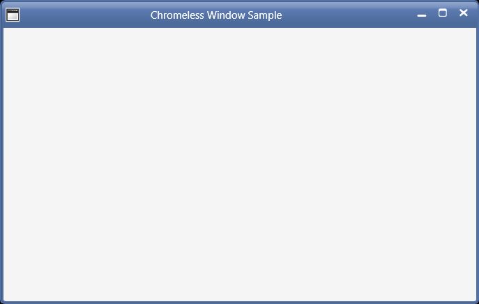
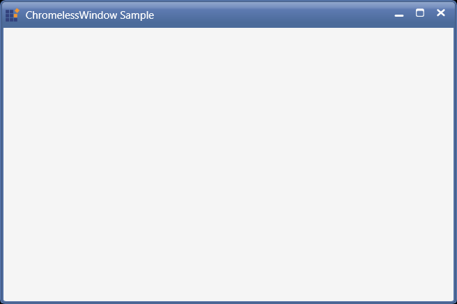
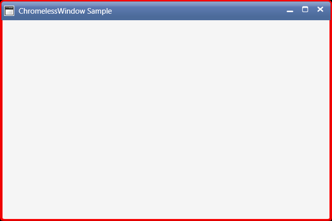

# Getting Started with WPF Chromeless Window

This section explains how to add and configure the Chromeless Window control in a WPF application.

## Assembly deployment

Refer to the [control dependencies](https://help.syncfusion.com/wpf/control-dependencies#chromelesswindow) section to get the list of assemblies or NuGet packages that need to be added as references to use the control in any application.

You can find more details about installing the NuGet packages in a WPF application in the following link:

[How to install NuGet packages](https://help.syncfusion.com/wpf/installation/install-nuget-packages)

The minimum NuGet package required is `Syncfusion.Shared.WPF`. Refer to [Control Dependencies](https://help.syncfusion.com/wpf/control-dependencies#chromelesswindow) for the list of additional dependent packages and the supported Syncfusion version.

## Creating a simple application with Chromeless Window

You can create a WPF application with Chromeless Window using the following steps:

1.	[Create a project.](#creating-the-project)
2.	[Add Chromeless Window.](#add-chromelesswindow)
3.	[Customize title bar.](#customizing-title-bar)
4.	[Customize title bar background.](#title-bar-background)
5.	[Customize title bar font.](#title-bar-font)
6.	[Customize title bar height.](#title-bar-height)
7.	[Customize title bar icon.](#title-bar-icon)
8.	[Customize the border of the Chromeless Window.](#customizing-the-border-of-chromelesswindow)

### Creating the project

Create a new WPF project in Visual Studio to display the Chromeless Window.

### Add Chromeless Window

The following steps help you add Chromeless Window to your project:

1. Create a WPF project and add a reference to the following assembly:
   * `Syncfusion.Shared.WPF.dll`

   You can also install the `Syncfusion.Shared.WPF` NuGet package.

2. Include an XML namespace for the assembly in the Main window.




<Window x:Class="Chromelesswindow.MainWindow" 
    xmlns="http://schemas.microsoft.com/winfx/2006/xaml/presentation"
    xmlns:x="http://schemas.microsoft.com/winfx/2006/xaml"
    Title="MainWindow" Height="350" Width="525"
    xmlns:syncfusion="clr-namespace:Syncfusion.Windows.Shared;assembly=Syncfusion.Shared.WPF">
</Window>



{{ codesnippet1 | OrderList_Indent_Level_1 }}

3. Change the `Window` to `Chromeless Window`.




<syncfusion:ChromelessWindow x:Class="Chromelesswindow.MainWindow"
    xmlns="http://schemas.microsoft.com/winfx/2006/xaml/presentation"
    xmlns:x="http://schemas.microsoft.com/winfx/2006/xaml"
    Title="MainWindow" Height="350" Width="525"
    xmlns:syncfusion="clr-namespace:Syncfusion.Windows.Shared;assembly=Syncfusion.Shared.WPF">
</syncfusion:ChromelessWindow>



{{ codesnippet2 | OrderList_Indent_Level_1 }}

4. Add the `Syncfusion.Windows.Shared` namespace and inherit `MainWindow` from `Chromeless Window` in code-behind.




using Syncfusion.Windows.Shared;
public partial class MainWindow : ChromelessWindow
{
    public MainWindow()
    {
        InitializeComponent();
    } 
}



{{ codesnippet3 | OrderList_Indent_Level_1 }}

## Customizing the title bar

The following sections describe the most common title bar customizations. For a complete list of properties, see [Title bar Customization](TitleBarCustomization.md).

### Title bar background

You can customize the background of the title bar by setting the [TitleBarBackground](https://help.syncfusion.com/cr/wpf/Syncfusion.Windows.Shared.ChromelessWindow.html#Syncfusion_Windows_Shared_ChromelessWindow_TitleBarBackground) property of Chromeless Window.



<syncfusion:ChromelessWindow
    x:Class="WPF_CalendarEdit.MainWindow"
    xmlns="http://schemas.microsoft.com/winfx/2006/xaml/presentation"
    xmlns:x="http://schemas.microsoft.com/winfx/2006/xaml"
    xmlns:d="http://schemas.microsoft.com/expression/blend/2008"
    xmlns:syncfusion="http://schemas.syncfusion.com/wpf" 
    TitleBarBackground="Red"
    Title="ChromelessWindow Sample" Height="350" Width="525">
    <Grid>
    </Grid>
</syncfusion:ChromelessWindow>



### Title bar font

The font size of the caption in the title bar can be customized using the [TitleFontSize](https://help.syncfusion.com/cr/wpf/Syncfusion.Windows.Shared.ChromelessWindow.html#Syncfusion_Windows_Shared_ChromelessWindow_TitleFontSize) property. 



<syncfusion:ChromelessWindow
    x:Class="WPF_CalendarEdit.MainWindow"
    xmlns="http://schemas.microsoft.com/winfx/2006/xaml/presentation"
    xmlns:x="http://schemas.microsoft.com/winfx/2006/xaml"
    xmlns:d="http://schemas.microsoft.com/expression/blend/2008"
    xmlns:syncfusion="http://schemas.syncfusion.com/wpf" 
    TitleFontSize="15"
    Title="ChromelessWindow Sample" Height="350" Width="525">
	<Grid>
	</Grid>
</syncfusion:ChromelessWindow>



### Title bar height

You can customize the caption height by setting the [TitleBarHeight](https://help.syncfusion.com/cr/wpf/Syncfusion.Windows.Shared.ChromelessWindow.html#Syncfusion_Windows_Shared_ChromelessWindow_TitleBarHeight) property of Chromeless Window.



<syncfusion:ChromelessWindow
    x:Class="WPF_CalendarEdit.MainWindow"
    xmlns="http://schemas.microsoft.com/winfx/2006/xaml/presentation"
    xmlns:x="http://schemas.microsoft.com/winfx/2006/xaml"
    xmlns:d="http://schemas.microsoft.com/expression/blend/2008"
    xmlns:syncfusion="http://schemas.syncfusion.com/wpf" 
    xmlns:local="clr-namespace:WPF_CalendarEdit"
	TitleBarHeight="50"
    Title="ChromelessWindow Sample" Height="350" Width="525">
	<Grid>
    </Grid>
</syncfusion:ChromelessWindow>



### Title bar text alignment

Use the [TitleTextAlignment](https://help.syncfusion.com/cr/wpf/Syncfusion.Windows.Shared.ChromelessWindow.html#Syncfusion_Windows_Shared_ChromelessWindow_TitleTextAlignment) property to set the alignment of the title text in the Chromeless Window. The following alignment options are available:

* `Left` - Aligns the title text to the left.
* `Right` - Aligns the title text to the right.
* `Center` - Centers the title text within the title bar.
* `Stretch` - Stretches the title text to fill the available space between the window icon and the caption buttons.



<syncfusion:ChromelessWindow x:Class="Chromeless_Window_Sample.MainWindow"
        xmlns="http://schemas.microsoft.com/winfx/2006/xaml/presentation"
        xmlns:x="http://schemas.microsoft.com/winfx/2006/xaml"
        xmlns:d="http://schemas.microsoft.com/expression/blend/2008"
        xmlns:mc="http://schemas.openxmlformats.org/markup-compatibility/2006"
        xmlns:local="clr-namespace:Chromeless_Window_Sample"
        mc:Ignorable="d" xmlns:syncfusion="http://schemas.syncfusion.com/wpf"
        TitleTextAlignment="Center"
        Title="Chromeless Window Sample"
        Height="350" Width="550">
    <Grid>
    </Grid>
</syncfusion:ChromelessWindow>



### Title bar icon

You can set the caption icon by setting the [Icon](https://learn.microsoft.com/en-us/dotnet/api/system.windows.window.icon) property. The icon file (for example, `App.ico`) must be added to the project with its **Build Action** set to **Resource**.



<syncfusion:ChromelessWindow
    x:Class="WPF_CalendarEdit.MainWindow"
    xmlns="http://schemas.microsoft.com/winfx/2006/xaml/presentation"
    xmlns:x="http://schemas.microsoft.com/winfx/2006/xaml"
    xmlns:d="http://schemas.microsoft.com/expression/blend/2008"
    xmlns:syncfusion="http://schemas.syncfusion.com/wpf" 
	Icon="App.ico"
    Title="ChromelessWindow Sample" Height="350" Width="525">
    <Grid>
    </Grid>
</syncfusion:ChromelessWindow>



### Title bar icon alignment

Use the [IconAlignment](https://help.syncfusion.com/cr/wpf/Syncfusion.Windows.Shared.ChromelessWindow.html#Syncfusion_Windows_Shared_ChromelessWindow_IconAlignment) property to align the title bar icon in the Chromeless Window.

The following alignment options are available:

* `Left` - Aligns the icon to the left side of the title bar.
* `Right` - Aligns the icon to the right side of the title bar.



<syncfusion:ChromelessWindow x:Class="Chromeless_Window_Sample.MainWindow"
        xmlns="http://schemas.microsoft.com/winfx/2006/xaml/presentation"
        xmlns:x="http://schemas.microsoft.com/winfx/2006/xaml"
        xmlns:d="http://schemas.microsoft.com/expression/blend/2008"
        xmlns:mc="http://schemas.openxmlformats.org/markup-compatibility/2006"
        xmlns:local="clr-namespace:Chromeless_Window_Sample"
        mc:Ignorable="d" xmlns:syncfusion="http://schemas.syncfusion.com/wpf"
        TitleTextAlignment="Center"
        Title="Chromeless Window Sample" IconAlignment="Left"
        Height="350" Width="550">
    <Grid>
    </Grid>
</syncfusion:ChromelessWindow>



## Customizing the border of Chromeless Window

You can change the border color of the Chromeless Window by setting the [ResizeBorderBrush](https://help.syncfusion.com/cr/wpf/Syncfusion.Windows.Shared.ChromelessWindow.html#Syncfusion_Windows_Shared_ChromelessWindow_ResizeBorderBrush) property. For full border customization, see [Customizing Border of the Chromeless Window](Customizing-Border-of-the-ChromelessWindow.md).



<syncfusion:ChromelessWindow
    x:Class="WpfApplication2.MainWindow"
    xmlns="http://schemas.microsoft.com/winfx/2006/xaml/presentation"
    xmlns:x="http://schemas.microsoft.com/winfx/2006/xaml"
    xmlns:d="http://schemas.microsoft.com/expression/blend/2008"
    xmlns:syncfusion="http://schemas.syncfusion.com/wpf" 
	ResizeBorderBrush="Red"
    Title="ChromelessWindow Sample" Height="350" Width="525">
	<Grid>
	</Grid>
</syncfusion:ChromelessWindow>



## Theme

Chromeless Window supports various built-in themes. Refer to the following links to apply themes to the Chromeless Window:

* [Apply theme using SfSkinManager](https://help.syncfusion.com/wpf/themes/skin-manager)
* [Create a custom theme using ThemeStudio](https://help.syncfusion.com/wpf/themes/theme-studio#creating-custom-theme)

  

N> [View Getting Started Sample in GitHub](https://github.com/syncfusion/wpf-demos/tree/master/layout/Chromeless%20Window)
