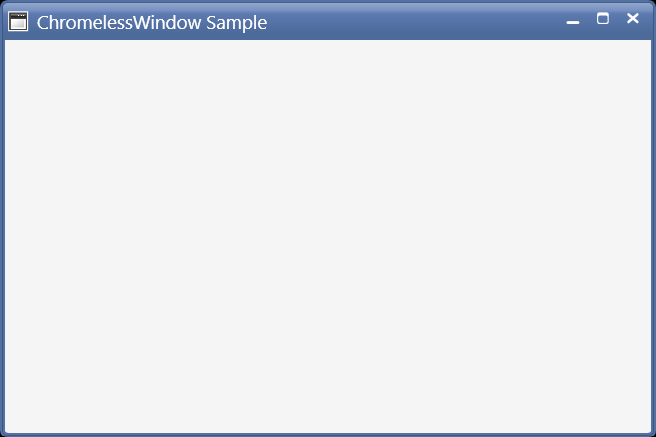

# Getting Started

This section explains how to implement the ChromelessWindow control. It describes the following:

## Assembly deployment

Refer to the [control dependencies](https://help.syncfusion.com/wpf/control-dependencies#chromelesswindow) section to get the list of assemblies or NuGet package that needs to be added as reference to use the control in any application.

You can find more details about installing the NuGet packages in a WPF application in the following link: 

[How to install nuget packages](https://help.syncfusion.com/wpf/nuget-packages)

## Creating simple application with ChromelessWindow

You can create a WPF application with ChromelessWindow using the following steps:

1.	[Create a project.](#creating-the-project)
2.	[Add ChromelessWindow.](#add-chromelesswindow)
3.	[Customize title bar.](#customizing-title-bar)
4.	[Customize title bar background.](#title-bar-background)
5.	[Customize title bar font.](#title-bar-font)
6.	[Customize title bar height.](#title-bar-height)
7.	[Show or hide the title bar text.](#show-or-hide-the-title-bar-text)
8.  [Show or hide the maximize and minimize buttons.](#show-or-hide-the-maximize-and-minimize-buttons)
9.	[Customize title bar icon.](#title-bar-icon)
10. [Show or hide the title bar icon.](#show-or-hide-the-title-bar-icon)
11.	[Customize the border of the ChromelessWindow.](#customizing-the-border-of-chromelesswindow)

### Creating the project

Create a new WPF project in Visual Studio to display chromeless window.

## Add ChromelessWindow

The following steps help you add ChromelessWindow:

1.	Create a WPF project, and refer the following assemblies: 
     * Syncfusion.Shared.WPF.dll.
2. Include an XML namespace for the above assemblies to the Main window.



<Window x:Class="Chromelesswindow.MainWindow" 
    xmlns="http://schemas.microsoft.com/winfx/2006/xaml/presentation"
    xmlns:x="http://schemas.microsoft.com/winfx/2006/xaml"
    Title="MainWindow" Height="350" Width="525"
    xmlns:syncfusion="clr-namespace:Syncfusion.Windows.Shared;assembly=Syncfusion.Shared.WPF">
</Window>



3.	Change the Window to ChromelessWindow.

<syncfusion:ChromelessWindow x:Class="Chromelesswindow.MainWindow"
    xmlns="http://schemas.microsoft.com/winfx/2006/xaml/presentation"
    xmlns:x="http://schemas.microsoft.com/winfx/2006/xaml"
    Title="MainWindow" Height="350" Width="525"
    xmlns:syncfusion="clr-namespace:Syncfusion.Windows.Shared;assembly=Syncfusion.Shared.WPF">
</syncfusion:ChromelessWindow>

4.	Add the **Syncfusion.Windows.Shared namespace**, and inherit MainWindow from ChromelessWindow in code behind.



using Syncfusion.Windows.Shared;
public partial class MainWindow : ChromelessWindow
{
    public MainWindow()
    {
        InitializeComponent();
    } 
}



## Customizing title bar

## Title bar background

You can customize the background of the title bar by setting the [TitleBarBackground](https://help.syncfusion.com/cr/wpf/Syncfusion.Windows.Shared.ChromelessWindow.html#Syncfusion_Windows_Shared_ChromelessWindow_TitleBarBackground) property of ChromelessWindow.



<syncfusion:ChromelessWindow
    x:Class="WPF_CalendarEdit.MainWindow"
    xmlns="http://schemas.microsoft.com/winfx/2006/xaml/presentation"
    xmlns:x="http://schemas.microsoft.com/winfx/2006/xaml"
    xmlns:d="http://schemas.microsoft.com/expression/blend/2008"
    xmlns:syncfusion="http://schemas.syncfusion.com/wpf" 
    TitleBarBackground="Red"
    syncfusion:SkinStorage.VisualStyle="Metro"
    Title="ChromelessWindow Sample" Height="350" Width="525">
    <Grid>
    </Grid>
</syncfusion:ChromelessWindow>



## Title bar font

The font of the caption in the title bar can be customized using the [TitleFontSize](https://help.syncfusion.com/cr/wpf/Syncfusion.Windows.Shared.ChromelessWindow.html#Syncfusion_Windows_Shared_ChromelessWindow_TitleFontSize) property.



<syncfusion:ChromelessWindow
    x:Class="WPF_CalendarEdit.MainWindow"
    xmlns="http://schemas.microsoft.com/winfx/2006/xaml/presentation"
    xmlns:x="http://schemas.microsoft.com/winfx/2006/xaml"
    xmlns:d="http://schemas.microsoft.com/expression/blend/2008"
    xmlns:syncfusion="http://schemas.syncfusion.com/wpf" 
    TitleFontSize="15"
	syncfusion:SkinStorage.VisualStyle="Metro"
    Title="ChromelessWindow Sample" Height="350" Width="525">
	<Grid>
	</Grid>
</syncfusion:ChromelessWindow>



## Title bar height

You can customize the caption height by setting the [TitleBarHeight](https://help.syncfusion.com/cr/wpf/Syncfusion.Windows.Shared.ChromelessWindow.html#Syncfusion_Windows_Shared_ChromelessWindow_TitleBarHeight) of ChromelessWindow.



<syncfusion:ChromelessWindow
    x:Class="WPF_CalendarEdit.MainWindow"
    xmlns="http://schemas.microsoft.com/winfx/2006/xaml/presentation"
    xmlns:x="http://schemas.microsoft.com/winfx/2006/xaml"
    xmlns:d="http://schemas.microsoft.com/expression/blend/2008"
    xmlns:syncfusion="http://schemas.syncfusion.com/wpf" 
    xmlns:local="clr-namespace:WPF_CalendarEdit"
	TitleBarHeight="50"
	syncfusion:SkinStorage.VisualStyle="Metro"
    Title="ChromelessWindow Sample" Height="350" Width="525">
	<Grid>
    </Grid>
</syncfusion:ChromelessWindow>



## Title bar text alignment

The text alignment of the title can be set using the [`TitleTextAlignment`](https://help.syncfusion.com/cr/wpf/Syncfusion.Windows.Shared.ChromelessWindow.html#Syncfusion_Windows_Shared_ChromelessWindow_TitleTextAlignment) property in the Chromeless Window. The various options of the `TitleTextAlignment` are listed below.

* Left
* Right
* Center
* Stretch



<syncfusion:ChromelessWindow x:Class="Chromeless_Window_Sample.MainWindow"
        xmlns="http://schemas.microsoft.com/winfx/2006/xaml/presentation"
        xmlns:x="http://schemas.microsoft.com/winfx/2006/xaml"
        xmlns:d="http://schemas.microsoft.com/expression/blend/2008"
        xmlns:mc="http://schemas.openxmlformats.org/markup-compatibility/2006"
        xmlns:local="clr-namespace:Chromeless_Window_Sample"
        mc:Ignorable="d" xmlns:syncfusion="http://schemas.syncfusion.com/wpf"
        xmlns:skin="clr-namespace:Syncfusion.SfSkinManager;assembly=Syncfusion.SfSkinManager.WPF"
        skin:SfSkinManager.VisualStyle="Office2016Colorful"
        TitleTextAlignment="Center"
        Title="Chromeless Window Sample"
        Height="350" Width="550">
    <Grid>
    </Grid>
</syncfusion:ChromelessWindow>



## Show or hide the title bar text

The visibility of the title can be customized using the [`ShowTitle`](https://help.syncfusion.com/cr/wpf/Syncfusion.Windows.Shared.ChromelessWindow.html#Syncfusion_Windows_Shared_ChromelessWindow_ShowTitle) property. The default value of `ShowTitle` property is true.



<syncfusion:ChromelessWindow x:Class="Chromeless_Window_Sample.MainWindow"
        xmlns="http://schemas.microsoft.com/winfx/2006/xaml/presentation"
        xmlns:x="http://schemas.microsoft.com/winfx/2006/xaml"
        xmlns:d="http://schemas.microsoft.com/expression/blend/2008"
        xmlns:mc="http://schemas.openxmlformats.org/markup-compatibility/2006"
        xmlns:local="clr-namespace:Chromeless_Window_Sample"
        mc:Ignorable="d" xmlns:syncfusion="http://schemas.syncfusion.com/wpf"
        xmlns:skin="clr-namespace:Syncfusion.SfSkinManager;assembly=Syncfusion.SfSkinManager.WPF"
        skin:SfSkinManager.VisualStyle="Office2019Colorful"
        TitleTextAlignment="Center"
        Icon="App.ico"
        ShowTitle="False" 
        Title="Getting Started"
        Height="350" Width="550">
    <Grid>
    </Grid>
</syncfusion:ChromelessWindow>



## Show or hide the maximize and minimize buttons

 The visibility of maximize and minimize buttons can be customized using the [`ShowMaximizeButton`](https://help.syncfusion.com/cr/wpf/Syncfusion.Windows.Shared.ChromelessWindow.html#Syncfusion_Windows_Shared_ChromelessWindow_ShowMaximizeButton) and [`ShowMinimizeButton`](https://help.syncfusion.com/cr/wpf/Syncfusion.Windows.Shared.ChromelessWindow.html#Syncfusion_Windows_Shared_ChromelessWindow_ShowMinimizeButton) properties respectively. The default value of `ShowMaximizeButton` and `ShowMinimizeButton` properties is true. 

 

<syncfusion:ChromelessWindow x:Class="Chromeless_Window_Sample.MainWindow"
        xmlns="http://schemas.microsoft.com/winfx/2006/xaml/presentation"
        xmlns:x="http://schemas.microsoft.com/winfx/2006/xaml"
        xmlns:d="http://schemas.microsoft.com/expression/blend/2008"
        xmlns:mc="http://schemas.openxmlformats.org/markup-compatibility/2006"
        xmlns:local="clr-namespace:Chromeless_Window_Sample"
        mc:Ignorable="d" xmlns:syncfusion="http://schemas.syncfusion.com/wpf"
        xmlns:skin="clr-namespace:Syncfusion.SfSkinManager;assembly=Syncfusion.SfSkinManager.WPF"
        skin:SfSkinManager.VisualStyle="Office2019Colorful"
        TitleTextAlignment="Center"
        Icon="App.ico"
        ShowMinimizeButton="False"
        ShowMaximizeButton="False" 
        Title="Getting Started"
        Height="350" Width="550">
    <Grid>
    </Grid>
</syncfusion:ChromelessWindow>



N> By default, the maximize and minimize buttons are not displayed in ResizeMode -`NoResize` even the value of `ShowMaximizeButton` and `ShowMaximizeButton` set as `True`. The maximize and minimize buttons are displayed only in the remaining resize modes such as `CanMinimize`, `CanResize`, `CanResizeWithGrip` on the basis of the `ShowMaximizeButton` and `ShowMinimizeButton` properties. 

## Title bar icon

You can set the caption icon by setting the [Icon](https://docs.microsoft.com/de-de/dotnet/api/system.windows.window.icon?view=netframework-4.7.2) property.



<syncfusion:ChromelessWindow
    x:Class="WPF_CalendarEdit.MainWindow"
    xmlns="http://schemas.microsoft.com/winfx/2006/xaml/presentation"
    xmlns:x="http://schemas.microsoft.com/winfx/2006/xaml"
    xmlns:d="http://schemas.microsoft.com/expression/blend/2008"
    xmlns:syncfusion="http://schemas.syncfusion.com/wpf" 
	Icon="App.ico"
    syncfusion:SkinStorage.VisualStyle="Metro"
    Title="ChromelessWindow Sample" Height="350" Width="525">
    <Grid>
    </Grid>
</syncfusion:ChromelessWindow>



## Title bar icon alignment

The title bar icon can be aligned to `Left` or `Right` using the [`IconAlignment`](https://help.syncfusion.com/cr/wpf/Syncfusion.Windows.Shared.ChromelessWindow.html#Syncfusion_Windows_Shared_ChromelessWindow_IconAlignment) property in the Chromeless Window. Its various options are listed below.

* Left
* Right



<syncfusion:ChromelessWindow x:Class="Chromeless_Window_Sample.MainWindow"
        xmlns="http://schemas.microsoft.com/winfx/2006/xaml/presentation"
        xmlns:x="http://schemas.microsoft.com/winfx/2006/xaml"
        xmlns:d="http://schemas.microsoft.com/expression/blend/2008"
        xmlns:mc="http://schemas.openxmlformats.org/markup-compatibility/2006"
        xmlns:local="clr-namespace:Chromeless_Window_Sample"
        mc:Ignorable="d" xmlns:syncfusion="http://schemas.syncfusion.com/wpf"
        xmlns:skin="clr-namespace:Syncfusion.SfSkinManager;assembly=Syncfusion.SfSkinManager.WPF"
        skin:SfSkinManager.VisualStyle="Office2016Colorful"
        TitleTextAlignment="Center"
        Title="Chromeless Window Sample" IconAlignment="Left"
        Height="350" Width="550">
    <Grid>
    </Grid>
</syncfusion:ChromelessWindow>



## Show or hide the title bar icon

The visibility of the title bar icon can be customized using the [`ShowIcon`](https://help.syncfusion.com/cr/wpf/Syncfusion.Windows.Shared.ChromelessWindow.html#Syncfusion_Windows_Shared_ChromelessWindow_ShowIcon) property. The default value of `ShowIcon` property is true.



<syncfusion:ChromelessWindow x:Class="Chromeless_Window_Sample.MainWindow"
        xmlns="http://schemas.microsoft.com/winfx/2006/xaml/presentation"
        xmlns:x="http://schemas.microsoft.com/winfx/2006/xaml"
        xmlns:d="http://schemas.microsoft.com/expression/blend/2008"
        xmlns:mc="http://schemas.openxmlformats.org/markup-compatibility/2006"
        xmlns:local="clr-namespace:Chromeless_Window_Sample"
        mc:Ignorable="d" xmlns:syncfusion="http://schemas.syncfusion.com/wpf"
        xmlns:skin="clr-namespace:Syncfusion.SfSkinManager;assembly=Syncfusion.SfSkinManager.WPF"
        skin:SfSkinManager.VisualStyle="Office2019Colorful"
        TitleTextAlignment="Center"
        Icon="App.ico"
        ShowIcon="False" 
        Title="Getting Started"
        Height="350" Width="550">
    <Grid>
    </Grid>
</syncfusion:ChromelessWindow>



## Customizing the border of ChromelessWindow

You can change the border color of the chromeless window by setting the [ResizeBorderBrush](https://help.syncfusion.com/cr/wpf/Syncfusion.Windows.Shared.ChromelessWindow.html#Syncfusion_Windows_Shared_ChromelessWindow_ResizeBorderBrush) property.



<syncfusion:ChromelessWindow
    x:Class="WpfApplication2.MainWindow"
    xmlns="http://schemas.microsoft.com/winfx/2006/xaml/presentation"
    xmlns:x="http://schemas.microsoft.com/winfx/2006/xaml"
    xmlns:d="http://schemas.microsoft.com/expression/blend/2008"
	syncfusion:SkinStorage.VisualStyle="Metro"
    xmlns:syncfusion="http://schemas.syncfusion.com/wpf" 
	ResizeBorderBrush="Red"
    Title="ChromelessWindow Sample" Height="350" Width="525">
	<Grid>
	</Grid>
</syncfusion:ChromelessWindow>



