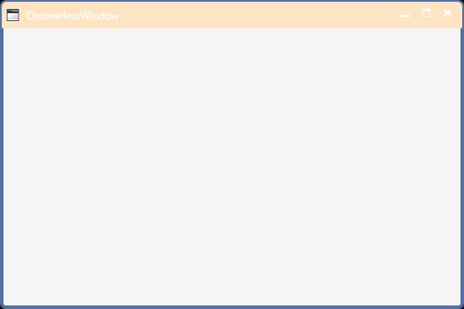
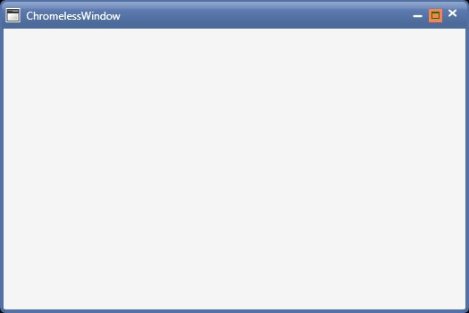

# Styling the ChromelessWindow in WPF Chromeless Window

This section deals with the Styles and Templates supported by ChromelessWindow control.

## Custom template for the TitleBar

ChromelessWindow allows the end-user to write own templates for the TitleBar. The TitleBar can be customized by using the **TitleBarTemplate** property. The following code snippet illustrates how to set the TitleBarTemplate property.





<syncfusion:ChromelessWindow x:Class="Chromelesswindow.MainWindow"
xmlns="http://schemas.microsoft.com/winfx/2006/xaml/presentation"
xmlns:x="http://schemas.microsoft.com/winfx/2006/xaml"
Title="ChromelessWindow" Height="350" Width="525" TitleBarTemplate="{StaticResource TitleBarTemplateKey}"   
syncfusion:SkinStorage.VisualStyle="Metro" x:Name="_chromelessWindow"    
xmlns:syncfusion="clr-namespace:Syncfusion.Windows.Shared;assembly=Syncfusion.Shared.WPF"  >
</syncfusion:ChromelessWindow>





For example, use the following code for a TitleBarTemplate.





<ControlTemplate x:Key="TitleBarTemplateKey" TargetType="{x:Type syncfusion:TitleBar}">
<Border x:Name="MainGrid"  Height="30" CornerRadius="5,5,0,0" Background="Bisque" >
<Border BorderBrush="Transparent" Background="Transparent" BorderThickness=".5" Width="Auto" CornerRadius="0,0,0,0">
<ContentPresenter   HorizontalAlignment="Stretch" VerticalAlignment="Center" />
</Border>
</Border>
</ControlTemplate>





N> The drag and drop feature for the ChromelessWindow is available only with the TitleBar,to incorporate this feature,include a TitleBar into your ChromelessWindow.Also it is necessary to specify the name of the TitleBar as PART_TitleBar",to enable the drag and drop feature.

## Custom template for the TitleButton

ChromelessWindow enables the user to write their own templates for the Title button that is used in the TitleBar. **Maximize** **,** **Minimize** **,** **Restore** **and** **Close** Button can be edited with **MaximizeButtonTemplate** **,** **MinimizeButtonTemplate** **,** **RestoreButtonTemplate** **,** **CloseButtonTemplate** property respectively. The below code example is illustrated to change the template of the Maximize Button using **MaximizeButtonTemplate** property





<syncfusion:ChromelessWindow x:Class="Chromelesswindow.MainWindow"
xmlns="http://schemas.microsoft.com/winfx/2006/xaml/presentation"
xmlns:x="http://schemas.microsoft.com/winfx/2006/xaml"
Title="ChromelessWindow" Height="350" Width="525" MaximizeButtonTemplate="{StaticResource MaxTemplateKey}" 
syncfusion:SkinStorage.VisualStyle="Metro"    x:Name="_chromelessWindow"    
xmlns:syncfusion="clr-namespace:Syncfusion.Windows.Shared;assembly=Syncfusion.Shared.WPF" >
<Grid>
</Grid>
</syncfusion:ChromelessWindow>





For example, use the following code for a MaximizeButtonTemplate.





<ControlTemplate x:Key="MaxTemplateKey" TargetType="{x:Type syncfusion:TitleButton}">
<Border SnapsToDevicePixels="true" x:Name="maxborder" Width="15" Height="15" Background="Coral"  
BorderThickness="0" BorderBrush="Transparent">
<Grid SnapsToDevicePixels="true" x:Name="grid" HorizontalAlignment="Center" VerticalAlignment="Center" Width="9" Height="8">
<Path Name="pathButton" SnapsToDevicePixels="True"  Stretch="Fill" StrokeThickness="1"               
Data="M1,1 L8,1 L8,8 L1,8 z M1,2 L8,2" Stroke="Green"
HorizontalAlignment="Center" VerticalAlignment="Center"  Width="9" Height="8">
</Path>                  
</Grid>
</Border>
</ControlTemplate>





Similarly, the template for the desired button can be changed by using the corresponding button property

## Overriding the default style

ChromelessWindow can be customized by editing the default template. The default style can be downloaded from the following link

[http://www.syncfusion.com/downloads/support/directtrac/general/ze/DefaultStyle-1700710349](http://www.syncfusion.com/downloads/support/directtrac/general/ze/DefaultStyle-1700710349)

This default style need to be included in the App.xaml file of your application and the override this style as you desire.

N> All the templates should be written in App.xaml file only.

The below example is illustrated to override the ChromelessWindow’s full style 





<ControlTemplate x:Key="TitleBarTemplateKey" TargetType="{x:Type syncfusion:TitleBar}">
<Border Name="border" Background="#AA161616" Height="30">
<ContentPresenter HorizontalAlignment="Stretch" VerticalAlignment="Bottom" Margin="0,0,0,0"/>
</Border>
</ControlTemplate>
<ControlTemplate x:Key="ChromelessWindowTemplate" TargetType="{x:Type syncfusion:ChromelessWindow}">
<AdornerDecorator>
<Border Name="OuterBorder" Background="#F1401013" BorderThickness="2" CornerRadius="{Binding ElementName=CornerRadiusSlider,Path=Value}" BorderBrush="#401013">
......
......
......
<syncfusion:TitleBar Name="PART_TitleBar" Grid.Row="0" Template="{StaticResource TitleBarTemplateKey}" >
<Grid VerticalAlignment="Top" Height="30">
<StackPanel Orientation="Horizontal">
<Image x:Name="PART_Icon" Source="{Binding RelativeSource={RelativeSource FindAncestor, AncestorType={x:Type syncfusion:ChromelessWindow}}, Path=Icon}" VerticalAlignment="Center" HorizontalAlignment="Left" Margin="4,4,2,4"  MaxWidth="16" MaxHeight="16" MinWidth="16" MinHeight="16" />
<ContentControl Foreground="White" Content="{TemplateBinding Title}" VerticalAlignment="Center" HorizontalAlignment="Left" x:Name="TitlePresenter" Margin="5,5,5,5" />
</StackPanel>
......
......
</Grid>
</syncfusion:TitleBar>
......
......
</Grid>
</Border>               
</AdornerDecorator>
</ControlTemplate>





Then apply this style to the ChromelessWindow using Template Property





<syncfusion:ChromelessWindow x:Class="Chromelesswindow.MainWindow"
xmlns="http://schemas.microsoft.com/winfx/2006/xaml/presentation"
xmlns:x="http://schemas.microsoft.com/winfx/2006/xaml"
Title="ChromelessWindow" Height="350" Width="525" Template="{StaticResource ChromelessWindowTemplate}"   
syncfusion:SkinStorage.VisualStyle="Metro" x:Name="_chromelessWindow"    
xmlns:syncfusion="clr-namespace:Syncfusion.Windows.Shared;assembly=Syncfusion.Shared.WPF"  >
</syncfusion:ChromelessWindow>





The following screen shot shows the Custom ChromelessWindow control created using the preceding code.

