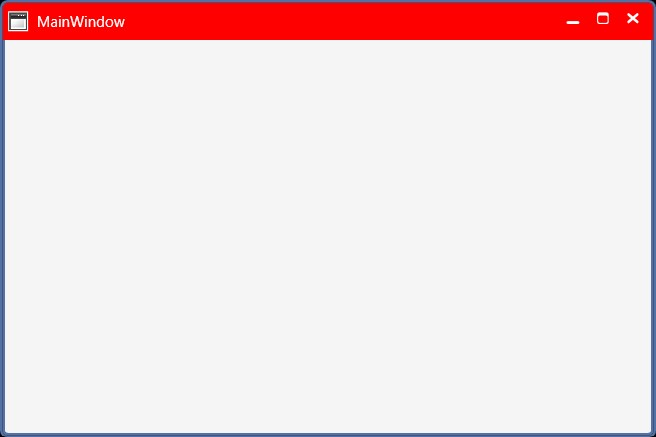

# Title bar Background

The `TitleBarBackground` property can help to set the background for the Title bar. By setting the value for this property, user can create custom Title bars.





<syncfusion:ChromelessWindow x:Class="Chromelesswindow.MainWindow"
xmlns="http://schemas.microsoft.com/winfx/2006/xaml/presentation"
xmlns:x="http://schemas.microsoft.com/winfx/2006/xaml"
Title="MainWindow" Height="350" Width="525"  TitleBarBackground="Red"   x:Name="_chromelessWindow"  
syncfusion:SkinStorage.VisualStyle="Metro"  
xmlns:syncfusion="clr-namespace:Syncfusion.Windows.Shared;assembly=Syncfusion.Shared.WPF" >
<Grid>
</Grid>
</syncfusion:ChromelessWindow>





this.TitleBarBackground = new SolidColorBrush(Colors.Red);





Me.TitleBarBackground = New SolidColorBrush(Colors.Red)





The following screen shots illustrate the title bar background changes.

