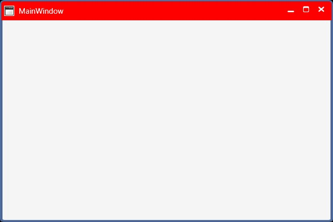
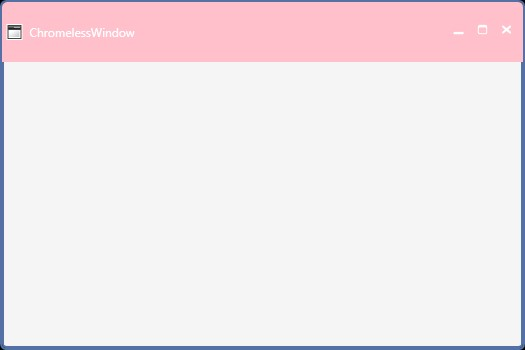
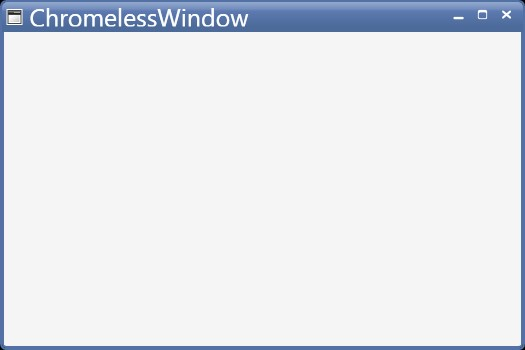
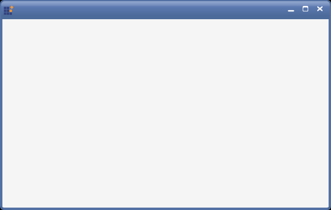
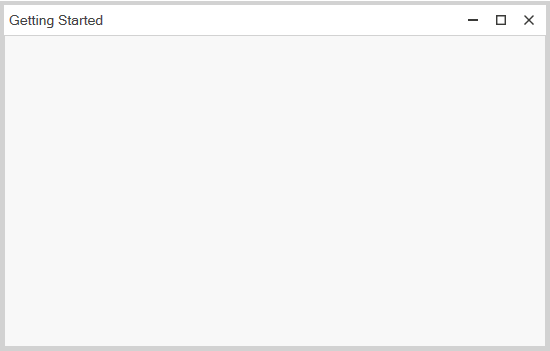
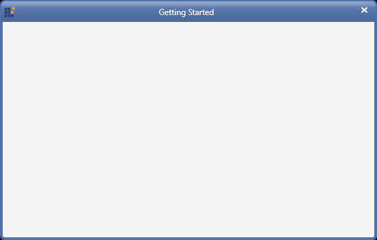

# Title bar Customization

## Customizing the background
 
 The [`TitleBarBackground`](https://help.syncfusion.com/cr/wpf/Syncfusion.Windows.Shared.ChromelessWindow.html#Syncfusion_Windows_Shared_ChromelessWindow_TitleBarBackground) property can be used to set the background for the Title bar.
 
 
 
 
 
 <syncfusion:ChromelessWindow x:Class="Chromelesswindow.MainWindow"
  xmlns="http://schemas.microsoft.com/winfx/2006/xaml/presentation"
  xmlns:x="http://schemas.microsoft.com/winfx/2006/xaml"
  Title="MainWindow" Height="350" Width="525"  TitleBarBackground="Red"   x:Name="_chromelessWindow"  
  syncfusion:SkinStorage.VisualStyle="Metro"  
  xmlns:syncfusion="clr-namespace:Syncfusion.Windows.Shared;assembly=Syncfusion.Shared.WPF" >
  <Grid>
  </Grid>
 </syncfusion:ChromelessWindow>
 
 
 
 
 
 this.TitleBarBackground = new SolidColorBrush(Colors.Red);
 
 
 
 
 
 Me.TitleBarBackground = New SolidColorBrush(Colors.Red)
 
 
 
 
 
 The following screen shots illustrate the title bar background changes.
 
 
 
## Customizing the height
 
 The [`TitleBarHeight`](https://help.syncfusion.com/cr/wpf/Syncfusion.Windows.Shared.ChromelessWindow.html#Syncfusion_Windows_Shared_ChromelessWindow_TitleBarHeight) property can be used to change the height of the Title bar. The default value is `30`. 
  
 
 
 
 
 <syncfusion:ChromelessWindow x:Class="Chromelesswindow.MainWindow"
  xmlns="http://schemas.microsoft.com/winfx/2006/xaml/presentation"
  xmlns:x="http://schemas.microsoft.com/winfx/2006/xaml"
  Title="ChromelessWindow" Height="350" Width="525" TitleBarHeight="60" TitleBarBackground="Pink" 
  syncfusion:SkinStorage.VisualStyle="Metro"  x:Name="_chromelessWindow"  
  xmlns:syncfusion="clr-namespace:Syncfusion.Windows.Shared;assembly=Syncfusion.Shared.WPF" >
  <Grid>
  </Grid>
 </syncfusion:ChromelessWindow>
 
 
 
 
 
 this.TitleBarHeight = 60;
 
 
 
 
 
   Me.TitleBarHeight = 60
   
 
 
 
 
 

## Customizing  the font size

 The font size of the ChromelessWindow title bar can be changed by using [`TitleFontSize`](https://help.syncfusion.com/cr/wpf/Syncfusion.Windows.Shared.ChromelessWindow.html#Syncfusion_Windows_Shared_ChromelessWindow_TitleFontSize) property. The default value is `12`.

 

 

 <syncfusion:ChromelessWindow x:Class="Chromelesswindow.MainWindow"
  xmlns="http://schemas.microsoft.com/winfx/2006/xaml/presentation"
  xmlns:x="http://schemas.microsoft.com/winfx/2006/xaml"
  Title="ChromelessWindow" Height="350" Width="525" TitleFontSize="25" syncfusion:SkinStorage.VisualStyle="Metro"     
  x:Name="_chromelessWindow" xmlns:syncfusion="clr-namespace:Syncfusion.Windows.Shared;assembly=Syncfusion.Shared.WPF" >
  <Grid>
  </Grid>
 </syncfusion:ChromelessWindow>

 
 
 
 
 this.TitleFontSize = 25;
 
 
 
 
 
 Me.TitleFontSize = 25
 
 
 
 
 
 

## Show or hide the title bar text

 The visibility of the title can be customized using the [`ShowTitle`](https://help.syncfusion.com/cr/wpf/Syncfusion.Windows.Shared.ChromelessWindow.html#Syncfusion_Windows_Shared_ChromelessWindow_ShowTitle) property. The default value of `ShowTitle` property is true.

 
 
 <syncfusion:ChromelessWindow x:Class="Chromeless_Window_Sample.MainWindow"
        xmlns="http://schemas.microsoft.com/winfx/2006/xaml/presentation"
        xmlns:x="http://schemas.microsoft.com/winfx/2006/xaml"
        xmlns:d="http://schemas.microsoft.com/expression/blend/2008"
        xmlns:mc="http://schemas.openxmlformats.org/markup-compatibility/2006"
        xmlns:local="clr-namespace:Chromeless_Window_Sample"
        mc:Ignorable="d" xmlns:syncfusion="http://schemas.syncfusion.com/wpf"
        xmlns:skin="clr-namespace:Syncfusion.SfSkinManager;assembly=Syncfusion.SfSkinManager.WPF"
        skin:SfSkinManager.VisualStyle="Office2019Colorful"
        TitleTextAlignment="Center"
        Icon="App.ico"
        ShowTitle="False" 
        Title="Getting Started"
        Height="350" Width="550">
    <Grid>
    </Grid>
 </syncfusion:ChromelessWindow>
 
 

 
 
## Show or hide the title bar icon

The visibility of the title bar icon can be customized using the [`ShowIcon`](https://help.syncfusion.com/cr/wpf/Syncfusion.Windows.Shared.ChromelessWindow.html#Syncfusion_Windows_Shared_ChromelessWindow_ShowIcon) property. The default value of `ShowIcon` property is true.



<syncfusion:ChromelessWindow x:Class="Chromeless_Window_Sample.MainWindow"
        xmlns="http://schemas.microsoft.com/winfx/2006/xaml/presentation"
        xmlns:x="http://schemas.microsoft.com/winfx/2006/xaml"
        xmlns:d="http://schemas.microsoft.com/expression/blend/2008"
        xmlns:mc="http://schemas.openxmlformats.org/markup-compatibility/2006"
        xmlns:local="clr-namespace:Chromeless_Window_Sample"
        mc:Ignorable="d" xmlns:syncfusion="http://schemas.syncfusion.com/wpf"
        xmlns:skin="clr-namespace:Syncfusion.SfSkinManager;assembly=Syncfusion.SfSkinManager.WPF"
        skin:SfSkinManager.VisualStyle="Office2019Colorful"
        TitleTextAlignment="Center"
        Icon="App.ico"
        ShowIcon="False" 
        Title="Getting Started"
        Height="350" Width="550">
    <Grid>
    </Grid>
</syncfusion:ChromelessWindow>



## Show or hide the maximize and minimize buttons

 The visibility of maximize and minimize buttons can be customized using the [`ShowMaximizeButton`](https://help.syncfusion.com/cr/wpf/Syncfusion.Windows.Shared.ChromelessWindow.html#Syncfusion_Windows_Shared_ChromelessWindow_ShowMaximizeButton) and [`ShowMinimizeButton`](https://help.syncfusion.com/cr/wpf/Syncfusion.Windows.Shared.ChromelessWindow.html#Syncfusion_Windows_Shared_ChromelessWindow_ShowMinimizeButton) properties respectively. The default value of `ShowMaximizeButton` and `ShowMinimizeButton` properties are true. 

 N> By default, the maximize and minimize buttons will not be displayed in ResizeMode -`NoResize` even when the value of `ShowMaximizeButton` and `ShowMaximizeButton` set as `True`. The maximize and minimize buttons will be displayed only in the remaining resize modes such as `CanMinimize`, `CanResize`, `CanResizeWithGrip` based on the `ShowMaximizeButton` and `ShowMinimizeButton` properties.

 

<syncfusion:ChromelessWindow x:Class="Chromeless_Window_Sample.MainWindow"
        xmlns="http://schemas.microsoft.com/winfx/2006/xaml/presentation"
        xmlns:x="http://schemas.microsoft.com/winfx/2006/xaml"
        xmlns:d="http://schemas.microsoft.com/expression/blend/2008"
        xmlns:mc="http://schemas.openxmlformats.org/markup-compatibility/2006"
        xmlns:local="clr-namespace:Chromeless_Window_Sample"
        mc:Ignorable="d" xmlns:syncfusion="http://schemas.syncfusion.com/wpf"
        xmlns:skin="clr-namespace:Syncfusion.SfSkinManager;assembly=Syncfusion.SfSkinManager.WPF"
        skin:SfSkinManager.VisualStyle="Office2019Colorful"
        TitleTextAlignment="Center"
        Icon="App.ico"
        ShowMinimizeButton="False"
        ShowMaximizeButton="False" 
        Title="Getting Started"
        Height="350" Width="550">
    <Grid>
    </Grid>
</syncfusion:ChromelessWindow>



