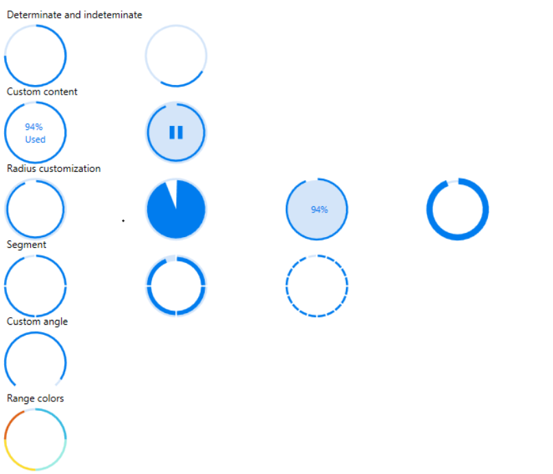

# WPF Circular ProgressBar (SfCircularProgressBar) Overview

The SfCircularProgressBar control indicates the progress of an operation and let users know the remaining time for completion visualizes in circular fashion.

## Key features

• **Determinate and indeterminate**: Determinate shows specific quantity of progress that occurred and indeterminate shows a redundant animations of circular progress.

• **Custom content**: Custom content helps to show the controls progress through user-defined text.

• **Radius customization**: Radius customization helps to change both inner and outer radii of the Circular ProgressBar.

• **Segment**: Segment splits the ProgressBar into multiple segments and indicates the progress.

• **Custom angle**: Custom angle shows the progress drawn to an specific angle for customized appearance.

• **Ranges**: Specifies the start position and end position to visualize multiple ranges with different colors that are mapped to each range.

