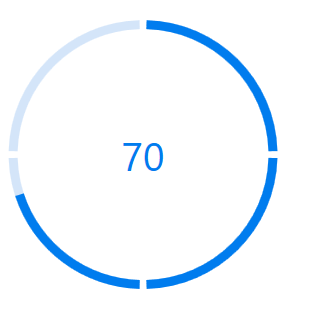

# Segment in WPF circular progressbar (SfCircularProgressBar)
Segmentation helps to divide the progressbar into multiple potions. To visualize the progress of multiple sequential tasks, split the progressbar into multiple segments by setting the [SegmentCount](https://help.syncfusion.com/cr/wpf/Syncfusion.UI.Xaml.ProgressBar.ProgressBarBase.html#Syncfusion_UI_Xaml_ProgressBar_ProgressBarBase_SegmentCountProperty) property.


      
<Syncfusion:SfCircularProgressBar Progress="70"  SegmentCount="4" />     


SfCircularProgressBar Circular = new SfCircularProgressBar();
 Circular.Progress = 70;
Circular.SegmentCount = 4;
grid.Children.Add(Circular);



