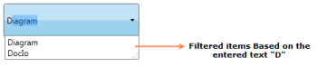

# Filter Support

Filter support is used to filter the matched list of items from the linked source depending on the text entered in the AutoComplete textbox. AutoComplete allows the user to enable Filter the items using [IsFilter](https://help.syncfusion.com/cr/wpf/Syncfusion.Windows.Tools.Controls.AutoComplete.html#Syncfusion_Windows_Tools_Controls_AutoComplete_IsFilter) property.

Filter Support
{:.caption}

## Adding filter support to an application 

If the [IsFilter](https://help.syncfusion.com/cr/wpf/Syncfusion.Windows.Tools.Controls.AutoComplete.html#Syncfusion_Windows_Tools_Controls_AutoComplete_IsFilter) property is set as True, once you enter text in the AutoComplete textbox, the matched list of items 
will be displayed in the drop-down list. If this property is set as False the matched list of items will not be 
displayed in the drop-down list, instead all the items will be displayed.




<syncfusion:AutoComplete x:Name="AutoComplete1" IsFilter="true"/></td></tr>





AutoComplete autoComplete1 = new AutoComplete();this.autoComplete1.IsFilter = true;</td></tr>




## Tables for properties, methods, and events

### Events

* [IsFilterChanged](https://help.syncfusion.com/cr/wpf/Syncfusion.Windows.Tools.Controls.AutoComplete.html)

## Sample link

WPF Sample Browser-> Tools -> Editors -> AutoComplete Demo
