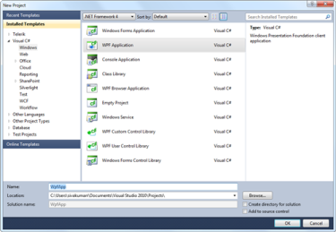
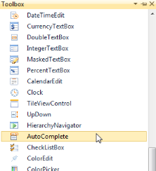
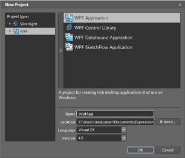
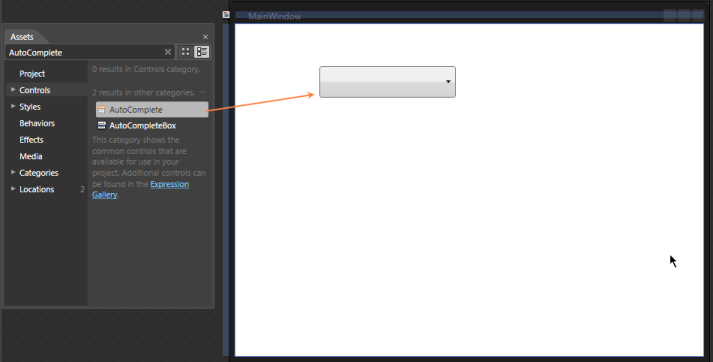
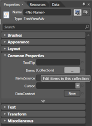
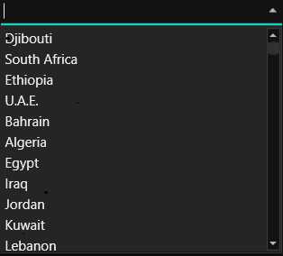

# Getting Started with WPF AutoComplete (Classic)

## Structure of the AutoComplete control

AutoComplete Control Structure
{:.caption}

## Add AutoComplete to an application

Following are the step-by-step instructions to add an AutoComplete control in a WPF application. The AutoComplete control can be created by using either C#, XAML code. It can also be created using Blend.

### Creating AutoComplete using C#

1. Open Visual Studio, On the File menu click New -> Project. This opens the New Project Dialog box.

   

    Creating New Project
	{:.caption}

2. In the Project Dialog window, select WPF application and, in the Name field type the name of the project. Click OK.

   

    Creating New WPF Application
	{:.caption}

3. Go to Solution Explorer. Right-click References folder and click Add Reference. Add the Syncfusion.Tools.WPF.dll and Syncfusion.Shared.WPF assembly to the project References folder.

   

    Adding Reference
	{:.caption}




xmlns:syncfusion="clr-namespace:
Syncfusion.Windows.Tools.Controls;assembly=Syncfusion.Tools.Wpf"




4.Add Syncfusion.Tools.WPF reference in XAML and C# code as follows.




using Syncfusion.Windows.Tools.Controls;




5.Click and open the C# file. Add AutoComplete to the application.




AutoComplete AutoComplete1 = new AutoComplete();
List<String> productSource = new List<String>();

productSource.Add("WPF");
productSource.Add("Chart");
productSource.Add("GridView");
productSource.Add("WF");
productSource.Add("Xlsio");
productSource.Add("Business Intelligence");
productSource.Add("Tools");
productSource.Add("Silverlight");
productSource.Add("Schedule");
productSource.Add("Mvc");
productSource.Add("Pdf");

this.AutoComplete1.CustomSource = productSource;


   
   
   
   
   AutoComplete Created Using C#
   {:.caption}

### Create AutoComplete using XAML

Following are the steps to create the AutoComplete by using VisualStudio in XAML as follows.

1. Create a new WPF application in Visual Studio. In Visual Studio Toolbox, click Syncfusion WPF Toolbox tab and select AutoComplete.

   

    Select AutoComplete From ToolBox
	{:.caption}

2. Drag-and-drop the AutoComplete to Design View, to add AutoComplete to the application.

   

    AutoComplete Drag and Drop from ToolBox
	{:.caption}

3. You can now customize the properties of AutoComplete in the Properties Window.




<local:productSource x:Key="Src"/>
<syncfusion:AutoComplete x:Name="AutoComplete1" Source="Custom" CustomSource="{StaticResource Src}"/>




    

     AutoComplete Created Using XAML
	 {:.caption}

### Create AutoComplete using expression blend

The AutoComplete control provides full Blend support. Here are the step-by-step instructions to create a WPF application in Blend.

1. Open Blend, On the File Menu click New Project. This opens the New Project dialog box.

   

   Create New project in Expression Blend
   {:.caption}

2. In the Project type’s panel, select WPF application and then click OK.

   

    Create New WPF Application in Expression Blend
	{:.caption}

3. Add the following References with the sample project.
    
   * Syncfusion.Tools.WPF.dll 
   * Syncfusion.Shared.WPF.dll

4. On the Window menu, select Assets. This opens the Assets Library dialog box. In the Search box, type AutoComplete. This displays the search results as shown below-.

   
  
    AutoComplete Displayed in Assets window
	{:.caption}

5. Drag the AutoComplete control to the Design View.

   

    AutoComplete Drag & Drop from Asset window
	{:.caption}

6. You can now customize the properties of the AutoComplete in the Properties Window.

   

    Properties Window
	{:.caption}
   



<local:productSource x:Key="Src"/>
<syncfusion:AutoComplete x:Name="AutoComplete1" Source="Custom" CustomSource="{StaticResource Src}"/>





List<String> productSource = new List<String>();

productSource.Add("Diagram");
productSource.Add("Gauge");
productSource.Add("GridView");
productSource.Add("Chart");
productSource.Add("Business Intelligence");
productSource.Add("Schedule");
productSource.Add("Grid");
productSource.Add("DocIo");
productSource.Add("XlsIo");
productSource.Add("Pdf");




AutoComplete Created Using Blend
{:.caption}

## Theme

AutoComplete supports various built-in themes. Refer to the below links to apply themes for the AutoComplete,

  * [Apply theme using SfSkinManager](https://help.syncfusion.com/wpf/themes/skin-manager)
	
  * [Create a custom theme using ThemeStudio](https://help.syncfusion.com/wpf/themes/theme-studio#creating-custom-theme)
 
   