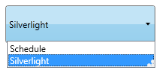

# Selection Mode Support

AutoComplete supports two kinds of Selection Mode namely Single and Multiple. You can select the Mode using the [SelectionMode](https://help.syncfusion.com/cr/wpf/Syncfusion.Tools.Wpf~Syncfusion.Windows.Tools.Controls.AutoComplete~SelectionMode.html) property. 

When the [SelectionMode](https://help.syncfusion.com/cr/wpf/Syncfusion.Tools.Wpf~Syncfusion.Windows.Tools.Controls.AutoComplete~SelectionMode.html) property is set as Single, only one item can be selected at a time. The following image illustrates the Single selection mode.

SelectionMode-Single
{:.caption}

When the [SelectionMode](https://help.syncfusion.com/cr/wpf/Syncfusion.Tools.Wpf~Syncfusion.Windows.Tools.Controls.AutoComplete~SelectionMode.html) is set as Multiple, you can select multiple items by using the [SeparatorChar](https://help.syncfusion.com/cr/wpf/Syncfusion.Tools.Wpf~Syncfusion.Windows.Tools.Controls.AutoComplete~SeparatorChar.html) property to separate the selected items. By default the SeparatorChar is “;”. This allows you to select multiple items by using the [SelectionMode](https://help.syncfusion.com/cr/wpf/Syncfusion.Tools.Wpf~Syncfusion.Windows.Tools.Controls.AutoComplete~SelectionMode.html) property. Once an item is selected the [SeparatorChar](https://help.syncfusion.com/cr/wpf/Syncfusion.Tools.Wpf~Syncfusion.Windows.Tools.Controls.AutoComplete~SeparatorChar.html) is to be entered in the text box to select the next item.

The following image illustrates the Multiple selection mode.

SelectionMode—Multiple
{:.caption}

When the [SelectionMode](https://help.syncfusion.com/cr/wpf/Syncfusion.Tools.Wpf~Syncfusion.Windows.Tools.Controls.AutoComplete~SelectionMode.html) is set as Extended, you can select multiple items at a time by pressing the Ctrl key. While selecting the multiple items, the selected items will be separated by the [SeparatorChar](https://help.syncfusion.com/cr/wpf/Syncfusion.Tools.Wpf~Syncfusion.Windows.Tools.Controls.AutoComplete~SeparatorChar.html) automatically.

The following image illustrates the Multiple selection mode.

SelectionMode—Extended
{:.caption}

Adding Single, Multiple & Extended Selection Support to an Application 

The [SelectionMode](https://help.syncfusion.com/cr/wpf/Syncfusion.Tools.Wpf~Syncfusion.Windows.Tools.Controls.AutoComplete~SelectionMode.html) property is used to attain these functionalities by setting its value as Single or Multiple or Extended. By default its value is Single. The following code snippet is used to set the [SelectionMode](https://help.syncfusion.com/cr/wpf/Syncfusion.Tools.Wpf~Syncfusion.Windows.Tools.Controls.AutoComplete~SelectionMode.html) property. 




<syncfusion:AutoComplete x:Name="AutoComplete2" SelectionMode="Multiple"/>




AutoComplete autoComplete1 = new AutoComplete();this.autoComplete2.SelectionMode = SelectionMode.Multiple;




## Tables for properties and events

### Events

* [SelectionModeChanged](https://help.syncfusion.com/cr/wpf/Syncfusion.Tools.Wpf~Syncfusion.Windows.Tools.Controls.AutoComplete~SelectionModeChanged_EV.html)

## Sample link

WPF Sample Browser-> Tools -> Editors -> AutoComplete Demo
