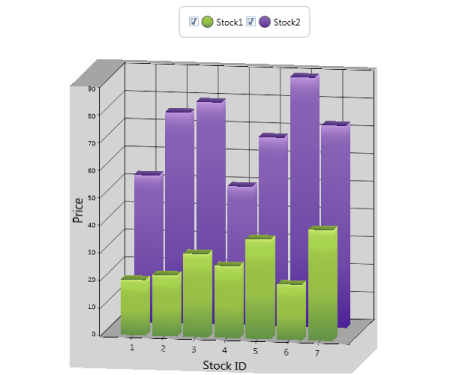
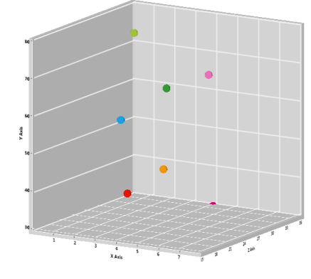

# 3D-Charts in WPF Chart (Classic)

## Enabling 3D Mode

3D mode can be easily enabled on a ChartArea using the View3DMode property as follows.





<sfchart:Chart Name="chart1">
    <sfchart:ChartArea View3DMode="True">

        <sfchart:ChartSeries Label="Sales" 
                             DataSource="{Binding Data}"
                             BindingPathX="Month"
                             BindingPathsY="Sales"
                             Type="Column" />

        <sfchart:ChartSeries Label="Projected Sales"
                             DataSource="{Binding Data}"
                             BindingPathX="Month" 
                             BindingPathsY="Projected" 
                             Type="Column" />
    </sfchart:ChartArea>

</sfchart:Chart>





Chart chart = new Chart();
chart.Areas.Add(new ChartArea());
chart.Areas[0].View3DMode= true;
chart.Areas[0].Series.Add(new ChartSeries(ChartTypes.Column));   





3D Mode is supported in the following chart types.

<table>
<tr>
<td>Area</td><td>
Pyramid, Funnel</td></tr>
<tr>
<td>
SplineArea</td><td>
Column</td></tr>
<tr>
<td>
StepArea</td><td>
RangeColumn</td></tr>
<tr>
<td>
StackingArea</td><td>
StackingColumn</td></tr>
<tr>
<td>
Bar</td><td>
StackingColumn100</td></tr>
<tr>
<td>
Stacking Bar</td><td>
Tornado</td></tr>
<tr>
<td>
Line</td><td>
Gantt</td></tr>
<tr>
<td>
FastLine</td><td>
Scatter</td></tr>
<tr>
<td>
Spline</td><td>
Bubble</td></tr>
<tr>
<td>
RotatedSpline</td><td>
Pie</td></tr>
<tr>
<td>
StepLine</td><td>
Doughnut</td></tr>
</table>

## Customizing Side Walls

3D chart allows the user to customize the look and feel of the side walls in the 3D chart. Exclusive properties has been implemented to customize the look and feel of the side walls. The following are properties that can be used to add look and feel to 3D chart.

* ShowLeftWall-This property is used to display or hide the left side wall
* ShowBackWall-This property is used to display or hide the back wall of the 3D chart
* ShowBottomWall-This property is used to display or hide the bottom wall of the 3D chart
* BackWallBackground-This property is used to customize the look and feel of the back wall
* LeftWallBackground-This property is used to customize the look and feel of the left wall
* BottomWallBackground-This property is used to customize the look and feel of the bottom wall

The following lines of code can be used to customize the side wall's look and feel.





<sfchart:Chart x:Name="Chart1" >
    <sfchart:ChartArea View3DMode="True">
        <sfchart:ChartArea.Chart3DSettings>

            <sfchart:Chart3D ShowBackWall="True"             
                             ShowLeftWall="True"
                             ShowBottomWall="True"
                             LeftWallBackground="AliceBlue" 
                             BottomWallBackground="AliceBlue" 
                             BackWallBackground="AliceBlue"/>

        </sfchart:ChartArea.Chart3DSettings>

        <sfchart:ChartSeries Label="Sales"
                             DataSource="{Binding Data}"
                             BindingPathX="Month"
                             BindingPathsY="Sales"
                             Type="Column" />

        <sfchart:ChartSeries Label="Projected Sales"
                             DataSource="{Binding Data}" 
                             BindingPathX="Month"
                             BindingPathsY="Projected"
                             Type="Column"/>

    </sfchart:ChartArea>
</sfchart:Chart>



chart1.Areas[0].Chart3DSettings.ShowBackWall = true;
chart1.Areas[0].Chart3DSettings.ShowBottomWall = true;
chart1.Areas[0].Chart3DSettings.ShowLeftWall = true;
chart1.Areas[0].Chart3DSettings.BackWallBackground = Brushes.AliceBlue;
chart1.Areas[0].Chart3DSettings.LeftWallBackground = Brushes.AliceBlue;
chart1.Areas[0].Chart3DSettings.BottomWallBackground = Brushes.AliceBlue;





## Camera Projection Views

Chart 3D supports two types of camera projection views namely perspective and orthographic. Camera projection for the chart can be changed using the CameraProjection property of the Chart3D type, as follows.



<syncfusion:Chart x:Name="Chart1">
    <syncfusion:ChartArea View3DMode="True">

        <syncfusion:ChartArea.Chart3DSettings>
            <syncfusion:Chart3D CameraProjection="Orthographic"/>
        </syncfusion:ChartArea.Chart3DSettings>

    </syncfusion:ChartArea>
</syncfusion:Chart>



chart1.Areas[0].Chart3DSettings.CameraProjection = CameraProjection.Perspective;





## 3-D Manhattan Bar Chart 

### Features

3D Manhattan Chart is a three dimensional charting feature that enables the chart control to visualize data in a three dimensional space (i.e. along the X, Y a, and Z axes). The feature supports basic Chart Types like Column, Bar, Line and Area, and helps the user to plot graphs in the third axis (Z axis), apart from X and Y axes, which already are supported in Chart.

### Use Case Scenarios

* You can avail of 3D Manhattan bar support by using the IsClustered property, when IsClustered is set to false. Each series is plotted in value of Z Axis, whereas Clustered view has series added to only X Axis
* You can plot various fields in a chart, using the 3D Manhattan Chart, in a more comprehensive manner, as shown in the following example:

### Properties

<table>
<tr>
<th>
Property </th><th>
Description </th><th>
Type </th><th>
Data Type </th><th>
Reference links </th></tr>
<tr>
<td>
IsClustered </td><td>
To cluster the series along X axis when isClustered is set to true. </td><td>
Dependency Property. </td><td>
Boolean</td><td>
NA</td></tr>
<tr>
<td>
IsRotated</td><td>
To allow the 3D Chart to rotate</td><td>
Dependency Property</td><td>
Boolean</td><td>
NA</td></tr>
</table>

Adding 3D Manhattan Bar Chart to an Application 




<syncfusion:Chart x:Name="Chart1">
    <syncfusion:ChartArea View3DMode="True"
                    IsClustered="True">
        <syncfusion:ChartSeries x:Name="series1"/>
    </syncfusion:ChartArea>
</syncfusion:Chart>




Chart1.Areas[0].IsClustered = true;




## 3-D Chart with Data Points in Z-Axis

This feature helps the user to plot the chart series in 3-D area, with data points mapping to three coordinate axes namely X, Y, and Z. This feature is supported in line, spline, rotated spline, column, range column, stacked column, 100% stacked column, bar, Gantt, stacked bar, 100% stacked bar, scatter, bubble, 3-D surface, and candle chart types.

These 3-D types can be bound to all basic types of data sources such as IList, ObservableCollection, Linq, and DataTable as like 2-D types. User can specify the mapping value for z-axis of a 3-D data point using BindingPathsY that is basically an array of string (paths), in which the last value maps to z-axis.

For example, in the column chart type, BindingPathsY[0] corresponds to a mapping value for y-axis, and BindingPathsY[1] corresponds to a mapping value for z-axis. For the range column chart type, BindingPathsY[0] corresponds to a starting value for y-axis, BindingPathsY[1] corresponds to an end value for y-axis, and BindingPathsY[2] corresponds to a mapping value for z-axis.

### Properties Table

Following are the properties of the ChartArea class pertain to the z-axis feature.

<table>
<tr>
<th>
Property </th><th>
Description </th><th>
Type </th><th>
Data Type </th><th>
Reference links </th></tr>
<tr>
<td>
EnableDepthAxis</td><td>
Allows the user to view z-axis. </td><td>
Dependency Property</td><td>
Bool </td><td>
NA</td></tr>
<tr>
<td>
DepthAxis</td><td>
Gets or sets the axis for z-axis and also used to specify the range, interval, tick lines and appearance of the z-axis.</td><td>
Dependency Property</td><td>
ChartAxis</td><td>
NA</td></tr>
</table>

### Adding Z-Axis to the Chart

The z-axis (or depth axis) for 3-D charts can be enabled using EnableDepthAxis. The following code example illustrates this.



<syncfusion:Chart x:Name="Chart" >
    <syncfusion:ChartArea Name="Area1"
                          EnableDepthAxis="True"
                          View3DMode="True" 
                          Allow3DRotate="False"/>
</syncfusion:Chart>




this.Area1.EnableDepthAxis = true;





The attributes of the z-axis (or depth axis) can be set using the DepthAxis property. The following code example illustrates this.




<syncfusion:Chart x:Name="Chart" >
    <syncfusion:ChartArea Name="Area1" View3DMode="True" >
        <syncfusion:ChartArea.DepthAxis>

            <syncfusion:ChartAxis Header="Z Axis"
                                  RangePadding="Normal"
                                  LabelForeground="Black" 
                                  LabelFontWeight="Bold"/>

        </syncfusion:ChartArea.DepthAxis>
    </syncfusion:ChartArea>
</syncfusion:Chart>



this.Area1.DepthAxis.Header = "Z Axis";
this.Area1.DepthAxis.RangePadding = ChartRangePaddingType.Normal;
this.Area1.DepthAxis.LabelForeground = new SolidColorBrush(Colors.Black);
this.Area1.DepthAxis.IsAutoSetRange = true;


