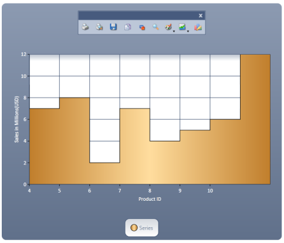
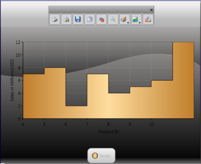

# Chart-Appearance in WPF Chart (Classic)

## Chart Styles

Essential Chart for WPF supports styles. Users can customize the styles for a chart area, series, legend and axis using the ChartVisualStyle property.

<table>
<tr>
<th>
Name of Property</th><th>
Description</th><th>
Type of Property</th><th>
Value It Accepts</th><th>
Property Syntax</th><th>
Sub properties</th></tr>
<tr>
<td>
ChartVisualStyle</td><td>
Used to set the style for the Chart.</td><td>
Dependency property</td><td>
ChartStyles or any value of the chart style enum.</td><td>
ChartVisualStyle="Style48"</td><td>
ChartAreaStyleLegendStyleSeriesStylePrimaryAxisStyleNote: Type - Style</td></tr>
</table>

### Customizing Chart Style

The styles for a chart area, series, legend, and axis can be customized by using the following code.




<sync:Chart x:Name="Chart1" ChartVisualStyle="ChocolateBlend">

//Insert the ChartLegend

<sync:Chart.Legends>

                <sync:ChartLegend/>

            </sync:Chart.Legends>

//Insert the ChartArea

            <sync:ChartArea IsContextMenuEnabled="True">

//Inserts the ChartSeries

                <sync:ChartSeries Data="1,5" Label="Series1"/>

            </sync:ChartArea>

 </sync:Chart>




Chart1.ChartVisualStyle = ChartStyles.ChocolateBlend;



When the code runs, the following output displays. 

##Chart Skins

Essential Chart for WPF provides a number of built-in skins that delivers the chart with appealing look and feel with just one property, the VisualStyle property of the class SkinStorage from the Shared.WPF assembly. In addition for the skins getting applied to the window and Window title Bar, the skins will also be applied to all parts of the chart such as Chart Area and Chart Legend.




<syncfusion:Chart Grid.Column="0"  syncfusion:SkinStorage.VisualStyle="Office2007Blue" >

</syncfusion:Chart>




using Syncfusion.Windows.Shared;

SkinStorage.SetVisualStyle(Chart1, "Office2007Blue");



N> Shared.WPF assembly should be referenced in the project to make use of this settings.

Various Built-In skins supported are:

* Default 
* Blend 
* Office2003 
* Office2007Blue 
* Office2007Silver 
* Office2007Black 
* CoolBlue 
* BlueWave 
* BrightGray 
* ChocolateYellow 
* ForestGreen 
* LawnGreen 
* MixedGreen 
* SpringGreen 
* OrangeRed 
* VS2010

The following images illustrate the various skins applied to the Chart.

## Chart Animation

Essential Chart WPF now comes with animation support. Charts can be animated by using animation options available. The state-of-the-art animation lets you to create lively charts that can be used for marketing, attractive data presentation, and so on.

It allows you to:

* Set the animation option for a chart.
* Set the type of animation.
* Set the animation by each series.
* Set the duration for the animation.

## Properties

The following table lists the properties and their usage in chart animation.

<table>
<tr>
<th>
Property</th><th>
Description</th><th>
Type</th><th>
Value Returned</th></tr>
<tr>
<td>
EnableAnimation</td><td>
Sets the Animation option for the Chart.</td><td>
Dependency Property</td><td>
Boolean</td></tr>
<tr>
<td>
AnimateOption</td><td>
Sets the Type of Animation.</td><td>
Dependency Property</td><td>
Enum(AnimationOptions)</td></tr>
<tr>
<td>
AnimateOneByOne</td><td>
Sets the Animation by each series.</td><td>
Dependency Property</td><td>
Boolean</td></tr>
<tr>
<td>
AnimationDuration</td><td>
Sets the duration for the Animation.</td><td>
Dependency Property</td><td>
Enum(TimeSpan)</td></tr>
</table>

### Events

The following table lists the events and their usage in chart animation.

<table>
<tr>
<th>
Event</th><th>
Event Trigger</th><th>
Event Args</th><th>
Purpose</th></tr>
<tr>
<td>
OnEaseAnimationChanged</td><td>
Whenever the properties AnimationDuration, AnimateOneByOne, AnimateOption and EnableAnimation change.</td><td>
-</td><td>
To set the Animation option selected by the user.</td></tr>
<tr>
<td>
OnEnableAnimationChanged</td><td>
Whenever the properties AnimationDuration, AnimateOneByOne, AnimateOption and EnableAnimation change.</td><td>
-</td><td>
To select or unselect the Animation of chart.</td></tr>
</table>

### Methods

The following table lists the methods and their usage in chart animation.

<table>
<tr>
<th>
Method</th><th>
Return Type</th><th>
Purpose</th></tr>
<tr>
<td>
StartAnimation</td><td>
Void</td><td>
This method is called when the user starts animation by using the options specified.</td></tr>
</table>

### Enabling and Customizing Chart Animation

The chart animation can be enabled by setting EnableAnimation property to _true_.





<syncfusion:ChartSeries Type="Column" EnableEffects="True" Label="Mark" EnableAnimation="{Binding ElementName=enableanimation,

Path=IsChecked}" Interior="Blue" StrokeThickness="2" DataSource="{StaticResource data}" BindingPathX="Name" BindingPathsY="Mark, MinMark,MaxMark, Low, High" AnimateOneByOne="{Binding ElementName=animateind, Path=IsChecked}">

</syncfusion:ChartSeries>




chart.Areas[0].Series[0].StartAnimation();

chart.Areas[0].Series[0].AnimationDuration = ts;

chart.Areas[0].Series[0].AnimateOption = AnimationOptions.Rotate;



Run the code. The following output is displayed.

## Chart Series Effects

Essential Chart lets you customize the series effects for all chart types. The look and feel can be enhanced by using the effects available. This can be achieved by setting the EnableEffects property to _true_.

### Properties

The following table provides more information on the property used.

<table>
<tr>
<th>
Property</th><th>
Description</th><th>
Type</th><th>
Value Returned</th></tr>
<tr>
<td>
EnableEffects</td><td>
Dependency</td><td>
Boolean</td><td>
Sets the effects on chart.</td></tr>
</table>

### Events

The following table provides more information on the event used.

<table>
<tr>
<th>
Event</th><th>
Event Trigger</th><th>
Event Args</th><th>
Purpose</th></tr>
<tr>
<td>
EnableEffectsChanged</td><td>
This event is triggered whenever the value of the EnableEffects property changes.</td><td>
OnEnableEffectsChanged</td><td>
Sets the effects to the chart.</td></tr>
</table>

### Customization of Chart Effects

The chart series effects can be applied to the chart by using the following code examples.

1. Using XAML
    
   ~~~ xaml

			 <syncfusion:ChartSeries Type="Column" EnableEffects="True" Label="Mark" DataSource="{StaticResource data}" BindingPathX="Name" BindingPathsY="Mark, MinMark,MaxMark, Low, High">

			 </syncfusion:ChartSeries>
			 
   ~~~

2. Using C#

   ~~~ csharp

             chart.Areas[0].Series[0].EnableEffects = True;
   ~~~

    Run the code. The following output is displayed.

    

