# Chart-Axis in WPF Chart (Classic)

## Indexed X Values

By default points in a series are plotted against their X and Y values. However in some cases the X values are meaningless, they simply represent categories, and you do not want to plot the points against such X values. Such an X axis that ignores the X-values and simply uses the positional value of a point in a series is said to be indexed.

The following code example could be used to make a series as Indexed.





<sfchart:ChartSeries IsIndexed="True" />




//Sets the series as indexed

series.IsIndexed = true;            




In the following figure, the first chart shows a column chart that is not-indexed while the second chart shows a column chart whose x-axis is indexed.

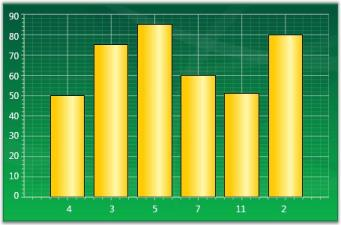

## ChartAxis Range

Essential Chart for WPF lets you customize the range and intervals that are displayed in the axes. This section discusses the following topics.

* Axis Range Customization
* AutoRange Customization
* Custom Range Support
* RangeCalculationMode
* VisibleRange

### Axis Range Customization

You can customize the range and intervals that are displayed in the axes by using the following ChartAxis properties.

<table>
<tr>
<th>
ChartAxis Properties</th><th>
Description</th></tr>
<tr>
<td>
IsAutoSetRange</td><td>
A bool property specifies whether the range of the axis should be set automatically or a custom specified range will be used. Default is true (auto range).</td></tr>
</table>

### Auto Range Customization

With the default auto range calculation setting (IsAutoSetRange=true), the following properties let you customize the automatic range calculation.

<table>
<tr>
<th>
ChartAxis Properties</th><th>
Description</th></tr>
<tr>
<td>
DesiredIntervalCount</td><td>
An integer property used to indicate the preferred total number of intervals to be displayed for auto range calculation.</td></tr>
<tr>
<td>
RangePadding</td><td>
An enum property, used to specify the spacing of the chart axis for auto range calculation. This property can take three values:None – The range of the axis will be calculated from the minimum value in the data source to the maximum value in the data source.Normal – The range of the axis will be calculated from the nearest multiples of the interval from the minimum and maximum values in the data source.Additional – The range of the axis will be calculated from one interval lower that the minimum value to one interval higher than the maximum value in the data source in terms of multiples of the interval.</td></tr>
<tr>
<td>
AdditionalRanges</td><td>
This DoubleRange property is used to customize the Additional Ranges added to the Range when RangePadding is set as Additional. If Additional padding is set to (2,3), it will add 2 intervals at the start of the range and 3 intervals at the end of the range respective to its Axis ValueType.</td></tr>
<tr>
<td>
IsSetDataValueRange</td><td>
A boolean property used to calculate the axis range based on the modified data value range.</td></tr>
</table>

N> The DesiredIntervalsCount will not be taken into account when the interval is set.





<sfchart:Chart>

  <sfchart:ChartArea Background="LightGray" GridBackground="White">

    <sfchart:ChartArea.SecondaryAxis>

      <sfchart:ChartAxis IsAutoSetRange="True" DesiredIntervalsCount="5"RangePadding="Additional"/>

    </sfchart:ChartArea.SecondaryAxis>

    <sfchart:ChartSeries Type="Column" DataSource="{StaticResource SeriesData1}" BindingPathX="Year" BindingPathsY="Sales"/>

  </sfchart:ChartArea>

</sfchart:Chart>




Chart1.Areas[0].SecondaryAxis.IsAutoSetRange = true;

Chart1.Areas[0].SecondaryAxis.RangePadding = ChartRangePaddingType.Additional;

Chart1.Areas[0].SecondaryAxis.DesiredIntervalsCount = 5;




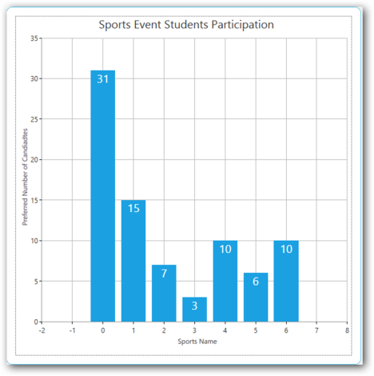

### Custom Range Support

With the auto range calculation turned off (IsAutoSetRange=false), use the following properties to format the chart on the custom range and interval length to use. 

<table>
<tr>
<th>
ChartAxis Properties</th><th>
Description</th></tr>
<tr>
<td>
ValueType</td><td>
Specifies the metrics for the axis range. Can be Double, DateTime, or String.</td></tr>
<tr>
<td>
Range</td><td>
This DoubleRange type property specifies the custom range to use when the ValueType=Double.</td></tr>
<tr>
<td>
Interval</td><td>
An integer property that indicates the length of the intervals in the custom range specified above when the ValueType=Double.</td></tr>
<tr>
<td>
DateTimeRange</td><td>
A DateTimeRange type property that lets you specify the start and end of the axis range in DateTime when the ValueType=DateTime.</td></tr>
<tr>
<td>
DateTimeInterval</td><td>
The frequency at which intervals should be rendered. Specified in TimeSpan, when ValueType=DateTime.</td></tr>
<tr>
<td>
MinimumInterval</td><td>
An integer property that indicates the length of the MinimumInterval in the custom range specified above when the ValueType=Double. The interval will not fall below this value.</td></tr>
<tr>
<td>
MinimumDateTimeInterval</td><td>
The frequency at which the MinimumDateTimeInterval should be rendered. Specified in TimeSpan, when the ValueType=DateTime. The DateTime Interval will not fall below this value.</td></tr>
</table>





<sfchart:Chart>

  <sfchart:ChartArea Background="LightGray" GridBackground="White">

    <sfchart:ChartArea.SecondaryAxis>

      <sfchart:ChartAxis IsAutoSetRange="False" Range="0,100" Interval="25"MinimumInterval="25"/>

    </sfchart:ChartArea.SecondaryAxis>

    <sfchart:ChartSeries Type="Column" DataSource="{StaticResource SeriesData1}" BindingPathX="Year" BindingPathsY="Sales"/>

  </sfchart:ChartArea>

</sfchart:Chart>




Chart1.Areas[0].SecondaryAxis.IsAutoSetRange = false;

Chart1.Areas[0].SecondaryAxis.Range = new DoubleRange(0, 100);

Chart1.Areas[0].SecondaryAxis.Interval = 25;

Chart1.Areas[0].SecondaryAxis.MinimumInterval = 25;





N> The Range set for an axis with Double ValueType and DateTimeRange set for an axis with the DateTime ValueType will be taken into account only when the IsAutoSetRange property is set as false. The Interval and DateTimeInterval properties could be used to set intervals when the range calculation is done automatically or when a custom range is set. While using custom ranges, make sure that the series.IsIndexed property is set as false. This will ensure that the actual x-axis values and the range will be taken into account. Ensure that the Interval value is proportionate to the Range value. When you set a small value as the Interval to an Axis with a large Range, it results in more gridlines, generating an “Out of Memory” exception.

### RangeCalculationMode

Range Calculation mode is used to position the segments between TickLines and on the TickLines. When the SegmentPosition is BetweenTicks, the segment will render between the gridlines. When the SegmentPosition is OnTicks, the segment will render on the gridlines.

Some charts need to render between TickLines so that the series segments will not be hidden. For example, Column, Bar, Stacking Column, and Stacking Bar Charts should render between the TickLine to display the whole segment. On the other hand, Line, Area, and Stacking Area charts can be rendered on the TickLines.

However, in some cases we require either of the types to be consistent. For this we could use the RangeCalculationMode property. 

<table>
<tr>
<th>
Chart Axis Property</th><th>
Description</th></tr>
<tr>
<td>
RangeCalculationMode</td><td>
An enum property used to specify the segment position. This property can take two values:AdjustAcrossChartTypes: Segment will render between the ticks. Segment position for this mode will be BetweenTicks.ConsistentAcrossChartTypes: Segment will render from the 1st axis. Segment position for this mode will be OnTicks. In this case, column charts will also be drawn with same range as other charts, making the first and last segments hidden partially. This is the default mode.</td></tr>
</table>
The following code example illustrates how to set the Range Calculation mode for the chart axis.





<syncfusion:ChartArea>

    <syncfusion:ChartArea.PrimaryAxis>

        <syncfusion:ChartAxis IsAutoSetRange="True" RangeCalculationMode="AdjustAcrossChartTypes"/>

    </syncfusion:ChartArea.PrimaryAxis>

</syncfusion:ChartArea>




 // Create an instance for the Chart and Chart Area.

Chart chart = new Chart();

ChartArea area = new ChartArea();

chart.Areas.Add(area);

// Initialize the Range Calculation Mode values.

chart.Areas[0].PrimaryAxis.RangeCalculationMode = RangeCalculationMode.ConsistentAcrossChartTypes;





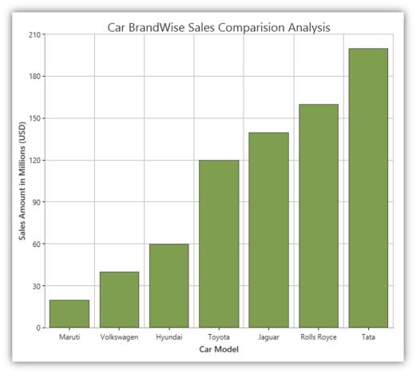

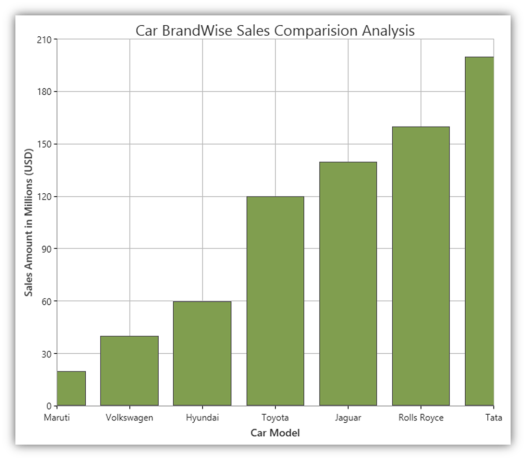

### Visible Range

It is possible to get the Range that is visible in the ChartAxis by using the ChartAxis.VisibleRange property.


DoubleRange range = this.Chart1.Areas[0].PrimaryAxis.VisibleRange;

MessageBox.Show("Start " + range.Start.ToString() +", "+ "End " + range.End.ToString());

 

N> Visible Range can also be calculated for the changed value of the range by using the Axis.RangeChanged event.  For details, see_ Chart Axis Events

### Support to Set Axis Range Based on the Data Value

This feature implements support for sharing a data range between axes, and concurrently both axes will have appropriate visible labels rendered on them based on the modified data range at run time.

### Use Case Scenarios

In a real-time data charting scenario such as a stock analysis, if the number of years to be visible in the range has been modified at run time, then the alternative y-axis range will also get modified based on the modified data range value in the x-axis.

### Properties

<table>
<tr>
<th>
Property</th><th>
Description</th><th>
Type</th><th>
Data Type</th></tr>
<tr>
<td>
IsSetDataValueRange </td><td>
This property  enables when the user wants to calculate the range based on the data point value range</td><td>
Dependency Property</td><td>
Binary, true/false </td></tr>
</table>

### Sample Link

Open the Sample Browser and select the following,

1. Click User Interface > WPF and select Run Samples 
2. Select the Chart product
3. Select the Chart Axis > Chart Axis Configuration demo

### Adding IsSetDataValueRange to an Application




  <syncfusion:ChartAxis x:Name="YAxis" IsAutoSetRange="True" RangeCalculationMode="Default" RangePadding="Normal" IsSetDataValueRange="True"/>


            this.YAxis.IsAutoSetRange = true;            this.YAxis.IsSetDataValueRange = true;




## ChartAxis GridLines

Chart for WPF allows you to show/hide the grid lines in the Chart Area using some attached properties in ChartArea. It also allows you to customize the look and feel of the grid lines using some attached properties.

The following lines of code can be used to hide the grid lines of an axis.





<Window.Resources>

  <local:ProductSalesCollection x:Key="SeriesData1"/>

</Window.Resources>

<sfchart:Chart>

  <sfchart:ChartArea Background="LightGray" GridBackground="White">

    <sfchart:ChartArea.PrimaryAxis>

      <sfchart:ChartAxis sfchart:ChartArea.ShowGridLines="False"/>

    </sfchart:ChartArea.PrimaryAxis>

    <sfchart:ChartArea.SecondaryAxis>

      <sfchart:ChartAxis sfchart:ChartArea.ShowGridLines="False"/>

    </sfchart:ChartArea.SecondaryAxis>

    <sfchart:ChartSeries Type="Column" DataSource="{StaticResource SeriesData1}" BindingPathX="Year" BindingPathsY="Sales"/>

  </sfchart:ChartArea>

</sfchart:Chart>




ChartArea.SetShowGridLines(Chart1.Areas[0].PrimaryAxis, false);

ChartArea.SetShowGridLines(Chart1.Areas[0].SecondaryAxis, false);




Grid lines style can be changed using the ChartArea.GridLineStroke attached property as follows.





<sfchart:ChartArea Background="LightGray" GridBackground="White">

  <sfchart:ChartArea.PrimaryAxis>

    <sfchart:ChartAxis>

      <sfchart:ChartArea.GridLineStroke>

        <Pen Brush="#c6c6c6" Thickness="0.75">

          <Pen.DashStyle>

            <DashStyle Dashes="1,2"/>

          </Pen.DashStyle>

        </Pen>

      </sfchart:ChartArea.GridLineStroke>

    </sfchart:ChartAxis>

  </sfchart:ChartArea.PrimaryAxis>

  <sfchart:ChartArea.SecondaryAxis>

    <sfchart:ChartAxis>

      <sfchart:ChartArea.GridLineStroke>

        <Pen Brush="#C6c6c6" Thickness="0.75"/>

      </sfchart:ChartArea.GridLineStroke>

    </sfchart:ChartAxis>

  </sfchart:ChartArea.SecondaryAxis>

  <sfchart:ChartSeries Type="Column" DataSource="{StaticResource SeriesData1}" BindingPathX="Year" BindingPathsY="Sales"/>

</sfchart:ChartArea>




Pen pen = new Pen(Brushes.LightGray, 0.75);

DashStyle style = new DashStyle();

DoubleCollection col = new DoubleCollection(2);

col.Add(1);

col.Add(2);

style.Dashes = col;

pen.DashStyle = style;

ChartArea.SetGridLineStroke(Chart1.Areas[0].PrimaryAxis, pen);

Pen pen1 = new Pen(Brushes.LightGray, 0.75);

ChartArea.SetGridLineStroke(Chart1.Areas[0].SecondaryAxis, pen1);



### Small Tick Lines

The number of small ticks to be drawn per interval can be controlled using the SmallTicksPerInterval property. The following lines of code can be used to change the number of small ticks to draw per interval.




<Window.Resources>

  <local:ProductSalesCollection x:Key="SeriesData1"/>

</Window.Resources>

<sfchart:Chart>

  <sfchart:ChartArea Background="LightGray" GridBackground="White">

    <sfchart:ChartArea.PrimaryAxis>

      <sfchart:ChartAxis SmallTicksPerInterval="4"/>

    </sfchart:ChartArea.PrimaryAxis>

    <sfchart:ChartArea.SecondaryAxis>

      <sfchart:ChartAxis SmallTicksPerInterval="6"/>

    </sfchart:ChartArea.SecondaryAxis>

    <sfchart:ChartSeries Type="Column" DataSource="{StaticResource SeriesData1}" BindingPathX="Year" BindingPathsY="Sales"/>

  </sfchart:ChartArea>

</sfchart:Chart>




Chart1.Areas[0].PrimaryAxis.SmallTicksPerInterval= 4;

Chart1.Areas[0].SecondaryAxis.SmallTicksPerInterval = 6;



## ChartAxis Lines

The ChartAxis line and tick lines can be customized using the LineStroke and TickLineStroke properties as follows.




<sfchart:Chart>

  <sfchart:ChartArea Background="LightGray" GridBackground="White">

    <sfchart:ChartArea.PrimaryAxis>

      <sfchart:ChartAxis sfchart:ChartArea.ShowGridLines="False">

        <sfchart:ChartAxis.LineStroke>

          <Pen Brush="Blue" Thickness="2"/>

        </sfchart:ChartAxis.LineStroke>

        <sfchart:ChartAxis.TickLineStroke>

          <Pen Brush="MidnightBlue" Thickness="2"/>

        </sfchart:ChartAxis.TickLineStroke>

      </sfchart:ChartAxis>

    </sfchart:ChartArea.PrimaryAxis>

    <sfchart:ChartArea.SecondaryAxis>

      <sfchart:ChartAxis sfchart:ChartArea.ShowGridLines="False">

        <sfchart:ChartAxis.LineStroke>

          <Pen Brush="Green" Thickness="2"/>

        </sfchart:ChartAxis.LineStroke>

        <sfchart:ChartAxis.TickLineStroke>

          <Pen Brush="Green" Thickness="2"/>

        </sfchart:ChartAxis.TickLineStroke>

      </sfchart:ChartAxis>

    </sfchart:ChartArea.SecondaryAxis>

    <sfchart:ChartSeries Type="Column" DataSource="{StaticResource SeriesData1}" BindingPathX="Year" BindingPathsY="Sales"/>

  </sfchart:ChartArea>

</sfchart:Chart>




Pen pen = new Pen(Brushes.Blue, 2);

Chart1.Areas[0].PrimaryAxis.LineStroke = pen;

Chart1.Areas[0].PrimaryAxis.TickLineStroke = pen;

Pen pen1 = new Pen(Brushes.Green, 2);

Chart1.Areas[0].SecondaryAxis.LineStroke = pen1;

Chart1.Areas[0].SecondaryAxis.TickLineStroke = pen1;

ChartArea.SetShowGridLines(Chart1.Areas[0].PrimaryAxis, false);

ChartArea.SetShowGridLines(Chart1.Areas[0].SecondaryAxis, false);




## Chart Striplines

Chart for WPF enables the user to highlight a specific area of the chart by adding StripLines to a ChartAxis. The strip lines length and width can be customized, a text label can be specified and the look and feel can be customized too.

Start, Frequency and Width of the line

The following properties let you customize the start, frequency and width of the lines.

<table>
<tr>
<th>
ChartStripLine Properties</th><th>
Description</th></tr>
<tr>
<td>
StartFromAxis</td><td>
A bool property used to specify whether the stripline starts from the beginning of the axis.</td></tr>
<tr>
<td>
Offset</td><td>
If StartFromAxis is true, this property lets you add an Offset to that starting location.</td></tr>
<tr>
<td>
Start</td><td>
If StartFromAxis is false, this property specifies where exactly the stripline should start.</td></tr>
<tr>
<td>
Width</td><td>
This double property lets you specify the width of each (optionally repeating) strip line.</td></tr>
<tr>
<td>
RepeatEvery</td><td>
Specifies how often this stripline should repeat or the frequency.</td></tr>
<tr>
<td>
RepeatUntil</td><td>
A double property that specifies until where the striplines should repeat.</td></tr>
</table>

### Appearance

<table>
<tr>
<th>
Properties</th><th>
Description</th></tr>
<tr>
<td>
Interior</td><td>
A brush property used to specify the color to be filled in the stripline area.</td></tr>
<tr>
<td>
Stroke</td><td>
A Pen type used to specify the border style around the strip area.</td></tr>
</table>

### Text Label

<table>
<tr>
<th>
Properties</th><th>
Description</th></tr>
<tr>
<td>
Text</td><td>
A FormattedText property that lets you specify the text and appearance of the label for this strip line.</td></tr>
<tr>
<td>
TextAlignment</td><td>
Lets you specify how this text label should be aligned.</td></tr>
<tr>
<td>
VerticalText</td><td>
Boolean property specifying if the text should be rendered vertically.</td></tr>
<tr>
<td>
TextBackground</td><td>
A Brush for the text background.</td></tr>
</table>

### Code Example



<sfchart:Chart>

  <sfchart:ChartArea Background="LightGray" GridBackground="White">

    <sfchart:ChartArea.PrimaryAxis>

      <sfchart:ChartAxis sfchart:ChartArea.ShowGridLines="False">

      </sfchart:ChartAxis>

    </sfchart:ChartArea.PrimaryAxis>

    <sfchart:ChartArea.SecondaryAxis>

      <sfchart:ChartAxis sfchart:ChartArea.ShowGridLines="False">

        <sfchart:ChartAxis.StripLines>

          <sfchart:ChartStripLine x:Name="strip1" Interior="MintCream" Offset="0" StartFromAxis="True" Width="15">

          </sfchart:ChartStripLine>

          <sfchart:ChartStripLine x:Name="strip2" Interior="MistyRose" Offset="15" StartFromAxis="True" Width="15">

          </sfchart:ChartStripLine>

          <sfchart:ChartStripLine x:Name="strip3" Interior="LightCoral" Offset="30" StartFromAxis="True" Width="10">

          </sfchart:ChartStripLine>

        </sfchart:ChartAxis.StripLines>

      </sfchart:ChartAxis>

    </sfchart:ChartArea.SecondaryAxis>

<sfchart:ChartSeries Name="Series1" Interior="Red" Type="Scatter" DataSource="{Binding Source = {StatisResource myXmlData}, XPath=Products/Product}" BindingPathX="X" BindingPathsY="Series1Y"/>

 <sfchart:ChartSeries Name="Series2" Interior="Blue" Type="Scatter" DataSource="{Binding Source = {StatisResource myXmlData}, XPath=Products/Product}" BindingPathX="X" BindingPathsY="Series1Y1"/>

  </sfchart:ChartArea>

</sfchart:Chart>


To set the labels for the striplines, use the following code example.



strip1.Text = new FormattedText("Low", CultureInfo.CurrentCulture, FlowDirection.LeftToRight, new Typeface("Times New Roman"), 20, Brushes.Black);

strip2.Text = new FormattedText("Average", CultureInfo.CurrentCulture, FlowDirection.LeftToRight, new Typeface("Times New Roman"), 20, Brushes.Black);

strip3.Text = new FormattedText("High", CultureInfo.CurrentCulture, FlowDirection.LeftToRight, new Typeface("Times New Roman"), 20, Brushes.Black);



### Stripline Customization

Essential Chart for WPF now supports customizing the position of strip line text. Users can set the strip line text using the TextOffsetX and TextOffsetY properties. 

### Property Details

<table>
<tr>
<th>
Name of Property</th><th>
Description </th><th>
Type of Property</th><th>
Value It Accepts</th><th>
Property Syntax</th></tr>
<tr>
<td>
TextOffsetX</td><td>
Sets the horizontal position of strip line text.</td><td>
Dependency </td><td>
double</td><td>
  csY.TextOffsetX = 10;</td></tr>
<tr>
<td>
TextOffsetY</td><td>
Sets the vertical position of strip line text.</td><td>
Dependency </td><td>
double</td><td>
            csY.TextOffsetY = 20;</td></tr>
</table>

### Setting the Position of Strip Line Text

The following code is used to set the position of strip line text.



ChartStripLine csY = new ChartStripLine();

            //Set the stripline text 

   csY.Text = new FormattedText("Historical High - 95'F", CultureInfo.CurrentCulture, FlowDirection.LeftToRight, new Typeface("Arial"), 10, Brushes.Black);

            //Set the stripline position 

            csY.TextOffsetX = 10;

            csY.TextOffsetY = 20;


Before setting the offset:

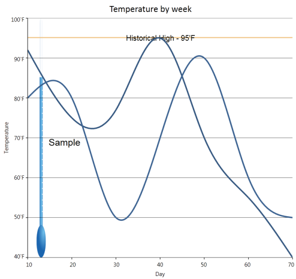

After setting the offset:

## ChartAxis OriginLines

Custom Origin Lines can be drawn for the X and Y axis by using the ChartArea.ShowOriginLine attached property as follows. The ChartArea.OriginLineStroke can be used to customize the look and feel.





<sfchart:ChartArea GridBackground="White">

  <sfchart:ChartArea.PrimaryAxis>

    <sfchart:ChartAxis RangePadding="Additional" sfchart:ChartArea.ShowGridLines="False" sfchart:ChartArea.ShowOriginLine="True" Origin="5"

    SmallTicksPerInterval="0">

      <sfchart:ChartArea.OriginLineStroke>

        <Pen Brush="Maroon" Thickness="3"/>

      </sfchart:ChartArea.OriginLineStroke>

    </sfchart:ChartAxis>

  </sfchart:ChartArea.PrimaryAxis>

  <sfchart:ChartArea.SecondaryAxis>

    <sfchart:ChartAxis RangePadding="Additional" sfchart:ChartArea.ShowGridLines="False" sfchart:ChartArea.ShowOriginLine="True" Origin="2"

    SmallTicksPerInterval="0">

      <sfchart:ChartArea.OriginLineStroke>

        <Pen Brush="Green" Thickness="3"/>

      </sfchart:ChartArea.OriginLineStroke>

    </sfchart:ChartAxis>

  </sfchart:ChartArea.SecondaryAxis>

  <sfchart:ChartSeries Type="Scatter" DataSource="{StaticResource SeriesData2}" BindingPathX="X"  BindingPathsY="Y"  Interior="Blue"/>

  <sfchart:ChartSeries Type="Scatter" DataSource="{StaticResource SeriesData1}"

  BindingPathX="X" BindingPathsY="Y"  Interior="Red"/>

</sfchart:ChartArea>




ChartArea.SetShowOriginLine(Chart1.Areas[0].PrimaryAxis, true);

ChartArea.SetShowOriginLine(Chart1.Areas[0].SecondaryAxis, true);

Pen pen = new Pen(Brushes.Maroon, 3);

ChartArea.SetOriginLineStroke(Chart1.Areas[0].PrimaryAxis, pen);

Pen pen1 = new Pen(Brushes.Green, 3);

ChartArea.SetOriginLineStroke(Chart1.Areas[0].SecondaryAxis, pen1);

Chart1.Areas[0].PrimaryAxis.Origin = 5;

Chart1.Areas[0].SecondaryAxis.Origin = 2;





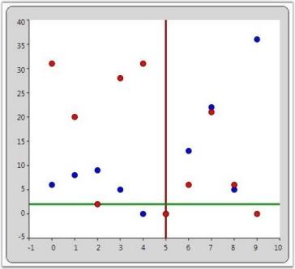

## Chart-Axis in WPF Chart (Classic) Ticks

Chart for WPF allows to customize the length of the Axis Ticks and SmallTicks by using the ChartAxis.TickSize and ChartAxis.SmallTicksize properties.

<table>
<tr>
<th>
ChartAxis Property</th><th>
Description</th></tr>
<tr>
<td>
TickSize</td><td>
gets or sets the length of the axis tick</td></tr>
<tr>
<td>
SmallTickSize</td><td>
gets or sets the length of the axis small tick</td></tr>
</table>





<syncfusion:ChartArea.PrimaryAxis>

    <syncfusion:ChartAxis TickSize="7" SmallTickSize="4" />

</syncfusion:ChartArea.PrimaryAxis>                       




// Sets the Axis tick size.

area.PrimaryAxis.TickSize = 7;

area.PrimaryAxis.SmallTickSize = 3;                                 





The following image illustrates Chart with Axis TickSize and SmallTickSize set.

### Support for customizing the Label position and TickLines along with the OrginAxis

This feature supports customizing the label position and TickLines along with the OrginAxis. Labels can be moved based on the AxisLabels type. Position of label will be changed based on LabelsPosition, and TickLines will be changed based on TickLinesPosition. 

### Properties 

<table>
<tr>
<th>
Property </th><th>
Description </th><th>
Type </th><th>
Data Type </th><th>
Reference links </th></tr>
<tr>
<td>
ChartAxisLabels </td><td>
Used to set the position of axis label. </td><td>
Dependency Property</td><td>
 AxisLabels</td><td>
NA</td></tr>
<tr>
<td>
ChartTickLinesPosition</td><td>
Used to set the position of tickline.</td><td>
Dependency Property</td><td>
TickLinesPosition</td><td>
NA</td></tr>
<tr>
<td>
ChartLabelsPoition</td><td>
Used to set the position of chart label.</td><td>
Dependency Property</td><td>
LabelsPosition</td><td>
NA</td></tr>
<tr>
<td>
TickLinesRange</td><td>
Used to set the size of TickLine to be placed inside the OriginAxis.</td><td>
Dependency Property</td><td>
Double</td><td>
NA</td></tr>
<tr>
<td>
SmallTickLinesRange</td><td>
Used to set the size of SmallTickLine to be placed inside the OriginAxis.</td><td>
Dependency Property</td><td>
Double</td><td>
NA</td></tr>
</table>
Customizing the Label position and TickLines along with the OrginAxis

You can customize the Label position and TickLines along with the OrginAxis using the properties given in the above table. 

The following code illustrates this:




<syncfusion:ChartArea.SecondaryAxis >

                            <syncfusion:ChartAxis x:Name="axis" ChartAxisLabels="NextToAxis" ChartLabelPosition="Above" ChartTickLinesPosition="Inside" TickLinesRange="0.5" SmallTickLinesRange="0.5"/>

       </syncfusion:ChartArea.SecondaryAxis>




            XAxis.ChartAxisLabels = AxisLabels.NextToAxis;

            XAxis.ChartLabelPosition = LabelsPosition.Above;

            XAxis.ChartTickLinesPosition = TickLinesPosition.Inside;





### Sample Link

To view samples:

1. Open the Syncfusion Dashboard.
2. Click the WPF drop-down list and select Run Locally Installed Samples.
3. Navigate to Chart Axis > Chart Axis Configuration > Demo.

## Chart-Axis in WPF Chart (Classic) Orientation

WPF Chart enables to set the orientation of the ChartAxis. The default orientation of the ChartAxis is Horizontal. This property is mostly used in Multiple Axes Scenarios.

<table>
<tr>
<th>
ChartAxis Property</th><th>
Description</th></tr>
<tr>
<td>
Orientation</td><td>
gets / sets the orientation of the axis.</td></tr>
</table>



 <syncfusion:ChartArea Name="area">                    

      <syncfusion:ChartSeries Name="series" Data=" 1 35 2 45 3 30 4 25 5 40" />

      <syncfusion:ChartSeries Name="series1" Data=" 1 30 2 50 3 40 4 35 5 30" >

            <syncfusion:ChartSeries.YAxis>

                    <syncfusion:ChartAxis  Orientation="Horizontal" />

            </syncfusion:ChartSeries.YAxis>

       </syncfusion:ChartSeries>

 </syncfusion:ChartArea>



The following image illustrates Chart with Y-axis orientation set as Horizontal.

## Inverted Axis

Essential Chart provides support for inverting the values on the axis. Data on an inverted axis is plotted in the opposite direction - Top to Bottom for Y-axis and Right to Left for X-axis. To enable this behavior, set the ChartAxis.IsInversed property to True.

<table>
<tr>
<th>
ChartAxis Property</th><th>
Description</th></tr>
<tr>
<td>
IsInversed</td><td>
Indicates whether the axis should be reversed. When reversed, the axis will render points from right to left if horizontal, top to bottom when vertical, and clockwise if radial.</td></tr>
</table>




<syncfusion:ChartArea>

 <syncfusion:ChartArea.PrimaryAxisAxis>

         <syncfusion:ChartAxis IsInversed="True">

 </syncfusion:ChartArea.PrimaryAxisAxis>

 <syncfusion:ChartArea.SecondaryAxis>

    <syncfusion:ChartAxis IsInversed="True">

          </syncfusion:ChartArea.SecondaryAxis>

</syncfusion:ChartArea>                        




// Sets the Axis as inversed.

chart.Areas[0].PrimaryAxis.IsInversed = true;

chart.Areas[0].SecondaryAxis.IsInversed = true;                       




The following image illustrates Chart with an Inversed Axis.

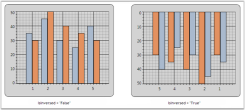

## Opposed Axis

For every Chart Type, there is an implied X-axis and Y-axis position, and by default all the X-axes and Y-axes will be rendered in that corresponding position. You can override this default behavior by setting the OpposedPosition property to True for an axis, which will cause it to be rendered in the opposite side of the implied position. This feature is also used with Multiple Axes, where you can position the Secondary axis opposite to the Primary axis.

<table>
<tr>
<th>
ChartAxis Property</th><th>
Description</th></tr>
<tr>
<td>
OpposedPosition</td><td>
Gets / sets a value indicating whether axis should be in opposed position.</td></tr>
</table>



<syncfusion:ChartArea Name="area">                    

 <syncfusion:ChartSeries Name="series" Data=" 1 35 2 45 3 30 4 25 5 40" />

 <syncfusion:ChartSeries Name="series1" Data=" 1 30 2 50 3 40 4 35 5 30" >

     <syncfusion:ChartSeries.YAxis>

          <syncfusion:ChartAxis  Orientation="Vertical" OpposedPosition="True"/>

     </syncfusion:ChartSeries.YAxis>

 </syncfusion:ChartSeries>

</syncfusion:ChartArea>

The following image illustrates Chart with Opposed Axis.

## Multiple Axes

Chart is capable of rendering multiple axes in the same plot. Different series can be plotted against different axes as follows.



<sfchart:Chart Name="Chart1">

<sfchart:ChartArea>

   <!--This series is plotted against the default Y axis -->

   <sfchart:ChartSeries Type="Spline" x:Name="Series1" DataSource="{Binding Source={StaticResource dataval}}" BindingPathX="ID" BindingPathsY="Val3" IsIndexed="False" Label="Avg Temperature">

   </sfchart:ChartSeries>

   <!--This series is plotted against a custom Y axis -->

   <sfchart:ChartSeries Type="SplineArea" x:Name="Series2" DataSource="{Binding Source={StaticResource dataval}}" BindingPathX="ID" BindingPathsY="Val1" Label="Avg Rainfall">

   <sfchart:ChartSeries.YAxis>

   <sfchart:ChartAxis OpposedPosition="True" RangePadding="Normal" IsAutoSetRange="False" Range="0,100" SmallTicksPerInterval="0" Interval="10" Orientation="Vertical">

   <sfchart:ChartArea.ShowGridLines>false</sfchart:ChartArea.ShowGridLines>

   <sfchart:ChartAxis.Header>

   <TextBlock Text="Rainfall (mm)" FontFamily="Tahoma" FontSize="14" Foreground="LightSteelBlue"/>

   </sfchart:ChartAxis.Header>

   </sfchart:ChartAxis>

   </sfchart:ChartSeries.YAxis>

   </sfchart:ChartSeries>

</sfchart:ChartArea>

</sfchart:Chart>


__For more details, refer to the sample in the following location:

_...\My Documents\Syncfusion\EssentialStudio\<Version Number>\WPF\Chart.WPF\Samples\3.5\WindowsSamples\Chart Axis\Chart Multiple Opposed Axes Demo_

## Axis Range Selection

Essential Chart for WPF now supports axis range selection. This enables the user to select a particular range of a primary axis by using two cursors.  

Adding an Axis Range Selection

To add axis range selction, set the EnableRangeSelection to True. The following code illustrates this.





  <syncfusion:ChartArea Name="area" EnableRangeSelection="True" LineStroke="Maroon" SelectionStroke="LightPink" />




chart1.Areas[0].EnableRangeSelection = true;

            double start = chart1.Areas[0].StartRange;

            double end = chart1.Areas[0].EndRange;

            chart1.Areas[0].LineStroke = Brushes.Maroon;

            chart1.Areas[0].SelectionStroke = Brushes.LightPink;




When the code runs, the following output displays.

### Property Details

<table>
<tr>
<th>
Name of Property</th><th>
Description </th><th>
Type of Property</th><th>
Value It Accepts</th><th>
Sub Properties</th></tr>
<tr>
<td>
EnableRangeSelection</td><td>
Used to set the range selection.</td><td>
Dependency</td><td>
Binary or True/False</td><td>
StartValue Type: double EndValueType: double LineStrokeType: Brush SelectionStroke Type: Brush</td></tr>
</table>

## Logarithmic Axes

Logarithmic values can be applied to the Chart. This is facilitated by the IsLogarithmic and LogarithmicBase properties. On setting the Axis.IsLogarithmic property, the Axis range, interval and padding will be plotted as per the log values provided. The LogarithmicBase value allows to set the base values for Logarithmic Axis.


// Add Data points to Chart

ChartListData points = new ChartListData();

for (int i = 1; i < 11; i++)

points.Add(new ChartPoint(i, Math.Exp(i)));

series.Data = points;

// Set the IsLogarithmic property of the Axis as true

area.SecondaryAxis.IsLogarithmic = true;

// Set the Logarithmic Base value as 10

area.SecondaryAxis.LogarithmicBase = 10;

// Set the Logarithmic Base value as 2

area.SecondaryAxis.LogarithmicBase = 2;

// Set the Logarithmic Base value as e

area.SecondaryAxis.LogarithmicBase = Math.E;


The following image illustrates Log chart with various LogarithmicBase values.

Show Minor Grid Lines When the Axis Is Logarithmic

Essential Chart WPF is enhanced with minor grid lines and ticks when the axis is set as logarithmic.

### Adding Show Minor Grid Lines 

Add Show Minor Grid Lines, by using the following code. 



 

<syncfusion:Chart Name="Chart1" Grid.Row="1" Margin="10">

      <syncfusion:ChartArea Name="area" >

   <syncfusion:ChartArea.PrimaryAxis>

                    <!--X axis declaration with required property settings-->

                    <syncfusion:ChartAxis Header="Year"  IsLogarithmic="True" 

EnableLogLabels="True" >

                    </syncfusion:ChartAxis>

                </syncfusion:ChartArea.PrimaryAxis>

              <syncfusion:ChartArea.SecondaryAxis>

                    <!--Y axis declaration with required property settings-->

                    <syncfusion:ChartAxis IsLogarithmic="True" 

EnableLogLabels="True">

                    </syncfusion:ChartAxis>

                </syncfusion:ChartArea.SecondaryAxis>							

</syncfusion:ChartArea>

</ syncfusion:Chart>




Chart1.Areas[0].PrimaryAxis.IsLogarithmic = true;

            Chart1.Areas[0].PrimaryAxis.EnableLogLabels = true;

            Chart1.Areas[0].SecondaryAxis.IsLogarithmic = true;

            Chart1.Areas[0].SecondaryAxis.EnableLogLabels = true;




When the code runs, the following output displays.

The following table contains the property Details.

<table>
<tr>
<th>
Name of the Property</th><th>
Description </th><th>
Type of the Property</th><th>
Value It Accepts</th></tr>
<tr>
<td>
EnabelLogLabels</td><td>
 Set /unset  the log labels</td><td>
Dependency Property</td><td>
Bool (true or false)</td></tr>
</table>
See Also

### Multiple Axes

Small tick for Logarithmic axis

Essential chart allows user to set the minor grid lines for log axis.

<table>
<tr>
<th>
Name of the Property</th><th>
Type of the property</th><th>
Value it accepts</th><th>
Property syntax</th><th>
Any other dependencies/ sub properties associated</th></tr>
<tr>
<td>
SmallTicksPerInterval</td><td>
Dependency property</td><td>
Integer and any whole number</td><td>
SmallTicksPerInterval = 5</td><td>
NA</td></tr>
</table>



  <syncfusion:ChartAxis SmallTicksPerInterval="20" IsLogarithmic="True" >



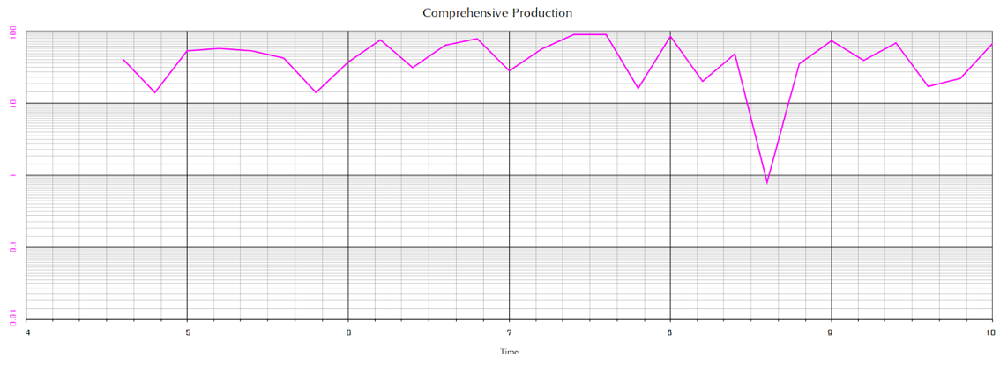

## Chart-Axis in WPF Chart (Classic) Header

Chart for WPF provides support for Chart Axis Titles with the help of the attached property ChartAxis.Header. Its position can be adjusted by using the HeaderAlignment property of the ChartAxis class.

<table>
<tr>
<th>
ChartAxis Property</th><th>
Description</th></tr>
<tr>
<td>
Header</td><td>
Gets/sets the title of the axis.</td></tr>
<tr>
<td>
HeaderAlignment</td><td>
Gets/sets the header alignment. The options included are as follows.FarCenterNear</td></tr>
</table>




<syncfusion:ChartArea Name="area">

          <syncfusion:ChartArea.PrimaryAxis>

              <syncfusion:ChartAxis Header="X-Axis" HeaderAlignment="Near" />

           </syncfusion:ChartArea.PrimaryAxis>

           <syncfusion:ChartArea.SecondaryAxis>

               <syncfusion:ChartAxis Header="Y-Axis" HeaderAlignment="Far" />                      

           </syncfusion:ChartArea.SecondaryAxis>

           <syncfusion:ChartSeries Name="series" Data=" 1 35 2 45 3 30 4 25 5 40" />                                       

</syncfusion:ChartArea> 




area.PrimaryAxis.Header = "X-Axis";

area.PrimaryAxis.HeaderAlignment = ChartAlignment.Near;

area.SecondaryAxis.Header = "Y-Axis";

area.SecondaryAxis.HeaderAlignment = ChartAlignment.Far;





The following image illustrates Chart with Axis HeaderAlignment set.

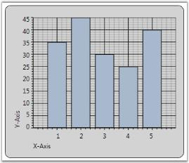

## Chart Striplines

Strip lines are horizontal or vertical bands marked in the background of a chart at regular or custom intervals. These strip lines help you to distinguish data points on a chart, highlight specific ranges of data, define threshold points etc. 

Segmented strip lines are created when the vertical and horizontal strip lines intersect each other. The segment created by this intersection for each strip line is a called a Segmented Strip Line.

The following code examples illustrate the creation of Segmented Strip Line at required locations.




<syncfusion:ChartAxis.StripLines>

<syncfusion:ChartStripLine IsSegmented="True" Start="1" Width="1" SegmentStartValue="10" Interior="Pink" Repeat="3" SegmentEndValue="60">

</syncfusion:ChartStripLine>

</syncfusion:ChartAxis.StripLines>




ChartStripLine sp = new ChartStripLine();

sp = new ChartStripLine();

sp.IsSegmented = true;

sp.Start = 1;

sp.Width = 1;

sp.Repeat=3;

sp.Interior = Brushes.Pink;

sp.StartFromAxis = false;

sp.SegmentStartValue = 10;

sp.SegmentEndValue = 60;

sp.Text = new FormattedText(item.Production.ToString(), CultureInfo.CurrentCulture, FlowDirection.LeftToRight, new Typeface("Arial"), 10, Brushes.Black);




Run the code. The following output is displayed.

## Scale Break Support

Breaks are very useful if you add points with too large difference in values. To enable breaks, you need to set the EnableBreaks property to true and set the break mode (BreaksMode property). A scale break is a line drawn across the plotting area of a chart to denote a break in continuity between the highest and lowest values on a value axis. A Scale Break displays two distinct ranges in the same chart area.

There are three possible modes. They are,

* ChartBreaksModes.Manual (default): If this value is set, you can manually set the breaks ranges.
* ChartAxis.BreakRanges.Union: to add a new break range
* ChartAxis.BreakRanges.Exclude: to remove the break range
* ChartAxis.BreakRanges.Clear: to remove all break ranges

* ChartBreaksMode.Auto: If this mode is enabled, chart will compute the breaks ranges automatically.
* This mode has several exclusions
* Breaks are computed only for actual y-axis of series
* Breaks don't work with zooming
* Breaks don't work with stacking
* All breaks work only with decart axes
* ChartBreaksModes.None: If this value is set, breaks are not used.

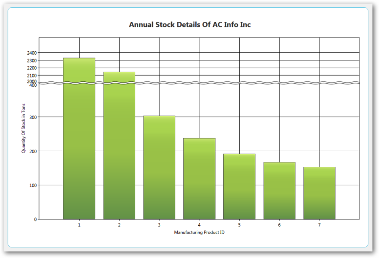

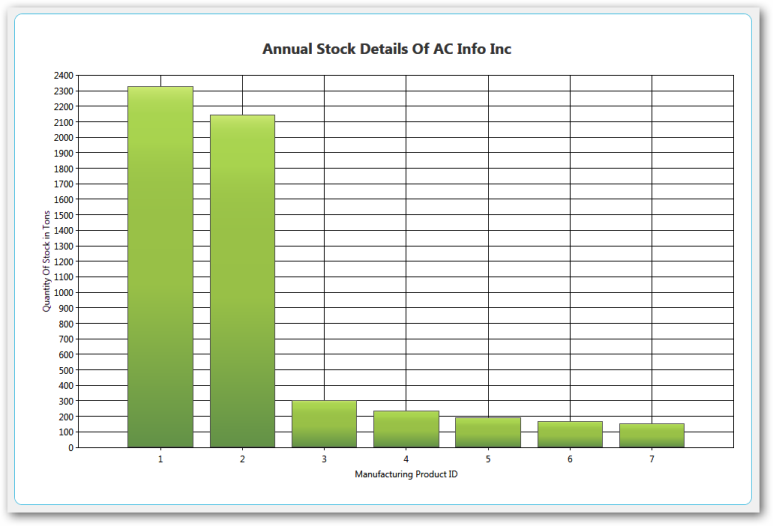

### Properties and Methods Tables

### Properties 

<table>
<tr>
<th>
Property</th><th>
Description </th><th>
Type </th><th>
Reference links</th></tr>
<tr>
<td>
EnableBreaks</td><td>
To enable break ranges</td><td>
bool</td><td>
NA</td></tr>
<tr>
<td>
BreaksMode</td><td>
3 types: Manual, Auto and None</td><td>
ChartBreaksModes</td><td>
NA</td></tr>
<tr>
<td>
LineType</td><td>
Straight line, wave and randomize</td><td>
ChartBreakLineTypes</td><td>
NA</td></tr>
<tr>
<td>
LineColor</td><td>
Different types of colors for the line</td><td>
Brush</td><td>
NA</td></tr>
<tr>
<td>
LineWidth</td><td>
Values from 1 to 10</td><td>
Double</td><td>
NA</td></tr>
<tr>
<td>
Linestyle</td><td>
Dash Line, DashDodDot Line ,DashDot Line, Dot Line, Solid Line</td><td>
DashStyle</td><td>
NA</td></tr>
<tr>
<td>
SpacingColor</td><td>
Different types of colors for the line</td><td>
Brush</td><td>
NA</td></tr>
<tr>
<td>
SpacingWidth</td><td>
Values from 1 to 10</td><td>
Double</td><td>
NA</td></tr>
</table>

### Methods

<table>
<tr>
<th>
Method </th><th>
Description </th><th>
Parameters </th><th>
Return Type </th><th>
Reference links </th></tr>
<tr>
<td>
Union</td><td>
To add a particular break range</td><td>
DoubleRangeChartBreakRangeInfo</td><td>
void</td><td>
NA</td></tr>
<tr>
<td>
Exclude</td><td>
To delete the specified break range</td><td>
DoubleRange</td><td>
void</td><td>
NA</td></tr>
<tr>
<td>
Clear</td><td>
Clear all existing break ranges</td><td>
NA</td><td>
void</td><td>
NA</td></tr>
</table>

## Retaining Axis Position

Essential Chart for WPF enables users to retain the axis position of the primary and secondary axis when multiple axes are added in a chart area.

### Adding Support for Retaining Axis Position 

Set the IsRetainAxisPosition propertyto True to add axesin the order they are added to the chart area. The following code illustrates this.  


<syncfusion:ChartArea IsRetainAxisPosition="True">

When the code runs, the following output displays. 

Set IsRetainAxisPosition is False to add axes in reverse order.

<table>
<tr>
<th>
Name of Property</th><th>
Description </th><th>
Type of Property</th><th>
Value It Accepts</th><th>
Property Syntax</th></tr>
<tr>
<td>
IsRetainAxisPosition</td><td>
Determines the order of arranging the multiple axes. </td><td>
Dependency </td><td>
Bool or True/False.</td><td>
IsRetainAxisPosition="True"</td></tr>
</table>

## Chart-Axis in WPF Chart (Classic) Improvements

Essential Chart provides support for some improvements in the existing chart axis by implementing the following features.

* Axis headers can be positioned inside, outside, or across the chart axes.
* Edge labels can be adjusted by setting EdgeLabelsDrawingMode to Fit to avoid the partial appearance of edge axis labels.
* Prefixes and suffixes can be added to chart axes labels to mention the units along with the labels.
* Labels can be aligned horizontally and vertically with respect to the specified width and height of chart axis labels.

### Properties

<table>
<tr>
<th>
Property</th><th>
Description</th><th>
Type</th><th>
Data Type</th></tr>
<tr>
<td>
HeaderPosition</td><td>
Specifies the position of the header with respect to the chart axis.Inside—Header is positioned inside the chart axis.Outside—Header is positioned outside the chart axis.Cross—Header is positioned across the chart axis.</td><td>
Dependency</td><td>
AxisPositions</td></tr>
<tr>
<td>
LabelHeight</td><td>
Specifies the height of axis labels</td><td>
Dependency</td><td>
double</td></tr>
<tr>
<td>
LabelWidth</td><td>
Specifies the width of axis labels</td><td>
Dependency</td><td>
double</td></tr>
<tr>
<td>
LabelHorizontalAlignment</td><td>
Aligns the labels horizontally within the specified width of the labels.</td><td>
Dependency</td><td>
HorizontalAlignment</td></tr>
<tr>
<td>
LabelVerticalAlignment</td><td>
Aligns the labels horizontally within the specified width of the labels.</td><td>
Dependency</td><td>
VerticalAlignment</td></tr>
<tr>
<td>
LabelsPrefix</td><td>
Specifies the prefix for chart axis labels.</td><td>
Dependency</td><td>
DataTemplate</td></tr>
<tr>
<td>
LabelsPostfix</td><td>
Specifies the suffix for chart axis labels.</td><td>
Dependency</td><td>
DataTemplate</td></tr>
<tr>
<td>
EdgeLabelsDrawingMode</td><td>
Fit—Draws the edge labels to fit within the chart area</td><td>
Dependency</td><td>
EdgeLabelsDrawingMode</td></tr>
</table>

### Sample Link

To access the chart axis improvement demo:

1. Open the Syncfusion Dashboard.
2. Select User Interface.
3. Click the WPF drop-down list and select Explore Samples.
4. Browse to the path Chart.WPF\Samples\3.5\ WindowsSamples\Chart Axis\Chart Axis Improvement Demo.

### Adding Axis Improvement properties to an Application 



            <syncfusion:ChartAxis HeaderPosition="Cross"                      LabelHeight="40" LabelWidth="120"                                            LabelsPrefix="{StaticResource yPrefix}"                       LabelsPostfix="{StaticResource yPostfix}"                      LabelHorizontalAlignment="Left" LabelVerticalAlignment="Top"                      EdgeLabelsDrawingMode="Fit">            </syncfusion:ChartAxis>


            this.primaryAxis.HeaderPosition = AxisPositions.Cross;            this.primaryAxis.LabelHeight = 40;            this.primaryAxis.LabelWidth = 120;            this.primaryAxis.LabelHorizontalAlignment = HorizontalAlignment.Left;            this.primaryAxis.LabelVerticalAlignment = VerticalAlignment.Top;            this.primaryAxis.LabelsPrefix = xPrefix;            this.primaryAxis.LabelsPostfix = xPostfix;            this.primaryAxis.EdgeLabelsDrawingMode = EdgeLabelsDrawingMode.Fit;



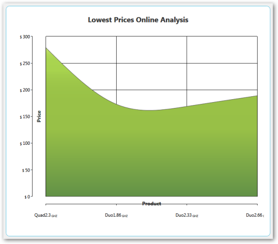

_Primary Axis Labels with Postfix (GHZ) and Secondary Axis Labels withPrefix ($)_

_Secondary Axis EdgeLabelsDrawingMode [Shift]_

_Secondary Axis LabelHeight [30], LabelVerticalAlignment [Top]_

## Smart Axis Labels

Essential Chart for WPF supports smart axis labels which help to display labels in a smart and effective manner. This support is available for the following axis types:

* Double
* DateTime
* TimeSpan

### Use Case Scenarios

Smart axis labels are useful in the following scenarios:

Axis Type Double: In cases where axis ranges have values that are so large (e.g., millions or trillions) that the labels use too much room on the axis. Smart axis labels are rendered with suffixes based on the data range value. For example, “M” will be appended to all labels with million values—1,000,000 will be displayed as 1M.

Axis Type DateTime: In cases where LabelDateTimeFormat is set to Default, the labels will appear too large displaying “MM/dd/yyyy hh:mm tt”. Smart labels calculate the data range and reduce the labels. For example, only “MM/dd” would be displayed depending upon the interval between two labels. 

Axis Type TimeSpan: In cases where the time span is set with intervals of hours, smart labels can convert and display when there is a change with the hours. For example, 12:00  to 15:00 will be displayed as 12:00:00. … 1 … 2 … … … 12 … 13 … 14 … 15:00:00 

### Properties

<table>
<tr>
<th>
Property</th><th>
Description</th><th>
Type</th><th>
Data Type</th></tr>
<tr>
<td>
EnableSmartAxisLabels</td><td>
Used to enable or disable SmartAxisLabels</td><td>
Dependency property</td><td>
Bool </td></tr>
<tr>
<td>
DoubleDisplayUnit</td><td>
Used to set double display units such as millions, trillions, etc.</td><td>
Dependency property</td><td>
Enum DisplayUnit</td></tr>
<tr>
<td>
DoubleDisplayUnitAlignment</td><td>
Used to set the alignment for double display units.</td><td>
Dependency property</td><td>
Enum ChartAlignment</td></tr>
</table>

### Sample Link

C:\Documents and Settings\<user name>\My documents\Syncfusion\Essential Studio\Samples\WPF\Chart.WPF\Samples\3.5\WindowsSamples\ChartAxis\Smart Axis Label

Enabling Smart Axis Labels in Chart Axis

The following code example shows how to enable smart axis labels:




  ChartAxis axis=new ChartAxis();

  axis.EnableSmartAxisLabel= True;

  Chart1.PrimaryAxis=axis;	



<syncfusion:ChartArea.PrimaryAxis>

     <syncfusion:ChartAxis EnableSmartAxisLabel="True"/>

</syncfusion:ChartArea.PrimaryAxis>



## Placing axis labels and series segment in between Ticklines

Provide the option to position the segments between axis lines and on the axis line. For ‘AdjustAcrossChartType’, the segments is visible between the axis lines and for ConsistentAcrossChartType, the segment is visible on the axis lines.

The following screenshot depicts the segments between TickLine

The following screenshot depicts the segments on TickLine

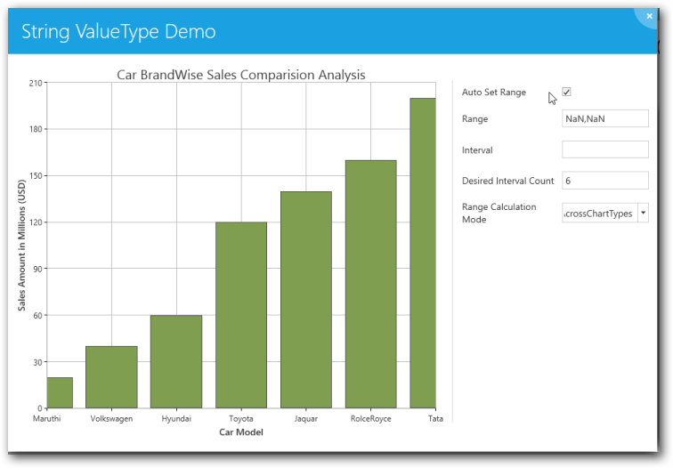

### Properties

<table>
<tr>
<th>
Property</th><th>
Description</th></tr>
<tr>
<td>
RangeCalculationMode</td><td>
AdjustAcrossChartType - The segment starts from 1st axis and the constant behavior is BetweenTicks.ConsistentAcrossChartType - Similar to AdjustAcrossChartType and the constant behavior is OnTicks.</td></tr>
</table>

Adding Segment Position to an Application 

For placing axis label and series segment in between Ticklines do the following:

1. Create a new WPF Application in VS2012.
2. Create a chart sample with ChartArea and ChartAxis.
3. Change the RangeCalculationMode property in primary axis to _AdjustAcrossChartType_ or ConsistentAcrossChartType for changing the segment position.

### Code Example

The following code example illustrates the usage of placing axis label and series segment between the Ticklines



<sfchart:Chart>

<sfchart:ChartArea Background="LightGray" GridBackground="White">

<sfchart:ChartArea.PrimaryAxis>

      <sfchart:ChartAxis IsAutoSetRange="False" Range="0,100" Interval="25" MinimumInterval="25" RangeCalculationMode="AdjustAcrossChartType" RangePadding="Addditional"/>

    </sfchart:ChartArea.PrimaryAxis>

     <sfchart:ChartSeries Template="{StaticResource Template1}"        DataSource="{Binding Source={StaticResource myXmlData},XPath=Products/Product}" BindingPathX="Month" BindingPathsY="Sales" Interior="Red"  Type="FastSpline"/>

   </sfchart:ChartArea>          

</sfchart:Chart>

