# Chart-Series in WPF Chart (Classic)

## Populating Chart Series

The following are the three steps that should be followed:

* Adding Chart Series
* Data Binding
* Sorting the Series Data

### Adding Chart Series

You can add one or more Chart Series to a Chart Area to plot points in the Chart. Note that you can specify one of the several built-in Chart types for rendering the series points.





<sfchart:Chart>

  <sfchart:ChartArea>

    <sfchart:ChartSeries/>

  </sfchart:ChartArea>

</sfchart:Chart>




ChartSeries series = new ChartSeries();

Chart1.Areas[0].Series.Add(series);





You can then add points to the series using one of the following Data Binding techniques.

### Data Binding

The most common and convenient approach to populate a Chart Series is by simply binding the Chart Series to a business object list. The following properties are used for this purpose.

### Property Table

<table>
<tr>
<th>
Property</th><th>
Description</th></tr>
<tr>
<td>
DataSource</td><td>
takes any IEnumerable instance as the Data Source</td></tr>
<tr>
<td>
BindingPathX</td><td>
specifies the member / field in the specified data source that contains the x values for the series</td></tr>
<tr>
<td>
BindingPathsY</td><td>
specifies the members / fields in the specified data source that contain the y values for the seriesNote that some Chart Types require more than one y value and hence this property is of type String Array.</td></tr>
</table>

All the common data sources are supported by the Chart control. The following are some of the data sources supported.

* IList instances
* ObservableCollection
* XmlDataProvider
* CollectionViewSource
* LINQ results
* Other compatible data sources

Note that the chart plot will automatically update when the bound data sends a change notification.

The following code example illustrates how to bind the Chart control to an XMLDataProvider.



<Window.Resources>

<XmlDataProvider x:Key="myXmlData">

<x:XData>

<Products xmlns="">

<Product Sales="20" Projected="30" Month="1"/>

<Product Sales="12" Projected="28" Month="2"/>

<Product Sales="15" Projected="29" Month="3"/>

<Product Sales="28" Projected="33" Month="4"/>

<Product Sales="24" Projected="30" Month="5"/>

</Products>

</x:XData>

</XmlDataProvider>

</Window.Resources>

<Grid>

    <sfchart:Chart Name="Chart2">

        <sfchart:ChartArea >

            <sfchart:ChartSeries DataSource="{Binding Source={StaticResource myXmlData}, XPath=Products/Product}" BindingPathX="Month"                BindingPathsY="Sales" Type="Column" Label="Actual Sales">

            </sfchart:ChartSeries>

            <sfchart:ChartSeries DataSource="{Binding Source={StaticResource myXmlData}, XPath=Products/Product}" BindingPathX="Month"                BindingPathsY="Projected" Type="Column" Label="Projected Sales">

            </sfchart:ChartSeries>

        </sfchart:ChartArea>

    </sfchart:Chart>

</Grid>



### Sorting the Series Data

The data can either be sorted or unsorted. If you are sure that the data passed to the collection is sorted, then you can turn off the sorting feature by using the following code.


Series.IsSortData = false;


## Series Customization

Chart Series can be customized with various properties. This section discusses the following topics.

### Interior

The interior of the Chart Series can be set by using the Interior property.



<Window.Resources>

<!--To be added in window resources.-->

<LinearGradientBrush x:Key="SeriesAInterior" EndPoint="1,0.5" StartPoint="0,0.5">

<LinearGradientBrush.GradientStops>

<GradientStop Color="#FFC07E2C" Offset="0"/>

<GradientStop Color="#FFFFDD9E" Offset="0.5"/>

<GradientStop Color="#FFC07E2C" Offset="1"/>

</LinearGradientBrush.GradientStops>

</LinearGradientBrush>

</Window.Resources>

<!--To be added in window resources.-->

<syncfusion:ChartSeries Interior="Red" Data="1 20 2 30 3 55 4 35 5 40" />

<syncfusion:ChartSeries Interior="{StaticResource SeriesAInterior}" Label="Series 2" Data="1 30 2 40 3 50 4 25 5 45" />



The following screenshot illustrates Chart Series Interior settings.

### IsVisible

Essential Chart for WPF enables you to show / hide the Chart Series by using the IsVisible boolean property provided by the ChartSeries class.





<syncfusion:Chart >

<syncfusion:ChartArea IsContextMenuEnabled="True" >                   

<syncfusion:ChartSeries Label="Series 1" IsVisible="False" Data=" 1 35 2 45 3 30 4 25 5 40" />

<syncfusion:ChartSeries Label="Series 2" Data=" 1 30 2 40 3 50 4 20 5 45" />

</syncfusion:ChartArea>                    

</syncfusion:Chart>




ChartSeries series = new ChartSeries();

series.IsVisible = false;




The following screenshot illustrates Chart with Series 1 invisible.

### IsRotated

Chart Series can be rotated by using the ChartSeries.IsRotated property.





<syncfusion:Chart >

      <syncfusion:ChartArea >                   

            <syncfusion:ChartSeries Label="Series 1" IsRotated="True" Data=" 1 35 2 45 3 30 4 25 5 40" />

            <syncfusion:ChartSeries Label="Series 2" Data=" 1 30 2 40 3 50 4 20 5 45" />

      </syncfusion:ChartArea>                    

</syncfusion:Chart>





area.Series[0].IsRotated = true;





The following screenshot illustrates Chart with Series 1 rotated.

### Label

The text displayed in the Chart Legends and the Chart Area context menu can be customized by using the ChartSeries.Label property.





<syncfusion:ChartArea>

     <syncfusion:ChartSeries Type="Column" Label="Series 1"/>

     <syncfusion:ChartSeries Type="Column" Label="Series 2"/>

</syncfusion:ChartArea>





area.Series[0].Label = "Series 1";

area.Series[1].Label = "Series 2";





The following screenshot illustrates Chart with customized Series Labels.

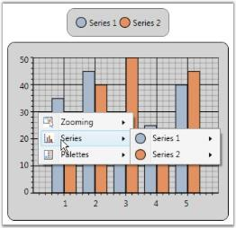

## Chart-Series in WPF Chart (Classic) Types

Chart control supports 34 types of charts, among which 12 types are supported in 3D mode as well. The Type property is used to specify the Chart Type.





<Window.Resources>

  <local:ProductSalesCollection x:Key="SeriesData1"/>

</Window.Resources>

<sfchart:Chart>

  <sfchart:ChartArea>

    <sfchart:ChartSeries Type="Area" DataSource="{StaticResource SeriesData1}" BindingPathX="Year" BindingPathsY="Sales"/>

  </sfchart:ChartArea>

</sfchart:Chart>





ChartSeries series = new ChartSeries();

series.DataSource = new ProductSalesCollection();

series.BindingPathX = "Year";

series.BindingPathsY = new string[] { "Sales" };

Chart1.Areas[0].Series.Add(series);




## Chart-Series in WPF Chart (Classic) Look and Feel

Chart for WPF provides various options to customize the look and feel of the Chart Series. The following are some of the properties that are used for this purpose.

### Property 

<table>
<tr>
<th>
Property</th><th>
Description</th></tr>
<tr>
<td>
Interior</td><td>
specifies the fill color of chart series</td></tr>
<tr>
<td>
Stroke</td><td>
specifies the border color of the chart series segment</td></tr>
<tr>
<td>
StrokeThickness</td><td>
specifies the thickness of the chart series segment border</td></tr>
</table>

The following code example illustrates how to set the preceding properties.





<Window.Resources>

  <local:ProductSalesCollection x:Key="SeriesData1"/>

</Window.Resources>

<sfchart:Chart>

  <sfchart:ChartArea>

    <sfchart:ChartSeries Type="Area" DataSource="{StaticResource SeriesData1}" BindingPathX="Year" BindingPathsY="Sales"

    Interior="LightCoral" Stroke="Black" StrokeThickness="1.5"/>

  </sfchart:ChartArea>

</sfchart:Chart>





ChartSeries series = new ChartSeries();

series.DataSource = new ProductSalesCollection();

series.BindingPathX = "Year";

series.BindingPathsY = new string[] { "Sales" };

series.Interior = Brushes.LightCoral;

series.Stroke = Brushes.Black;

series.StrokeThickness = 1.5;

Chart1.Areas[0].Series.Add(series);





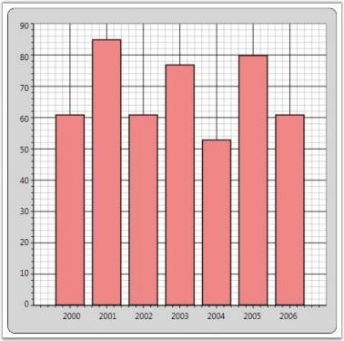

## Chart-Series in WPF Chart (Classic) Template

Chart for WPF enables you to apply custom Data Templates to the Chart Series. By applying the custom data templates, the Chart Series Segments can be altered. The following code example illustrates how to create a sample data template to draw a Line Chart.

N> Data templates cannot be customized for a single segment in a series. As each series is drawn as a single segment, we cannot customize the individual segments.



<Window.Resources>

<!--Chart Series Data-->

<XmlDataProvider x:Key="myXmlData">

<x:XData>

<Products xmlns="">

<Product Sales="20" Projected="30" Month="1"/>

<Product Sales="12" Projected="28" Month="2"/>

<Product Sales="15" Projected="29" Month="3"/>

<Product Sales="28" Projected="33" Month="4"/>

<Product Sales="24" Projected="30" Month="5"/>

</Products>

</x:XData>

</XmlDataProvider>

<!--Line Chart Template-->

<DataTemplate x:Key="Template1">

<Line X1="{Binding X1}" X2="{Binding X2}" Y1="{Binding Y1}" Y2="{Binding Y2}" StrokeThickness="2" Stroke="{Binding Interior}"       StrokeDashArray="3,2" />

</DataTemplate>

</Window.Resources>

<sfchart:Chart>

   <sfchart:ChartArea Background="LightGray" GridBackground="White">

     <sfchart:ChartSeries Template="{StaticResource Template1}" DataSource="{Binding Source={StaticResource myXmlData},

     XPath=Products/Product}" BindingPathX="Month" BindingPathsY="Sales" Interior="Red"  Type="Line"/>

   </sfchart:ChartArea>            

</sfchart:Chart>



## Chart-Series in WPF Chart (Classic) Adornments

Chart Series Adornments are used to display values in a Chart Segment related to it. Values from data points (x value, y value) or other properties from a data source can be displayed. ChartAdornmentsInfo class is used to display Chart Series Adornments. ChartAdornmentsInfo class provides the following properties to customize the chart series adornments.

### Property Table

<table>
<tr>
<th>
Property</th><th>
Description</th></tr>
<tr>
<td>
LabelContentPath</td><td>
specifies the value to display in the AdornmentsFor example, to display the x value, LabelContentPath will be DataPoint.X.</td></tr>
<tr>
<td>
Symbol</td><td>
allows selecting one symbol among the eleven predefined symbols or custom symbol options</td></tr>
<tr>
<td>
SymbolInterior</td><td>
specifies the interior of the predefined symbols added to the adornments</td></tr>
<tr>
<td>
SymbolHeight</td><td>
specifies the height of the predefined symbols added to the adornments</td></tr>
<tr>
<td>
SymbolWidth</td><td>
specifies the width of the predefined symbols added to the adornments</td></tr>
<tr>
<td>
SymbolTemplate</td><td>
specifies the symbol to be displayed in the adornments when the Symbol property is set to {{ '_Custom_' | markdownify }}</td></tr>
<tr>
<td>
VerticalAlignment</td><td>
specifies the Vertical alignment of the Adornment text</td></tr>
<tr>
<td>
HorizontalAlignment</td><td>
specifies the Horizontal alignment of the adornments</td></tr>
<tr>
<td>
LabelTemplate</td><td>
customizes the look and feel of the adornments being displayed</td></tr>
</table>

The following code example illustrates how to display adornments in a Chart Series.





<Window.Resources>

    <!--Chart Series Data-->

    <XmlDataProvider x:Key="myXmlData">

        <x:XData>

            <Products xmlns="">

                <Product Sales="20" Projected="30" Month="1"/>

                <Product Sales="12" Projected="28" Month="2"/>

                <Product Sales="15" Projected="29" Month="3"/>

                <Product Sales="28" Projected="33" Month="4"/>

                <Product Sales="24" Projected="30" Month="5"/>

            </Products>

        </x:XData>

    </XmlDataProvider>

    <!--ChartAdornmentInfo LabelTemplate-->

    <DataTemplate x:Key="Lbltxt1">

        <TextBlock Name="TB1" Text ="{Binding}" FontSize="13" Foreground="Red" TextAlignment="Justify"  VerticalAlignment="Center" FontWeight="Bold" />

       </DataTemplate>

</Window.Resources>

<!--Chart with Adornments-->

<sfchart:Chart>

    <sfchart:ChartArea  Background="LightGray" GridBackground="White">

        <sfchart:ChartArea.PrimaryAxis>

            <sfchart:ChartAxis sfchart:ChartArea.ShowGridLines="False" />

        </sfchart:ChartArea.PrimaryAxis>

        <sfchart:ChartSeries Type="Column" DataSource="{Binding Source={StaticResource myXmlData}, XPath=Products/Product}"

        BindingPathX="Month" BindingPathsY="Sales"  Interior="LightSkyBlue" Stroke="Black" StrokeThickness="1.5">

            <sfchart:ChartSeries.AdornmentsInfo>

                <sfchart:ChartAdornmentInfo LabelTemplate="{StaticResource Lbltxt1}" LabelContentPath="DataPoint.X" Visible="True"                        VerticalAlignment="Top"  />

            </sfchart:ChartSeries.AdornmentsInfo>

        </sfchart:ChartSeries>

    </sfchart:ChartArea>

</sfchart:Chart>




ChartSeries series = Chart1.Areas[0].Series[0];           

ChartAdornmentInfo adornments = series.AdornmentsInfo;

adornments.LabelContentPath = "DataPoint.X";

adornments.LabelTemplate = this.Resources["Lbltxt1"] as DataTemplate;

adornments.Visible = true;

adornments.VerticalAlignment = VerticalAlignment.Top;





### Symbol Template for Chart Adornment

The following Symbol Templates can be set for ChartAdornmentInfo.

* Predefined Symbol Template (set from one among the twelve predefined symbols)
* Custom Template (custom Data Template set by users)

### Predefined Symbol Template

You can set any one of the following predefined symbols for ChartAdornmentInfo. 

* Cross
* Diamond
* Ellipse
* Hexagon
* HorizontalLine
* InvertedTriangle
* Pentagon
* Plus Square
* Triangle
* VerticalLine

The following code example illustrates how to apply predefined symbol templates to chart adornments.





 <Syncfusion:ChartSeries Type="Column"  DataSource="{StaticResource collection1}" BindingPathX="X" BindingPathsY="Y" IsIndexed="True"         Stroke="Black" StrokeThickness="1.5">

      <Syncfusion:ChartSeries.AdornmentsInfo>

         <Syncfusion:ChartAdornmentInfo Visible="True" Symbol="Pentagon" SymbolInterior="Green" SymbolHeight="25" SymbolWidth="25" />

         </Syncfusion:ChartSeries.AdornmentsInfo>

      </Syncfusion:ChartSeries>





series1.AdornmentsInfo.Visible = true;

series1.AdornmentsInfo.Symbol = Symbol.Pentagon;

series1.AdornmentsInfo.SymbolInterior = Brushes.Green;

series1.AdornmentsInfo.SymbolHeight = 25;

series1.AdornmentsInfo.SymbolWidth = 25;





### Custom Symbol Template

The following code example illustrates how to apply custom symbol templates to chart adornments.





<Window.Resources>

    <local:ProductSalesCollection x:Key="SeriesData1"/>

    <DataTemplate x:Key="Lbltxt1">

        <TextBlock Name="TB1" Text ="{Binding}" FontSize="11" Foreground="Black" TextAlignment="Justify"  VerticalAlignment="Center"

        FontWeight="Bold">

    </TextBlock>

    </DataTemplate>

    <DataTemplate x:Key="SymbolTemplate">

        <Rectangle Stroke="Black" Fill="Red" Width="10" Height="10"/>

    </DataTemplate>

</Window.Resources>

<sfchart:Chart>

    <sfchart:ChartArea>

        <sfchart:ChartSeries Type="Area" DataSource="{StaticResource SeriesData1}" BindingPathX="Year" BindingPathsY="Sales"                     Interior="LightCoral" Stroke="Black" StrokeThickness="1.5">

            <sfchart:ChartSeries.AdornmentsInfo>

                <sfchart:ChartAdornmentInfo SymbolTemplate="{StaticResource SymbolTemplate}" LabelTemplate="{StaticResource Lbltxt1}"

                LabelContentPath="DataPoint.X" Visible="True" VerticalAlignment="Top"/>

            </sfchart:ChartSeries.AdornmentsInfo>

        </sfchart:ChartSeries>

    </sfchart:ChartArea>

</sfchart:Chart>





ChartSeries series = new ChartSeries();

series.DataSource = new ProductSalesCollection();

series.BindingPathX = "Year";

series.BindingPathsY = new string[] { "Sales" };

series.Stroke = Brushes.Black;

series.StrokeThickness = 1d;

Chart1.Areas[0].Series.Add(series);

ChartAdornmentInfo adornments = series.AdornmentsInfo;

adornments.LabelContentPath = "DataPoint.X";

adornments.LabelTemplate = this.Resources["Lbltxt1"] as DataTemplate;

adornments.Visible = true;

adornments.VerticalAlignment = VerticalAlignment.Bottom;

adornments.SymbolTemplate = this.Resources["SymbolTemplate"] as DataTemplate;





### Adornment Support for Fast Chart Types

This feature helps the user use adornments in fastchart types too. Considering the performance of Fastchart types, only limited adornment support for fastchart types have been provided.

* Limited adornment symbols are supported for Fastchart types. They are
* Ellipse
* Square
* Horizontal line
* Vertical line
* Symbol interior can be changed.
* Symbol height and width can be changed.

### Use Case Scenarios

Most fastchart types are used in stock market charts. Users can display the data of the point in the adornment.

### Sample Link

Essential Chart WPF > Chart Series > Adornments Configuration Demo

Adding Fastchart Types with Adornments to an Application





  <Syncfusion:ChartSeries.AdornmentsInfo>

         <Syncfusion:ChartAdornmentInfo Visible="True" Symbol="Ellipse" SymbolInterior="Red" SymbolHeight="20" SymbolWidth="20" />

         </Syncfusion:ChartSeries.AdornmentsInfo>

      </Syncfusion:ChartSeries>





series1.AdornmentsInfo.Visible = true;

series1.AdornmentsInfo.Symbol = Symbol.Ellipse;

series1.AdornmentsInfo.SymbolInterior = Brushes.Red;

series1.AdornmentsInfo.SymbolHeight = 20;

series1.AdornmentsInfo.SymbolWidth = 20;



## Chart Segment Labels

Labels can be displayed in the chart types such as Pie, Doughnut, Pyramid and Funnel. Chart Segment Labels can be used to display information like x value, y value, percentage, y value of total and datetime. This feature has been implemented based on the ChartAdornmentsInfo class. The following code example illustrates how to add Chart Segment Labels.


<sfchart:ChartArea>

    <sfchart:ChartSeries Type="Pie">

        <sfchart:ChartSeries DataSource="{Binding Source={StaticResource myXmlData}, XPath=Products/Product}" BindingPathX="Month"                 BindingPathsY="Sales" >

            <sfchart:ChartSeries.AdornmentsInfo>

                <sfchart:ChartAdornmentInfo LabelContentPath="SegmentLabel" Visible="True" SegmentShowLine="False"

                SegmentLabelContent="Percentage" SegmentLabelFontSize="12"/>

            </sfchart:ChartSeries.AdornmentsInfo>

        </sfchart:ChartSeries>

</sfchart:ChartArea>



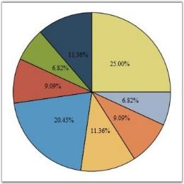

Chart supports applying custom templates to the chart segment labels. The following code example illustrates this.



<Window.Resources>

    <DataTemplate x:Key="labelsTemplate">

        <Border CornerRadius="1" Margin="0" Padding="2" BorderBrush="Black" Background="MintCream" BorderThickness="1">

            <ContentPresenter Content="{Binding}"/>

        </Border>

    </DataTemplate>

    <DataTemplate x:Key="connectorTemplate">

        <Line X1="0" X2="10" Y1="0" Y2="0" Stroke="Black"/>

    </DataTemplate>

</Window.Resources>

<sfchart:ChartSeries DataSource="{Binding Source={StaticResource myXmlData}, XPath=Products/Product}" BindingPathX="Month"

BindingPathsY="Sales" Type="Pie">

    <sfchart:ChartSeries.AdornmentsInfo>

        <sfchart:ChartAdornmentInfo LabelContentPath="SegmentLabel" SegmentIsOut="False" SegmentLabelContent="Percentage" Visible="True"          SegmentShowLine="True" SegmentLabelFontSize="12" LabelTemplate="{StaticResource labelsTemplate}"

        ConnectorTemplate="{StaticResource connectorTemplate}"/>

    </sfchart:ChartSeries.AdornmentsInfo>

</sfchart:ChartSeries>



The following properties are used to customize the look and feel of the Chart Segment Labels.

### Property 

<table>
<tr>
<th>
Name</th><th>
Type</th><th>
Description</th><th>
Default Value</th></tr>
<tr>
<td>
SegmentLabelContent</td><td>
Enum</td><td>
specifies value of the labelThe options included are as follows.DateTimePercentageXValueYofTotYValue</td><td>
YValue</td></tr>
<tr>
<td>
SegmentIsOut</td><td>
Bool</td><td>
indicates whether label is inside or outside the segment</td><td>
False</td></tr>
<tr>
<td>
SegmentShowLine</td><td>
Bool</td><td>
indicates whether line is shown from the segment to label</td><td>
False</td></tr>
<tr>
<td>
HorizontalAlignment</td><td>
HorizontalAlignment</td><td>
specifies horizontal label alignment with respect to segment</td><td>
Center</td></tr>
<tr>
<td>
VerticalAlignment</td><td>
VerticalAlignment</td><td>
specifies vertical label alignment with respect to segment</td><td>
Center</td></tr>
<tr>
<td>
SegmentLabelDataTimeFormat</td><td>
String</td><td>
specifies segment label data time format</td><td>
"dd/MM/yyyy"</td></tr>
<tr>
<td>
SegmentLabelFontFamily</td><td>
FontFamily</td><td>
specifies font of the label</td><td>
Times New Roman</td></tr>
<tr>
<td>
SegmentLabelFontSize</td><td>
Int32</td><td>
specifies font size of the label</td><td>
10</td></tr>
<tr>
<td>
SegmentLabelFontWeight</td><td>
FontWeight</td><td>
specifies font weight of the label</td><td>
Normal</td></tr>
<tr>
<td>
SegmentLabelFormat</td><td>
String</td><td>
specifies label format</td><td>
"0.00"</td></tr>
<tr>
<td>
SegmentLabelRotation</td><td>
double</td><td>
specifies rotation angle for the label</td><td>
0d</td></tr>
<tr>
<td>
ConnectorTemplate</td><td>
DataTemplate</td><td>
label's connector template</td><td>
Null</td></tr>
<tr>
<td>
LabelContentPath</td><td>
String</td><td>
label's content path</td><td>
"SegmentLabel"</td></tr>
<tr>
<td>
LabelTemplate</td><td>
DataTemplate</td><td>
label's template</td><td>
Null</td></tr>
<tr>
<td>
SymbolTemplate</td><td>
DataTemplate</td><td>
symbol's template</td><td>
Null</td></tr>
</table>

N> To show the segment lines, the SegmentShowLine property must be set to true and a ConnectorTemplate must be associated.
 

## Chart-Series in WPF Chart (Classic) Empty Points

Essential Chart provides support for Empty Points. The data collection that is passed to the chart can have NaN or infinite values that will be considered as Empty Points. You can also hide the empty points by setting the ShowEmptyPoints property to _false_.



<syncfusion:ChartSeries Type="Column" Name="series1" EmptyPointInterior="Red" EmptyPointStyle="SymbolAndInterior" Interior="Green" IsIndexed="False" ShowEmptyPoints="True" Stroke="Black"  StrokeThickness="1"/>





// Display Empty Points.

series1.ShowEmptyPoints = true;

// Set Empty Point style.

series1.EmptyPointStyle = EmptyPointStyle.SymbolAndInterior;

// Set Empty Point symbol color.

series1.EmptyPointInterior = Brushes.Red;

// Collection with Nan values.

public IList products()

{

    Random rand = new Random(DateTime.Now.Millisecond);

    List<product> productList = new List<product>();

    productList.Add(new product() { ProdId = 1, Prodname = "Rice", Price = double.NaN, Stock = 3.5 });

    productList.Add(new product() { ProdId = 2, Prodname = "Wheat", Price = double.NaN, Stock = 5.8 });

    productList.Add(new product() { ProdId = 3, Prodname = "Oil", Price = 30, Stock = 2.1 });

    productList.Add(new product() { ProdId = 4, Prodname = "Corn", Price = 20, Stock = 5.1 });

    productList.Add(new product() { ProdId = 5, Prodname = "Gram", Price = double.NaN, Stock = 2.0 });

    productList.Add(new product() { ProdId = 6, Prodname = "Milk", Price = 30, Stock = 1.5 });

    productList.Add(new product() { ProdId = 7, Prodname = "Oil", Price = 40, Stock = 2.0 });

    productList.Add(new product() { ProdId = 8, Prodname = "Corn", Price = 20, Stock = 2.5 });

    productList.Add(new product() { ProdId = 9, Prodname = "Butter", Price = 30, Stock = 1.5 });

    return productList;

}



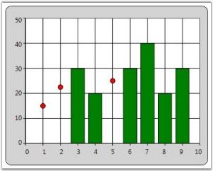

### Empty Point Symbol customization 

This feature enables you to customize the marker for the empty point. You can differentiate the points using symbol or interior color. This support is available for all chart types except Fast chart type.

### Property

<table>
<tr>
<th>
Property </th><th>
Description </th><th>
Type </th><th>
Data Type </th><th>
Reference links </th></tr>
<tr>
<td>
EmpyPointSymbolTemplate </td><td>
Used to apply user defined template for the empty point symbol.</td><td>
Dependency Property</td><td>
DataTemplate</td><td>
NA </td></tr>
</table>

### Customizing Chart Empty Point Symbol

You can customize the empty point symbol using the _EmpyPointSymbolTemplate_ property. The following code illustrates this:



<!—Data Template for Empty point symbol-->

<DataTemplate x:Key="EmptyTemp">                <Grid >                    <Rectangle Fill="Green" Margin="0,0,0,10"  Width="10" Height="10" />                </Grid>            </DataTemplate >

<!— Adding Data Template for Chart series-->

<syncfusion:ChartSeries Name="series1" Label="Profit" EmptyPointSymbolTemplate="{StaticResource EmptyTemp}">



### Sample Link

To view a sample:

1. Open the Syncfusion Dashboard.

2. Select User Interface.

3. Click the WPF drop-down list and select Explore Samples.

4. Navigate to _Chart.WPF\Samples\3.5\WindowsSamples\Chart Customization\_

### Empty Point Default Value

This feature enables you to specify the default value of the empty point.  You can either set this as zero or the average of nearest value on the adjacent side. 

### Properties

<table>
<tr>
<th>
Property </th><th>
Description </th><th>
Type </th><th>
Data Type </th><th>
Reference links </th></tr>
<tr>
<td>
EmptyPointValue</td><td>
Specifies whether empty point has to show zero or average value.</td><td>
Dependency Property</td><td>
EmptyPointValue</td><td>
NA</td></tr>
</table>
Customizing the Default Value of the Empty Point

You can customize the default value of the empty point using the _EmptyPointValue_ property. 

Set the EmptyPointValue property to _Zero_, the default empty point value will be zero.

The following code illustrates this:




<syncfusion:ChartSeries Name="series1" EmptyPointValue="Zero"  EmptyPointStyle="Symbol" ShowEmptyPoints="True" EmptyPointSymbolTemplate="{StaticResource EmptyTemp}"

 Stroke="Black"  StrokeThickness="1"/>





series1.EmptyPointValue = EmptyPointValue.Zero;





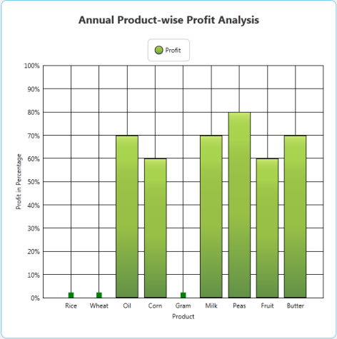

Set the EmptyPointValue property to Average, the default empty point value will be the average of nearest value on the adjacent side.

The following code illustrates this: 





<syncfusion:ChartSeries Name="series1" EmptyPointValue="Average"  EmptyPointStyle="Symbol" ShowEmptyPoints="True" EmptyPointSymbolTemplate="{StaticResource EmptyTemp}"

 Stroke="Black"  StrokeThickness="1"/>





series1.EmptyPointValue = EmptyPointValue.Average;




## Applying Different Colors to Chart Series Segments

Essential Chart allows setting different colors to each data point in a chart series by using built-in color palettes and custom palettes.

* Using the ColorEach property, the segments of a chart series can be applied with various colors.
* Chart series segments are allowed to be set with unique colors without specifying an interior color for individual segments of chart series.

### Use Case Scenarios

With the help of this feature, users can differentiate huge numbers of data points with different colors through which chart segments can be easily identified. 

Tables for Properties, Methods, and Events

### Properties 

<table>
<tr>
<th>
Property</th><th>
Description</th><th>
Type</th><th>
Data Type</th></tr>
<tr>
<td>
 ColorEach</td><td>
Specifies whether each data point of a series is shown in a different color.</td><td>
 Dependency</td><td>
Bool </td></tr>
<tr>
<td>
Palette</td><td>
To set the color palette for chart series segments.</td><td>
Dependency</td><td>
ChartColorPalette</td></tr>
<tr>
<td>
CustomPalette</td><td>
To set the custom color palette for chart series segments.</td><td>
Dependency</td><td>
Brush[]</td></tr>
</table>

### Sample Link

To access the chart series multi-color segments demo:

1. Open the Syncfusion Dashboard.

2. Select User Interface.

3. Click the WPF drop-down list and select Explore Samples.

4. Browse to the path Chart.WPF\Samples\3.5\WindowsSamples\Chart Series\Series Multi-Color Segments Demo.

Adding Colorful Chart Series Segments to an Application

### Built-in Palette




   <syncfusion:ChartSeries DataSource="{Binding ProductModel}"            ColorEach="True" Palette="Gradient"                      BindingPathX="Months" BindingPathsY="Sales">     </syncfusion:ChartSeries>



     this.Series1.ColorEach = true;     this.Series1.Palette = ChartColorPalette.Gradient;




### Custom Palette




<syncfusion:ChartSeries DataSource="{Binding ProductModel}"ColorEach="True" Palette="Custom" BindingPathX="Months" BindingPathsY="Sales">    <syncfusion:ChartStyleModel.CustomPalette>        <x:Array Type='Brush'>            <SolidColorBrush Color='Violet"></SolidColorBrush><SolidColorBrush Color='Indigo'></SolidColorBrush><SolidColorBrush Color='Blue'></SolidColorBrush><SolidColorBrush Color='Green'></SolidColorBrush><SolidColorBrush Color='Yellow'></SolidColorBrush><SolidColorBrush Color='Orange'></SolidColorBrush><SolidColorBrush Color='Red'></SolidColorBrush>        </x:Array>    </syncfusion:ChartStyleModel.CustomPalette></syncfusion:ChartSeries>



this.Series1.ColorEach = true;this.Series1.Palette = ChartColorPalette.Custom;this.Series1.CustomPalette = new Brush[]{Brushes.Violet,Brushes.Indigo,Brushes.Blue,Brushes.Green,Brushes.Yellow,Brushes.Orange,Brushes.Red};





## Highlighting Series

Chart for WPF lets you to "highlight" all the data points in a series when you move the mouse over any one of the data points in the series, or over the legend items corresponding to a Chart Series. This is achieved by binding the ChartSeries.Interior to the ChartSeries.Highlighted dependency property, such that all the data point segments in the series will get "highlighted" when this property changes.

The following code example illustrates this.





<!--Include this in the Window's Resources section.-->

<local:HighlightedToOpacityConverter x:Key="myOpcConverter"/>

<sfchart:ChartSeries Name="series1" Label="Series 1" Type="Column" DataSource="{StaticResource SeriesData1}" BindingPathX="Date" BindingPathsY="Y1">

    <sfchart:ChartSeries.Interior>

        <!--Increasing the Opacity of the Interior when this series is highlighted.-->

        <LinearGradientBrush EndPoint="0,0.5" StartPoint="1,0.5" Opacity="{Binding ElementName=series1, Path=Highlighted,

        Converter={StaticResource myOpcConverter}}">

            <GradientStop Color="#FF434865" Offset="0"/>

            <GradientStop Color="#FF7598BF" Offset="0.947"/>

            <GradientStop Color="#FF496B82" Offset="0.75"/>

            <GradientStop Color="#FF8DA4C7" Offset="0.365"/>

        </LinearGradientBrush>

    </sfchart:ChartSeries.Interior>

</sfchart:ChartSeries>





public class HighlightedToOpacityConverter : IValueConverter

{

    #region IValueConverter Members

    public object Convert(object value, Type targetType, object parameter, System.Globalization.CultureInfo culture)

    {

        bool highlighted = (bool)value;

        if (highlighted)

            return 1;

        else

            return 0.65;

    }

    public object ConvertBack(object value, Type targetType, object parameter, System.Globalization.CultureInfo culture)

    {

        throw new NotImplementedException();

    }

    #endregion

}





A sample which demonstrates Series highlighting feature is available in the following sample installation path.

_..My Documents\Syncfusion\EssentialStudio\<Version Number>\WPF\Chart.WPF\Samples\3.5\WindowsSamples\Chart Series\Series Highlight Demo_

## Highlighting Data Points

Chart for WPF lets you highlight a single data point segment when you move the mouse pointer over the data point segment. The ChartSegment.Highlighted dependency property is used for this purpose. This property is set to _true_ when you move the mouse pointer over a data point segment. Also, you can create custom templates that utilize this dependency property to change the interior of the data point segment when the mouse pointer is moved it.

The following code example illustrates this.


<!--Include this in the Window's Resources section.-->

<!--Define the interior that will be used as the "highlight" color.-->

<LinearGradientBrush x:Key="MouseHoverInterior" StartPoint="0,0.5" EndPoint="1,0.5">

    <GradientStop Color="#FFFDAE41" Offset="0"/>

    <GradientStop Color="#FFFDC55C" Offset="0.860442"/>

    <GradientStop Color="#FFFDDD77" Offset="0.989014"/>

    <GradientStop Color="#FFFDDD77" Offset="1"/>

</LinearGradientBrush>

<!--Chart Series Data-->

<XmlDataProvider x:Key="myXmlData">

    <x:XData>

        <Products xmlns="">

            <Product Sales="20" Projected="30" Month="1"/>

            <Product Sales="12" Projected="28" Month="2"/>

            <Product Sales="15" Projected="29" Month="3"/>

            <Product Sales="28" Projected="33" Month="4"/>

            <Product Sales="24" Projected="30" Month="5"/>

        </Products>

    </x:XData>

</XmlDataProvider>

<!--Custom column template where the interior color of the data point segment is changed when the mouse pointer is over it. (ChartSegment.Highlighted property change)-->

<DataTemplate x:Key="ColumnTemplate">

    <Canvas>

        <Grid Canvas.Left="{Binding X}" Canvas.Top="{Binding Y}" Width="{Binding Width}" Height="{Binding Height}">

            <Border Name="ColumnRect" VerticalAlignment="Bottom" Width="{Binding Width}" Height="{Binding Height}"

                           >

                <Border.Style>

                    

                </Border.Style>

            </Border>

        </Grid>

    </Canvas>

</DataTemplate>

<!--Refer to the preceding template while defining a Chart Series.-->

<sfchart:ChartSeries Name="series1"  Template="{StaticResource ColumnTemplate}" Type="Column"

DataSource="{Binding Source={StaticResource myXmlData}, XPath=Products/Product}" BindingPathX="Month" BindingPathsY="Sales"

Stroke="Black" StrokeThickness="1.5" />



A sample which demonstrates Data Point highlighting feature is available in the following sample installation path.

_..My Documents\Syncfusion\EssentialStudio\<Version Number>\WPF\Chart.WPF\Samples\3.5\WindowsSamples\Chart Series\Data Point Highlight Demo_

## Selecting Points

Chart for WPF lets you implement list box-like selection of data point segments in your chart. The following steps illustrate this.

1. Bind the Chart to a CollectionViewSource

   Wrap your data in a CollectionViewSource and bind this to a Chart Series.

   ~~~ xaml

				<!--Create a CollectionViewSource.-->

				<local:MyDataCollection x:Key="SeriesData1"/>

				<CollectionViewSource x:Key="cvs" Source="{StaticResource SeriesData1}"  />

				<!--Bind this to a Chart Series.-->

				<sfchart:ChartSeries DataSource="{Binding Source={StaticResource cvs}}" Template="{StaticResource SeriesTemplate}" Type="Column" BindingPathX="Date" BindingPathsY="Y2" />
   ~~~
   
   The CollectionViewSource has a CurrentItem property which tracks the "selected item". The Chart control listens to this property change and updates the corresponding data point's ChartSegment.IsSelected property appropriately.

2. Create a Custom Template

   Create a custom template that renders a data-point segment with a "selected" look and feel, when the ChartSegment.IsSelected property changes to _true_.

   ~~~ xaml

				<!-- This template helps in 2 ways. 1) It enables to bind to IsSelected property to change the selected segment color. 2) It enables to listen to Canvas.MouseDown event to change selection.-->

				<DataTemplate x:Key="SeriesTemplate">

					<!--Change the CollectionView.CurrentItem in the handler.-->

					<Canvas MouseDown="Canvas_MouseDown">

						<Grid Canvas.Left="{Binding X}" Canvas.Top="{Binding Y}" Width="{Binding Width}" Height="{Binding Height}">

							<Border Name="ColumnRect" VerticalAlignment="Bottom" Width="{Binding Width}" Height="{Binding Height}">

								<Border.Style>

									

								</Border.Style>

							</Border>

						</Grid>

					</Canvas>

				</DataTemplate>

				<!--Defines the interior that will be used as the "highlight" color.-->

				<LinearGradientBrush x:Key="MouseHoverInterior" StartPoint="0,0.5" EndPoint="1,0.5">

					<GradientStop Color="#FFFDAE41" Offset="0"/>

					<GradientStop Color="#FFFDC55C" Offset="0.860442"/>

					<GradientStop Color="#FFFDDD77" Offset="0.989014"/>

					<GradientStop Color="#FFFDDD77" Offset="1"/>

				</LinearGradientBrush>
   ~~~
   
   This will cause the CollectionView.CurrentItem to be rendered distinctly. Note that the CurrentItem can be changed by a different Control bound to the same CollectionView, and this change will be automatically reflected in the Chart.

3. Change CollectionView.CurrentItem 

   Change it when any Mouse Button is pressed while the Mouse Pointer is moved over a Data Point Segment.

   To change the CurrentItem when any mouse button is pressed while the mouse pointer is moved over a data point segment, listen to the MouseDown event of the top-level Canvas in the template, as illustrated in the following code.

   ~~~ csharp

				private void Canvas_MouseDown(object sender, MouseButtonEventArgs e)

				{

					// Get the corresponding Chart Segment.

					ChartSegment seg = ((ChartSeriesPresenter.ChartSegmentPresenter)(((Canvas)sender).TemplatedParent)).Segment;

					// Get the corresponding bound CollectionView.

					CollectionView cv = seg.Series.DataSource as CollectionView;

					// Set the CurrentItem in the CollectionView.

					cv.MoveCurrentToPosition(seg.CorrespondingPoints[0].Index);

				}

   ~~~

   

   
A sample which demonstrates Data Point highlighting feature is available in the following sample installation path.

_..My Documents\Syncfusion\EssentialStudio\<Version Number>\WPF\Chart.WPF\Samples\3.5\WindowsSamples\Chart Series\Selectable Data Points Demo_

## Side-By-Side Series

Series can be placed side by side or overlapped by using the ChartArea.SideBySideSeriesPlacement property. This is especially used when multiple HiLo type series are used in the Chart. HiLo type series that get stacked and plotted can be separated and placed side by side by using this property.




<syncfusion:ChartArea SideBySideSeriesPlacement="True">

<syncfusion:ChartSeries Type="HiLo" />

</syncfusion:ChartArea>




area.SideBySideSeriesPlacement = true;




The following screenshot illustrates Chart Series placed side by side.

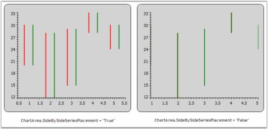

## AutoDiscard Property

AutoDiscard can be used to set range for primary axis in a chart. This property belongs to ChartSeries class. It can be set to three enumerations namely:

* None-The user can provide custom range values for primary axis, when the AutoDiscard property is set to _None_.
* ExtendRange-The range values will be automatically extended based on the difference between the start and end range values, when the AutoDiscard property is set to _ExtendRange_.
* ResetRange-The range values will be reset based on the interval, when set to ResetRange,

N> The AutosetRange property of the primary axis needs to be set to False, when the AutoDiscard property is set to ExtendRange or ResetRange.

The following code example illustrates the usage of the AutoDiscard property, when set to various enumerations.


<syncfusion:ChartArea.PrimaryAxis>

                    <syncfusion:ChartAxis Header="Time" LabelForeground="LightGray" ValueType="Double"	  IsAutoSetRange="False"/>         </syncfusion:ChartArea.PrimaryAxis>

<syncfusion:ChartSeries Label="Measurement 1" Type="FastLine" Interior="Orange" AutoDiscard="None" Range="0,10"/>

or

<syncfusion:ChartSeries Label="Measurement 1" Type="FastLine" Interior="Orange" AutoDiscard="ExtendRange" />

or

<syncfusion:ChartSeries Label="Measurement 1" Type="FastLine" Interior="Orange" AutoDiscard="ResetRange" />


## Controlling the Visibility of Chart Legend Items

Essential Chart WPF now provides support to toggle the visibility of the Chart Legend Items. This is achieved by using the VisibilityOnLegend property.

<table>
<tr>
<th>
Property</th><th>
Description</th></tr>
<tr>
<td>
VisibilityOnLegend</td><td>
Sets the visibility of Legend Items. It includes the following options.Visible-Items in the Legend will be Visible.Hidden-Items in the Legend will be Hidden.Collapsed-Items in the Legend will be Collapsed.</td></tr>
</table>

The following code example illustrates how to set this property.




<syncfusion:ChartSeries Name="SeriesB" Type="Bar" VisibilityOnLegend="Hidden" BindingPathX="FruitName"

BindingPathsY="FruitID,NumberOfFruits,Price,Year" Label="Series B" Stroke="#FF000000" StrokeThickness="0.5" >

</syncfusion:ChartSeries>





Chart1.Areas[0].Series[0].VisibilityOnLegend = Visibility.Hidden;





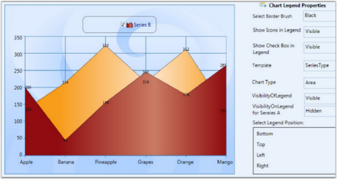

### Methods

The LegendItemSource method associated with this feature can also be used to control the visibility of the Legend Items. The following code example illustrates how to use this method.



public void LegendItemSource(ChartSeries chartSeries)

{

    ChartSeriesCollection collection = new ChartSeriesCollection();

    foreach (ChartSeries item in chartSeries.Area.Series)

    {

        if (item.IsVisibleOnLegend == true && item.VisibilityOnLegend != Visibility.Collapsed)

        {

            collection.Add(item);

        }

    }

    Legend.ItemsSource = collection;

}


### Events

The OnVisibilityOnLegend event is triggered when the value of the VisibilityOnLegend property is changed. The following code example illustrates how to handle this event.


public static readonly DependencyProperty VisibilityOnLegendProperty =

DependencyProperty.Register("VisibilityOnLegend", typeof(Visibility), typeof(ChartSeries), new PropertyMetadata(Visibility.Visible, new PropertyChangedCallback(OnVisibilityOnLegend)));

public Visibility VisibilityOnLegend

{

    get { return (Visibility)GetValue(VisibilityOnLegendProperty); }

    set { SetValue(VisibilityOnLegendProperty, value); }

}

private static void OnVisibilityOnLegend(DependencyObject d, DependencyPropertyChangedEventArgs args)

{

    ChartSeries type = (ChartSeries)d;

    type.Area.LegendItemSource(type);

}


## Creating Predefined Shapes for Annotation Objects

Predefined shapes for annotation objects are used to point at specific information about a point in the chart series. For example: Circle, Down arrow, and so on. The following table describes more about the annotation shapes:

### Property

<table>
<tr>
<th>
Name of the Property</th><th>
Description</th><th>
Values it accepts</th></tr>
<tr>
<td>
AnnotationShape</td><td>
Dependency Property</td><td>
Enum of type AnnotationShapes</td></tr>
<tr>
<td>
Fill</td><td>
Dependency Property</td><td>
Colors from Brushes</td></tr>
</table>

N> The AnnotationShape property helps create the required shape for the annotation and the Fill property helps fill the shape selected with required color.

The following code example illustrates creation of a circle with orange fill at points 5 on X series and point 45 on Y series in a Chart.





<syncfusion:ChartSeries DataSource="{Binding Source={StaticResource myXmlData}, XPath=Products/Product}" BindingPathX="Month" BindingPathsY="Sales" IsIndexed="False" Name="series1" Label="Series1" Type="Area" Interior="{StaticResource SeriesAInterior}">

    <syncfusion:ChartSeries.Annotations>

        <syncfusion:AnnotationsCollection >

            <syncfusion:ChartSeriesAnnotation x:Name="serAnnot" X="5" Y="45" OffsetX="0" OffsetY="0" AnnotationShape="Circle"

            Fill="Orange" Stroke="Black" />

        </syncfusion:AnnotationsCollection>

    </syncfusion:ChartSeries.Annotations>

</syncfusion:ChartSeries>





Chart1.Areas[0].Series[0].Annotations.Items[0].AnnotationShape = AnnotationShapes.Circle;

Chart1.Areas[0].Series[0].Annotations.Items[0].X = 5;

Chart1.Areas[0].Series[0].Annotations.Items[0].Y = 45;

Chart1.Areas[0].Series[0].Annotations.Items[0].OffsetX = 0;

Chart1.Areas[0].Series[0].Annotations.Items[0].OffsetY = 0;

Chart1.Areas[0].Series[0].Annotations.Items[0].Fill = Brushes.Orange;

Chart1.Areas[0].Series[0].Annotations.Items[0].Stroke = Brushes.Black;




Run the sample. The following output is provided.

## Empty point support for FastLine Chart type

Essential chart WPF is now supports Empty point for Fast Line Chart type.

The data collection that is passed to the chart may have NaN values, this is an empty points.

If data points bounded with chart does not give any value then chart renders empty points in chart series.

This feature is useful when you are not able to get exact value for a particular data.

e.g.  In population analysis if you do not get the result for previous years then we can use Empty data value.

### Adding Empty Point

Add Empty Point to the Chart, by using the following code.

Set ShowEmptyPoints to True to enable Empty Point.




  <syncfusion:ChartSeries Name="series1" ShowEmptyPoints="True" 

Type="FastLine" Interior="Red" Stroke="Black" DataSource="{Binding}"/>





 

Series1.ShowEmptyPoints = true;




## Customization support for FastChart types

This enables the users to customize the Fast chat types like FastScatter, FastColumn, FastStackingColumn, and FastHiLoOpenClose.  Using this feature, users can customize the Stroke, Stroke thickness, and interior of each chart segment of the series.

### Adding Customization Support

Add customization support for FastChart types, by using the following code.



 

  <syncfusion:ChartSeries Name="series1" Type="FastStackingColumn" 

FastSegmentProperties="{Binding Converter={StaticResource interiorConverter} }" 

Stroke="Black" DataSource="{Binding}"/>





FastSegmnetPropertiesCollection list = new FastSegmnetPropertiesCollection();

  FastSegmnetProperties segmentProperty = new FastSegmnetProperties { Stroke=Brushes.Black,

StrokeThickness=1, Interior = brush };

list.Add(segmentProperty);

series1.FastSegmentProperties= list;





## Smart Labels Support

Essential Chart ships with the enhancement of smart labels support to avoid the overlapping of adornment labels using the enum property AdornmentIntersectAction. The following actions can be taken when labels overlap:

* Hide
* AdjustAroundPoints
* None

### Advantage of Using Smart Labels

1. Avoids the overlap of segment labels.
2. To view the label clearly and place the labels around the data points.
3. Additional connector lines are shown between a label and its corresponding chart point.

### Properties

<table>
<tr>
<th>
Property</th><th>
Description</th><th>
Type</th><th>
Data Type</th></tr>
<tr>
<td>
ShowSmartLabels </td><td>
Sets the smart labels for the series.</td><td>
Dependency Property</td><td>
Boolean</td></tr>
<tr>
<td>
AdornmentIntersectAction</td><td>
Sets the intersect action for the adornments.</td><td>
Dependency Property</td><td>
Enum</td></tr>
</table>

### Sample Link

1. Open the WPF sample browser.
2. Select the Chart control from the sample browser.
3. Chart > Smart Labels > Smart Label Demo.

### Adding Smart Labels Support to an Application

The following code examples are used to add smart labels to the chart series.





<sync:ChartSeries x:Name="series2"                                  AdornmentIntersectAction="AdjustAcrossPoints" 

ShowSmartLabels="True"                                >

       <sync:ChartSeries.AdornmentsInfo>

            <sync:ChartAdornmentInfo x:Name="adorn" Visible="True" Symbol="Square" SymbolHeight="20" SymbolWidth="20"                                                SymbolInterior="LightBlue" />

       </sync:ChartSeries.AdornmentsInfo>

</sync:ChartSeries>





series.ShowSmartLabels = true;

            series.AdornmentIntersectAction = AdornemntIntersectActions.AdjustAcrossPoints;





The following code examples are used to add smart labels to the chart series with intersect action set to Hide.




<sync:ChartSeries x:Name="series2"                                  AdornmentIntersectAction="Hide" 

ShowSmartLabels="True"                                >

       <sync:ChartSeries.AdornmentsInfo>

            <sync:ChartAdornmentInfo x:Name="adorn" Visible="True" Symbol="Square" SymbolHeight="20" SymbolWidth="20"                                                SymbolInterior="LightBlue" />

       </sync:ChartSeries.AdornmentsInfo>

</sync:ChartSeries>





series.ShowSmartLabels = true;

            series.AdornmentIntersectAction = 

AdornemntIntersectActions.AdjustAcrossPoints;





The following code examples are used to add smart labels to the chart series with intersect action set to Hide.





<sync:ChartSeries x:Name="series2"                                  AdornmentIntersectAction="None" 

ShowSmartLabels="True"                                >

       <sync:ChartSeries.AdornmentsInfo>

            <sync:ChartAdornmentInfo x:Name="adorn" Visible="True" Symbol="Square" SymbolHeight="20" SymbolWidth="20"                                                SymbolInterior="LightBlue" />

       </sync:ChartSeries.AdornmentsInfo>

</sync:ChartSeries>





series.ShowSmartLabels = true;

            series.AdornmentIntersectAction = 

AdornemntIntersectActions.None; 





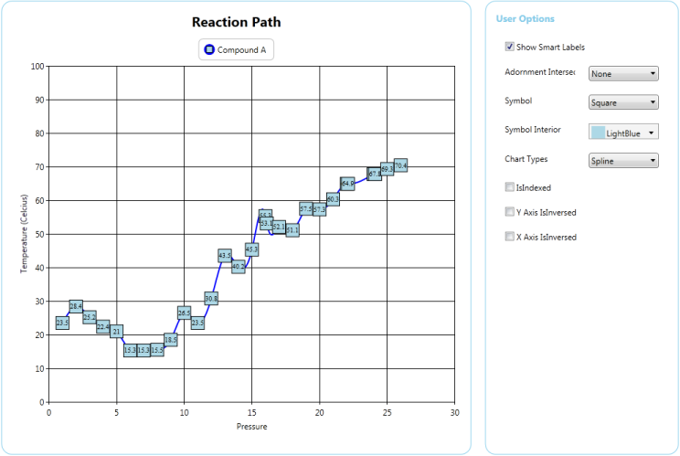

## Technical Indicators

### Overview

Technical Indicators are used to predict future price levels by analyzing a set of recorded data. They are used to improve the data analysis capabilities of a chart with regard to information on pricing, volume, and other metrics used in business calculations.

Essential Chart supports the following Technical Indicators:

* Accumulation Distribution
* Average True Range
* Bollinger Band
* Exponential Moving Average
* Simple Average
* Triangular Average
* MACD
* Momentum
* Stochastic
* RSI

A technical indicator is a graphic representation of price action. Some technical indicators overlay on the trading chart, and some reside on the bottom of the chart.

### Accumulation Distribution

Accumulation Distribution Indicator is a volume indicator which was essentially designed to measure underlying supply and demand. It accomplishes this by trying to determine whether traders are actually accumulating (buying) or distributing (selling).

<table>
<tr>
<th>
Property</th><th>
Description</th></tr>
<tr>
<td>
SignalLineColor</td><td>
Specifies the color for the signal line of the Accumulation Distribution technical indicator.</td></tr>
</table>



<sync:ChartSeries.Indicators>

<sync:IndicatorCollection>

<sync:IndicatorCollection.Items>

<sync:ChartTechnicalIndicator IndicatorType="AccumulationDistribution"          sync:ChartAccumulationDistribution.SignalLineColor="Red">

</sync:ChartTechnicalIndicator>

</sync:IndicatorCollection.Items>

</sync:IndicatorCollection>

</sync:ChartSeries.Indicators>


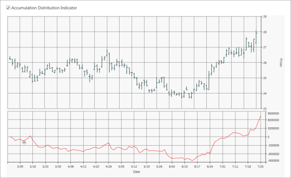

### Average True Range

Average True Range (ATR) Indicator is a technical analysis volatility indicator. The indicator does not provide an indication of price trend, simply the degree of price volatility. The average true range is an N-day exponential moving average of the true range values.


<sync:ChartSeries.Indicators>

<sync:IndicatorCollection>

<sync:IndicatorCollection.Items>

<sync:ChartTechnicalIndicator IndicatorType="AverageTrueRange" >

</sync:IndicatorCollection.Items>

</sync:IndicatorCollection>

</sync:ChartSeries.Indicators>


### Bollinger Band

Bollinger Bands consist of a band of three lines which are plotted in relation to security prices. The line in the middle is usually a Simple Moving Average (SMA) set to a period of 20 days (The type of trend line and period can be changed by the trader; however a 20 day moving average is by far the most popular). The SMA then serves as a base for the Upper and Lower Bands. The Upper and Lower Bands are used as a way to measure volatility by observing the relationship between the Bands and price. Typically the Upper and Lower Bands are set to two standard deviations away from the SMA (The Middle Line); however the number of standard deviations can also be adjusted by the trader.

Bollinger Band Properties

<table>
<tr>
<th>
Property</th><th>
Description</th></tr>
<tr>
<td>
SignalLineColor</td><td>
Specifies the color for the signal line of the Bollinger Band technical indicator.</td></tr>
<tr>
<td>
UpperLineColor</td><td>
Specifies the color for the upper line of the Bollinger Band technical indicator.</td></tr>
<tr>
<td>
LowerLineColor</td><td>
Specifies the color for the lower line of the Bollinger Band technical indicator.</td></tr>
<tr>
<td>
BollingerMovingAverage</td><td>
Indicates the identification of a trend.</td></tr>
</table>



<sync:ChartSeries.Indicators>

<sync:IndicatorCollection>

<sync:IndicatorCollection.Items>

<sync:ChartTechnicalIndicator IndicatorType="BollingerBands"  sync:ChartBollingerBand.LowerLineColor ="Blue" sync:ChartBollingerBand.UpperLineColor="Red" sync:ChartBollingerBand.SignalLineColor ="Green" sync:ChartBollingerBand.BollingerMovingAverage="50" >

</sync:ChartTechnicalIndicator>

</sync:IndicatorCollection.Items>

</sync:IndicatorCollection>

</sync:ChartSeries.Indicators>



### Exponential Moving Average

The exponential moving average (EMA) is a weighted average of a price data which put a higher weight on recent data point.

<table>
<tr>
<th>
Property</th><th>
Description</th></tr>
<tr>
<td>
SignalLineInterior</td><td>
Specifies the color for the signal line of the Exponential Moving Average technical indicator. </td></tr>
<tr>
<td>
ExponentialMovingAverage</td><td>
Indicates the identification of a trend.</td></tr>
</table>



<sync:ChartSeries.Indicators>

<sync:IndicatorCollection>

<sync:IndicatorCollection.Items>

<sync:ChartTechnicalIndicator IndicatorType="ExponentialAverage" sync:ChartExponentialAverage.ExponentialAverage="50" sync:ChartExponentialAverage.SignalLineInterior="Red" >

</sync:ChartTechnicalIndicator>

</sync:IndicatorCollection.Items>

</sync:IndicatorCollection>

</sync:ChartSeries.Indicators>


### Simple Average

The simple moving average is an arithmetic mean of price data. It is calculated by summing up each interval's price and dividing the sum by the number of intervals covered by the moving average. For instance, adding the closing prices of an instrument for the most recent 25 days, and then dividing it by 25 will get you the 25 day moving average.

<table>
<tr>
<th>
Property</th><th>
Description</th></tr>
<tr>
<td>
SignalLineInterior</td><td>
Specifies the color for the signal line of the Simple Average technical indicator.</td></tr>
<tr>
<td>
MovingAverage</td><td>
Indicates the identification of a trend.</td></tr>
</table>



<sync:ChartSeries.Indicators>

<sync:IndicatorCollection>

<sync:IndicatorCollection.Items>

<sync:ChartTechnicalIndicator IndicatorType="TriangularAverage" sync:ChartSimpleAverage.MovingAverage="20" sync:ChartSimpleAverage.SignalLineInterior="Red" />      

</sync:IndicatorCollection.Items>

</sync:IndicatorCollection>

</sync:ChartSeries.Indicators>



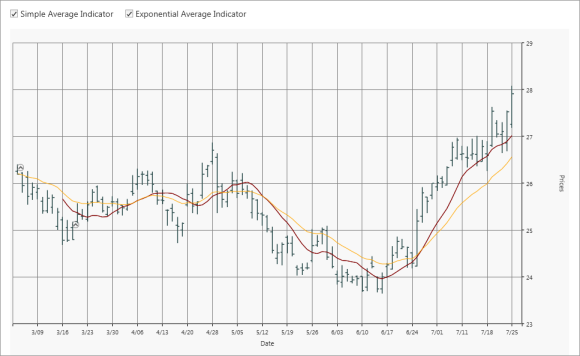

### Triangular Average

The Moving Average Triangular indicator measures a simple arithmetic average of prices, specified by the input Price and creates a simple arithmetic average of this average. The length of every of these averages is one more than half the value specified in the input Length, rounded to a whole number. This uses all the price data from the latest number of bars specified by the input Length, but with the smoothing effect of so-called averaging the average.

<table>
<tr>
<th>
Property</th><th>
Description</th></tr>
<tr>
<td>
SignalLineInterior</td><td>
Specifies the color for the signal line of the Triangular Average technical indicator.</td></tr>
<tr>
<td>
TriangularMovingAverage</td><td>
Indicates the identification of a trend.</td></tr>
</table>



<sync:ChartSeries.Indicators>

<sync:IndicatorCollection>

<sync:IndicatorCollection.Items>

<sync:ChartTechnicalIndicator IndicatorType="TriangularAverage"

sync:ChartTriangularAverage.TriangularAverage="20"

sync:ChartTriangularAverage.SignalLineInterior="Red" />      

</sync:IndicatorCollection.Items>

</sync:IndicatorCollection>

</sync:ChartSeries.Indicators>


### MACD

MACD is an extremely popular indicator used in technical analysis. MACD can be used to identify aspects of a security's overall trend. Most notably these aspects are momentum, as well as trend direction and duration.

<table>
<tr>
<th>
Property</th><th>
Description</th></tr>
<tr>
<td>
SignalLineInterior</td><td>
Specifies the color for the signal line of the MACD technical indicator.</td></tr>
<tr>
<td>
ConvergenceLineColor</td><td>
Specifies the color for the convergence line of the MACD technical indicator.</td></tr>
<tr>
<td>
DivergenceLineColor</td><td>
Specifies the color for the divergence line of the MACD technical indicator.</td></tr>
</table>



<sync:ChartSeries.Indicators>

<sync:IndicatorCollection>

<sync:IndicatorCollection.Items>

<sync:ChartTechnicalIndicator IndicatorType="MACD" sync:ChartMACD.SignalLineInterior="Red" sync:ChartMACD.ConvergenceLineColor="Yellow"  sync:ChartMACD.DivergenceLineColor="Blue" />     

</sync:IndicatorCollection.Items>

</sync:IndicatorCollection>

</sync:ChartSeries.Indicators>


### Momentum

Momentum and rate of change (ROC) are simple technical analysis indicators showing the difference between today's closing price and the close N days ago.

<table>
<tr>
<th>
Property</th><th>
Description</th></tr>
<tr>
<td>
MomentumTimeSpan</td><td>
Measures the amount that a security's price has changed over a given time span.</td></tr>
</table>



<sync:ChartSeries.Indicators>

<sync:IndicatorCollection>

<sync:IndicatorCollection.Items>

<sync:ChartTechnicalIndicator IndicatorType="Momentum" sync:ChartMomentum.MomentumTimeSpan="10" />     

</sync:IndicatorCollection.Items>

</sync:IndicatorCollection>

</sync:ChartSeries.Indicators>



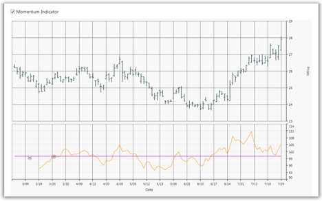

### Stochastic

The Stochastic Oscillator is a range bound momentum oscillator. The Stochastic indicator is designed to display the location of the close compared to the high or low range over a user-defined number of periods. Typically, the Stochastic Oscillator is used for three things: Identifying overbought and oversold levels, spotting divergences, and also identifying bull and bear set ups or signals.

<table>
<tr>
<th>
Property</th><th>
Description</th></tr>
<tr>
<td>
SignalLineColor</td><td>
Specifies the color for the signal line of the Stochastic technical indicator.</td></tr>
<tr>
<td>
UpperLineColor</td><td>
Specifies the color for the upper line of the Stochastic technical indicator.</td></tr>
<tr>
<td>
LowerLineColor</td><td>
Specifies the color for the lower line of the Stochastic technical indicator.</td></tr>
</table>



<sync:ChartSeries.Indicators>

<sync:IndicatorCollection>

<sync:IndicatorCollection.Items>

<sync:ChartTechnicalIndicator IndicatorType="Stochastics"  sync:ChartStochastics.LowerLineColor="Red" sync:ChartStochastics.SignalLineColor="Green" sync:ChartStochastics.UpperLineColor="Blue" />     

</sync:IndicatorCollection.Items>

</sync:IndicatorCollection>

</sync:ChartSeries.Indicators>



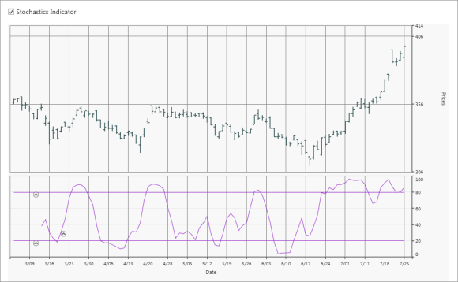

### RSI

The Relative Strength Index (RSI) is a well-versed momentum-based oscillator which is used to measure the speed (velocity) as well as the change (magnitude) of directional price movements. Essentially RSI, when graphed, provides a visual mean to monitor both the current, as well as historical, strength and weakness of a particular market.


<sync:ChartSeries.Indicators>

<sync:IndicatorCollection>

<sync:IndicatorCollection.Items>

<sync:ChartTechnicalIndicator IndicatorType="RelativeStrengthIndex" />     

</sync:IndicatorCollection.Items>

</sync:IndicatorCollection>

</sync:ChartSeries.Indicators>


