# Chart-Types in WPF Chart (Classic)

## Line Charts

### Line Chart

Line Charts join points on a plot using straight lines showing trends in data at equal intervals. Line charts treats the input as non-numeric, categorical information, equally spaced along the x-axis. This is appropriate for categorical data, such as text labels, but can produce unexpected results when the x values consist of numbers.

When rendered in 3D the plot looks like a ribbon and hence such types are also referred to as Ribbon or Strip Charts.

The appearance of the lines and the points can be configured with options such as the colors used, thickness of the lines and the symbols displayed. 

### Data Requirements

The following are the details about Line Chart:

<table>
<tr>
<th colspan = "2">
Details</th></tr>
<tr>
<td>
Number of y values per point</td><td>
one</td></tr>
<tr>
<td>
Number of points   </td><td>
one or more</td></tr>
<tr>
<td>
Number of series</td><td>
one or more</td></tr>
</table>

### Template

While setting template the following parameters can be used.

<table>
<tr>
<th>
Name</th><th>
Type</th><th>
Description</th></tr>
<tr>
<td>
X1</td><td>
double</td><td>
x-coordinate of first point</td></tr>
<tr>
<td>
Y1</td><td>
double</td><td>
y-coordinate of first point</td></tr>
<tr>
<td>
X2</td><td>
double</td><td>
x-coordinate of second point</td></tr>
<tr>
<td>
Y2</td><td>
double</td><td>
y-coordinate of second point</td></tr>
<tr>
<td>
Interior</td><td>
Brush</td><td>
column color</td></tr>
<tr>
<td>
Series</td><td>
ChartSeries</td><td>
reference to series-owner</td></tr>
</table>
A sample which demonstrates Line Chart Types is available in the following sample installation path.

_..My Documents\Syncfusion\EssentialStudio\<Version Number>\WPF\Chart.WPF\Samples\3.5\WindowsSamples\Chart Gallery\Line Chart Demo_

### Fast Line Chart

Use a Fast Line chart instead of a Line chart when displaying a large number of data points in the chart. This chart type improves performance by foregoing some features in the Line chart.

### Data Requirements

The following are the details about Fast Line Chart:

<table>
<tr>
<th colspan = "2">
Details</th></tr>
<tr>
<td>
Number of y values per point</td><td>
One</td></tr>
<tr>
<td>
Number of points   </td><td>
one or more</td></tr>
<tr>
<td>
Number of series</td><td>
one or more</td></tr>
</table>
Template

While setting template the following parameters can be used:

<table>
<tr>
<th>
Name</th><th>
Type</th><th>
Description</th></tr>
<tr>
<td>
X1</td><td>
Double</td><td>
x-coordinate of first point</td></tr>
<tr>
<td>
Y1</td><td>
Double</td><td>
y-coordinate of first point</td></tr>
<tr>
<td>
X2</td><td>
Double</td><td>
x-coordinate of second point</td></tr>
<tr>
<td>
Y2</td><td>
Double</td><td>
y-coordinate of second point</td></tr>
<tr>
<td>
Interior</td><td>
Brush</td><td>
column color</td></tr>
<tr>
<td>
Series</td><td>
ChartSeries</td><td>
reference to series-owner</td></tr>
</table>

A sample which demonstrates Line Chart Types is available in the following sample installation path.

_..My Documents\Syncfusion\EssentialStudio\<Version Number>\WPF\Chart.WPF\Samples\3.5\WindowsSamples\Chart Gallery\Line Chart Demo_

### Customization of FastLine 

Essential Chart enables you to customize the look and feel of the Fastline chart. 

Following types of lines are supported for FastLine chart:

* Dash line
* Dot line
* Dash-dot line
* Dash-dot-dot line

### Property

<table>
<tr>
<th>
Property </th><th>
Description </th><th>
Type </th><th>
Data Type </th><th>
Reference links </th></tr>
<tr>
<td>
Pen</td><td>
Gets and sets various types of pen for drawing fastchat type. </td><td>
Attached property for ChartFastSeriesPresenter </td><td>
System.Drawing.Pen </td><td>
{{ '[Pen Class](http://msdn.microsoft.com/en-us/library/system.drawing.pen.aspx)' | markdownify }}</td></tr>
</table>

### Customizing Fastline

To customize the FastLine chart, use the Pen property of ChartFastSeriesPresenter.

The following code illustrates this: 



<syncfusion:ChartSeries Name="series" Type="FastLine" IsIndexed="True"  Interior="LightBlue" >

                            <syncfusion:ChartFastSeriesPresenter.Pen>

                                <Pen Brush="Black" DashCap="Round" DashStyle="DashDot" StartLineCap="Round" EndLineCap="Round"/>

                            </syncfusion:ChartFastSeriesPresenter.Pen>

                        </syncfusion:ChartSeries>



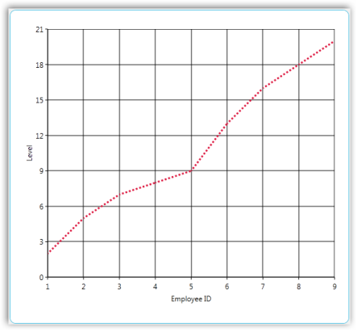

### Sample Link

To view a sample

1. Open the Syncfusion Dashboard.
2. Select User Interface.
3. Click the WPF drop-down list and select Explore Samples.
4. Navigate to _Chart.WPF\Samples\3.5\WindowsSamples\Chart Customization\ FastLine Customization Demo\_

### FastSpline Chart Series

FastSpline is used to render a large number of data points as a smooth line in a fast manner and helps in improving the performance of the chart. Its view is similar to the Line chart, but plots a fitted curve through each data point in series. FastSpline draws a smooth flowing line through all data points in the data set.

The appearance of the FastSpline can be configured with options such as interior, thickness of the Lines

### Chart Type Characteristic

The following table lists the main characteristic of the FastSpline chart.

<table>
<tr>
<th colspan = "2">
Details</th></tr>
<tr>
<td>
Number of Y values per point </td><td>
One.</td></tr>
<tr>
<td>
Number of Series          </td><td>
One or more.</td></tr>
<tr>
<td>
Cannot be Combined with    </td><td>
Pie, Bar, Stacked Bar, Polar, Radar.</td></tr>
</table>
The following screenshot depicts a FastSpline chart:

### Use Case Scenarios

FastSpline chart is useful in the following fields where high volume data is used.

* Marketing
* Scientific Research
* Economics

### Properties

<table>
<tr>
<th>
Property</th><th>
Description</th></tr>
<tr>
<td>
Geometry</td><td>
Draws the spline when set to paths {{ '_Data_' | markdownify }} property.</td></tr>
</table>

### Template for FastSpline

The following code example illustrates the template for the FastSpline chart:



<DataTemplate x:key="{x:Type local:ChartFastSplineSegment}">

<Grid> 

   <Path Stroke="{Binding Interior}" StrokeThickness="{Binding    StrokeThickness}" Data="{Binding Geometry}" ToolTip="{Binding ToolTip}"/>

<local:FastSplinePresenter Points="{Binding Points}" Series="{Binding Series}" ToolTip="{Binding ToolTip}">

</Grid>

</DataTemplate>


### Adding FastSpline Chart to an Application 

To add FastSpline chart to an application do the following:

1. Create a new WPF application in VS2012.
2. Create a chart sample with ChartArea and ChartAxis.
3. To get the FastSpline chart, specify the Type property in ChartSeries as “FastSpline”.

### Code Example

The following code example illustrates the usage of FastSpline charts.


<sfchart:Chart>

   <sfchart:ChartArea Background="LightGray" GridBackground="White">

     <sfchart:ChartSeries Template="{StaticResource Template1}"        DataSource="{Binding Source={StaticResource myXmlData},XPath=Products/Product}" BindingPathX="Month" BindingPathsY="Sales" Interior="Red"  Type="FastSpline"/>

   </sfchart:ChartArea>    

</sfchart:Chart>


### Spline Chart

Spline Chart is similar to a Line Chart except that it connects the different data points using splines instead of straight lines.

When rendered in 3D the plot looks like a ribbon and hence such types are also referred to as Ribbon or Strip Charts.

The appearance of the lines and the points can be configured with options such as the colors used, thickness of the lines and the symbols displayed. 

### Data Requirements

The following are the details about Spline Chart:

<table>
<tr>
<th colspan = "2">
Details</th></tr>
<tr>
<td>
Number of y values per point</td><td>
one</td></tr>
<tr>
<td>
Number of points</td><td>
one or more</td></tr>
<tr>
<td>
Number of series</td><td>
one or more</td></tr>
</table>

### Spline Settings

<table>
<tr>
<th>
Name</th><th>
Type</th><th>
Container</th><th>
Description</th></tr>
<tr>
<td>
ChartSplineType.SplineCoefficient</td><td>
double</td><td>
ChartSeries</td><td>
attached property which lets you control the spline curvature</td></tr>
</table>

### Template

While setting template the following parameters can be used.

<table>
<tr>
<th>
Name</th><th>
Type</th><th>
Description</th></tr>
<tr>
<td>
X1</td><td>
double</td><td>
x-coordinate of first point</td></tr>
<tr>
<td>
Y1</td><td>
double</td><td>
y-coordinate of first point</td></tr>
<tr>
<td>
X2</td><td>
double</td><td>
x-coordinate of second point</td></tr>
<tr>
<td>
Y2</td><td>
double</td><td>
y-coordinate of second point</td></tr>
<tr>
<td>
Geometry</td><td>
Geometry</td><td>
segment geometry</td></tr>
<tr>
<td>
Interior</td><td>
Brush</td><td>
column color</td></tr>
<tr>
<td>
Series</td><td>
ChartSeries</td><td>
reference to series-owner</td></tr>
</table>
A sample which demonstrates Line Chart Types is available in the following sample installation path.

_..My Documents\Syncfusion\EssentialStudio\<Version Number>\WPF\Chart.WPF\Samples\3.5\WindowsSamples\Chart Gallery\Line Chart Demo_

### Rotated Spline Chart

A Rotated Spline Chart is similar to a Spline Chart. The only difference is that it would be rotated. It plots one or several series of data and joins each series by smooth, rotated spline curves instead of straight lines.

The following image shows a sample Rotated Spline Chart.

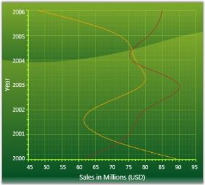

### Data Requirements

The following are the details about Rotated Spline Chart:

<table>
<tr>
<th colspan = "2">
Details</th></tr>
<tr>
<td>
Number of y values per point</td><td>
one</td></tr>
<tr>
<td>
Number of points</td><td>
one or more</td></tr>
<tr>
<td>
Number of series</td><td>
one or more</td></tr>
</table>
Rotated Spline Settings

<table>
<tr>
<th>
Name</th><th>
Type</th><th>
Container</th><th>
Description</th></tr>
<tr>
<td>
ChartSplineType.SplineCoefficient</td><td>
double</td><td>
ChartSeries</td><td>
attached property which lets you control the spline curvature</td></tr>
</table>
A sample which demonstrates Line Chart Types is available in the following sample installation path.

_..My Documents\Syncfusion\EssentialStudio\<Version Number>\WPF\Chart.WPF\Samples\3.5\WindowsSamples\Chart Gallery\Line Chart Demo_

### Step Line Chart

Step Line Charts use horizontal and vertical lines to connect data points resulting in a step like progression.

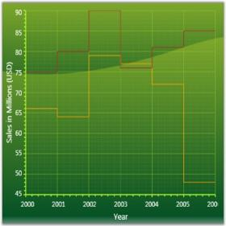

### Data Requirements

The following are the details about Step Line Chart:

<table>
<tr>
<th colspan = "2">
Details</th></tr>
<tr>
<td>
Number of y values per point</td><td>
one</td></tr>
<tr>
<td>
Number of points</td><td>
one or more</td></tr>
<tr>
<td>
Number of series</td><td>
one or more</td></tr>
</table>

### Template

While setting template the following parameters can be used:

<table>
<tr>
<th>
Name</th><th>
Type</th><th>
Description</th></tr>
<tr>
<td>
X1</td><td>
double</td><td>
x-coordinate of first point</td></tr>
<tr>
<td>
Y1</td><td>
double</td><td>
y-coordinate of first point</td></tr>
<tr>
<td>
X2</td><td>
double</td><td>
x-coordinate of second point</td></tr>
<tr>
<td>
Y2</td><td>
double</td><td>
y-coordinate of second point</td></tr>
<tr>
<td>
StepX</td><td>
double</td><td>
x-coordinate of transient point</td></tr>
<tr>
<td>
StepY</td><td>
double</td><td>
y-coordinate of transient point</td></tr>
<tr>
<td>
Points</td><td>
PointCollection</td><td>
collection of  segment points</td></tr>
<tr>
<td>
Interior</td><td>
Brush</td><td>
column color</td></tr>
<tr>
<td>
Series</td><td>
ChartSeries</td><td>
reference to series-owner</td></tr>
</table>
A sample which demonstrates Line Chart Types is available in the following sample installation path.

_..My Documents\Syncfusion\EssentialStudio\<Version Number>\WPF\Chart.WPF\Samples\3.5\WindowsSamples\Chart Gallery\Line Chart Demo_

## Bar Charts

### Bar Chart

Bar Chart is the simplest and most versatile of statistical diagrams. It displays horizontal bars for each point in the series and points from adjacent series are drawn as bars next to each other. It is also available with a 3-D visual effect.

Bar Charts can be used to compare values across categories, for showing the variations in the value of an item over time or for showing the values of several items at a single point in time.

Another good reason to use bar charts is when you realize that the number of a data series fits better in a horizontal format. If you have long gaps between different values and you also have many items to compare, the bar chart type is the best one to use.  

The following image shows a multi series Bar Chart.

### Data Requirements

The following are the details about Bar Chart:

<table>
<tr>
<th colspan = "2">
Details</th></tr>
<tr>
<td>
Number of y values per point</td><td>
one</td></tr>
<tr>
<td>
Number of points      </td><td>
one or more</td></tr>
<tr>
<td>
Number of series  </td><td>
one or more</td></tr>
</table>
Bar Chart Settings

<table>
<tr>
<th>
Name</th><th>
Type</th><th>
Container</th><th>
Description</th></tr>
<tr>
<td>
ChartType.Spacing</td><td>
double</td><td>
ChartArea</td><td>
Attached property that specifies the space between columnsPossible values lie between 0 and 1. Default value is 0.2.</td></tr>
</table>

### Template

While setting template the following parameters can be used.

<table>
<tr>
<th>
Name</th><th>
Type</th><th>
Description</th></tr>
<tr>
<td>
X</td><td>
double</td><td>
x column coordinate</td></tr>
<tr>
<td>
Y</td><td>
double</td><td>
y column coordinate</td></tr>
<tr>
<td>
Width</td><td>
double</td><td>
column width</td></tr>
<tr>
<td>
Height</td><td>
double</td><td>
column height</td></tr>
<tr>
<td>
Interior</td><td>
Brush</td><td>
column color</td></tr>
<tr>
<td>
Series</td><td>
ChartSeries</td><td>
reference to series-owner</td></tr>
</table>
A sample which demonstrates Bar Chart Types is available in the following sample installation path.

_..My Documents\Syncfusion\EssentialStudio\<Version Number>\WPF\Chart.WPF\Samples\3.5\WindowsSamples\Chart Gallery\Bar Chart Demo_

### FastBar ChartType	

FastBar Chart is similar to Bar chart as it uses horizontal bars to display different values of one or more items. It is inherited from FastColumn ChartType with rotated Series, to achieve better performance over Bar ChartType. 

It is used for comparing frequencies, counts, total and average of data in different categories. It is ideal for showing the variations in the value of an item over time.

The following points give the advantages of FastBar over Bar charts:

* They load faster than the Bar charts. 
* They ensure high performance for displaying data. 
* They can be used as real time charts to render a huge number of data points.

### Use Case Scenarios

FastBar ChartType can be used in Stock Market where large amounts of data need to be rendered. It allows users to add large numbers of DataPoints thereby delivering a better performance.

Adding FastBar ChartType to an Application 

To add FastBar ChartType to the application:

1. Select FastBar from the enum of type ChartTypes. 
2. Assign it to the Type property in the ChartSeries. This can be added using xaml and also using C# code as given in the following code examples.

   ~~~ xaml

   
			  <syncfusion:ChartSeries Type="FastBar"/>      

			   Area1.Series[0].Type = ChartTypes.FastBar;

   ~~~

   

   

### Sample Link

To run the UI WPF sample

1. Open Essential Studio Dashboard by selecting Start -> Program -> Syncfusion-> Essential Studio <<Version Number>> -> Dashboard.
2. Select Run Locally Installed Samples, from the WPF drop-down list on the User Interface pane.
3. Select Chart in the sample browser.
4. Select ChartPerformance->FastChartTypesDemo on the Essential Chart pane and click the Run Sample button.

   To open the sample project

5. Go to the following sample location in your system:  

   _“<sample installation location>\Syncfusion\EssentialStudio\Version Number \WPF\Chart.WPF\Samples\3.5\WindowsSamples\ChartPerformance\FastChartTypesDemo”_

6. This location contains two sub folders CS and VB.  You can open the sample projects from the respective folders based on your application development language.
   Stacking Bar Chart

   Stacking Bar Charts are similar to regular bar charts except that the Y values stack on top of each other in the specified series order. This helps visualize the relationship of parts to the whole.

   The following image shows a sample Stacking Bar Chart.

   

   

### Data Requirements

The following are the details about Stacking Bar Chart:

<table>
<tr>
<th colspan = "2">
Details</th></tr>
<tr>
<td>
Number of y values per point</td><td>
one</td></tr>
<tr>
<td>
Number of points      </td><td>
one or more</td></tr>
<tr>
<td>
Number of series   </td><td>
one or more</td></tr>
</table>

Stacking Bar Chart Properties

<table>
<tr>
<th>
Name</th><th>
Type</th><th>
Container</th><th>
Description</th></tr>
<tr>
<td>
ChartType.Spacing</td><td>
double</td><td>
ChartArea</td><td>
Attached property that specifies the space between columnsPossible values lie between 0 and 1. Default value is 0.2.</td></tr>
</table>

### Template

While setting template the following parameters can be used:

<table>
<tr>
<th>
Name</th><th>
Type</th><th>
Description</th></tr>
<tr>
<td>
X</td><td>
double</td><td>
x column coordinate</td></tr>
<tr>
<td>
Y</td><td>
double</td><td>
y column coordinate</td></tr>
<tr>
<td>
Width</td><td>
double</td><td>
column width</td></tr>
<tr>
<td>
Height</td><td>
double</td><td>
column height</td></tr>
<tr>
<td>
Interior</td><td>
Brush</td><td>
column color</td></tr>
<tr>
<td>
IsUpper</td><td>
bool</td><td>
true – if this is upper column</td></tr>
<tr>
<td>
IsLower</td><td>
bool</td><td>
true – if this is lower column</td></tr>
<tr>
<td>
Series</td><td>
ChartSeries</td><td>
reference to series-owner</td></tr>
</table>

A sample which demonstrates Bar Chart Types is available in the following sample installation path.

_..My Documents\Syncfusion\EssentialStudio\<Version Number>\WPF\Chart.WPF\Samples\3.5\WindowsSamples\Chart Gallery\Bar Chart Demo_

### Gantt Chart

Frequently used in project management, a Gantt chart provides a graphical illustration of a schedule to help plan, coordinate, and track specific tasks in a project.

### Data Requirements

The following are the details about Gantt Chart:

<table>
<tr>
<th colspan = "2">
Details</th></tr>
<tr>
<td>
Number of y values per point</td><td>
two</td></tr>
<tr>
<td>
Number of points      </td><td>
one or more</td></tr>
<tr>
<td>
Number of series   </td><td>
one or more</td></tr>
</table>
Gantt Chart Settings

_Gantt Chart Setting_

<table>
<tr>
<th>
Name</th><th>
Type</th><th>
Container</th><th>
Description</th></tr>
<tr>
<td>
ChartType.Spacing</td><td>
double</td><td>
ChartArea</td><td>
attached property that specifies the space between columnsPossible values lie between 0 an 1. Default value is 0.2.</td></tr>
</table>

### Template

While setting template the following parameters can be used.

<table>
<tr>
<th>
Name</th><th>
Type</th><th>
Description</th></tr>
<tr>
<td>
X</td><td>
double</td><td>
x column coordinate</td></tr>
<tr>
<td>
Y</td><td>
double</td><td>
y column coordinate</td></tr>
<tr>
<td>
Width</td><td>
double</td><td>
column width</td></tr>
<tr>
<td>
Height</td><td>
double</td><td>
column height</td></tr>
<tr>
<td>
Interior</td><td>
Brush</td><td>
column color</td></tr>
<tr>
<td>
Series</td><td>
ChartSeries</td><td>
reference to series-owner</td></tr>
</table>
A sample which demonstrates Gantt Chart Type is available in the following sample installation path.

_..My Documents\Syncfusion\EssentialStudio\<Version Number>\WPF\Chart.WPF\Samples\3.5\WindowsSamples\Chart Gallery\Gantt Chart Demo_

### Tornado Chart

The Tornado chart is a bar chart which shows the variability of an output to several different inputs. Variability is displayed using relative lengths of bars across a range. It is mainly used in sensitivity analysis. It shows how different random factors can influence the prognostic outcome.

### Data Requirements

The following are the details about Tornado Chart:

<table>
<tr>
<th colspan = "2">
Details</th></tr>
<tr>
<td>
Number of y values per point</td><td>
two</td></tr>
<tr>
<td>
Number of points   </td><td>
one or more</td></tr>
<tr>
<td>
Number of series</td><td>
one or more</td></tr>
</table>

Tornado Settings

<table>
<tr>
<th>
Name</th><th>
Type</th><th>
Container</th><th>
Description</th></tr>
<tr>
<td>
ChartType.Spacing</td><td>
double</td><td>
ChartArea</td><td>
attached property that specifies the space between columnsPossible values lie between 0 and 1. Default value is 0.2.</td></tr>
</table>

### Template

While setting template the following parameters can be used:

<table>
<tr>
<th>
Name</th><th>
Type</th><th>
Description</th></tr>
<tr>
<td>
X</td><td>
double</td><td>
x column coordinate</td></tr>
<tr>
<td>
Y</td><td>
double</td><td>
y column coordinate</td></tr>
<tr>
<td>
Width</td><td>
double</td><td>
column width</td></tr>
<tr>
<td>
Height</td><td>
double</td><td>
column height</td></tr>
<tr>
<td>
Interior</td><td>
Brush</td><td>
column color</td></tr>
<tr>
<td>
Series</td><td>
ChartSeries</td><td>
reference to series-owner</td></tr>
</table>
A sample which demonstrates Tornado Chart Type is available in the following sample installation path.

_..My Documents\Syncfusion\EssentialStudio\<Version Number>\WPF\Chart.WPF\Samples\3.5\WindowsSamples\Chart Gallery\Tornado Chart Demo_

### Stacked Bar 100 Chart

In the 100 percent Stacked Bar Chart, the cumulative proportion of each stacked element always totals 100 percent. This type of chart is great to visualize the relative contribution of each series values to the whole.

The following image shows a sample Stacking Bar 100 Chart.

### Data Requirements

The following are the details about Stacking Bar 100 Chart:

<table>
<tr>
<th colspan = "2">
Details</th></tr>
<tr>
<td>
Number of y values per point</td><td>
one</td></tr>
<tr>
<td>
Number of points   </td><td>
one or more</td></tr>
<tr>
<td>
Number of series</td><td>
one or more</td></tr>
</table>
A sample which demonstrates Bar Chart Types is available in the following sample installation path.

_..My Documents\Syncfusion\EssentialStudio\<Version Number>\WPF\Chart.WPF\Samples\3.5\WindowsSamples\Chart Gallery\Bar Chart Demo_

## Column Charts

### Column Chart

Column Charts are among the most common chart types that are being used. It uses vertical bars (called columns) to display different values of one or more items. It is similar to a bar chart except that here the bars are vertical and not horizontal. Points from adjacent series are drawn as bars next to each other.  

It is used for comparing the frequency, count, total or average of data in different categories. It is ideal for showing the variations in the value of an item over time.

The following image shows a multi series Column Chart.

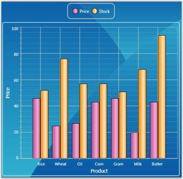

Data Requirements

<table>
<tr>
<th colspan = "2">
Details</th></tr>
<tr>
<td>
Number of y values per point</td><td>
one</td></tr>
<tr>
<td>
Number of points      </td><td>
one or more</td></tr>
<tr>
<td>
Number of series   </td><td>
one or more</td></tr>
</table>
Custom Properties

_Custom Property_

<table>
<tr>
<th>
Name</th><th>
Type</th><th>
Container</th><th>
Description</th></tr>
<tr>
<td>
ChartType.Spacing</td><td>
double</td><td>
ChartArea</td><td>
sets the interval between columnsPossible values lie between 0 and 1.</td></tr>
</table>
Template

While setting template the following parameters can be used:

_Template Parameter_

<table>
<tr>
<th>
Name</th><th>
Type</th><th>
Description</th></tr>
<tr>
<td>
X</td><td>
double</td><td>
x column coordinate</td></tr>
<tr>
<td>
Y</td><td>
double</td><td>
y column coordinate</td></tr>
<tr>
<td>
Width</td><td>
double</td><td>
column width</td></tr>
<tr>
<td>
Height</td><td>
double</td><td>
column height</td></tr>
<tr>
<td>
Interior</td><td>
Brush</td><td>
column color</td></tr>
<tr>
<td>
Series</td><td>
ChartSeries</td><td>
reference to series-owner</td></tr>
</table>
A sample which demonstrates Column Chart Types is available in the following sample installation path.

_..My Documents\Syncfusion\EssentialStudio\<Version Number>\WPF\Chart.WPF\Samples\3.5\WindowsSamples\Chart Gallery\Column Chart Demo_

See Also

Chart Types

### Column Range Chart

Column Range Chart is similar to the Column Chart except that each column is rendered over a range. Therefore the user must specify the y-axis Starting and Ending values for each point. 

The following figure shows a Column Range Chart.

Data Requirements

_Data Requirement_

<table>
<tr>
<th colspan = "2">
Details</th></tr>
<tr>
<td>
Number of y values per point</td><td>
two</td></tr>
<tr>
<td>
Number of points      </td><td>
one or more</td></tr>
<tr>
<td>
Number of series</td><td>
one or more</td></tr>
</table>

### Custom Properties

_Custom Property_

<table>
<tr>
<th>
Name</th><th>
Type</th><th>
Container</th><th>
Description</th></tr>
<tr>
<td>
ChartType.Spacing</td><td>
double</td><td>
ChartArea</td><td>
sets the interval between columnsPossible values lie between 0 and 1.</td></tr>
</table>

### Template

While setting template the following parameters can be used:

_Template Parameter_

<table>
<tr>
<th>
Name</th><th>
Type</th><th>
Description</th></tr>
<tr>
<td>
X</td><td>
double</td><td>
x column coordinate</td></tr>
<tr>
<td>
Y</td><td>
double</td><td>
y column coordinate</td></tr>
<tr>
<td>
Width</td><td>
double</td><td>
column width</td></tr>
<tr>
<td>
Height</td><td>
double</td><td>
column height</td></tr>
<tr>
<td>
Interior</td><td>
Brush</td><td>
column color</td></tr>
<tr>
<td>
Series</td><td>
ChartSeries</td><td>
reference to series-owner</td></tr>
</table>
A sample which demonstrates Column Chart Types is available in the following sample installation path.

_..My Documents\Syncfusion\EssentialStudio\<Version Number>\WPF\Chart.WPF\Samples\3.5\WindowsSamples\Chart Gallery\Column Chart Demo_

### Stacking Column Chart

Stacking Column Charts are similar to regular column charts except that the Y values stack on top of each other in the specified series order. This helps visualize the relationship of parts to the whole.

The following image shows a sample Stacking Column Chart.

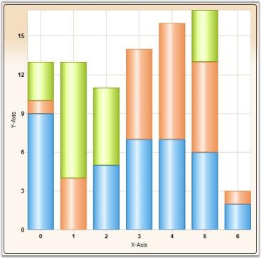

### Data Requirements

_Data Requirement_

<table>
<tr>
<th colspan = "2">
Details</th></tr>
<tr>
<td>
Number of y values per point</td><td>
one</td></tr>
<tr>
<td>
Number of points    </td><td>
one or more</td></tr>
<tr>
<td>
Number of series</td><td>
one or more</td></tr>
</table>

### Custom StackingColumn100 Properties

_Custom Stacking Column 100 Property_

<table>
<tr>
<th>
Name</th><th>
Type</th><th>
Container</th><th>
Description</th></tr>
<tr>
<td>
ChartStackingColumn100Type.ShowValueAsProbability</td><td>
bool</td><td>
ChartArea</td><td>
y-axis range is set between 0 and 100If true, the y-axis range is set between 0 and 1. Default value is {{ '_false_' | markdownify }}.</td></tr>
</table>

###Template

While setting template, the following parameters can be used.

_Template Parameter_

<table>
<tr>
<th>
Name</th><th>
Type</th><th>
Description</th></tr>
<tr>
<td>
X</td><td>
double</td><td>
x column coordinate</td></tr>
<tr>
<td>
Y</td><td>
double</td><td>
y column coordinate</td></tr>
<tr>
<td>
Width</td><td>
double</td><td>
column width</td></tr>
<tr>
<td>
Height</td><td>
double</td><td>
column height</td></tr>
<tr>
<td>
Interior</td><td>
Brush</td><td>
column color</td></tr>
<tr>
<td>
IsUpper</td><td>
bool</td><td>
true – if this is upper column</td></tr>
<tr>
<td>
IsLower</td><td>
bool</td><td>
true – if this is lower column</td></tr>
<tr>
<td>
Series</td><td>
ChartSeries</td><td>
reference to series-owner</td></tr>
</table>

### Stacking Negative Series

When negative values are added, Stacking Column chart can be made to be stacked separately in the chart area, above and below the y-axis 0.

Following code is used to do this.


ChartStackingColumnType.SetRequiresNegativeSeriesStack(this.chartArea2, true);

A sample which demonstrates Column Chart Types is available in the following sample installation path.

_..My Documents\Syncfusion\EssentialStudio\<Version Number>\WPF\Chart.WPF\Samples\3.5\WindowsSamples\Chart Gallery\Column Chart Demo_

### Stacking Column 100 Chart

In the 100 % Stacked Column Chart, the cumulative proportion of each stacked element always totals 100%. This type of chart is great to visualize the relative contribution of each series values to the whole.

The following image shows a sample Stacking Column 100 Chart.

### Data Requirements

<table>
<tr>
<th colspan = "2">
Details</th></tr>
<tr>
<td>
Number of y values per point</td><td>
one</td></tr>
<tr>
<td>
Number of points    </td><td>
one or more</td></tr>
<tr>
<td>
Number of series</td><td>
one or more</td></tr>
</table>

### Spline Settings

<table>
<tr>
<th>
Name</th><th>
Type</th><th>
Container</th><th>
Description</th></tr>
<tr>
<td>
ChartStackingColumn100.ShowValueAsProbability</td><td>
bool</td><td>
ChartArea</td><td>
y-axis range is set from 0 - 100If true, y-axis range is set from 0 - 1. Default value is {{ '_false_' | markdownify }}.</td></tr>
</table>

### Template

While setting template, the following parameters can be used.

<table>
<tr>
<th>
Name</th><th>
Type</th><th>
Description</th></tr>
<tr>
<td>
X</td><td>
double</td><td>
x column coordinate</td></tr>
<tr>
<td>
Y</td><td>
double</td><td>
y column coordinate</td></tr>
<tr>
<td>
Width</td><td>
double</td><td>
column width</td></tr>
<tr>
<td>
Height</td><td>
double</td><td>
column height</td></tr>
<tr>
<td>
Interior</td><td>
Brush</td><td>
column color</td></tr>
<tr>
<td>
IsUpper</td><td>
bool</td><td>
{{ '_true_' | markdownify }} – if this is upper column</td></tr>
<tr>
<td>
IsLower</td><td>
bool</td><td>
{{ '_true_' | markdownify }} – if this is lower column</td></tr>
<tr>
<td>
Percentage</td><td>
double</td><td>
indicates the percentage this point takes up</td></tr>
<tr>
<td>
Series</td><td>
ChartSeries</td><td>
reference to series-owner</td></tr>
</table>
A sample which demonstrates Column Chart Types is available in the following sample installation path.

_..My Documents\Syncfusion\EssentialStudio\<Version Number>\WPF\Chart.WPF\Samples\3.5\WindowsSamples\Chart Gallery\Column Chart Demo_

See Also

Chart Types

### Histogram Chart

Histogram is a bar (column) chart of a frequency distribution in which the widths of the bars are proportional to the classes into which the variable has been divided and the heights of the bars are proportional to the class frequencies. The categories are usually specified as non overlapping intervals of some variable. The categories (bars) must be adjacent. In addition, the chart has the capability to draw a normal distribution curve.

Histograms are useful data summaries that convey the following information:

* The general shape of the frequency distribution. (normal, exponential, etc.)
* Symmetry of the distribution and whether it is skewed.
* Modality - unimodal, bimodal or multimodal. 

The shape of the distribution conveys important information such as the probability distribution of the data.

### Data Requirements

_Data Requirement_

<table>
<tr>
<th colspan = "2">
Details</th></tr>
<tr>
<td>
Number of y values per point</td><td>
one</td></tr>
<tr>
<td>
Number of points</td><td>
one or more</td></tr>
<tr>
<td>
Number of series</td><td>
one or more</td></tr>
</table>

### Histogram Settings

_Histogram Setting_

<table>
<tr>
<th>
Name</th><th>
Type</th><th>
Container</th><th>
Description</th></tr>
<tr>
<td>
ChartHistogramType.IntervalOfHistogram</td><td>
double</td><td>
ChartArea</td><td>
attached property that specifies the Interval which leads for one column</td></tr>
<tr>
<td>
ChartHistogramType.DrawNormalDistribution</td><td>
bool</td><td>
ChartSeries</td><td>
specifies whether to draw Normal Distribution Line</td></tr>
</table>

### Template

While setting template the following parameters can be used:

_Template Parameter_

<table>
<tr>
<th>
Name</th><th>
Type</th><th>
Description</th></tr>
<tr>
<td>
X</td><td>
double</td><td>
x column coordinate</td></tr>
<tr>
<td>
Y</td><td>
double</td><td>
y column coordinate</td></tr>
<tr>
<td>
Width</td><td>
double</td><td>
column width</td></tr>
<tr>
<td>
Height</td><td>
double</td><td>
column height</td></tr>
<tr>
<td>
Interior</td><td>
Brush</td><td>
column color</td></tr>
<tr>
<td>
Series</td><td>
ChartSeries</td><td>
reference to series-owner</td></tr>
</table>

### Fast Column Chart

Fast Column Chart is similar to Column chart as it uses vertical bars (called columns) to display different values of one or more items. Points from adjacent series are drawn as bars next to each other.  

It is used for comparing the frequency, count, total or average of data in different categories. It is ideal for showing the variations in the value of an item over time.

The following points mark the advantages of Fast Column over Column charts:

* The Fast Column charts are rendered using drawing visuals. 
* They load faster than the Column charts. 
* They ensure high performance for displaying data. 
* They can be used as real time charts to render huge number of data points.

The Chart type Fast Column is added in the Enum of type ChartTypes.

### Data Requirements

<table>
<tr>
<th colspan = "2">
Details</th></tr>
<tr>
<td>
Number of y values per point</td><td>
one</td></tr>
<tr>
<td>
Number of points      </td><td>
one or more</td></tr>
<tr>
<td>
Number of series   </td><td>
one or more</td></tr>
</table>

### Custom Properties

<table>
<tr>
<th>
Name</th><th>
Type</th><th>
Container</th><th>
Description</th></tr>
<tr>
<td>
ChartType.Spacing</td><td>
double</td><td>
ChartArea</td><td>
sets the interval between columnsPossible values lie between 0 and 1.</td></tr>
</table>

### Template

While setting template the following parameters can be used: 

<table>
<tr>
<th>
Name</th><th>
Type</th><th>
Description</th></tr>
<tr>
<td>
X</td><td>
double</td><td>
x column coordinate</td></tr>
<tr>
<td>
Y</td><td>
double</td><td>
y column coordinate</td></tr>
<tr>
<td>
Width</td><td>
double</td><td>
column width</td></tr>
<tr>
<td>
Height</td><td>
double</td><td>
column height</td></tr>
<tr>
<td>
Interior</td><td>
Brush</td><td>
column color</td></tr>
<tr>
<td>
Series</td><td>
ChartSeries</td><td>
reference to series-owner</td></tr>
</table>
A sample which demonstrates Fast Column Chart Type is available in the following sample installation path.

_..My Documents\Syncfusion\Essential Studio\<Version Number>\WPF\Chart.WPF\Samples\3.5\WindowsSamples\Chart Performance-> Fast chart types_

The following code example illustrate the usage of Fast Column charts.




<syncfusion:ChartSeries Type="FastColumn" Name="series1" Stroke="Black" DataSource="{Binding}"/>





ChartSeries series = new ChartSeries();

series.Type = ChartTypes.FastColumn;



Run the sample. 

A Fast Column chart is displayed pertaining to the data source it is bound to.

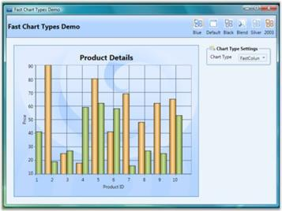

## Area Charts

### Area Chart

The Area Chart connects the Y-points using straight lines and forms an area covered by the above lines and X-axis. This area is then shaded with a specified color or gradient. 

Multiple series can be plotted on the same chart and alpha-blended interior color can be used on the exterior chart to make the interior chart show through.

The following image shows a multi series Area Chart.

Data Requirements

<table>
<tr>
<th colspan = "2">
Details</th></tr>
<tr>
<td>
Number of y values per point</td><td>
one</td></tr>
<tr>
<td>
Number of points     </td><td>
two or more</td></tr>
<tr>
<td>
Number of series   </td><td>
one or more</td></tr>
</table>

### Template

The following parameters can be used while specifying template.

<table>
<tr>
<th>
Name</th><th>
Type</th><th>
Description</th></tr>
<tr>
<td>
X1</td><td>
double</td><td>
x-coordinate of first point</td></tr>
<tr>
<td>
Y1</td><td>
double</td><td>
y-coordinate of first point</td></tr>
<tr>
<td>
X2</td><td>
double</td><td>
x-coordinate of second point</td></tr>
<tr>
<td>
Y2</td><td>
double</td><td>
y-coordinate of second point</td></tr>
<tr>
<td>
IsStartSegment</td><td>
bool</td><td>
{{ '_true_' | markdownify }} - if this is start segment</td></tr>
<tr>
<td>
IsEndSegment</td><td>
bool</td><td>
{{ '_true_' | markdownify }} - if this is end segment</td></tr>
<tr>
<td>
Geometry</td><td>
Geometry</td><td>
segment geometry</td></tr>
<tr>
<td>
Interior</td><td>
Brush</td><td>
column color</td></tr>
<tr>
<td>
Series</td><td>
ChartSeries</td><td>
reference to series-owner</td></tr>
</table>
A sample which demonstrates Area Chart Types is available in the following sample installation path.

_..My Documents\Syncfusion\EssentialStudio\<Version Number>\WPF\Chart.WPF\Samples\3.5\WindowsSamples\Chart Gallery\Area Chart Demo_

### Spline Area Chart

Spline Area Chart is similar to an Area Chart with the only difference being the way in which the points of a series are connected. It connects each series of points by a smooth spline curve. 

Multiple series can be plotted on the same chart and alpha-blended interior color can be used on the exterior chart to make the interior chart(s) show through.

The following image shows a multi series Spline Area Chart. 

### Data Requirements

<table>
<tr>
<th colspan = "2">
Details</th></tr>
<tr>
<td>
Number of y values per point</td><td>
one</td></tr>
<tr>
<td>
Number of points      </td><td>
one or more</td></tr>
<tr>
<td>
Number of series   </td><td>
one or more</td></tr>
</table>

### SplineArea Properties

<table>
<tr>
<th>
Name</th><th>
Type</th><th>
Container</th><th>
Description</th></tr>
<tr>
<td>
ChartSplineType.SplineCoefficient</td><td>
double</td><td>
ChartSeries</td><td>
responsible for spline curvature</td></tr>
</table>

### Template

While setting template the following parameters can be used:

<table>
<tr>
<th>
Name</th><th>
Type</th><th>
Description</th></tr>
<tr>
<td>
X1</td><td>
double</td><td>
x-coordinate of first point</td></tr>
<tr>
<td>
Y1</td><td>
double</td><td>
y-coordinate of first point</td></tr>
<tr>
<td>
X2</td><td>
double</td><td>
x-coordinate of second point</td></tr>
<tr>
<td>
Y2</td><td>
double</td><td>
y-coordinate of second point</td></tr>
<tr>
<td>
IsStartSegment</td><td>
bool</td><td>
{{ '_true_' | markdownify }} - if this is start segment</td></tr>
<tr>
<td>
IsEndSegment</td><td>
bool</td><td>
{{ '_true_' | markdownify }} - if this is end segment</td></tr>
<tr>
<td>
Geometry</td><td>
Geometry</td><td>
segment geometry</td></tr>
<tr>
<td>
Interior</td><td>
Brush</td><td>
column color</td></tr>
<tr>
<td>
Series</td><td>
ChartSeries</td><td>
reference to series-owner</td></tr>
</table>
A sample which demonstrates Area Chart Types is available in the following sample installation path.

_..My Documents\Syncfusion\EssentialStudio\<Version Number>\WPF\Chart.WPF\Samples\3.5\WindowsSamples\Chart Gallery\Area Chart Demo_

### Stacking Area Chart

Stacking Area Charts are similar to regular area charts except that the Y values stack on top of each other in the specified series order. This helps visualize the relationship of parts to the whole.

The following image shows a sample Stacking Area Chart.

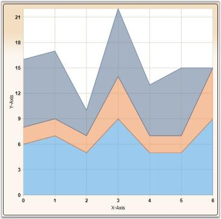

### Data Requirements

<table>
<tr>
<th colspan = "2">
Details</th></tr>
<tr>
<td>
Number of Y values per point:</td><td>
one</td></tr>
<tr>
<td>
Number of points:      </td><td>
one or more</td></tr>
<tr>
<td>
Number of series:   </td><td>
one or more</td></tr>
</table>

### Template

While setting template the following parameters can be used.

<table>
<tr>
<th>
Name</th><th>
Type</th><th>
Description</th></tr>
<tr>
<td>
X1</td><td>
double</td><td>
x-coordinate of first point</td></tr>
<tr>
<td>
Y1</td><td>
double</td><td>
y-coordinate of first point</td></tr>
<tr>
<td>
X2</td><td>
double</td><td>
x-coordinate of second point</td></tr>
<tr>
<td>
Y2</td><td>
double</td><td>
y-coordinate of second point</td></tr>
<tr>
<td>
IsStartSegment</td><td>
bool</td><td>
{{ '_true_' | markdownify }} - if this is start segment</td></tr>
<tr>
<td>
IsEndSegment</td><td>
bool</td><td>
{{ '_true_' | markdownify }} - if this is end segment</td></tr>
<tr>
<td>
Geometry</td><td>
Geometry</td><td>
segment geometry</td></tr>
<tr>
<td>
IsUpper</td><td>
bool</td><td>
{{ '_true_' | markdownify }} – if this is upper segment</td></tr>
<tr>
<td>
IsLower</td><td>
bool</td><td>
{{ '_true_' | markdownify }} – if this is lower segment</td></tr>
<tr>
<td>
Interior</td><td>
Brush</td><td>
column color</td></tr>
<tr>
<td>
Series</td><td>
ChartSeries</td><td>
reference to series-owner</td></tr>
</table>

### Stacking Negative Series

When negative values are added, Stacking Area chart can be made to be stacked separately in the chart area, above and below the x- axis 0.


ChartStackingAreaType.SetRequiresNegativeSeriesStack(this.chartArea1, true);

A sample which demonstrates Area Chart Types is available in the following sample installation path.

_..My Documents\Syncfusion\EssentialStudio\<Version Number>\WPF\Chart.WPF\Samples\3.5\WindowsSamples\Chart Gallery\Area Chart Demo_

### StackingArea100 Chart

100% stacked area charts are similar to regular area charts except that the y values stack to 100% on top of each other in the specified series order. In the 100% stacked area charts, the cumulative proportion of each stacked element always totals 100%. This type of chart is great to visualize the relative contribution of each series’ values to the whole.

### Sample Link

A sample that demonstrates the StackingArea100 chart type is available in the following sample installation path:

..MyDocuments\Syncfusion\EssentialStudio\<Version Number>\WPF\Chart.WPF\Samples\3.5\WindowsSamples\Basic Charts\StackingArea100 Chart Demo

### Adding StackingArea100 Chart to Chart Area

The StackingArea100 chart type can be added into a chart area through the following code example:



  <syncfusion:Chart>

            <syncfusion:ChartArea>

                <syncfusion:ChartSeries Data="10,10,20,20,30,30" Type="StackingArea100"/>

                <syncfusion:ChartSeries Data="20,20,30,30,40,40" Type="StackingArea100"/>

            </syncfusion:ChartArea>

  </syncfusion:Chart>



<table>
<tr>
<th colspan = "2">
Data Requirement Details</th></tr>
<tr>
<td>
Number of Y values per point</td><td>
One</td></tr>
<tr>
<td>
Number of points</td><td>
One or more</td></tr>
<tr>
<td>
Number of Series</td><td>
One or more</td></tr>
</table>

### Overriding Data Template for Chart Series

The data template for a 100% stacked area chart can be overridden by changing the default template as shown in the following code example.

[XAML: Default Template]

  <DataTemplate x:Key="{x:Type local:ChartStackingArea100Segment}">

    <Path Stroke="{Binding Stroke}" StrokeThickness="{Binding StrokeThickness}" Fill="{Binding Interior}"  Data="{Binding Geometry}" ToolTip="{Binding ToolTip}"/>

  </DataTemplate>

[Custom Template]

<DataTemplate x:Key="customTemplate">

    <Path Stroke="{Binding Stroke}" StrokeThickness="4" Fill="Red"  Data="{Binding Geometry}"/>

  </DataTemplate>

[Apply Template]

<syncfusion:Chart>

 <syncfusion:ChartArea>

      <syncfusion:ChartSeries Template="{StaticResource customTemplate}" Data="10,10,20,20,30,30" Type="StackingArea100"/>

      <syncfusion:ChartSeries Data="20,20,30,30,40,40" Type="StackingArea100"/>

 </syncfusion:ChartArea>

</syncfusion:Chart>



When setting template, the following parameters can be used:

<table>
<tr>
<th>
Name</th><th>
Type</th><th>
Description</th></tr>
<tr>
<td>
Geometry</td><td>
Geometry</td><td>
Segment geometry</td></tr>
<tr>
<td>
Stroke</td><td>
Brush</td><td>
Segment stroke</td></tr>
<tr>
<td>
StrokeThickness</td><td>
Thickness</td><td>
Segment stroke thickness</td></tr>
<tr>
<td>
Interior</td><td>
Brush</td><td>
Segment color</td></tr>
<tr>
<td>
Series</td><td>
ChartSeries</td><td>
Reference to series owner</td></tr>
</table>

###StepArea Chart

Step Area Charts are similar to regular area charts except that instead of a straight line tracing the shortest path between points, the values are connected by continuous vertical and horizontal lines forming a step-like progression. Also, step area charts contain only one segment for each series.

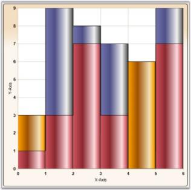

### Data Requirements

<table>
<tr>
<th colspan = "2">
Details</th></tr>
<tr>
<td>
Number of y values per point</td><td>
one</td></tr>
<tr>
<td>
Number of points      </td><td>
one or more</td></tr>
<tr>
<td>
Number of series   </td><td>
one or more</td></tr>
</table>

### Template

While setting template the following parameters can be used.

<table>
<tr>
<th>
Name</th><th>
Type</th><th>
Description</th></tr>
<tr>
<td>
X1</td><td>
double</td><td>
x-coordinate of first point</td></tr>
<tr>
<td>
Y1</td><td>
double</td><td>
y-coordinate of first point</td></tr>
<tr>
<td>
X2</td><td>
double</td><td>
x-coordinate of second point</td></tr>
<tr>
<td>
Y2</td><td>
double</td><td>
y-coordinate of second point</td></tr>
<tr>
<td>
StepX</td><td>
double</td><td>
x-coordinate of transient point</td></tr>
<tr>
<td>
StepY</td><td>
double</td><td>
y-coordinate of transient point</td></tr>
<tr>
<td>
Geometry</td><td>
Geometry</td><td>
segment geometry</td></tr>
<tr>
<td>
IsStartSegment</td><td>
bool</td><td>
{{ '_true_' | markdownify }} - if this is start segment</td></tr>
<tr>
<td>
IsEndSegment</td><td>
bool</td><td>
{{ '_true_' | markdownify }} - if this is end segment</td></tr>
<tr>
<td>
Interior</td><td>
Brush</td><td>
column color</td></tr>
<tr>
<td>
Series</td><td>
ChartSeries</td><td>
reference to series-owner</td></tr>
</table>
A sample which demonstrates Area Chart Types is available in the following sample installation path.

_..My Documents\Syncfusion\EssentialStudio\<Version Number>\WPF\Chart.WPF\Samples\3.5\WindowsSamples\Chart Gallery\Area Chart Demo_

### Range Area Chart

Range Area Chart is a variation of Area Chart type that lets you plot bands of data in a chart, like Bollinger bands, weather patterns, etc. Each point in the chart is specified by 2 Y values – the lower and higher end of the band. 

### Data Requirements

<table>
<tr>
<th colspan = "2">
Details</th></tr>
<tr>
<td>
Number of y values per point</td><td>
two</td></tr>
<tr>
<td>
Number of points      </td><td>
one or more</td></tr>
<tr>
<td>
Number of series</td><td>
one or more</td></tr>
</table>

### Custom Properties

<table>
<tr>
<th>
Name</th><th>
Type</th><th>
Container</th><th>
Description</th></tr>
<tr>
<td>
ChartRangeAreaType.HighValueInterior</td><td>
Brush</td><td>
ChartSeries</td><td>
specifies the brush that should be used for the segment where the 2nd y value is greater than the 1st y value</td></tr>
<tr>
<td>
ChartRangeAreaType.LowValueInterior</td><td>
Brush</td><td>
ChartSeries</td><td>
specifies the brush that should be used for the segment where the 1st  y value is greater than the 2nd y value</td></tr>
</table>

### Template

The following parameters can be used while specifying template.

<table>
<tr>
<th>
Name</th><th>
Type</th><th>
Description</th></tr>
<tr>
<td>
IsHighLow</td><td>
bool</td><td>
{{ '_true_' | markdownify }} - if this segment is for a "high" area</td></tr>
<tr>
<td>
Geometry</td><td>
Geometry</td><td>
segment geometry</td></tr>
<tr>
<td>
FillBrush</td><td>
Brush</td><td>
interior for this segment</td></tr>
<tr>
<td>
Series</td><td>
ChartSeries</td><td>
reference to series-owner</td></tr>
</table>
A sample which demonstrates Range Area Chart Type is available in the following sample installation path.

_..My Documents\Syncfusion\EssentialStudio\<Version Number>\WPF\Chart.WPF\Samples\3.5\WindowsSamples\Chart Gallery\Range-Area Chart Demo_

## Accumulation Charts

### Funnel Chart

The Funnel chart is a single series chart representing the data as portions of 100%, and this chart does not use any axes. Funnel chart can be viewed as 2D or 3D.

Funnel charts are often used to represent stages in a sales process and show the amount of potential revenue for each stage. This type of chart can be useful also in identifying potential problem areas in an organization's sales processes, for example. A funnel chart is similar to a stacked percent bar chart.

### Data Requirements

<table>
<tr>
<th colspan = "2">
Details</th></tr>
<tr>
<td>
Number of y values per point</td><td>
one</td></tr>
<tr>
<td>
Number of points     </td><td>
one or more</td></tr>
<tr>
<td>
Number of series   </td><td>
one or more</td></tr>
</table>

### FunnelType Properties

<table>
<tr>
<th>
Name</th><th>
Type</th><th>
Container</th><th>
Description</th></tr>
<tr>
<td>
ChartFunnelType.ExplodedIndex</td><td>
int</td><td>
ChartSeries</td><td>
index of segment which should be leant out</td></tr>
<tr>
<td>
ChartFunnelType.GapRatio</td><td>
double</td><td>
ChartSeries</td><td>
indicates relation of  inner interval to their width</td></tr>
<tr>
<td>
ChartFunnelType.FunnelMode</td><td>
ChartFunnelMode</td><td>
ChartSeries</td><td>
method of data displaying</td></tr>
</table>

### Template

While setting template the following parameters can be used:

<table>
<tr>
<th>
Name</th><th>
Type</th><th>
Description</th></tr>
<tr>
<td>
GapRatio</td><td>
double</td><td>
indicates relation of  inner  interval to their width</td></tr>
<tr>
<td>
IsExploded</td><td>
bool</td><td>
true - if segment is leant out</td></tr>
<tr>
<td>
ExplodedOffset</td><td>
double</td><td>
displacement on which segment should be leant out</td></tr>
<tr>
<td>
MinWidth</td><td>
double</td><td>
minimal segment width</td></tr>
<tr>
<td>
Geometry</td><td>
Geometry</td><td>
segment geometry</td></tr>
<tr>
<td>
Interior</td><td>
Brush</td><td>
column color</td></tr>
<tr>
<td>
Series</td><td>
ChartSeries</td><td>
reference to series-owner</td></tr>
</table>
A sample which demonstrates Accumulation Chart Types is available in the following sample installation path.

_..My Documents\Syncfusion\EssentialStudio\<Version Number>\WPF\Chart.WPF\Samples\3.5\WindowsSamples\Chart Gallery\Accumulation Chart Demo_

### Pyramid Chart

Pyramid chart is similar to the funnel chart. It is often used for geographical purposes. The Pyramid Chart type displays the data which when totalled will be 100%. This type of chart is a single series chart representing the data as portions of 100%, and this chart does not use any axes. Pyramid chart can be viewed as 2D or 3D.

The following images are some sample Pyramid Charts.

### Data Requirements

<table>
<tr>
<th colspan = "2">
Details</th></tr>
<tr>
<td>
Number of y values per point</td><td>
one</td></tr>
<tr>
<td>
Number of points      </td><td>
one or more</td></tr>
<tr>
<td>
Number of series   </td><td>
one or more</td></tr>
</table>
PyramidType Properties

Property Table

<table>
<tr>
<th>
Name</th><th>
Type</th><th>
Container</th><th>
Description</th></tr>
<tr>
<td>
ChartPyramidType.ExplodedIndex</td><td>
int</td><td>
ChartSeries</td><td>
index of segment which should be leant out</td></tr>
<tr>
<td>
ChartPyramidType.GapRatio</td><td>
double</td><td>
ChartSeries</td><td>
indicates relation of inner  interval to their width</td></tr>
<tr>
<td>
ChartPyramidType.PyramidMode</td><td>
ChartPyramidMode</td><td>
ChartSeries</td><td>
method of data displaying</td></tr>
</table>

### Template

While setting template the following parameters can be used.

<table>
<tr>
<th>
Name</th><th>
Type</th><th>
Description</th></tr>
<tr>
<td>
GapRatio</td><td>
double</td><td>
indicates relation of inner interval to their  width</td></tr>
<tr>
<td>
IsExploded</td><td>
bool</td><td>
true - if segment is leant out</td></tr>
<tr>
<td>
ExplodedOffset</td><td>
double</td><td>
displacement on which segment should be leant out</td></tr>
<tr>
<td>
Geometry</td><td>
Geometry</td><td>
segment geometry</td></tr>
<tr>
<td>
Interior</td><td>
Brush</td><td>
column color</td></tr>
<tr>
<td>
Series</td><td>
ChartSeries</td><td>
reference to series-owner</td></tr>
</table>
A sample which demonstrates Accumulation Chart Types is available in the following sample installation path.

_..My Documents\Syncfusion\EssentialStudio\<Version Number>\WPF\Chart.WPF\Samples\3.5\WindowsSamples\Chart Gallery\Accumulation Chart Demo_

## XY Charts (Bubble and Scatter)

### Scatter Chart

Scatter Charts, also known as XY Charts, are a plot of Y values and X values along two axes. The points are not joined together and can be customized using shapes or images to make them easily identifiable, usually independent of time.

The scatter graph lets you plot data points based on two independent variables. The variable that we seek to predict is called the dependent variable or Y-variable. The variable on which it depends is called the independent variable or the X-variable. Scatter graphs can chart multiple data sets, each represented by a different symbol and each having any number of data points.

It is used to display numerical data, either discrete or continuous. Scatter charts are commonly used for visualizing scientific data. 

The following image shows a multi series Scatter Chart.

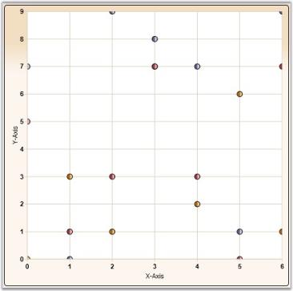

### Data Requirements

<table>
<tr>
<th colspan = "2">
Details</th></tr>
<tr>
<td>
Number of y values per point</td><td>
one</td></tr>
<tr>
<td>
Number of points     </td><td>
one or more</td></tr>
<tr>
<td>
Number of series</td><td>
one or more</td></tr>
</table>

### Template

While setting template the following parameters can be used:

<table>
<tr>
<th>
Name</th><th>
Type</th><th>
Description</th></tr>
<tr>
<td>
X</td><td>
double</td><td>
x point coordinate</td></tr>
<tr>
<td>
Y</td><td>
double</td><td>
y point coordinate</td></tr>
<tr>
<td>
Interior</td><td>
Brush</td><td>
column color</td></tr>
<tr>
<td>
Series</td><td>
ChartSeries</td><td>
reference to series-owner</td></tr>
</table>

### Customizing the Height and Width of the Scatter Chart

You can modify the size of the Scatter chart by using the Height and Width properties of Scatter-Type, as shown in the following code sample:


<syncfusion:ChartSeries Name="Series1" Type="Scatter" 

DataSource="{Binding ExpensiveCarDetails}" BindingPathX="Position" BindingPathsY="Price" syncfusion:ChartScatterType.ScatterHeight="30" syncfusion:ChartScatterType.ScatterWidth="30">

</syncfusion:ChartSeries>





ChartScatterType.SetScatterWidth(seriesname, 30);
ChartScatterType.SetScatterHeight(seriesname, 30);


A sample which demonstrates Scatter and Bubble Chart Types is available in the following sample installation path.

_..My Documents\Syncfusion\EssentialStudio\<Version Number>\WPF\Chart.WPF\Samples\3.5\WindowsSamples\Chart Gallery\Scatter And Bubble Chart Demo_

### Fast Scatter chart Type

Fast Scatter charts are similar to Scatter Charts as they are a plot of Y values and X values along two axes. The points are not joined together and can be customized using shapes or images to make them easily identifiable, usually independent of time.

Fast Scatter charts can present multiple data sets, each represented by a different symbol and each having any number of data points. It is used to display numerical data, either discrete or continuous. 

The following points mark the advantages of Fast Scatter Charts over Scatter Charts:

* The Fast Scatter Charts are rendered using drawing visuals. 
* They load faster than the scattered charts. 
* They ensure high performance for displaying data. 
* They can be used as real time charts to render huge number of data points.

The Chart type Fast Scatter is added in the Enum of type ChartTypes.

### Data Requirements

<table>
<tr>
<th colspan = "2">
Details</th></tr>
<tr>
<td>
Number of y values per point</td><td>
one</td></tr>
<tr>
<td>
Number of points     </td><td>
one or more</td></tr>
<tr>
<td>
Number of series</td><td>
one or more</td></tr>
</table>

### Template

While setting template the following parameters can be used:

<table>
<tr>
<th>
Name</th><th>
Type</th><th>
Description</th></tr>
<tr>
<td>
X</td><td>
double</td><td>
x point coordinate</td></tr>
<tr>
<td>
Y</td><td>
double</td><td>
y point coordinate</td></tr>
<tr>
<td>
Interior</td><td>
Brush</td><td>
column color</td></tr>
<tr>
<td>
Series</td><td>
ChartSeries</td><td>
reference to series-owner</td></tr>
</table>
The following code example illustrates the usage of Fast Scatter charts.



<syncfusion:ChartSeries Type="FastScatter" Name="series1" Stroke="Black" DataSource="{Binding}"/>





ChartSeries series = new ChartSeries();

series.Type = ChartTypes.FastScatter;



Run the sample. 

A Fast Scatter chart is displayed.

Customizing the Height and Width of the Fast Scatter Chart

You can modify the size of the Fast Scatter chart by using the Height and Width properties of FastScatter-Type, as shown in the following code sample:




<syncfusion:ChartSeries Name="Series1" Type="FastScatter" 

DataSource="{Binding ExpensiveCarDetails}" BindingPathX="Position" BindingPathsY="Price" syncfusion:ChartFastScatterType.FastScatterHeight="30" syncfusion:ChartFastScatterType.FastScatterWidth="30">

</syncfusion:ChartSeries>





ChartFastScatterType.SetFastScatterWidth(seriesname, 30);
ChartFastScatterType.SetFastScatterHeight(seriesname, 30);





A sample which demonstrates Fast Scatter Chart Types is available in the following sample installation path.

_..My Documents\Syncfusion\Essential Studio\<Version Number>\WPF\Chart.WPF\Samples\3.5\WindowsSamples\Chart Performance-> Fast chart types_

### Bubble Chart

Bubble Chart is an extension of the Scatter Chart (or XY-chart) where each data marker is represented by a circle whose dimension forms a third variable. Consequently, bubble charts allow three-variable comparisons allowing for easy visualization of complex interdependencies that are not apparent in two-variable charts. Bubble charts are frequently used in market and product comparison studies.

Though it's called a bubble chart, the data marker can be rendered as either a circle, image or square using the BubbleType property.

The following image shows a multi series Bubble Chart.

### Data Requirements

<table>
<tr>
<th colspan = "2">
Details</th></tr>
<tr>
<td>
Number of y values per point</td><td>
two</td></tr>
<tr>
<td>
Number of points     </td><td>
one or more</td></tr>
<tr>
<td>
Number of series</td><td>
one or more</td></tr>
</table>

### BubbleType Properties

<table>
<tr>
<th>
Name</th><th>
Type</th><th>
Container</th><th>
Description</th></tr>
<tr>
<td>
ChartBubbleType.MinRadius</td><td>
double</td><td>
ChartSeries</td><td>
minimal figure radius</td></tr>
<tr>
<td>
ChartBubbleType.MaxRadius</td><td>
double</td><td>
ChartSeries</td><td>
maximal figure radius</td></tr>
</table>

### Template

While setting template the following parameters can be used:

<table>
<tr>
<th>
Name</th><th>
Type</th><th>
Description</th></tr>
<tr>
<td>
X</td><td>
double</td><td>
x column coordinate</td></tr>
<tr>
<td>
Y</td><td>
double</td><td>
y column coordinate</td></tr>
<tr>
<td>
Width</td><td>
double</td><td>
column width</td></tr>
<tr>
<td>
Height</td><td>
double</td><td>
column height</td></tr>
<tr>
<td>
Radius</td><td>
double</td><td>
figure radius</td></tr>
<tr>
<td>
Interior</td><td>
Brush</td><td>
column color</td></tr>
<tr>
<td>
Series</td><td>
ChartSeries</td><td>
reference to series-owner</td></tr>
</table>
A sample which demonstrates Scatter and Bubble Chart Types is available in the following sample installation path.

_..My Documents\Syncfusion\EssentialStudio\<Version Number>\WPF\Chart.WPF\Samples\3.5\WindowsSamples\Chart Gallery\Scatter And Bubble Chart Demo_

## Financial Charts

### Candle Chart

A Candle Chart displays stock information using the High, Low, Open and Close values. The Hi and Lo values are represented by the wick of a candle. The candle represents open and close values.

The following image shows a CandleChart displaying a single series. 

### Data Requirements

<table>
<tr>
<th colspan = "2">
Details</th></tr>
<tr>
<td>
Number of y values per point</td><td>
four (High, Low , Open and Close respectively)</td></tr>
<tr>
<td>
Number of points  </td><td>
one or more</td></tr>
<tr>
<td>
Number of series</td><td>
one or more</td></tr>
</table>

### CandleType Properties

<table>
<tr>
<th>
Name</th><th>
Type</th><th>
Container</th><th>
Description</th></tr>
<tr>
<td>
ChartType.Spacing</td><td>
double</td><td>
ChartArea</td><td>
interval between line groupsPossible value lies between 0 and 1.</td></tr>
</table>

### Template

While setting template the following parameters can be used:

<table>
<tr>
<th>
Name</th><th>
Type</th><th>
Description</th></tr>
<tr>
<td>
HiX</td><td>
double</td><td>
x-coordinate of upper border</td></tr>
<tr>
<td>
HiY</td><td>
double</td><td>
y-coordinate of upper border</td></tr>
<tr>
<td>
LoX</td><td>
double</td><td>
x-coordinate of lower border</td></tr>
<tr>
<td>
LoY</td><td>
double</td><td>
y-coordinate of lower border</td></tr>
<tr>
<td>
X</td><td>
double</td><td>
x-column coordinate</td></tr>
<tr>
<td>
Y</td><td>
double</td><td>
y-column coordinate</td></tr>
<tr>
<td>
Width</td><td>
double</td><td>
column width</td></tr>
<tr>
<td>
Height</td><td>
double</td><td>
column height</td></tr>
<tr>
<td>
Interior</td><td>
Brush</td><td>
column color</td></tr>
<tr>
<td>
Series</td><td>
ChartSeries</td><td>
reference to series-owner</td></tr>
</table>
A sample which demonstrates Financial Chart Types is available in the following sample installation path.

_..My Documents\Syncfusion\EssentialStudio\<Version Number>\WPF\Chart.WPF\Samples\3.5\WindowsSamples\Chart Gallery\Financial Chart Demo_

### HiLo Chart

Hi Lo Chart is a special kind of chart that is normally used in stock analysis. They are typically used to display error bars or the trading range of a stock for each period. 

The Hi Lo Chart expect 2 Y values to be specified in the series. One value should represent the high and the other value should represent the low stock price for the period. This can be specified in any order.

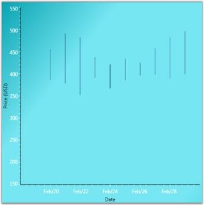

### Data Requirements

<table>
<tr>
<th colspan = "2">
Details</th></tr>
<tr>
<td>
Number of y values per point</td><td>
two</td></tr>
<tr>
<td>
Number of points      </td><td>
one or more</td></tr>
<tr>
<td>
Number of series  </td><td>
one or more</td></tr>
</table>

### Template

While setting template the following parameters can be used:

<table>
<tr>
<th>
Name</th><th>
Type</th><th>
Description</th></tr>
<tr>
<td>
HiX</td><td>
double</td><td>
x-coordinate of upper border</td></tr>
<tr>
<td>
HiY</td><td>
double</td><td>
y-coordinate of upper border</td></tr>
<tr>
<td>
LoX</td><td>
double</td><td>
x-coordinate of lower border</td></tr>
<tr>
<td>
LoY</td><td>
double</td><td>
y-coordinate of lower border</td></tr>
<tr>
<td>
Interior</td><td>
Brush</td><td>
column color</td></tr>
<tr>
<td>
Series</td><td>
ChartSeries</td><td>
reference to series-owner</td></tr>
</table>
A sample which demonstrates Financial Chart Types is available in the following sample installation path.

_..My Documents\Syncfusion\EssentialStudio\<Version Number>\WPF\Chart.WPF\Samples\3.5\WindowsSamples\Chart Gallery\Financial Chart Demo_

### HiLoOpenClose Chart

Hi Lo Open Close Chart is a special kind of chart that is normally used in stock analysis. This chart type expects 4 Y values for every point in the series. Those values should represent the High, Low, Open and Close values of the stock, in that order, for that period.

### Data Requirements

<table>
<tr>
<th colspan = "2">
Details</th></tr>
<tr>
<td>
Number of y values per point</td><td>
four (Open, Close, High and Low, in that order)</td></tr>
<tr>
<td>
Number of points     </td><td>
one or more</td></tr>
<tr>
<td>
Number of series</td><td>
one or more</td></tr>
</table>

### Template

While setting template the following parameters can be used:

<table>
<tr>
<th>
Name</th><th>
Type</th><th>
Description</th></tr>
<tr>
<td>
HiX</td><td>
double</td><td>
x-coordinate of upper border</td></tr>
<tr>
<td>
HiY</td><td>
double</td><td>
y-coordinate of upper border</td></tr>
<tr>
<td>
LoX</td><td>
double</td><td>
x-coordinate of lower border</td></tr>
<tr>
<td>
LoY</td><td>
double</td><td>
y-coordinate of lower border</td></tr>
<tr>
<td>
StartOpenX</td><td>
double</td><td>
x start coordinate of opening price</td></tr>
<tr>
<td>
StartOpenY</td><td>
double</td><td>
y start coordinate of opening price</td></tr>
<tr>
<td>
EndOpenX</td><td>
double</td><td>
x end coordinate of opening price</td></tr>
<tr>
<td>
EndOpenY</td><td>
double</td><td>
y end coordinate of opening price</td></tr>
<tr>
<td>
StartCloseX</td><td>
double</td><td>
x start coordinate of closing price</td></tr>
<tr>
<td>
StartCloseY</td><td>
double</td><td>
y start coordinate of closing price</td></tr>
<tr>
<td>
EndCloseX</td><td>
double</td><td>
x end coordinate of closing price</td></tr>
<tr>
<td>
EndCloseY</td><td>
double</td><td>
y end coordinate of closing price</td></tr>
<tr>
<td>
Interior</td><td>
Brush</td><td>
column color</td></tr>
<tr>
<td>
Series</td><td>
ChartSeries</td><td>
reference to series-owner</td></tr>
</table>
A sample which demonstrates Financial Chart Types is available in the following sample installation path.

_..My Documents\Syncfusion\EssentialStudio\<Version Number>\WPF\Chart.WPF\Samples\3.5\WindowsSamples\Chart Gallery\Financial Chart Demo_

### Kagi Chart

Kagi Charts are a Japanese invention and date since the late 1870's, but were popularized in the western world by Steven Nison. They contain a series of connecting vertical lines where the thickness and direction of those lines depend on price. If closing prices continue to move in the direction of the prior vertical Kagi line, then that line is extended. However, if the closing price reverses by a pre-determined "reversal" amount, a new Kagi line is drawn in the next column in the opposite direction.

The penetration of a prior column's high or low, by the latest closing price, alters the colors of the lines. These colors depict either a bullish or bearish pattern. Use the PriceUpColor and PriceDownColor properties to specify the colors for these two patterns. The wider the columns, the stronger the pattern.

### Data Requirements

<table>
<tr>
<th colspan = "2">
Details</th></tr>
<tr>
<td>
Number of y values per point</td><td>
one</td></tr>
<tr>
<td>
Number of points      </td><td>
one or more</td></tr>
<tr>
<td>
Number of series   </td><td>
one or more</td></tr>
</table>

### KagiType Properties

<table>
<tr>
<th>
Name</th><th>
Type</th><th>
Container</th><th>
Description</th></tr>
<tr>
<td>
ChartKagiType.ReversalAmount</td><td>
double</td><td>
ChartSeries</td><td>
price difference which should overcome in order to change diagram direction</td></tr>
</table>

### Template

While setting template the following parameters can be used:

<table>
<tr>
<th>
Name</th><th>
Type</th><th>
Description</th></tr>
<tr>
<td>
IsPriceUp</td><td>
bool</td><td>
{{ '_true_' | markdownify }} – if segment shows price rising</td></tr>
<tr>
<td>
IsPriceDown</td><td>
bool</td><td>
{{ '_true_' | markdownify }} – if segment shows price recession</td></tr>
<tr>
<td>
Points</td><td>
PointCollection</td><td>
collection of segment points</td></tr>
<tr>
<td>
Interior</td><td>
Brush</td><td>
column color</td></tr>
<tr>
<td>
Series</td><td>
ChartSeries</td><td>
reference to series-owner</td></tr>
</table>
A sample which demonstrates Financial Chart Types is available in the following sample installation path.

_..My Documents\Syncfusion\EssentialStudio\<Version Number>\WPF\Chart.WPF\Samples\3.5\WindowsSamples\Chart Gallery\Financial Chart Demo_

### Point and Figure Chart

Point and Figure Chart is used to identify support levels, resistance levels and chart patterns. The chart ignores the time factor and concentrates solely on movements in price - a column of Xs or Os may take one day or several weeks to complete. By convention, the first X in a column is plotted one box above the last O in the previous column (and the first O in a column is plotted one box below the highest X).  

This is a chart that plots the day-to-day increment and decrement in price. It uses a series of X's and O's to determine price trends where the X's represent an upward trend and the O's represent a downward trend. The default value of ReversalAmount is 1. Use the PriceUpColor to specify the color for the Xs and PriceDownColor to specify the color for the Os. 

This chart requires 2 Y values, the high value and the low value for the specified period.

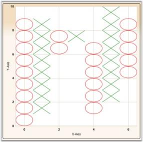

### Data Requirements

<table>
<tr>
<th colspan = "2">
Details</th></tr>
<tr>
<td>
Number of y values per point</td><td>
two</td></tr>
<tr>
<td>
Number of points</td><td>
one or more</td></tr>
<tr>
<td>
Number of series</td><td>
one or more</td></tr>
</table>

PointAndFigure Customization

<table>
<tr>
<th>
Name</th><th>
Type</th><th>
Container</th><th>
Description</th></tr>
<tr>
<td>
ChartPointAndFigureType.FigureCost</td><td>
double</td><td>
ChartSeries</td><td>
price of one segment</td></tr>
<tr>
<td>
ChartPointAndFigureType.ReversalAmount</td><td>
double</td><td>
ChartSeries</td><td>
price difference which should be overcome in order to change diagram direction</td></tr>
</table>

### Template

While setting template the following parameters can be used.

<table>
<tr>
<th>
Name</th><th>
Type</th><th>
Description</th></tr>
<tr>
<td>
X</td><td>
double</td><td>
x-column coordinate</td></tr>
<tr>
<td>
Y</td><td>
double</td><td>
y-column coordinate</td></tr>
<tr>
<td>
Width</td><td>
double</td><td>
column width</td></tr>
<tr>
<td>
IsPoint</td><td>
bool</td><td>
{{ '_true_' | markdownify }} – if segment is point</td></tr>
<tr>
<td>
IsFigure</td><td>
bool</td><td>
{{ '_true_' | markdownify }} – if segment is figure</td></tr>
<tr>
<td>
Height</td><td>
double</td><td>
column height</td></tr>
<tr>
<td>
Interior</td><td>
Brush</td><td>
column Color</td></tr>
<tr>
<td>
Series</td><td>
ChartSeries</td><td>
reference to series-owner</td></tr>
</table>
A sample which demonstrates Financial Chart Types is available in the following sample installation path.

_..My Documents\Syncfusion\EssentialStudio\<Version Number>\WPF\Chart.WPF\Samples\3.5\WindowsSamples\Chart Gallery\Financial Chart Demo_

### Renko Chart

Renko charting method is thought to have acquired its name from "renga" which is the Japanese word for bricks. Renko Charts were introduced by Steve Nison. Renko (Bricks) are drawn equal in size for a determined amount. A brick is drawn in the direction of the prior move only if prices move by a minimum amount. If prices change by the determined amount or more, a new brick is drawn. If prices change by less than the determined amount (specified by ReversalAmount), the new price is ignored. The default value of ReversalAmount is 1.

If the new closing price penetrates the previous bricks closing price in the opposite direction a trend reversal highlighted by the change in color of the bricks happens. Use the PriceUpColor to indicate bullish trend and PriceDownColor to indicate bearish trend.

Since a Renko chart isolates the underlying trends by filtering out the minor ups and downs, Renko charts are excellent in determining support and resistance levels.  

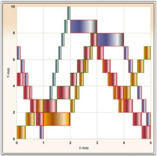

### Data Requirements

<table>
<tr>
<th colspan = "2">
Details</th></tr>
<tr>
<td>
Number of y values per point</td><td>
one</td></tr>
<tr>
<td>
Number of points      </td><td>
one or more</td></tr>
<tr>
<td>
Number of series   </td><td>
one or more</td></tr>
</table>

### Renko Customization

<table>
<tr>
<th>
Name</th><th>
Type</th><th>
Container</th><th>
Description</th></tr>
<tr>
<td>
ChartRenkoType.RenkoCost</td><td>
double</td><td>
ChartSeries</td><td>
price of one Renko segment</td></tr>
</table>

### Template

While setting template the following parameters can be used:

<table>
<tr>
<th>
Name</th><th>
Type</th><th>
Description</th></tr>
<tr>
<td>
X</td><td>
double</td><td>
x column coordinate</td></tr>
<tr>
<td>
Y</td><td>
double</td><td>
y column coordinate</td></tr>
<tr>
<td>
Width</td><td>
double</td><td>
column width</td></tr>
<tr>
<td>
IsPriceUp</td><td>
bool</td><td>
{{ '_true_' | markdownify }} – if segment shows price rising</td></tr>
<tr>
<td>
IsPriceDown</td><td>
bool</td><td>
{{ '_true_' | markdownify }} – if segment shows price recession</td></tr>
<tr>
<td>
Height</td><td>
double</td><td>
column height</td></tr>
<tr>
<td>
Interior</td><td>
Brush</td><td>
column color</td></tr>
<tr>
<td>
Series</td><td>
ChartSeries</td><td>
reference to series-owner</td></tr>
</table>
A sample which demonstrates Financial Chart Types is available in the following sample installation path.

_..My Documents\Syncfusion\EssentialStudio\<Version Number>\WPF\Chart.WPF\Samples\3.5\WindowsSamples\Chart Gallery\Financial Chart Demo_

### ThreeLineBreak Chart

Three Line Break Chart is similar in concept to point and figure charts. The Three Line Break charting method is so-named because of the number of lines typically used. It displays a series of vertical boxes ("lines") that are based on changes in prices. It ignores the passage of time.

The three-line break chart looks like a series of rising and falling lines of varying heights. Each new line, like the Xs and Os of a point and figure chart, occupies a new column. Based on closing prices (or highs and lows), a new rising line is drawn if the previous high is exceeded and a new falling line is drawn if the price hits a new low. Change in price trends are highlighted by changing colors. Use the PriceUpColor to indicate bullish trend and PriceDownColor to indicate bearish trend.

The ReversalAmount specifies the threshold amount by which the price should change to begin rendering a new vertical box in the appropriate direction.

### Data Requirements

<table>
<tr>
<th colspan = "2">
Details</th></tr>
<tr>
<td>
Number of y values per point</td><td>
one</td></tr>
<tr>
<td>
Number of points</td><td>
one or more</td></tr>
<tr>
<td>
Number of series</td><td>
one or more</td></tr>
</table>

### Renko Customization

<table>
<tr>
<th>
Name</th><th>
Type</th><th>
Container</th><th>
Description</th></tr>
<tr>
<td>
ChartThreeLineBreakType.BreakLineCount</td><td>
double</td><td>
ChartSeries</td><td>
sets the break line count Default value is 3.</td></tr>
</table>

### Template

While setting template the following parameters can be used.

<table>
<tr>
<th>
Name</th><th>
Type</th><th>
Description</th></tr>
<tr>
<td>
X</td><td>
double</td><td>
x-column coordinate</td></tr>
<tr>
<td>
Y</td><td>
double</td><td>
y-column coordinate</td></tr>
<tr>
<td>
Width</td><td>
double</td><td>
column width</td></tr>
<tr>
<td>
IsPriceUp</td><td>
bool</td><td>
{{ '_true_' | markdownify }} – if segment shows price rising</td></tr>
<tr>
<td>
IsPriceDown</td><td>
bool</td><td>
{{ '_true_' | markdownify }} – if segment shows price recession</td></tr>
<tr>
<td>
Height</td><td>
double</td><td>
column height</td></tr>
<tr>
<td>
Interior</td><td>
Brush</td><td>
column color</td></tr>
<tr>
<td>
Series</td><td>
ChartSeries</td><td>
reference to series-owner</td></tr>
</table>
A sample which demonstrates Financial Chart Types is available in the following sample installation path.

_..My Documents\Syncfusion\EssentialStudio\<Version Number>\WPF\Chart.WPF\Samples\3.5\WindowsSamples\Chart Gallery\Financial Chart Demo_

### Box and Whisker Chart

In 1977, John Tukey published an efficient method for displaying a five-number data summary. The graph is called a Box and Whisker plot (also known as BoxPlot) and summarizes the following statistical measures.

* median
* upper and lower quartiles (75 percentile to 25 percentile)
* minimum and maximum data values

The following is an example of a Box and Whisker plot.

### Custom Properties

<table>
<tr>
<th>
Name</th><th>
Type</th><th>
Container</th><th>
Description</th></tr>
<tr>
<td>
ChartType.Spacing</td><td>
double</td><td>
ChartArea</td><td>
interval between columnsPossible value lies between 0 and 1.</td></tr>
</table>

### Template

While setting template the following parameters can be used.

<table>
<tr>
<th>
Name</th><th>
Type</th><th>
Description</th></tr>
<tr>
<td>
X</td><td>
double</td><td>
x-column coordinate</td></tr>
<tr>
<td>
Y</td><td>
double</td><td>
y-column coordinate</td></tr>
<tr>
<td>
Width</td><td>
double</td><td>
column width</td></tr>
<tr>
<td>
TopWhiskerX1</td><td>
double</td><td>
x1 of upper border</td></tr>
<tr>
<td>
TopWhiskerY1</td><td>
double</td><td>
y1 of upper border</td></tr>
<tr>
<td>
TopWhiskerX2</td><td>
double</td><td>
x2 of upper border</td></tr>
<tr>
<td>
TopWhiskerY2</td><td>
double</td><td>
y2 of upper border</td></tr>
<tr>
<td>
BottomWhiskerX1</td><td>
double</td><td>
x1 of lower border</td></tr>
<tr>
<td>
BottomWhiskerY1</td><td>
double</td><td>
y1 of lower border</td></tr>
<tr>
<td>
BottomWhiskerX2</td><td>
double</td><td>
x2 of lower border</td></tr>
<tr>
<td>
BottomWhiskerY2</td><td>
double</td><td>
y2 of lower border</td></tr>
<tr>
<td>
MedianWhiskerX1</td><td>
double</td><td>
x1 of lengthwise line</td></tr>
<tr>
<td>
MedianWhiskerY1</td><td>
double</td><td>
y1 of lengthwise line</td></tr>
<tr>
<td>
MedianWhiskerX2</td><td>
double</td><td>
x2 of lengthwise line</td></tr>
<tr>
<td>
MedianWhiskerY2</td><td>
double</td><td>
y2 of lengthwise line</td></tr>
<tr>
<td>
Height</td><td>
double</td><td>
column height</td></tr>
<tr>
<td>
Interior</td><td>
Brush</td><td>
column color</td></tr>
<tr>
<td>
Series</td><td>
ChartSeries</td><td>
reference to series-owner</td></tr>
</table>

### Data Requirements

<table>
<tr>
<th colspan = "2">
Details</th></tr>
<tr>
<td>
Number of y values per point</td><td>
five (minimum, lower quartile, median, upper quartile, maximum)</td></tr>
<tr>
<td>
Number of points      </td><td>
one or more</td></tr>
<tr>
<td>
Number of series   </td><td>
one or more</td></tr>
</table>

### Outlier Calculation

Outliers that are greater than the segment height can be rendered in the chart. Essential chart also provides option to set a difference in such outlier rendering. This difference can be set using the SetDefaultOutlierVisible property.


ChartBoxAndWhiskerType.SetDefaultOutlierVisible(ser, false);

A sample which demonstrates Box And Whisker Chart Type is available in the following sample installation path.

..My Documents\Syncfusion\EssentialStudio\<Version Number>\WPF\Chart.WPF\Samples\3.5\WindowsSamples\Chart Gallery\Box-and-Whisker Chart Demo

### Fast HiLo Open Close

Fast High Low (HiLo) Open Close charts are similar to HiLo Open Close Charts and are used in stock analysis. This chart type expects 4 Y values for every point in the series. Those values should represent the High, Low, Open and Close values of the stock, in that order, for a particular period. 

The Fast High Low (HiLo) Open Close charts have the following advantages:

* The Fast HiLo Open Close charts are rendered using drawing visuals. 
* They load faster than the HiLo Open Close charts. 
* They ensure high performance for displaying data. 
* They can be used as real time charts to render huge number of data points.

The Chart type HiLo Open Close is added in the Enum of type ChartTypes.

### Data Requirements

<table>
<tr>
<th colspan = "2">
Details</th></tr>
<tr>
<td>
Number of y values per point</td><td>
Four (open, close, high and low, in that order)</td></tr>
<tr>
<td>
Number of points      </td><td>
one or more</td></tr>
<tr>
<td>
Number of series   </td><td>
one or more</td></tr>
</table>

### Template

While setting template the following parameters can be used:

<table>
<tr>
<th>
Name</th><th>
Type</th><th>
Description</th></tr>
<tr>
<td>
HiX</td><td>
double</td><td>
x-coordinate of upper border</td></tr>
<tr>
<td>
HiY</td><td>
double</td><td>
y-coordinate of upper border</td></tr>
<tr>
<td>
LoX</td><td>
double</td><td>
x-coordinate of lower border</td></tr>
<tr>
<td>
LoY</td><td>
double</td><td>
y-coordinate of lower border</td></tr>
<tr>
<td>
StartOpenX</td><td>
double</td><td>
x start coordinate of opening price</td></tr>
<tr>
<td>
StartOpenY</td><td>
double</td><td>
y start coordinate of opening price</td></tr>
<tr>
<td>
EndOpenX</td><td>
double</td><td>
x end coordinate of opening price</td></tr>
<tr>
<td>
EndOpenY</td><td>
double</td><td>
y end coordinate of opening price</td></tr>
<tr>
<td>
StartCloseX</td><td>
double</td><td>
x start coordinate of closing price</td></tr>
<tr>
<td>
StartCloseY</td><td>
double</td><td>
y start coordinate of closing price</td></tr>
<tr>
<td>
EndCloseX</td><td>
double</td><td>
x end coordinate of closing price</td></tr>
<tr>
<td>
EndCloseY</td><td>
double</td><td>
y end coordinate of closing price</td></tr>
<tr>
<td>
Interior</td><td>
Brush</td><td>
column color</td></tr>
<tr>
<td>
Series</td><td>
ChartSeries</td><td>
reference to series-owner</td></tr>
</table>
A sample which demonstrates Financial Chart Types is available in the following sample installation path.

_..My Documents\Syncfusion\EssentialStudio\<Version Number>\WPF\Chart.WPF\Samples\3.5\WindowsSamples\Chart Performance\Fast chart types_

The following code illustrates the creation of Fast High Low (HiLo) Open Close charts.




<syncfusion:ChartSeries Type="HiLoOpenClose" Name="series1" Stroke="Black" DataSource="{Binding}"/>




ChartSeries series = new ChartSeries();

series.Type = ChartTypes.HiLoOpenClose;



Run the sample. The following output is provided.

## Pie Charts

### Pie Chart

A Pie Chart renders Y values as slices in a pie. These slices are rendered in proportion to the whole which is simply the sum of all the Y values in the series. Consequently, Pie Charts are used to visualize the proportional contribution (in terms of percentage or fraction) of categories of data to the whole data set. The X values in the data series will only be treated as nominal (categorical, qualitative) data. The Pie Chart can display only one DataSeries at a time.

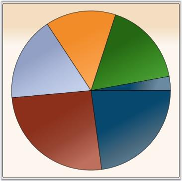

### Data Requirements

<table>
<tr>
<th colspan = "2">
Details</th></tr>
<tr>
<td>
Number of y values per point</td><td>
one</td></tr>
<tr>
<td>
Number of points      </td><td>
one or more</td></tr>
<tr>
<td>
Number of series</td><td>
one or more</td></tr>
</table>

### Pie Type Properties

<table>
<tr>
<th>
Name</th><th>
Type</th><th>
Container</th><th>
Description</th></tr>
<tr>
<td>
ChartPieType.ExplodedIndex</td><td>
double</td><td>
ChartArea</td><td>
index of segment which should be leant out</td></tr>
</table>

### Template

While setting template, the following parameters can be used.

<table>
<tr>
<th>
Name</th><th>
Type</th><th>
Description</th></tr>
<tr>
<td>
TickX</td><td>
double</td><td>
x-coordinate of sector center</td></tr>
<tr>
<td>
TickY</td><td>
double</td><td>
y-coordinate of sector center</td></tr>
<tr>
<td>
IsExploded</td><td>
double</td><td>
{{ '_true_' | markdownify }} if segment is leant out</td></tr>
<tr>
<td>
ExplodRadius</td><td>
double</td><td>
radius to which the segment should be leant out</td></tr>
<tr>
<td>
Geometry</td><td>
Geometry</td><td>
segment geometry</td></tr>
<tr>
<td>
Interior</td><td>
Brush</td><td>
column color</td></tr>
<tr>
<td>
Series</td><td>
ChartSeries</td><td>
reference to series-owner</td></tr>
<tr>
<td>
AngleOfSliceRotation</td><td>
double</td><td>
specifies the angle (in radians) at which the segment is renderedIt is useful for creating animated templates.</td></tr>
<tr>
<td>
StartAngle</td><td>
double</td><td>
specifies the angle (in radians) of one side of the pie</td></tr>
<tr>
<td>
EndAngle</td><td>
double</td><td>
specifies the angle (in radians) of the other side of the pie</td></tr>
</table>
A sample which demonstrates Pie Chart Types is available in the following sample installation path.

_..My Documents\Syncfusion\EssentialStudio\<Version Number>\WPF\Chart.WPF\Samples\3.5\WindowsSamples\Chart Gallery\Pie Chart Demo_

### Doughnut Chart

Doughnut charts are pie charts with a hole, whose value is specified as the doughnut coefficient. The Doughnut Chart is best suited for presenting data in proportions.

### Data Requirements

<table>
<tr>
<th colspan = "2">
Details</th></tr>
<tr>
<td>
Number of y values per point</td><td>
one</td></tr>
<tr>
<td>
Number of points   </td><td>
one or more</td></tr>
<tr>
<td>
Number of series</td><td>
one or more</td></tr>
</table>

### Doughnut Type Properties

<table>
<tr>
<th>
Name</th><th>
Type</th><th>
Container</th><th>
Description</th></tr>
<tr>
<td>
ChartDoughnutType.ExplodedIndex</td><td>
int</td><td>
ChartSeries</td><td>
index of segment which should be leant out</td></tr>
<tr>
<td>
ChartDoughnutType.DoughnutCoefficient</td><td>
double</td><td>
ChartSeries</td><td>
number which shows relation of inner radius to outer radius</td></tr>
</table>

### Template

While setting template the following parameters can be used:

<table>
<tr>
<th>
Name</th><th>
Type</th><th>
Description</th></tr>
<tr>
<td>
TickX</td><td>
double</td><td>
x-coordinate of sector center</td></tr>
<tr>
<td>
TickY</td><td>
double</td><td>
y-coordinate of sector center</td></tr>
<tr>
<td>
IsExploded</td><td>
double</td><td>
{{ '_true_' | markdownify }} if segment is leant out</td></tr>
<tr>
<td>
DoughnutCoefficient</td><td>
double</td><td>
number which shows relation of inner radius to outer</td></tr>
<tr>
<td>
ExplodRadius</td><td>
double</td><td>
radius to which the segment should be leant out</td></tr>
<tr>
<td>
Geometry</td><td>
Geometry</td><td>
segment geometry</td></tr>
<tr>
<td>
Interior</td><td>
Brush</td><td>
column color</td></tr>
<tr>
<td>
Series</td><td>
ChartSeries</td><td>
reference to series-owner</td></tr>
</table>
A sample which demonstrates Pie Chart Types is available in the following sample installation path.

_..My Documents\Syncfusion\EssentialStudio\<Version Number>\WPF\Chart.WPF\Samples\3.5\WindowsSamples\Chart Gallery\Pie Chart Demo_

## Polar Chart

Essential Chart supports the implementation of Polar chart in the chart control. This chart is used to display different values and angles in the form of a graph.

APolar Chart is a circular graph on which data is displayed in terms of values and angles. The X values define the angles at which the data points will be plotted. The Y value defines the distance of the data points from the center of the graph, with the center of the graph usually starting at 0.

It is a form of graph that allows a visual comparison between several quantitative or qualitative aspects of a situation and also allows a visual comparison between several situations that are drawn using the same axes (poles).

### Data Requirements

<table>
<tr>
<th colspan = "2">
Details</th></tr>
<tr>
<td>
Number of y values per point</td><td>
one</td></tr>
<tr>
<td>
Number of points     </td><td>
one or more</td></tr>
<tr>
<td>
Number of series</td><td>
one or more</td></tr>
</table>

### Template

While setting template the following parameters can be used.

<table>
<tr>
<th>
Name</th><th>
Type</th><th>
Description</th></tr>
<tr>
<td>
X1</td><td>
double</td><td>
x-coordinate of first point</td></tr>
<tr>
<td>
Y1</td><td>
double</td><td>
y-coordinate of first point</td></tr>
<tr>
<td>
X2</td><td>
double</td><td>
x-coordinate of second point</td></tr>
<tr>
<td>
Y2</td><td>
double</td><td>
y-coordinate of second point</td></tr>
<tr>
<td>
Interior</td><td>
Brush</td><td>
column color</td></tr>
<tr>
<td>
Series</td><td>
ChartSeries</td><td>
reference to series-owner</td></tr>
</table>
A sample that illustrates Circular Chart Type is available in the following sample installation path.

_..My Documents\Syncfusion\EssentialStudio\<Version Number>\WPF\Chart.WPF\Samples\3.5\WindowsSamples\Chart Gallery\Circular Chart Demo_

### Special Support in Radar and Polar Charts

This feature provides IsClosed and DrawType support for Radar and Polar chart types. The IsClosed feature specifies whether the series drawn should be in closed form. This can be applied to line-type series in polar and radar charts. The DrawType feature specifies in which form or shape the series should be drawn. 

Following are the different DrawType categories for radar and polar charts

### Line

When the DrawType is Line, the series is drawn as a line segment connecting each point in the chart. The following image illustrates this.

### Area

When the DrawType is Area, the series is drawn as a single area segment connecting each point in the chart. The following image illustrates this.

### Symbol

When the DrawType is Symbol, the series is drawn as separate points as a symbol without connecting each point in the chart. The following image illustrates this.

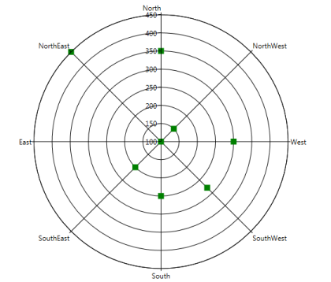

Following are the screenshots of the chart when IsClosed is set to True and False:

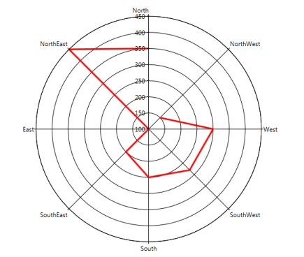

### Properties

<table>
<tr>
<th>
Property</th><th>
Description</th><th>
Type</th><th>
Data Type</th></tr>
<tr>
<td>
IsClosed</td><td>
Used to specify how to draw the segment (closed or not closed).</td><td>
Attached</td><td>
Bool</td></tr>
<tr>
<td>
DrawType</td><td>
Used to specify what template is to be applied to series.</td><td>
Attached</td><td>
Enum (Line, Area, Symbol)</td></tr>
<tr>
<td>
PolarSymbol</td><td>
Used to assign symbol for polar charts and will be displayed when draw type is Symbol.</td><td>
Attached</td><td>
DataTemplate</td></tr>
<tr>
<td>
RadarSymbol</td><td>
Used to assign symbol for radar charts and will be displayed when the draw type is Symbol.</td><td>
Attached</td><td>
DataTemplate</td></tr>
</table>
Adding Support for IsClosed and DrawType in Radar and Polar Charts to an Application 




Polar Chart

<syncf:ChartArea syncf:ChartPolarType.IsClosed="True" syncf:ChartPolarType.PolarSymbol="{StaticResource sym}" syncf:ChartPolarType.DrawType="Line" Name="Area1">     

 <syncf:ChartSeries StrokeThickness="3" Interior="Red" Type="Polar" x:Name="Series1" Data="0,100,1,150,2,300,3,50,4,214,5,166" >                   

</syncf:ChartSeries>

</syncf:ChartArea>

Radar Chart

<syncf:ChartArea syncf:ChartRadarType.IsClosed="True" syncf:ChartRadarType.PolarSymbol="{StaticResource sym}" syncf:ChartRadarType.DrawType="Line" Name="Area1">     

 <syncf:ChartSeries StrokeThickness="3" Interior="Red" Type="Radar" x:Name="Series1" Data="0,100,1,150,2,300,3,50,4,214,5,166" >                   

</syncf:ChartSeries>

</syncf:ChartArea>





Polar Chart

ChartPolarType.SetPolarSymbol(Series1, this.Resources["sym"] as DataTemplate);

ChartPolarType.SetDrawType(Area1, ChartPolarDrawType.Line);    ChartPolarType.SetIsClosed(Area1, true);

Radar Chart

ChartRadarType.SetRadarSymbol(Series1, this.Resources["sym"] as DataTemplate);

ChartRadarType.SetDrawType(Area1, ChartRadarDrawType.Line);    ChartRadarType.SetIsClosed(Area1, true);




### Stacking Charts

Stacking Charts are similar to regular charts except that the Y values stack on top of each other in the specified series order. Stacking charts help visualize data that is a sum of parts, each of which is in a series. 

There are different types of stacking charts.

### Fast Stacking Column Charts

Fast Stacking Column charts are similar to Stacked-column charts with y-coordinate values stacked over one another, in series order allowing the chart data to be visualized as sum of series parts. The following points mark the advantages of Fast Stacking Column over Stacked-column charts:

* The Fast Stacking Column charts are rendered using drawing visuals. 
* They load faster than the Stacked-column charts. 
* They ensure high performance for displaying data. 
* They can be used as real time charts to render huge number of data points.

The Fast Stacking Column chart is added in the Enum of type ChartTypes.

### Data Requirements

<table>
<tr>
<th colspan = "2">
Details</th></tr>
<tr>
<td>
Number of y values per point</td><td>
one</td></tr>
<tr>
<td>
Number of points</td><td>
one or more</td></tr>
<tr>
<td>
Number of series</td><td>
one or more</td></tr>
</table>

### Custom StackingColumn100 Properties

<table>
<tr>
<th>
Name</th><th>
Type</th><th>
Container</th><th>
Description</th></tr>
<tr>
<td>
ChartStackingColumn100Type.ShowValueAsProbability</td><td>
bool</td><td>
Chart Area</td><td>
The y-axis range is set between 0 and 100If true, the y-axis range is set between 0 and 1. Default value is false.</td></tr>
</table>

### Template

While setting template the following parameters can be used:

<table>
<tr>
<th>
Name</th><th>
Type</th><th>
Description</th></tr>
<tr>
<td>
X</td><td>
double</td><td>
x column coordinate</td></tr>
<tr>
<td>
Y</td><td>
double</td><td>
y column coordinate</td></tr>
<tr>
<td>
Width</td><td>
double</td><td>
column width</td></tr>
<tr>
<td>
Height</td><td>
double</td><td>
column height</td></tr>
<tr>
<td>
Interior</td><td>
Brush</td><td>
column color</td></tr>
<tr>
<td>
IsUpper</td><td>
boolean</td><td>
true–if this is upper column</td></tr>
<tr>
<td>
IsLower</td><td>
boolean</td><td>
true–if this is lower column</td></tr>
<tr>
<td>
Series</td><td>
ChartSeries</td><td>
reference to series-owner</td></tr>
</table>
The following code example illustrates the usage of Fast Stacking Column charts.





<syncfusion:ChartSeries Type="FastStackingColumn" Name="series1" Stroke="Black" DataSource="{Binding}"/>




ChartSeries series = new ChartSeries();

series.Type = ChartTypes.FastStackingColumn;




Run the sample. 

A Fast Stacking Column chart is displayed pertaining to the data source it is bound to.

A sample which demonstrates Fast Stacking Column Chart Types is available in the following sample installation path.

..My Documents\Syncfusion\Essential Studio\<Version Number>\WPF\Chart.WPF\Samples\3.5\WindowsSamples\Chart Performance\Fast chart types

Stacking Positive and Negative Values for Stacking Chart Types

Support ahs been provided for stacking positive and negative values in stacking chart types. Calculation logic must be the same and it has to adhere to the general standards of stacking chart type.

Chart types are:

* Stacking Column 
* Stacking Bar 
* Stacking Area

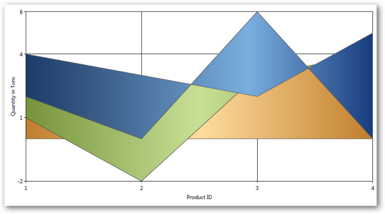

### Properties

_Properties_

<table>
<tr>
<th>
Property </th><th>
Description </th><th>
Type </th><th>
Value it accepts</th><th>
Any other dependencies/sub properties associated</th></tr>
<tr>
<td>
RequiresNegativeSeriesStack</td><td>
Specifies whether the positive and negative series should be stacked seperately.</td><td>
Bool</td><td>
True/False</td><td>
NA</td></tr>
</table>

## Step Charts

Step Charts are similar to regular charts except that the values are drawn continuously, step by step without any gaps in-between. 

There are two types of step charts.

## Break Lines

Line charts with missing data points can be drawn with gaps for the missing points. When there is a huge gap between consecutive points, we could make the lines break for more clarity.

SetBreakLineForNonIndexedData is used to specify whether the line segments could be drawn with break lines. SetBreakLineForDoublePointsDistanceMoreThan is used to set the distance for lines that should be broken.


ChartLineType.SetBreakLineForNonIndexedData(Chart1.Areas[0].Series[0], true);

ChartLineType.SetBreakLineForDoublePointsDistanceMoreThan(Chart1.Areas[0].Series[0], 1);


If the data given are 1, 2, 4, 5, 8, 10, 12, 13, 14, 15, 16, 17 and the SetBreakLineForDoublePointsDistanceMoreThan is passed with a value 1, all points that don't have a point after 1 will not be drawn. Following screenshot shows the output for this data.

N> This feature can be applied for both Line and Spline type charts. This can be applied for both Double and DateTime type axis values.

Break Lines for Spline Type


ChartSplineType.SetBreakLineForNonIndexedData(Chart1.Areas[0].Series[0], true);

ChartSplineType.SetBreakLineForDoublePointsDistanceMoreThan(Chart1.Areas[0].Series[0], 1);

The following code could be used to specify the break distance for axis with DateTime ValueTypes.


ChartLineType.SetBreakLineForTimeSpanPointsDistanceMoreThan(Chart2.Areas[0].Series[0], new TimeSpan(1, 0, 0, 0));

ChartSplineType.SetBreakLineForTimeSpanPointsDistanceMoreThan(Chart2.Areas[0].Series[0], new TimeSpan(1, 0, 0, 0));


N> This feature can be applied for non-indexed data alone. It cannot be applied for 3D charts.

## Heat Map Control

HeatMapControl is a control that lays out bound child items in rectangles, whose area is based on their "weight", and whose color is based on their "color weight". It can also be bound to hierarchical data.

<table>
<tr>
<th>
Property</th><th>
Description</th></tr>
<tr>
<td>
ColorCalculationLevel</td><td>
specifies the items at a level (when bound to hierarchical data) for which the ColorWeight should be processedDefault value is -1, indicating this will be processed for all leaf nodes in the hierarchy. 0 indicates the top level of items in the bound hierarchy and so on. If you are adding HeatMapItems manually, make sure to set their Level property appropriately. This is a dependency property.</td></tr>
<tr>
<td>
ColorValuePath</td><td>
gets or sets a path to a value on the source object to serve as the "color weight" of the objectThis is a dependency property. This is used for items at all levels. It can be overridden for items at specific levels through the corresponding HeatMapItem's setting.</td></tr>
<tr>
<td>
ColorWeightsInfo</td><td>
contains computed information about the low and high colors in the bound items</td></tr>
<tr>
<td>
HighestWeightColor</td><td>
specifies the color that will be used on the item with the highest color weightThis is a dependency property. Default value is Green.</td></tr>
<tr>
<td>
ItemsLayoutMode</td><td>
specifies the mode in which items should be laid outThis setting will be applied at all levels. To customize this for specific levels, check the corresponding HeatMapItem setting. Default value is HeatMapLayoutMode.Squarified. This is a dependency property.</td></tr>
<tr>
<td>
LowestWeightColor</td><td>
specifies the color that will be used on the item with the lowest color weightThis is a dependency property. Default value is Cornsilk. </td></tr>
<tr>
<td>
MedianWeight</td><td>
specifies the "median color weight" on which the MedianWeightColor will be appliedThe valid values for this property are between 0 to 100. Default value is 50. This is a dependency property.</td></tr>
<tr>
<td>
MedianWeightColor</td><td>
specifies the color that will be used on the item with the median color weightThis is a dependency property. Default value is Yellow.</td></tr>
<tr>
<td>
PreferredItemsPanelHeight</td><td>
when bound to a grouped CollectionViewSource, this property specifies the preferred height you want to use for groupsDefault value is 300. This is a dependency property.</td></tr>
<tr>
<td>
PreferredItemsPanelWidth</td><td>
when bound to a grouped CollectionViewSource, this property specifies the preferred width you want to use for groupsDefault value is 300. This is a dependency property.</td></tr>
<tr>
<td>
WeightValuePath</td><td>
gets or sets a path to a value on the source object to serve as the "weight" of the objectThis is a dependency property. This is used for items at all levels. It can be overridden for items at specific levels, through the corresponding HeatMapItem's setting.</td></tr>
</table>

### Gradient Support for Heat Maps

The heat map control contains the IsGradientBrush property, which supports linear gradient brushes in its interior.

### Property Details

<table>
<tr>
<th>
Name of Property</th><th>
Description </th><th>
Type of Property</th><th>
Value It Accepts</th><th>
Property syntax</th><th>
Sub properties</th></tr>
<tr>
<td>
IsGradientBrush</td><td>
Used to set the gradient brush for a heat map control.</td><td>
Dependency </td><td>
Bool or True/False.</td><td>
IsGradientBrush="True"</td><td>
LowestWeightGradient,  MedianWeightGradient,                          HighestWeightGradient (All properties are type of brushes)</td></tr>
</table>

### Setting Gradient Brush for a Heat Map Control

The following code is used to set a gradient brush for a heat map control.


<syncfusion:HeatMapControl Grid.Row="0" x:Name="heatMap" IsGradientBrush="True"  LowestWeightGradient="{StaticResource SeriesBInterior}"  

MedianWeightGradient="{StaticResource SeriesAInterior}"                                     HighestWeightGradient="{StaticResource SeriesCInterior}" />



When the code runs, the following output displays.

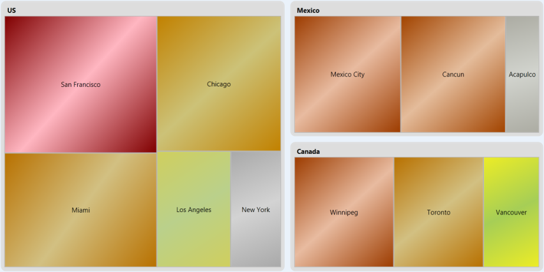

### Resize the Font to Fit in the HeatMap Item

This feature automatically resizes the content to fit inside the HeatMap item, so that the font size of the content is adjusted according to the width of the Heat Map item and the orientation is changed according to the height and width of the HeatMap item.

### Use Case Scenarios

It is used in the field where data are represented in a two dimensional map namely Population Survey. The data of the survey will automatically fit into the HeatMap item by resizing its font size.

### Sample Link

The path to access the sample is: 

_<sample installation location>\Syncfusion\EssentialStudio\Version Number\WPF\Chart.WPF\WindowSamples\3.5\Controllers \Heat Map\FlatListDemo"_

Text Wrapping Behavior in HeatMapItem

The HeatMap control ships with the enhancement of customizing the text within the HeatMap item using the enum property TextIntersectAction which includes Shrink and Wrap to shrink the size of the overlapped text on resizing and to support multiline text respectively.

### Use Case Scenarios

1. Avoid overlapping of text on resizing.
2. Make the text inside the HeatMapItem readable.

### Properties

<table>
<tr>
<th>
Property</th><th>
Description</th><th>
Type</th><th>
Data Type</th></tr>
<tr>
<td>
TextIntersectAction </td><td>
Sets the intersect action for the text in the HeatMapItem.</td><td>
Dependency</td><td>
Enum</td></tr>
</table>

### Sample Links

1. Open the Sample Browser and select the WPF platform.
2. Select the Chart product.
3. SB > Chart > Heat Map > Flat List Demo.

Adding Text Wrapping Behavior in HeatMapItem to an Application

To add the text wrapping support to the HeatMapItem:



<syncfusion:HeatMapControl x:Name="heatMap" TextIntersectAction="Wrap"/>




 heatMap.TextIntersectAction = TextIntersectActions.Wrap;




To shrink the text for the HeatMapItem.





<syncfusion:HeatMapControl x:Name="heatMap" TextIntersectAction="Shrink"/>





 heatMap.TextIntersectAction = TextIntersectActions.Shrink;





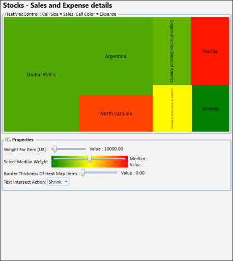

## FastChart

### Performance Improvements and New fast chart types 

Fast Column and Fast Scatter Charts are similar to Column and Scatter charts respectively. It uses vertical bars (called columns) and scattered circles (called ellipse) to display different values of one or more items.

### The advantages of Fast Charts:

* Loads faster than other charts
* Ensures high performance for displaying data. 
* They can be used as real time charts to render huge number of data points.

### Use Case Scenarios

It can be used for rendering large number of points like Stock Market Analysis.

Adding FastScatter to an Application 

FastScatter and FastColumn Chart types can be added using the property Type in ChartSeries.




//Add FastScatter chart type to the series.

  <sync:ChartSeries  Type="FastScatter" />




//Add FastScatter chart type to the series.

Chart1.Areas[0].Series[0].Type = ChartTypes.FastScatter;








//Add FastColumn chart type to the series.

  <sync:ChartSeries  Type="FastColumn" />





//Add FastColumn chart type to the series.

Chart1.Areas[0].Series[0].Type = ChartTypes.FastColumn;




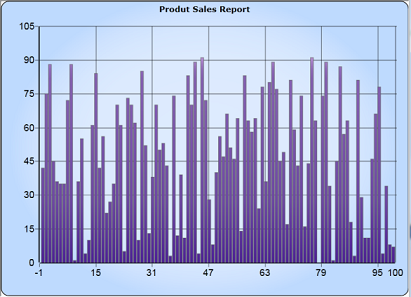

Customizing the Height and Width of the Fast Scatter Chart

You can modify the size of the Fast Scatter chart by using the Height and Width properties of FastScatter-Type, as shown in the following code example:




<syncfusion:ChartSeries Name="Series1" Type="FastScatter" 

DataSource="{Binding ExpensiveCarDetails}" BindingPathX="Position" BindingPathsY="Price" syncfusion:ChartFastScatterType.FastScatterHeight="30" syncfusion:ChartFastScatterType.FastScatterWidth="30">

</syncfusion:ChartSeries>




ChartFastScatterType.SetFastScatterWidth(seriesname, 30);
ChartFastScatterType.SetFastScatterHeight(seriesname, 30);




## Custom Charts

Essential Chart WPF now comes with the Custom Chart Type that allows users to customize the appearance of the graph thereby improving the look and feel of the chart. This is achieved by initializing the “Custom” enum value to the Type property of ChartSeries control and by adding the customized chart to the ChartType property of ChartSeries.

### Use Case Scenarios

Users can draw a new chart type that is not available in Essential Chart WPF. Users can create a new HybirdAreaLine chart type, which is a combination of Area and Line chart types.

Adding Custom Chart Type to an Application 

To set the Custom type feature in chart application: 

1. Initialize the Custom Enum value to the Type property of ChartSeries control.

   ~~~ xaml
   
			   <syncfusion:ChartSeries Type="Custom" />

				//Initialize Chart type as Custom

				chart.Areas[0].Series[0].Type = ChartTypes.Custom;

   ~~~

4. Create a new custom class, which should inherit the Segment abstract class. 
5. Create another new custom class, which should be inherited by ChartType class and override the CalculateSegments method to customize the new chart type based on requirements. 
6. In these CalculateSegments methods, add create new Segment object and add it to the Segments property of ChartSeries control.

   ~~~ csharp

				public class HybridChartSegment : ChartSegment

				{

					public override void Update(IChartTransformer transformer)

					{

			//transformer.TransformToVisible method has used to convert actual Chart points into the pixel coordinates

						………

					}       

				}

				public class HybridChartType : ChartType

				{

					protected override void CalculateSegments(ChartSeries series, ChartIndexedDataPoint[] points)

					{

							…..

							//Add the HybirdArea segment to the Chart Series

							series.Segments.Add(new HybridChartSegment(segmentPoints.ToArray(), points, series, hybirdIntersectLine));

							…..

					 }

				 }

   ~~~

7. Create a new object for your own custom class and initialize it to the ChartType property of ChartSeries control.

   ~~~ csharp
   
					//Inititalize the customized Hybrid Area line type to ther Series.

					chart.Areas[0].Series[0].ChartType = new HybridChartType();

   ~~~
   
8. Finally, define a Template design for your new custom chart type by initializing the Template property of ChartSeries control.

   ~~~ xaml

				<!--Hybird Area Line Type Template-->

				<DataTemplate x:Key="HybirdAreaLineType">

					<Grid>

						<Grid Clip="{Binding Geometry}">

							<Rectangle Fill="{Binding HighValueColor}"/>

							<Rectangle Fill="{Binding LowValueColor}"  Margin="{Binding HybirdMargin}"  />

						</Grid>

						<Line X1="0" Y1="0" X2="{Binding Series.Area.ActualWidth}" Y2="0"  Margin="{Binding HybirdMargin}" HorizontalAlignment="Stretch" VerticalAlignment="Stretch" Stroke="{Binding LineColor}" StrokeThickness="5"/>

					</Grid>

				</DataTemplate>

					chart.Areas[0].Series[0].Template = App.Current.Resources["HybirdAreaLineType"] as DataTemplate;

   ~~~

   

Sample Link

To run the UI Chart WPF samples:

1. On the dashboard, click the WPF Combo box and then select Run Locally Installed Samples. The WPF sample browser opens.
2. Select Chart.
3. Navigate to Chart Gallery -> CustomChart Type demo.
4. Click the Run Sample button.

   Or

5. Go to

   _<<EssentialStudioInstalledLocation>>\Syncfusion\EssentialStudio\<Version>\WPF\Chart.WPF\Samples\3.5\WindowsSamples\Chart Gallery\ Custom Chart Type Demo_

   There are two folders namely C Sharp and Visual Basic. The user can choose the required folder.

6. Run the sample by opening the project file.

