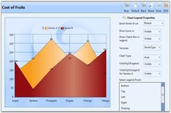

# Chart and ChartArea Legends in WPF Chart (Classic)

## Legend Label

Essential Chart allows you to customize the legend icon of a chart. You can change the legend Icon of a chart legend by using the options provided. The legend icons can be represented in two ways:

* It can be set as a symbol.
* It can be set as the chart icon (in case of chart series).

The LegendIcon property is used to set the required icon.

* If LegendIcon property is set to a symbol, it will be displayed as the selected legend icon.
* If LegendIcon property is set to the SeriesType, the corresponding chart icon will be displayed as legend icon.

### Properties

The following table provides more information on the property used.

<table>
<tr>
<th>
Property</th><th>
Description</th><th>
Type</th><th>
Value Returned</th></tr>
<tr>
<td>
LegendIcon</td><td>
The legend icon is displayed according to the option selected. </td><td>
Dependency</td><td>
Enum(ChartLegenIcon)</td></tr>
</table>

### Events

The following table provides more information on the event used.

<table>
<tr>
<th>
Event</th><th>
Event Trigger</th><th>
Event Args</th><th>
Purpose</th></tr>
<tr>
<td>
LegendIconChanged</td><td>
The event is triggered by calling a method when the value of LegendIcon is changed.</td><td>
OnLegendIconChanged</td><td>
The Icon is changed whenever the value for LegendIcon property changes.</td></tr>
</table>

### Methods

The following table provides more information on the method used.

<table>
<tr>
<th>
Method</th><th>
Parameters</th><th>
Return Type</th><th>
Description</th></tr>
<tr>
<td>
UpdateLegendIcon</td><td>
ChartSeries</td><td>
Void</td><td>
Updation of the legend icon with a new icon.</td></tr>
</table>

### Customizing Legend Icon

The legend icon can be customized by using the following code exaples.

1. Using XAML

   ~~~ xaml

				<syncfusion:ChartLegend Name="chrtlgnd" BorderThickness="0.5" ></syncfusion:ChartLegend>

				<syncfusion:ChartSeries Name="SeriesA" LegendIcon="Circle" Type="Bar" BindingPathX="FruitName"

				BindingPathsY="Price,NumberOfFruits,FruitID,Year" Label="Series A" Stroke="#FF000000" StrokeThickness="0.5" ></syncfusion:ChartSeries>
   ~~~
   
2. Using C#

   ~~~ csharp

				Chart1.Areas[0].Series[0].LegendIcon = ChartLegendIcon.Circle;
   ~~~
   Run the code. The following output is displayed.

   

   