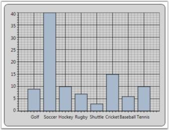
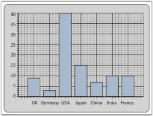

# Data Binding in WPF Chart (Classic)

## IList Data Source

Simple IList-based instances can be easily bound to the Chart. The following code example illustrates how to bind IList-based instances as the data source to Chart.



public IList marks()

{

            List<mark> markList = new List<mark>();

            markList.Add(new mark() { ID = 0, Name = "John", Mark1 = 97, Mark2 = 99, Mark3 = 85, Mark4 = 92 });

            markList.Add(new mark() { ID = 1, Name = "James",Mark1 = 45, Mark2 = 35, Mark3 = 48, Mark4 = 42 });

            markList.Add(new mark() { ID = 2, Name = "Sam",Mark1 = 32, Mark2 = 65,Mark3 = 67,Mark4 = 78});

            markList.Add(new mark() { ID = 3, Name = "Victor",Mark1 = 30, Mark2 = 39,Mark3 = 38,Mark4 = 56});

            markList.Add(new mark() { ID = 4, Name = "Faith", Mark1= 25,Mark2 = 45,Mark3 = 77,Mark4 = 19});

            markList.Add(new mark() { ID = 5, Name ="Joyce", Mark1= 50,Mark2 = 35,Mark3 = 54,Mark4 = 55});

            markList.Add(new mark() { ID = 6, Name = "Silvy",Mark1 = 70, Mark2 = 28, Mark3 = 35, Mark4 = 45 });

            markList.Add(new mark() { ID = 7, Name = "Ian",Mark1 = 45,Mark2 = 85,Mark3 = 77,Mark4 =19});

            markList.Add(new mark() { ID = 8, Name = "Mandy", Mark1 = 90, Mark2 = 45, Mark3 = 54, Mark4 = 55 });

            markList.Add(new mark() { ID = 9, Name = "Alan",  Mark1 = 50, Mark2 = 28, Mark3 = 25, Mark4 = 45 });

            return markList;

}

The following screenshot illustrates how a Chart Series is associated to the Chart by using IList-based instances.

### Data-Binding in WPF Chart (Classic) for Child Level Properties

## XML Data Source

Chart provides built-in support to bind XML data created through XmlDataProvider instances. The following code example illustrates this.




<XmlDataProvider x:Key="myXmlData">

            <x:XData>

                <Travel xmlns="">

                    <TravelDetails DayCount="1"  Kms="30" Day="Mon"/>

                    <TravelDetails DayCount="2" Kms="45" Day="Tue"/>

                    <TravelDetails DayCount="3" Kms="50" Day="Wed"/>

                    <TravelDetails DayCount="4" Kms="60" Day="Thu"/>

                    <TravelDetails DayCount="5" Kms="55" Day="Fri"/>

                    <TravelDetails DayCount="6" Kms="75" Day="Sat"/>

                    <TravelDetails DayCount="7" Kms="55" Day="Sun"/>

                    <TravelDetails DayCount="8" Kms="40" Day="Mon"/>

                    <TravelDetails DayCount="9" Kms="30" Day="Tue"/>

                   </Travel>

            </x:XData>

</XmlDataProvider>

<syncfusion:ChartSeries DataSource="{Binding Source={StaticResource myXmlData}, XPath=Travel/TravelDetails}" BindingPathX="DayCount" BindingPathsY="Kms" IsIndexed="False"  Name="series1"  Label="Series1" Type="FastStackingColumn" Interior="{StaticResource SeriesAInterior}" />




chart1.Areas[0].Series[0].DataSource = xmlDataProvider1;

chart1.Areas[0].Series[0].BindingPathX = "Month";

chart1.Areas[0].Series[0].BindingPathsY = new string[] { "Sales" };  





## ObservableCollection Data Source

Essential Chart provides support to bind data to an ObservableCollection or INotifyCollectionChanged collection. Also, the chart automatically gets updated when any changes are made to the data source.

The following code illustrates how to bind an ObservableCollection as data source to Chart.




<Window.Resources>

  <local:Sports x:Key="sportinterest"/>

</Window.Resources>

<sfchart:ChartSeries DataSource="{StaticResource sportinterest}" Type="Column" BindingPathX="SportName" BindingPathsY="Interest"/>



// Namespace to be included for INotifyPropertyChanged interface.

using System.ComponentModel;

// Namespace to be included for ObservableCollection.

using System.Collections.ObjectModel;

public class Sport : INotifyPropertyChanged

{

private int sportid;

private string sportname;

private double interest;

public event PropertyChangedEventHandler PropertyChanged;

public Sport()

{

}

public Sport(int sportid, string sportname, double interests)

{

this.sportid = sportid;

this.sportname = sportname;

this.interest = interests;

}

public override string ToString()

{

return sportname.ToString();

}

public int SportID

{

get { return sportid; }

set

{

sportid = value;

OnPropertyChanged("SportID");

}

}

public string SportName

{

get { return sportname; }

set

{

sportname = value;

OnPropertyChanged("SportName");

}

}

public double Interest

{

get { return interest; }

set

{

interest = value;

OnPropertyChanged("Interest");

}

}

protected void OnPropertyChanged(string info)

{

PropertyChangedEventHandler handler = PropertyChanged;

if (handler != null)

{

handler(this, new PropertyChangedEventArgs(info));

}

}

}

public class Sports : ObservableCollection<Sport>

{

public Sports() : base()

{

Add(new Sport(101, "Golf", 9));

Add(new Sport(102, "Soccer", 40));

Add(new Sport(103, "Hockey", 10));

Add(new Sport(104, "Rugby", 7));

Add(new Sport(105, "Shuttle", 3));

Add(new Sport(106, "Cricket", 15));

Add(new Sport(107, "Baseball", 6));

Add(new Sport(108, "Tennis", 10));

}

}  




The following screenshot illustrates how a Chart Series is associated to the Chart by using ObservableCollection data source.

## CollectionViewSource Data Source

You can bind CollectionViewSource as a Chart Series Data Source to Chart. Chart listens to the changes in the source and gets updated automatically. The following code illustrates how to bind CollectionViewSource as data source to Chart.




<Window.Resources>

<local:SalesinLocation x:Key="saleslocation"/>

<CollectionViewSource Source="{StaticResource saleslocation}" x:Key="cvs"  >

<CollectionViewSource.SortDescriptions>

<scm:SortDescription PropertyName="LocationID" />

</CollectionViewSource.SortDescriptions>

</CollectionViewSource>

</Window.Resources>

<sfchart:Chart>

<sfchart:ChartArea>

<sfchart:ChartSeries  Name="series1" Label="Sales" Type="Column" DataSource="{Binding Source={StaticResource cvs}}"

BindingPathX="LocationName" BindingPathsY="Sales"/>  

</sfchart:ChartArea>

</sfchart:Chart>




// Namespace to be included for INotifyPropertyChanged interface.

using System.ComponentModel;

// Namespace to be included for ObservableCollection.

using System.Collections.ObjectModel;

public class Production : INotifyPropertyChanged

{

    private double prodid;

    private string locationname;

    private double sales;

    public event PropertyChangedEventHandler PropertyChanged;

    public Production()

    {

    }

    public Production(double prodid, string locationname, double sales)

    {

        this.prodid = prodid;

        this.locationname = locationname;

        this.sales = sales;

    }

    public override string ToString()

    {

        return locationname.ToString();

    }

    public double LocationID

    {

        get { return prodid; }

        set

        {

            prodid = value;

            OnPropertyChanged("ProdId");

        }

    }

    public string LocationName

    {

        get { return locationname; }

        set

        {

            locationname = value;

            OnPropertyChanged("LocationName");

        }

    }

    public double Sales

    {

        get { return sales; }

        set

        {

            sales = value;

            OnPropertyChanged("Sales");

        }

    }

    protected void OnPropertyChanged(string info)

    {

        PropertyChangedEventHandler handler = PropertyChanged;

        if (handler != null)

        {

            handler(this, new PropertyChangedEventArgs(info));

        }

    }

}

class SalesinLocation : ObservableCollection<Production>

{

    public SalesinLocation() : base()

    {

        Random rand = new Random(DateTime.Now.Millisecond);

        Add(new Production(101, "UK", 9));

        Add(new Production(102, "Germany", 3));

        Add(new Production(103, "USA", 40));

        Add(new Production(104, "Japan", 15));

        Add(new Production(105, "China", 7));            

        Add(new Production(106, "India", 10));            

        Add(new Production(107, "France", 10));

    }

}




The following screenshot illustrates how a Chart Series is associated to the Chart by using CollectionViewSource data source.

## LINQ Data Source

Chart lets you to directly bind LINQ results as the Data Source for a Chart Series. The following code illustrates how to bind LINQ results as the data source for the Chart Series.



// Namespace to be included for XDocument.

using System.Xml.Linq;

public partial class Window1 : Window

{

public Window1()

{

InitializeComponent();

// Create Data to associate with the series.

CreateDataToSeries();

// Add Data Source with the series. Queries Price value more than 30,000.

this.SetDataSource(carlist.Where(s => s.Price > 30000).ToList());           

}

// Add Data Source with the series.

private void SetDataSource(IList source)

{

Chart1.Areas[0].Series.Clear();

ChartSeries series = new ChartSeries();

// Data Source for series 1.

series.DataSource = source;

// Binding X with Name.

series.BindingPathX = "Name";

// Binding Y with Price.

series.BindingPathsY = new string[] {"Price"};

// Add series to Chart.

Chart1.Areas[0].Series.Add(series);

}

// Create Data to associate with the series.

IList<Car> carlist;

private IList<Car> CreateDataToSeries()

{

carlist = new List<Car>();

carlist.Add(new Car("Car A", 36700, 200, 28));

carlist.Add(new Car("Car B", 23970, 170, 23));

carlist.Add(new Car("Car C", 34675, 160, 22));

carlist.Add(new Car("Car D", 44950, 180, 36));

carlist.Add(new Car("Car E", 74950, 150, 18));

carlist.Add(new Car("Car F", 37300, 190, 25));

carlist.Add(new Car("Car G", 40765, 200, 26));

carlist.Add(new Car("Car H", 23799, 150, 22));

carlist.Add(new Car("Car I", 49400, 160, 29));

carlist.Add(new Car("Car J", 25149, 200, 22));

return carlist;

}

switch (queryby)

{

      case "Price":

      this.SetDataSource(carlist.Where(s => s.Price < double.Parse(value)).ToList());

      break;

      case "MaximumSpeed":

      this.SetDataSource(carlist.Where(s => s.MaximumSpeed < double.Parse(value)).ToList());

      break;

      case "Mileage":

      this.SetDataSource(carlist.Where(s => s.Mileage < double.Parse(value)).ToList());

      break;

}

}

// Add class Car.

class Car

{

public string Name { get; set; }

public double Price { get; set; }

public double MaximumSpeed { get; set; }

public double Mileage { get; set; }

public Car(string name, double price, double maxspeed, double mileage)

{

this.Name = name;

this.Price = price;

this.MaximumSpeed = maxspeed;

this.Mileage = mileage;

}

}

The following screenshot illustrates how a Chart Series is associated to the Chart by using LINQ results.

## Data-Binding in WPF Chart (Classic) for Child Level Properties

The child level properties can be bound to the chart series using BindingPathX and BindingPathsY values. BindingPathX and BindingPathsY are the properties that belong to chart series which holds the x-axis and y-axis binding path values.

The following code example elaborates on the data binding for the child level properties-End and Start, for the Product class. 



public class Product

    {

        public int ID { get; set; }

        public ProductInfo Info { get; set; }

        public TestClass Start

        {

            get

            {

                return Info.Start;

            }

        }

        public int End

        {

            get

            {

                return Info.End;

            }

        }

    }

    public class ProductInfo

    {

        public int Start { get; set; }

        public int End { get; set; }

    }

//series1 is the chart series

  this.series1.BindingPathX = "ID";

  this.series1.BindingPathsY = new string[] { "Info.Start", "Info.End" };




<syncfusion:ChartSeries Name="series1" Type="Gantt"  Interior="{StaticResource SeriesAInterior}" Label="Allotted Days"  StrokeThickness="0.4"  IsIndexed="False"   BindingPathX=”ID” BindingPathY=”Info.Start,Info.End” />


##  Data Binding Support

The Data Binding feature has generated common DataModel based on the user bind underlying objects. You can use this DataModel to perform sorting and grouping operations. This can be done by using the DataModel.View property of ChartSeries control.  You can also bind ObservableCollection, List, IList, CollectionViewSource, DataTable, LINQresults, ITypedList, IBindingList, BindingList and XML data into the Chart.

The View is internally generated automatically based on the object collection bind on the DataSource property of ChartSeries.  You can also bind the external collection view objects into the Chart. The external collection view, SortDescription and GroupDescription are internally listened by Chart DataModel and the internal View.

This Data Binding engine improves the performance of chart with effectively handling the chart data.  The following are some of the useful tips to improve the chart performance.

* Instead of using built-in IsSortData and IsIndexed feature, you can sort the underlying business object in application level and then initialize it to DataSource property of ChartSeries control.
* Use BeginInit and EndInit method when you add, delete and replace multiple objects at a same time in ChartSeries control.  It helps to improve the performance.
* Disable Auto Range and Interval feature. You can manually initialize the Range and Interval to ChartAxis to get better performance.

### Use Case Scenarios

In Stock market, data gets updated in a timely manner.  Initial data can be bind to chart and later you can update the underlying object. Based on that new stock information added in your underlying object, the DataModel and the Chart Visual can refresh automatically.

Adding Data Binding to an Application 

You can bind chart data into the DataSource property of ChartSeries control.  The View is generated internally for the user bound data and the chart can render in visual. The BindingPathX and BindingPathsY properties are used to initialize the property name of the binded data. This property values is used as coordinate values for X and Y direction in the ChartAxis control.




<syncfusion:ChartSeries DataSource="{StaticResource data}" BindingPathX="ProductID" BindingPathsY="Price" />




            ProductDetails data = this.Resources["data"] as ProductDetails;

            //Initialize the business object into the ChartSeries.

            series.DataSource = data;

            series.BindingPathX = "ProductID";

            series.BindingPathsY = new string[] { "Price" };

            //To add the SortDescription in DataModel View.

            SortDescription desc = new SortDescription("Price", ListSortDirection.Descending);

            chart.Areas[0].Series[0].DataModel.View.SortDescriptions.Add(desc);




<table>
<tr>
<th>
Property </th><th>
Description </th><th>
Type </th><th>
Data Type </th><th>
Reference links </th></tr>
<tr>
<td>
DataModel </td><td>
This DataModel has internally initialized based on the user bind data on DataSource property of ChartSeries control.  It generates View for user bind DataSource.</td><td>
CLR. </td><td>
ChartDataModel </td><td>
NA </td></tr>
</table>

ChartDataModel Table

<table>
<tr>
<th>
Property</th><th>
Description</th><th>
Type</th><th>
Data Type</th><th>
Reference links</th></tr>
<tr>
<td>
View</td><td>
This property helps to add SortDescription and GroupDescription features.  This property initializes the common view for all Collection objects initially.</td><td>
CLR.</td><td>
ICollectionViewAdv</td><td>
NA</td></tr>
</table>

## IChartDataPoint interface

IChartDataPoint interface is a point that contains the information about the data of the chart series, X and Y coordinates of the point, and the segment. The IChartDataPoint interface objects can be initialized internally based on the ChartPoint and the object input by the user.

### Properties

The following table lists the properties of the IChartDataPoint interface.

<table>
<tr>
<th>
Property name</th><th>
Description</th><th>
Data Type</th></tr>
<tr>
<td>
X</td><td>
Represents the X value of the DataPoint.</td><td>
Double</td></tr>
<tr>
<td>
Y</td><td>
Represents the Y value of the DataPoint.</td><td>
Double</td></tr>
<tr>
<td>
ParentSegment</td><td>
Represents the parent segment of the DataPoint.</td><td>
ChartSegment</td></tr>
<tr>
<td>
Visible</td><td>
Sets the visibility of the DataPoint.</td><td>
Bool</td></tr>
<tr>
<td>
Item</td><td>
Includes X,Y and custom values to represent the point.</td><td>
Object</td></tr>
<tr>
<td>
Label</td><td>
Value represnts the ContentPath.</td><td>
String</td></tr>
<tr>
<td>
IsEmpty</td><td>
Indicates whether the point is empty.</td><td>
Bool</td></tr>
<tr>
<td>
Values</td><td>
Value array should be used to represent the range of Y values that correspond to one X value.</td><td>
Double</td></tr>
<tr>
<td>
EmptyPoint</td><td>
Value indicates the Empty Point.</td><td>
Bool</td></tr>
</table>
Following are the code that describes the IChartDataPoint interfaces.



class CustomPoint : IChartDataPoint

    {

        public CustomPoint(double X, double Y)

        {

            this.X = X;

            this.Y = Y;

            this.Values = new double[] { Y };

        }

        public double X { get; set; }

        public double Y { get; set; }

        public double[] Values { get; set; }

        public bool IsEmpty { get; set; }

        public bool EmptyPoint { get; set; }

        public string Label { get; set; }

        public bool Visible { get; set; }

        public object StringItem { get; set; }

        public ChartSegment ParentSegment { get; set; }

        public object Item { get; set; }

        public object Clone()

        {

            CustomPoint customPoint = new CustomPoint(this.X, this.Y);

            //...

            // Filling proper fields.

            //...

            return customPoint;

        }

        public void Dispose()

        {

        }

    }

    // Custom collection strongly typed as CustomPoint that implements IChartData.

    class CustomChartPointsCollection : ObservableCollection<CustomPoint>, IChartData

    {

        public new IChartDataPoint this[int index]

        {

            get { return base[index]; }

        }

        public ChartValueType XValueType { get; set; }

        #region IDisposable Members

        /// 

        /// Clean up any resources being used.

        /// 

        public void Dispose()

        {

        }

        #endregion

    }}

  //Using classes

            //...

            //Creating a new chart1 with area and series.

            //...

            CustomChartPointsCollection customCollection = new

            CustomChartPointsCollection();

            customCollection.Add(new CustomPoint(1, 3));

            customCollection.Add(new CustomPoint(2, 5));

            customCollection.Add(new CustomPoint(3, 2));

            customCollection.Add(new CustomPoint(4, 8));

            chart1.Areas[0].Series[0].Data = customCollection;


