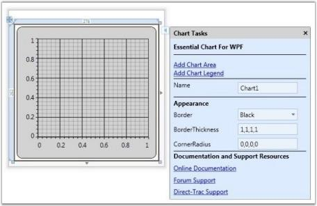
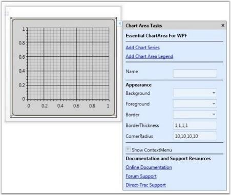
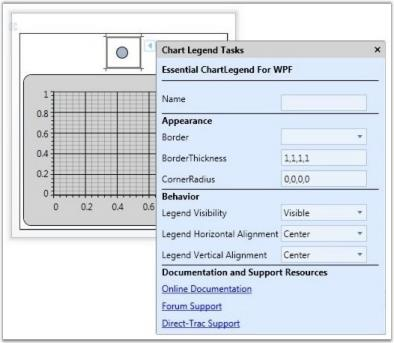

# Design Time Support in WPF Classic Chart

## Chart Control Smart Tag Support

Smart Tag appears for the Chart, Chart Area and Chart Legend. By using the Smart Tag, you can add Chart Areas, Chart Legends and Chart Series. In addition, you can customize the Chart appearance by using the Smart Tag in the designer.

The following screenshot illustrates Smart Tag support in Chart.

The following screenshot illustrates Smart Tag support in Chart Area.

The following screenshot illustrates Smart Tag support in Chart Legend.

