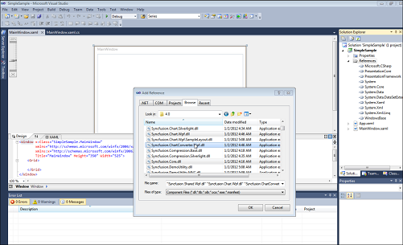

# Export Chart To PDF in WPF Chart (Classic)

Essential Chart for WPF now comes with the support to export the chart to a PDF file; this conversion can be done using the Syncfusion.ChartConversion.WPF assembly.

## Methods

<table>
<tr>
<th>
Method</th><th>
Description</th><th>
Parameters</th><th>
Type</th><th>
Return Type</th></tr>
<tr>
<td>
ChartPdfConverter</td><td>
Converts chart to PDF file.</td><td>
Chart, Filename </td><td>
ChartString</td><td>
Void</td></tr>
</table>

### Sample Link

1. Open the WPF sample browser
2. Select the Chart product
3. Select Chart > Export and Import > Chart to PDF

### Adding Support to Convert a Chart to PDF to an Application 

The following steps explain how to convert a chart to PDF.

1. Create a new Visual Studio 2010 or 2008 project.
2. Add the following assemblies to the project:
   1. Syncfusion.Chart.WPF.dll
   2. Syncfusion.ChartConverter.WPF.dll

   

3. Create a chart to be exported to PDF. Use the following code to convert the chart to a PDF file.

   ~~~ csharp

				ChartPdfConverterControl control = new ChartPdfConverterControl();

				control.ChartPdfConverter(Chart1, "chartpdf.pdf");
   ~~~
4. The PDF file is generated as follows.

   
