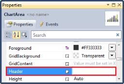
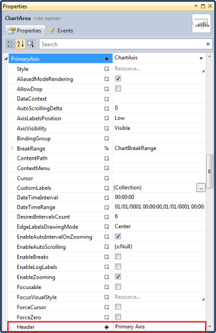
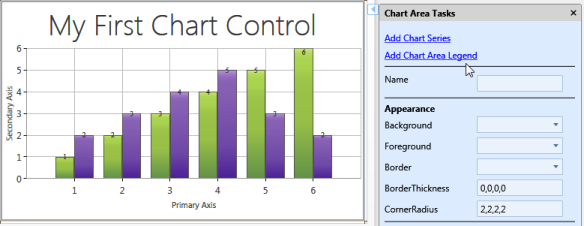
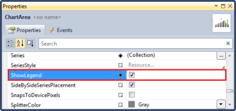
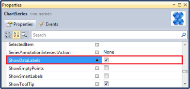
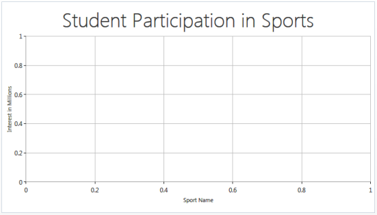

# Getting Started with WPF Chart

## Feature Summary

The complete summary of the features of the Chart control for WPF are listed as follows:

* Chart customization—Essential Chart provides easy customization for each and every unit of chart such as Chart, Chart Area, Chart Series and Chart Legend.
* Chart Data Binding—Essential Chart allows you to populate the chart with any kind of data source.
* Smart Tag Feature—Essential Chart provides sophisticated customization options.
* Chart Animation—Essential Chart supports various animation effects for good visualization.
* Chart Templates—Chart control uses the benefits of WPF template concept, and enables to customize all parts of Chart with the templates customization option.
* Chart Area—Multiple Chart Areas can be added to perform comparison of data at single view. Chart Area also comes with high layout customization.
* Chart Area Context Menu—WPF Chart has a built-in context menu which lets you change the chart type and color palette of a series and enable zooming.
* Chart Series—Highly customizable and interactive chart series can be added to Chart control.
* Chart Types—Essential Chart supports more than 33 chart types.
* 2-D and 3-D Appearance—Essential Chart supports 2-D and 3-D appearance of the Chart.
* Chart Axis—Essential Chart allows to customize the Chart Axis. Chart control also provides support of multiple axes.
* Chart Labels—Essential Chart allows you to customize the chart labels. The labels can be fetched from various data sources.
* Chart Skins—Essential Chart supports all basic OS themes and in addition supports 14 custom skins.
* Chart Legends—Essential Chart allows extensive customization of the legend. The position of the legend on the chart area as well as its representation aspects can be customized. Essential Chart also features modification of legend items using events. It also supports custom legend items that are not tied to any series of data.
* User Interaction—Essential Chart supports zooming and mouse events to enhance the user interaction.
* Chart Export, Import, and Print—Essential Chart supports exporting, importing and printing functionalities.
* Date Handling—Essential Chart provides built-in support for handling date. The data type of any series that is plotted on the chart can be set to Date Time. This also supports Date Time ranges and intervals.
* Multiple chart areas can share a single datetime x-axis for representing the data. This allows the user to use more than one area with a single axis.
* Enables synchronization of chart axis while using more than one area with a single axis.
* More than 34 chart types are available, which are highly and easily configurable with built-in support for creating stunning visual effects. 
* High chart performance by implementing Fast Column, stacking column, Fast Scatter and HiLoOpenclose Chart types in WPF.
* Facility to select the zoomed area across both the Axis. 
* Segmented horizontal and vertical striplines can be placed in the chart area.
* Complete customization support is available for the Chart Series.
* Animation feature is added to the chart with multiple animation options. 
* Annotation with various Predefined shapes can attached to the chart.
* Legend icons can be displayed according to the corresponding Chart Type.

## Elaborate Structure of Chart Control 

A chart is composed of various sub elements such as legends, areas, toolbars, headers, and footers. The following screenshot illustrates the elements of the Chart control.

## Creating a Simple Chart using Designer 

Users can create a simple chart application with Syncfusion WPF Chart control without much of typing codes. It can be done with the help of Visual Studio designer and Syncfusion Smart Tag. The following are the steps to create a chart:

1. Create a new WPF application in VS2010. You can see the Chart control in the Toolbox of Visual Studio. 

   

2. Drag the Chart control from the Toolbox and drop it to the designer. It generates a chart with two default series in the designer.

   

   The following code is auto generated in the XAML window.

   ~~~ xaml    

		<syncfusion:Chart HorizontalAlignment="Left" Margin="10,10,0,0" Name="chart1"      

											VerticalAlignment="Top">

			<syncfusion:ChartArea ZoomInCoefficient="0.5" ZoomOutCoefficient="2">

				<syncfusion:ChartSeries Data="1,1,2,2,3,3,4,4,5,5,6,6" 

																SegmentWidthMode="Fixed"/>

				<syncfusion:ChartSeries Data="1,2,2,3,3,4,4,5,5,3,6,2" 

																SegmentWidthMode="Fixed”/>

			</syncfusion:ChartArea>

		</syncfusion:Chart>

   ~~~
   
3. Click the Expand button at the right corner of the chart area in the designer. It generates the Smart Tag for the chart area.

   

4. You can reuse this default series or else you can delete them and add a new series using the Smart Tag. Use DataSource property of ChartSeries to have the data collection bound to chart series, and to visualize the data in various forms such as bar chart, column chart, pie, pyramid, or other chart types. Refer to the section Chart Series to know more about data-binding to a chart series.

5. To add a title to the chart area, select the Properties tab in the chart area and enter a title for the chart area in the Header field.

   

   

6. To set the axis header, expand the PrimaryAxis and enter the axis header in the Header field. Similarly, you can do this for the SecondaryAxis.

   

   

7. To add a legend to the chart area, click Add Chart Area Legend in the Smart Tag.

   

   

   N> The chart area legend can also be added in the chart area by setting the ShowLegend property of ChartArea as True.

   

8. To display the data labels, set the ShowDataLabels property of ChartSeries as True.

   

   

9. To set icon text of the chart legend, set the Label property of ChartSeries.

   

   

   ~~~ xaml

	 <syncfusion:Chart HorizontalAlignment="Left" Margin="10,10,0,0" Name="chart1”   

										 VerticalAlignment="Top">

			<syncfusion:ChartArea  ZoomInCoefficient="0.5" ZoomOutCoefficient="2" 

														  Header="My First Chart Control">

				<syncfusion:ChartArea.Legend>

					<syncfusion:ChartLegend />

				</syncfusion:ChartArea.Legend>

				<syncfusion:ChartArea.SecondaryAxis>

					<syncfusion:ChartAxis Header="Secondary Axis" />

				</syncfusion:ChartArea.SecondaryAxis>

				<syncfusion:ChartArea.PrimaryAxis>

					<syncfusion:ChartAxis Header="Primary Axis" />

				</syncfusion:ChartArea.PrimaryAxis>

				<syncfusion:ChartSeries Label="FirstSeries" Data="1,1,2,2,3,3,4,4,5,5,6,6" 

								  SegmentWidthMode="Fixed" ShowDataLabels="True"/>

				<syncfusion:ChartSeries Label="SecondSeries" 

																Data="1,2,2,3,3,4,4,5,5,3,6,2" 

																SegmentWidthMode="Fixed" ShowDataLabels="True”/>

	   </syncfusion:ChartArea>

	 </syncfusion:Chart>
			 
   ~~~
   
### Chart Control Smart Tag Support

Smart Tag appears for the chart, chart area and chart legend. By using the Smart Tag, you can add chart areas, legends, and series to the chart. In addition, you can customize the chart appearance using the Smart Tag in the designer.

The following screenshot illustrates the Smart Tag for chart.

The following screenshot illustrates the Smart Tag for chart area.

The following screenshot illustrates the Smart Tag for chart legend.

## Creating a Data-Binding Application for Chart Control

To create a data-binding application for Chart control:

1. Add the following Syncfusion assembly references to your project.

   I. Syncfusion.Chart.WPF
   
   II. Syncfusion.Shared.WPF
   
   III. Syncfusion.Core
   
2. Create a namespace reference to Syncfusion.Chart.WPF using the Syncfusion global namespace reference schemas.syncfusion.com. The Chart control is available in the Syncfusion.Chart.WPF namespace of Syncfusion.Chart.WPF dll.

   ~~~ xaml

		xmlns:syncfusion="http://schemas.syncfusion.com/wpf"

   ~~~		

   ~~~ csharp		

		using Syncfusion.Windows.Chart;

   ~~~
   
3. To create a simple series, initialize the Chart, ChartArea,and ChartSeries as in the following code example.

   ~~~ xaml

					<syncfusion:Chart>

						<syncfusion:ChartArea>

							   <syncfusion:ChartSeries />

						</syncfusion:ChartArea>

					</syncfusion:Chart>

   ~~~    
   
   ~~~ csharp
   
		Chart chart = new Chart();

		//Adding a new area.

		chart.Areas.Add(new ChartArea());

		//Adding a new series.

		chart.Areas[0].Series.Add(new ChartSeries());

		//Assigning window's content property.

		this.Content = chart;

   ~~~

   

4. To set a header to the chart area, use the Header property of ChartArea.

   ~~~ xaml
  
		 <syncfusion:Chart>

		 <syncfusion:ChartArea Header="Student Participation in Sports">

					 <syncfusion:ChartSeries/>

			   </syncfusion:ChartArea>

		</syncfusion:Chart>

   ~~~ 
   
   ~~~ csharp

		Chart chart = new Chart();

		//Adding a new area.

		chart.Areas.Add(new ChartArea());

		//Adding a new series.

		chart.Areas[0].Series.Add(new ChartSeries());

		//Assigning Header to chart area.

		chart.Areas[0].Header = "Student Participation in Sports";

		//Assigning window's content property.

		this.Content = chart;               

   ~~~

   

5. To set headers to the primary and secondary axes, use the Header property of ChartAxis.

   ~~~ xaml

		<syncfusion:Chart>

			<syncfusion:ChartArea Header="Student Participation in Sports">

				<syncfusion:ChartArea.PrimaryAxis>

					 <syncfusion:ChartAxis Header="Sport Name"/>

				</syncfusion:ChartArea.PrimaryAxis>

				<syncfusion:ChartArea.SecondaryAxis>

					 <syncfusion:ChartAxis Header="Interest in Millions"/>

				</syncfusion:ChartArea.SecondaryAxis>

				<syncfusion:ChartSeries/>

			</syncfusion:ChartArea>

	   </syncfusion:Chart>

   ~~~
   
   ~~~ csharp

		Chart chart = new Chart();

		//Adding a new area.

		chart.Areas.Add(new ChartArea());

		//Adding a new series.

		chart.Areas[0].Series.Add(new ChartSeries());

		//Assigning Header to chart area.

		chart.Areas[0].Header = "Student Participation in Sports";

		//Adding header to primary axis

		chart.Areas[0].PrimaryAxis.Header = "Sport Name";

		//Adding header to secondary axis

		chart.Areas[0].SecondaryAxis.Header = "Interest in Millions";

		//Assigning window's content property.

		this.Content = chart;

   ~~~

   

6. Use the DataSource property of ChartSeries to bind collection objects with the chart series and to visualize data from collection.

7. Create a class to represent a chart point. Each instance of this class is visualized as a chart point in the chart series_._ Make sure that the class has two properties, one for positioning a point along x-axis and another one for positioning a point along y-axis.

   N> Y mapping property should be a double compatible type, and x mapping property can be double string, DateTime, TimeSpan, and etc.

   ~~~ csharp
   
		public class Sport

		{

			private int sportid;

			private string sportname;

			private double interest;

			public Sport()

			{        }

			public Sport(int sportid, string sportname, double interests)

			{

				this.sportid = sportid;

				this.sportname = sportname;

				this.interest = interests;

			}

			public int SportID

			{

				get { return sportid; }

				set

				{

					sportid = value;

				}

			}

			public string SportName

			{

				get { return sportname; }

				set

				{

					sportname = value;

				}

			}

			public double Interest

			{

				get { return interest; }

				set

				{

					interest = value;

				}

			}

		}

				
   ~~~
   
8. Create a Model class with a collection property which is a collection of the previously defined class.  For more details about the types of collection that chart supports refer to the section 4.2.2. Populate the collection property. In the following code example, the collection is populated using simple code simulation.

   ~~~ csharp

		// Namespace to be included for ObservableCollection.

		using System.Collections.ObjectModel;

		public class Model

		{

			public Model()

			{

				SportDetails = new ObservableCollection<Sport>();

				SportDetails.Add(new Sport(101, "Golf", 9));

				SportDetails.Add(new Sport(102, "Soccer", 37));

				SportDetails.Add(new Sport(103, "Hockey", 10));

				SportDetails.Add(new Sport(104, "Rugby", 17));

				SportDetails.Add(new Sport(105, "Shuttle", 30));

				SportDetails.Add(new Sport(106, "Cricket", 15));

				SportDetails.Add(new Sport(107, "Baseball", 6));

				SportDetails.Add(new Sport(108, "Tennis", 10));

			}

			public ObservableCollection<Sport> SportDetails

			{

				get;

				set;

			}

		}

   ~~~ 
   
9. Bind the collection property to the DataSource property of ChartSeries.

   ~~~ xaml

	 //Reference to Application

		  xmlns:local="clr-namespace:GettingStarted"

		  ..........

		  <Grid.DataContext>

				<local:Model/>

		  </Grid.DataContext>

		 <syncfusion:Chart>

			<syncfusion:ChartArea Header="Student Participation in Sports">

				<syncfusion:ChartArea.PrimaryAxis>

					 <syncfusion:ChartAxis Header="Sport Name"/>

				</syncfusion:ChartArea.PrimaryAxis>

				<syncfusion:ChartArea.SecondaryAxis>

					 <syncfusion:ChartAxis Header="Interest in Millions"/>

				</syncfusion:ChartArea.SecondaryAxis>

				<syncfusion:ChartSeries DataSource="{Binding SportDetails}"/>

			</syncfusion:ChartArea>

	   </syncfusion:Chart>

   ~~~ 
   
   ~~~ csharp

   Chart chart = new Chart();

	   //Adding a new area.

	   chart.Areas.Add(new ChartArea());

	   //Adding a new series.

	   chart.Areas[0].Series.Add(new ChartSeries());

	   //Assigning Header to chart area.

	   chart.Areas[0].Header = "Student Participation in Sports";

	   //Adding header to primary axis

	   chart.Areas[0].PrimaryAxis.Header = "Sport Name";

	   //Adding header to secondary axis

	   chart.Areas[0].SecondaryAxis.Header = "Interest in Millions";

	   //Assigning DataContext with the model

	   this.DataContext = new Model();

	   //Creating a new binding for DataSource

	   Binding dataSrcBinding = new Binding("SportDetails") 

														 { Source = this.DataContext };

	   // Binding sport details to Datasource 

	   BindingOperations.SetBinding(chart.Areas[0].Series[0],  

																	ChartSeries.DataSourceProperty, 

																	dataSrcBinding);        

	   //Assigning window's content property.

	   this.Content = chart;

   ~~~

   

10. If you do not have any model in your application, you can simply assign the DataSource with a collection object (which is a collection of objects of the class stated in point 7).

    ~~~ csharp

		// Namespace to be included for ObservableCollection.

		using System.Collections.ObjectModel;

		public class SportCollection : ObservableCollection<Sport>

		{

			public SportCollection()

			{

				this.Add(new Sport() { SportID = 101, SportName = "Golf", Interest = 9 });

				this.Add(new Sport() { SportID = 102, SportName = "Soccer", Interest = 37 });

				this.Add(new Sport() { SportID = 103, SportName = "Hockey", Interest = 10 });

				this.Add(new Sport() { SportID = 104, SportName = "Rugby", Interest = 17 });

				this.Add(new Sport() { SportID = 105, SportName = "Shuttle", Interest = 30 });

				this.Add(new Sport() { SportID = 106, SportName = "Cricket", Interest = 15 });

				this.Add(new Sport() { SportID = 107, SportName = "Baseball", Interest = 6 });

				this.Add(new Sport() { SportID = 108, SportName = "Tennis", Interest = 10 });

			}

		}
		
    ~~~  
   
    ~~~ xaml
   
		  //Reference to application

		xmlns:local="clr-namespace:GettingStarted"

	 ..............

		 <Window.Resources>

			   <local:SportCollection x:Key="sportCollection"/>

		 </Window.Resources>

		 <syncfusion:Chart>

			<syncfusion:ChartArea Header="Student Participation in Sports">

				<syncfusion:ChartArea.PrimaryAxis>

					 <syncfusion:ChartAxis Header="Sport Name"/>

				</syncfusion:ChartArea.PrimaryAxis>

				<syncfusion:ChartArea.SecondaryAxis>

					 <syncfusion:ChartAxis Header="Interest in Millions"/>

				</syncfusion:ChartArea.SecondaryAxis>

				<syncfusion:ChartSeries DataSource="{StaticResource sportCollection}"/>

			</syncfusion:ChartArea>

	   </syncfusion:Chart>

    ~~~  
   
    ~~~ csharp
		
		Chart chart = new Chart();

		//Adding a new area.

		chart.Areas.Add(new ChartArea());

		//Adding a new series.

		chart.Areas[0].Series.Add(new ChartSeries());

		//Assigning a header to chart area.

		chart.Areas[0].Header = "Student Participation in Sports";

		//Adding header to primary axis

		chart.Areas[0].PrimaryAxis.Header = "Sport Name";

		//Adding header to secondary axis

		chart.Areas[0].SecondaryAxis.Header = "Interest in Millions";

		// Assigning sport collection to Datasource 

		chart.Areas[0].Series[0].DataSource = new SportCollection();

		//Assigning Window's content property.

		this.Content = chart;

    ~~~

    

11. Specify the BindingPathX and BindingPathsY with mapping names. The mapping names are simply the names of the properties whose value has to be taken for x-axis value and y-axis values, respectively. Running your project can have a chart with a column type loaded with the data points specified by you.

    ~~~ xaml

					 <syncfusion:Chart>

						<syncfusion:ChartArea Header="Student Participation in Sports">

							<syncfusion:ChartArea.PrimaryAxis>

								 <syncfusion:ChartAxis Header="Sport Name"/>

							</syncfusion:ChartArea.PrimaryAxis>

							<syncfusion:ChartArea.SecondaryAxis>

								 <syncfusion:ChartAxis Header="Interest in Millions"/>

							</syncfusion:ChartArea.SecondaryAxis>

							<syncfusion:ChartSeries DataSource="{StaticResource sportCollection}"

																			BindingPathX="SportName" 

																			BindingPathsY="Interest"/>        

						  </syncfusion:ChartArea>

				   </syncfusion:Chart>

    ~~~
	
	~~~ csharp

					Chart chart = new Chart();

					//Adding a new area.

					chart.Areas.Add(new ChartArea());

					//Adding a new series.

					chart.Areas[0].Series.Add(new ChartSeries());

					//Assigning header to chart area.

					chart.Areas[0].Header = "Student Participation in Sports";

					//Adding header to primary axis

					chart.Areas[0].PrimaryAxis.Header = "Sport Name";

					//Adding header to secondary axis

					chart.Areas[0].SecondaryAxis.Header = "Interest in Millions";

					// Assigning sport collection to Datasource 

					chart.Areas[0].Series[0].DataSource = new SportCollection();

					//Setting BindingPathX for series

					chart.Areas[0].Series[0].BindingPathX = "SportName";

					//Setting BindingPathsY for series

					chart.Areas[0].Series[0].BindingPathsY = new string[] { "Interest" };

					//Assigning Window's content property.

					this.Content = chart;

    ~~~
	
    

12. To add data labels to chart points, set ShowDataLabels property of ChartSeries as true. You can modify the default values and appearance of the labels using the AdornmentsInfo property of ChartSeries (instance of the ChartAdornmentsInfo). The ChartAdornmentsInfo class is used to configure the settings of data label positions, label contents, symbols, and etc.

    ~~~ xaml
	
					 <syncfusion:Chart>

						<syncfusion:ChartArea Header="Student Participation in Sports">

							<syncfusion:ChartArea.PrimaryAxis>

								 <syncfusion:ChartAxis Header="Sport Name"/>

							</syncfusion:ChartArea.PrimaryAxis>

							<syncfusion:ChartArea.SecondaryAxis>

								 <syncfusion:ChartAxis Header="Interest in Millions"/>

							</syncfusion:ChartArea.SecondaryAxis>

							<syncfusion:ChartSeries ShowDataLabels="True”

																			DataSource="{StaticResource sportCollection}"

																			BindingPathX="SportName" 

																			BindingPathsY="Interest"/>        

						  </syncfusion:ChartArea>

				   </syncfusion:Chart>

    ~~~
	
	~~~ csharp

					Chart chart = new Chart();

					//Adding a new area.

					chart.Areas.Add(new ChartArea());

					//Adding a new series.

					chart.Areas[0].Series.Add(new ChartSeries());

					//Assigning header to chart area.

					chart.Areas[0].Header = "Student Participation in Sports";

					//Adding header to primary axis

					chart.Areas[0].PrimaryAxis.Header = "Sport Name";

					//Adding header to secondary axis

					chart.Areas[0].SecondaryAxis.Header = "Interest in Millions";

					// Assigning sport collection to Datasource 

					chart.Areas[0].Series[0].DataSource = new SportCollection();

					//Setting BindingPathX for series

					chart.Areas[0].Series[0].BindingPathX = "SportName";

					//Setting BindingPathsY for series

					chart.Areas[0].Series[0].BindingPathsY = new string[] { "Interest" };

					//Setting DataLables to chart series.

					chart.Areas[0].Series[0].ShowDataLabels = true;

					//Assigning window's content property.

					this.Content = chart; 

    ~~~

    

13. To add legends to the chart area, set ShowLegend property of ChartArea as true.

    ~~~ xaml
	
					 <syncfusion:Chart>

						<syncfusion:ChartArea ShowLegend="True” 

																	 Header="Student Participation in Sports">

							<syncfusion:ChartArea.PrimaryAxis>

								 <syncfusion:ChartAxis Header="Sport Name"/>

							</syncfusion:ChartArea.PrimaryAxis>

							<syncfusion:ChartArea.SecondaryAxis>

								 <syncfusion:ChartAxis Header="Interest in Millions"/>

							</syncfusion:ChartArea.SecondaryAxis>

							<syncfusion:ChartSeries ShowDataLabels="True”

																			DataSource="{StaticResource sportCollection}"

																			BindingPathX="SportName" 

																			BindingPathsY="Interest"/>        

						  </syncfusion:ChartArea>

				   </syncfusion:Chart>

    ~~~
	
	~~~ csharp

					Chart chart = new Chart();

					//Adding a new area.

					chart.Areas.Add(new ChartArea());

					//Setting Legend to chart area.

					chart.Areas[0].ShowLegend = true;

					//Adding a new series.

					chart.Areas[0].Series.Add(new ChartSeries());

					//Assigning Header to chart area.

					chart.Areas[0].Header = "Student Participation in Sports";

					//Adding header to primary axis

					chart.Areas[0].PrimaryAxis.Header = "Sport Name";

					//Adding header to secondary axis

					chart.Areas[0].SecondaryAxis.Header = "Interest in Millions";

					// Assigning sport collection to Datasource 

					chart.Areas[0].Series[0].DataSource = new SportCollection();

					//Setting BindingPathX for series

					chart.Areas[0].Series[0].BindingPathX = "SportName";

					//Setting BindingPathsY for series

					chart.Areas[0].Series[0].BindingPathsY = new string[] { "Interest" };

					//Setting DataLables to chart series.

					chart.Areas[0].Series[0].ShowDataLabels = true;

					//Assigning window's content property.

					this.Content = chart;

    ~~~

    

14. To have an icon label in the legend, set the Label property of ChartSeries with a required string. To modify the default icon of the legend, use the LegendIcon property of ChartSeries. 

    ~~~ xaml

					   <syncfusion:Chart>

						<syncfusion:ChartArea ShowLegend="True” 

																	 Header="Student Participation in Sports">

							<syncfusion:ChartArea.PrimaryAxis>

								 <syncfusion:ChartAxis Header="Sport Name"/>

							</syncfusion:ChartArea.PrimaryAxis>

							<syncfusion:ChartArea.SecondaryAxis>

								 <syncfusion:ChartAxis Header="Interest in Millions"/>

							</syncfusion:ChartArea.SecondaryAxis>

							<syncfusion:ChartSeries Label="Sports Interest”

																			ShowDataLabels="True”

																			DataSource="{StaticResource sportCollection}"

																			BindingPathX="SportName" 

																			BindingPathsY="Interest"/>        

						  </syncfusion:ChartArea>

				   </syncfusion:Chart>

    ~~~
	
	~~~ csharp

					 Chart chart = new Chart();

					//Adding a new area.

					chart.Areas.Add(new ChartArea());

					//Setting legend to chart area.

					chart.Areas[0].ShowLegend = true;

					//Adding a new series.

					chart.Areas[0].Series.Add(new ChartSeries());

					//Assigning header to chart area.

					chart.Areas[0].Header = "Student Participation in Sports";

					//Adding header to primary axis

					chart.Areas[0].PrimaryAxis.Header = "Sport Name";

					//Adding header to secondary axis

					chart.Areas[0].SecondaryAxis.Header = "Interest in Millions";

					// Assigning sport collection to Datasource 

					chart.Areas[0].Series[0].DataSource = new SportCollection();

					//Setting BindingPathX for series

					chart.Areas[0].Series[0].BindingPathX = "SportName";

					//Setting BindingPathsY for series

					chart.Areas[0].Series[0].BindingPathsY = new string[] { "Interest" };

					//Setting data lables to chart series.

					chart.Areas[0].Series[0].ShowDataLabels = true;

					//Setting legend icon text by assigning label of chart series.

					chart.Areas[0].Series[0].Label = "First Series";

					//Assigning Window's content property.

					this.Content = chart;

    ~~~
 
    

15. To change the default legend icon, set the LegendIcon property of ChartSeries with an icon type.

    ~~~ xaml

					   <syncfusion:Chart>

						<syncfusion:ChartArea ShowLegend="True” 

																	 Header="Student Participation in Sports">

							<syncfusion:ChartArea.PrimaryAxis>

								 <syncfusion:ChartAxis Header="Sport Name"/>

							</syncfusion:ChartArea.PrimaryAxis>

							<syncfusion:ChartArea.SecondaryAxis>

								 <syncfusion:ChartAxis Header="Interest in Millions"/>

							</syncfusion:ChartArea.SecondaryAxis>

							<syncfusion:ChartSeries LegendIcon="Pentagon”

																			Label="Sports Interest”

																			ShowDataLabels="True”

																			DataSource="{StaticResource sportCollection}"

																			BindingPathX="SportName" 

																			BindingPathsY="Interest"/>        

						  </syncfusion:ChartArea>

				   </syncfusion:Chart>

    ~~~	
	
	~~~ csharp

					Chart chart = new Chart();

					//Adding a new area.

					chart.Areas.Add(new ChartArea());

					//Setting legend to chart area.

					chart.Areas[0].ShowLegend = true;

					//Adding a new series.

					chart.Areas[0].Series.Add(new ChartSeries());

					//Assigning header to chart area.

					chart.Areas[0].Header = "Student Participation in Sports";

					//Adding header to primary axis

					chart.Areas[0].PrimaryAxis.Header = "Sport Name";

					//Adding header to secondary axis

					chart.Areas[0].SecondaryAxis.Header = "Interest in Millions";

					// Assigning sport collection to Datasource 

					chart.Areas[0].Series[0].DataSource = new SportCollection();

					//Setting BindingPathX for series

					chart.Areas[0].Series[0].BindingPathX = "SportName";

					//Setting BindingPathsY for series

					chart.Areas[0].Series[0].BindingPathsY = new string[] { "Interest" };

					//Setting DataLables to chart series.

					chart.Areas[0].Series[0].ShowDataLabels = true;

					//Setting legend icon text by assigning label of chart series.

					chart.Areas[0].Series[0].Label = "First Series";

					//Setting legend icon text by assigning Label of chart series.

					chart.Areas[0].Series[0].Label = "First Series";

					//Assigning Window's content property.

					this.Content = chart;

    ~~~

    

## Class Diagram

The class diagram for Essential Chart for WPF is as follows.

### Chart

A chart is a type of information graphic or graphic organizer that represents tabular numeric data and / or functions. Chart is often used to make it easier to understand large quantities of data and the relationship between different parts of the data. Charts can be read more quickly than the raw data using which they are created.

<table>
<tr>
<th>
Property</th><th>
Description</th></tr>
<tr>
<td>
AnnotationLabels</td><td>
gets or sets the Labels</td></tr>
<tr>
<td>
AnnotationLabelTemplate</td><td>
gets or sets the LabelTemplate</td></tr>
<tr>
<td>
Area</td><td>
gets the collection of ChartArea</td></tr>
<tr>
<td>
AreasPanel</td><td>
gets or sets the areas panel template</td></tr>
<tr>
<td>
CornerRadius</td><td>
gets or sets the corner radius</td></tr>
<tr>
<td>
Legends</td><td>
gets the collection of Chart Legends</td></tr>
</table>

<table>
<tr>
<th>
Method</th><th>
Description</th></tr>
<tr>
<td>
CopyToClipboard</td><td>
copies the chart to clipboard</td></tr>
<tr>
<td>
OnApplyTemplate</td><td>
invoked whenever application code or internal processes call ApplyTemplate()</td></tr>
<tr>
<td>
Print</td><td>
prints the chart by the specified print Area</td></tr>
<tr>
<td>
Save</td><td>
saves the chart to the file with specified file name using encoder</td></tr>
<tr>
<td>
SaveToXps</td><td>
saves to xps format</td></tr>
<tr>
<td>
SwitchPrintingMode</td><td>
switches to the printing mode</td></tr>
</table>