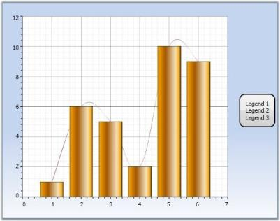

## Add Custom Legends

It's easy to replace existing, default, legend items with custom items in Chart or Chart Area legends.

Remember to clear the existing default entries, before adding new custom items. Otherwise, this results in exceptions. The following lines of code can be used to add items to chart legend.


ChartLegend legend = new ChartLegend();

legend.Items.Clear();

legend.Items.Add("Legend 1");

legend.Items.Add("Legend 2");

legend.Items.Add("Legend 3");

Chart1.Legends.Add(legend);



