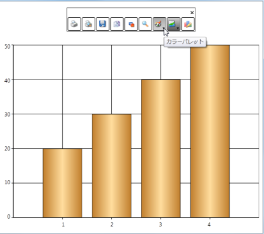

# Localization-Support in WPF Chart (Classic)

Localization is the process of making your application multi-lingual, by formatting content according to cultures. This involves configuring the application for a specific language. Culture is the combination of language and location (e.g. En-US is the culture for English spoken in United States; En-GB is the culture for English spoken in Great Britain). Syncfusion Chart allows you to set custom resource through the Resx file. You can simply give the string values in the resource file for a specific culture and set the culture in the application. The given string values are set to the Chart that does not affect the Code Block of the chart.  

## Use Case Scenario

The Essential Chart WPF can be localized according to the native language. It thus helps you to use the Chart more effectively.

Adding Localization to an Application 

The following steps explain the implementation of Localization support in applications.

## Creating an Application

Create a WPF application and add Chart control to it. 

### Creating a Resource File

To create a Resource file:

1. Create a folder named Resources in the application. 
2. Create a resource file (Resx file) and name it Syncfusion.Chart.Wpf<your culture info name>.resx E.g. Syncfusion.Chart.WPF.Ja.resx 

Use the prescribed naming convention as it is mandatory. 

The following screenshot explains the addition of a Resource file to the application. 

Enter the “Name” and “Value” in the Resource file. 

The String Property names used in the  Chart are given in the Properties table. This is explained in the following screenshot.

Setting the Culture Information in the Application

The culture information should be set in the application before the InitializeComponent() method is called. Now, the application is set to Japanese Culture info. The following code example explains the implementation of this.


System.Threading.Thread.CurrentThread.CurrentUICulture = new System.Globalization.CultureInfo("ja");



<table>
<tr>
<th>
Property</th><th>
Description</th><th>
Type</th><th>
Data Type</th></tr>
<tr>
<td>
Analog</td><td>
Sets the string for the Analog property</td><td>
static</td><td>
string</td></tr>
<tr>
<td>
Area</td><td>
Sets the string for the Area property</td><td>
static</td><td>
string</td></tr>
<tr>
<td>
Bar</td><td>
Sets the string for the Bar property</td><td>
static</td><td>
string</td></tr>
<tr>
<td>
BoxAndWhisker</td><td>
Sets the string for the Box and Whisker property</td><td>
static</td><td>
string</td></tr>
<tr>
<td>
Bubble</td><td>
Sets the string for the Bubble property</td><td>
static</td><td>
string</td></tr>
<tr>
<td>
Candle</td><td>
Sets the string for the Candle property</td><td>
static</td><td>
string</td></tr>
<tr>
<td>
ChangeType</td><td>
Sets the string for the ChangeType property</td><td>
static</td><td>
string</td></tr>
<tr>
<td>
Close</td><td>
Sets the string for the Close property</td><td>
static</td><td>
string</td></tr>
<tr>
<td>
Colorful</td><td>
Sets the string for the Colorful property</td><td>
static</td><td>
string</td></tr>
<tr>
<td>
ColorPalette</td><td>
Sets the string for the ColorPalette property</td><td>
static</td><td>
string</td></tr>
<tr>
<td>
Column</td><td>
Sets the string for the Column property</td><td>
static</td><td>
string</td></tr>
<tr>
<td>
contextMenuPalettes</td><td>
Sets the string for the ContextMenuPalette property</td><td>
static</td><td>
string</td></tr>
<tr>
<td>
contextMenuSeries</td><td>
Sets the string for the ContextMenuSeries property</td><td>
static</td><td>
string</td></tr>
<tr>
<td>
contextMenuZoomAll</td><td>
Sets the string for the ContextMenuZoomAll property</td><td>
static</td><td>
string</td></tr>
<tr>
<td>
contextMenuZooming</td><td>
Sets the string for the ContextmenuZooming  property</td><td>
static</td><td>
string</td></tr>
<tr>
<td>
Copy</td><td>
Sets the string for the Copy property</td><td>
static</td><td>
string</td></tr>
<tr>
<td>
Custom</td><td>
Sets the string for the Custom property</td><td>
static</td><td>
string</td></tr>
<tr>
<td>
Default</td><td>
Sets the string for the Default property</td><td>
static</td><td>
string</td></tr>
<tr>
<td>
DefaultAlpha</td><td>
Sets the string for the DefaultAlpha property</td><td>
static</td><td>
string</td></tr>
<tr>
<td>
Doughnut</td><td>
Sets the string for the Dhoughnut property</td><td>
static</td><td>
string</td></tr>
<tr>
<td>
EarthTone</td><td>
Sets the string for the EarthTone property</td><td>
static</td><td>
string</td></tr>
<tr>
<td>
EnableZooming</td><td>
Sets the string for the EnableZooming property</td><td>
static</td><td>
string</td></tr>
<tr>
<td>
FastColumn</td><td>
Sets the string for the FastColumn property</td><td>
static</td><td>
string</td></tr>
<tr>
<td>
FastHiLoOpenClose</td><td>
Sets the string for the FastHiLoOpenClose property</td><td>
static</td><td>
string</td></tr>
<tr>
<td>
FastLine</td><td>
Sets the string for the FastLine property</td><td>
static</td><td>
string</td></tr>
<tr>
<td>
FastScatter</td><td>
Sets the string for the FastScatter property</td><td>
static</td><td>
string</td></tr>
<tr>
<td>
FastStackingColumn</td><td>
Sets the string for the FastStackingColumn property</td><td>
static</td><td>
string</td></tr>
<tr>
<td>
Funnel</td><td>
Sets the string for the Funnel property</td><td>
static</td><td>
string</td></tr>
<tr>
<td>
Gantt</td><td>
Sets the string for the Gantt property</td><td>
static</td><td>
string</td></tr>
<tr>
<td>
Gradient</td><td>
Sets the string for the Gradient property</td><td>
static</td><td>
string</td></tr>
<tr>
<td>
Grayscale</td><td>
Sets the string for the GrayScale property</td><td>
static</td><td>
string</td></tr>
<tr>
<td>
HiLo</td><td>
Sets the string for the HiLo property</td><td>
static</td><td>
string</td></tr>
<tr>
<td>
HiLoArea</td><td>
Sets the string for the HiLoArea property</td><td>
static</td><td>
string</td></tr>
<tr>
<td>
HiLoOpenClose</td><td>
Sets the string for the HiLoOpenClose property</td><td>
static</td><td>
string</td></tr>
<tr>
<td>
Histogram</td><td>
Sets the string for the Histogram property</td><td>
static</td><td>
string</td></tr>
<tr>
<td>
Kagi</td><td>
Sets the string for Kagi property</td><td>
static</td><td>
string</td></tr>
<tr>
<td>
LegendWindowCancel</td><td>
Sets the string for the LegendWindowControl property</td><td>
static</td><td>
string</td></tr>
<tr>
<td>
LegendWindowCheckBox</td><td>
Sets the string for the LegendWindowCheckBox property</td><td>
static</td><td>
string</td></tr>
<tr>
<td>
LegendWindowIcon</td><td>
Sets the string for the LegendWindowIcon property</td><td>
static</td><td>
string</td></tr>
<tr>
<td>
LegendWindowOK</td><td>
Sets the string for the legendWindowOk property</td><td>
static</td><td>
string</td></tr>
<tr>
<td>
LegendWindowTitle</td><td>
Sets the string for the LegendWindowTiltle property</td><td>
static</td><td>
string</td></tr>
<tr>
<td>
Line</td><td>
Sets the string for the Line property</td><td>
static</td><td>
string</td></tr>
<tr>
<td>
Nature</td><td>
Sets the string for the Nature property</td><td>
static</td><td>
string</td></tr>
<tr>
<td>
Office2007Black</td><td>
Sets the string for the Office2007Black property</td><td>
static</td><td>
string</td></tr>
<tr>
<td>
Office2007Blue</td><td>
Sets the string for the Office2007Blue property</td><td>
static</td><td>
string</td></tr>
<tr>
<td>
Office2007Silver</td><td>
Sets the string for the Office2007Silver property</td><td>
static</td><td>
string</td></tr>
<tr>
<td>
Palette1</td><td>
Sets the string for the Palette1 property</td><td>
static</td><td>
string</td></tr>
<tr>
<td>
Palette2</td><td>
Sets the string for the Palette2 property</td><td>
static</td><td>
string</td></tr>
<tr>
<td>
Palette3</td><td>
Sets the string for the Palette3 property</td><td>
static</td><td>
string</td></tr>
<tr>
<td>
Palette4</td><td>
Sets the string for the Palette4 property</td><td>
static</td><td>
string</td></tr>
<tr>
<td>
Palette5</td><td>
Sets the string for the Palette5 property</td><td>
static</td><td>
string</td></tr>
<tr>
<td>
Palette6</td><td>
Sets the string for the Palette6 property</td><td>
static</td><td>
string</td></tr>
<tr>
<td>
Palette7</td><td>
Sets the string for the Palette7 property</td><td>
static</td><td>
string</td></tr>
<tr>
<td>
Palette8</td><td>
Sets the string for the Palette8 property</td><td>
static</td><td>
string</td></tr>
<tr>
<td>
Panning</td><td>
Sets the string for the Panning property</td><td>
static</td><td>
string</td></tr>
<tr>
<td>
Pastel</td><td>
Sets the string for the Pastel property</td><td>
static</td><td>
string</td></tr>
<tr>
<td>
Pie</td><td>
Sets the string for the Pie property</td><td>
static</td><td>
string</td></tr>
<tr>
<td>
PointAndFigure</td><td>
Sets the string for the PointAndFigure property</td><td>
static</td><td>
string</td></tr>
<tr>
<td>
Polar</td><td>
Sets the string for the Polar property</td><td>
static</td><td>
string</td></tr>
<tr>
<td>
printDialogAdvanced</td><td>
Sets the string for the PrintDialogAdvanced property</td><td>
static</td><td>
string</td></tr>
</table>

### Sample Link

To run the UI WPF Chart samples:

1. Open Essential Studio Dashboard by selecting Start -> Program -> Syncfusion-> Essential Studio <<Version Number>> -> Dashboard.
2. Click Run locally installed samples from the WPF drop-down list on the User Interface pane.
3. Select Chart on the sample browser.
4. Select User Interaction -> Localization Demo on the Essential Chart pane and click the Run Sample button.

To open the sample projects:

1. Go to the following sample location in your system:  
2. “<sample installation location>\Syncfusion\EssentialStudio\Version Number \WPF\Chart.WPF\Samples\3.5\WindowsSamples\User Interaction\Localization Demo”
3. This location contains two sub folders CS and VB.  You can open the sample projects from the respective folders based on your application developing language.
