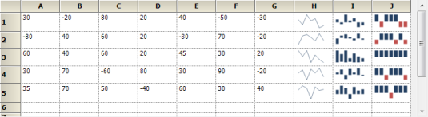
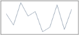
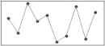

# Sparkline in WPF Chart (Classic)

A Sparklinecontrolis a type of information graphic characterized by its small size, high data density and lightweight. It presents trends and variations in a very condensed fashion. The Sparkline does not contain an axis scale and is intended to give a high level overview of what happened to the data over time.

## Use Case Scenarios

A sparkline can display a trend based on adjacent data in a clear and compact graphical representation. The purpose of sparkline is to quickly see the data range difference with high density data and it is represented in lightweight graphical representation. You can use it as per your requirement.

The following screenshot shows three  types of sparklines, which are  drawn inside the grid control cell, based on row values.

## Properties

<table>
<tr>
<th>
Property</th><th>
Description</th><th>
Type</th><th>
Data Type</th><th>
Reference links</th></tr>
<tr>
<td>
SparkLineType</td><td>
Get or set the type of spark lines.By default, it is set to Line type.</td><td>
 Dependency property</td><td>
SparkLineTypes – Enum {Line, Column, WinLoss}</td><td>
NA</td></tr>
<tr>
<td>
ItemSource</td><td>
Gets or sets the data source for sparkline data points</td><td>
 Dependency Property</td><td>
IEnumerable</td><td>
 NA</td></tr>
<tr>
<td>
DisplayMemberPath</td><td>
Gets or sets the property name that has to be taken as data for displaying points</td><td>
Dependency Property</td><td>
String</td><td>
NA</td></tr>
<tr>
<td>
FirstPointHighlightBrush</td><td>
Gets or sets the brush used to highlight first data point in spark line</td><td>
 Dependency Property</td><td>
Brush</td><td>
 NA</td></tr>
<tr>
<td>
IsFirstPointHighlighted</td><td>
Helps to enable or disable highlighting of first data point in spark line</td><td>
Dependency Property</td><td>
Bool</td><td>
NA</td></tr>
<tr>
<td>
LastPointHighlightBrush</td><td>
Gets or sets the brush used to highlight last data point in spark line</td><td>
 Dependency Property</td><td>
Brush</td><td>
 NA</td></tr>
<tr>
<td>
IsLastPointHighlighted</td><td>
Helps to enable or disable highlighting of last data point in spark line</td><td>
Dependency Property</td><td>
Bool</td><td>
NA</td></tr>
<tr>
<td>
HighPointHighlightBrush</td><td>
Gets or sets the brush used to highlight highest data point in spark line</td><td>
 Dependency Property</td><td>
Brush</td><td>
 NA</td></tr>
<tr>
<td>
IsHighPointHighlighted</td><td>
Helps to enable or disable highlighting of highest data point in spark line</td><td>
Dependency Property</td><td>
Bool</td><td>
NA</td></tr>
<tr>
<td>
LowPointHighlightBrush</td><td>
Gets or sets the brush used to highlight lowest data point in spark line</td><td>
 Dependency Property</td><td>
Brush</td><td>
 NA</td></tr>
<tr>
<td>
IsLowPointHighlighted</td><td>
Helps to enable or disable highlighting of lowest data point in spark line</td><td>
Dependency Property</td><td>
Bool</td><td>
NA</td></tr>
<tr>
<td>
NegativePointHighlightBrush</td><td>
Gets or sets the brush used to highlight negative data points in spark line</td><td>
 Dependency Property</td><td>
Brush</td><td>
 NA</td></tr>
<tr>
<td>
IsNegativePointHighlighted</td><td>
Helps to enable or disable highlighting of negative data point in spark line</td><td>
Dependency Property</td><td>
Bool</td><td>
NA</td></tr>
<tr>
<td>
MarkerColor</td><td>
Gets or sets the brush of the markers in spark line. This property has effect over Line type spark line only</td><td>
Dependency Property</td><td>
Brush</td><td>
NA</td></tr>
<tr>
<td>
IsMarkerEnabled</td><td>
Helps to enble or disable markers in line type spark line </td><td>
Dependency Property</td><td>
Bool</td><td>
NA</td></tr>
</table>

## Types of Sparklines

Presently, Syncfusion SparkLine control supports three types of Sparklines and the sparkline control must be bound to a data source. It supports a variety of datasource such as DataTable and any component that implements the interface IEumerable, ICollection, IList. 

* Line
* Column
* WinLoss 

## Drawing Sparkline in an Application

Drawing Line Sparkline in an Application

The line type of spark line represents a set of data points, connected by a line. 

Refer to the following code examples to draw  the line sparkline.





//Set Sparkline points to source property

this.sparkLine1.ItemSource =new double[] { 30, -20, 80, 20, 40, -50, -30, 70,    -40, 50 };

//Set line type sparkline

this.sparkLine1.SparkLineType = SparkLine.SparkLineType.Line;




'Set Sparkline points to source property

Me.sparkLine1.ItemSource = New Double() {30, -20, 80, 20, 40, -50,-30, 70, -40, 50}

'Set line type sparkline

Me.sparkLine1.SparkLineType = SparkLine.SparkLineType.Line





### Drawing Column Sparkline in an Application

The column type of spark line represents each data point by a column. The vertical column direction represents the negative or positive value.

Refer to the following code examples to draw the column sparkline:




//Set Sparkline points to source property

this.sparkLine1.ItemSource =new double[] { 30, -20, 80, 20, 40, -50, -30, 70,    -40, 50 };

//Set line type sparkline

this.sparkLine1.SparkLineType = SparkLine.SparkLineType.Column;




'Set Sparkline points to source property

Me.sparkLine1.ItemSource = New Double() {30, -20, 80, 20, 40, -50,-30, 70, -40, 50}

'Set line type sparkline

Me.sparkLine1.SparkLineType = SparkLine.SparkLineType. Column





### Drawing WinLoss Sparkline in an Application

The Winloss type of spark line is similar to column type but all columns have equal length for data points.   The vertical column direction represents the negative or positive value.

Refer to the following code examples to draw the WinLoss sparkline:




//Set Sparkline points to source property

this.sparkLine1.ItemSource =new double[] { 30, -20, 80, 20, 40, -50, -30, 70,    -40, 50 };

//Set line type sparkline

this.sparkLine1.SparkLineType = SparkLine.SparkLineType.WinLoss;




'Set Sparkline points to source property

Me.sparkLine1.ItemSource = New Double() {30, -20, 80, 20, 40, -50,-30, 70, -40, 50}

'Set line type sparkline

Me.sparkLine1.SparkLineType = SparkLine.SparkLineType. WinLoss





## Marker Support

Markers Support for Line

This marker feature supports data points of line sparkline. You can choose the marker color for data points.  

Refer to the following code examples to enable the marker in line sparkline.





//To enable marker to sparkline for all data points

this.sparkLine1.Markers.ShowMarker  =true;




'To enable marker to sparkline for all data points

Me.sparkLine1.Markers.ShowMarker  =True





You can choose the highlight color for data points.

Refer to the following code examples to enable the marker in column sparkline.





//To enable marker to sparkline high,low,start,end,negative data points

this.sparkLine1.IsHighPointHighlighted = true;

this.sparkLine1.IsLowPointHighlighted = true;

this.sparkLine1.IsFirstPointHighlighted = true;

this.sparkLine1.IsLastPointHighlighted = true;

this.sparkLine1.IsNegativePointHighlighted = true;




//To enable marker to sparkline high,low,start,end,negative data points

Me.sparkLine1.IsHighPointHighlighted = true;

Me.sparkLine1.IsLowPointHighlighted = true;

Me.sparkLine1.IsFirstPointHighlighted = true;

Me.sparkLine1.IsLastPointHighlighted = true;

Me.sparkLine1.IsNegativePointHighlighted = true;




### Markers Support for Column

This marker feature supports high point, low point, start point, end point and negative points of column sparkline.  You can choose the highlight color for data points.

Refer to the following code examples to enable the marker in column sparkline.




//To enable marker to sparkline high,low,start,end,negative data points

this.sparkLine1.IsHighPointHighlighted = true;

this.sparkLine1.IsLowPointHighlighted = true;

this.sparkLine1.IsFirstPointHighlighted = true;

this.sparkLine1.IsLastPointHighlighted = true;

this.sparkLine1.IsNegativePointHighlighted = true;




//To enable marker to sparkline high,low,start,end,negative data points

Me.sparkLine1.IsHighPointHighlighted = true;

Me.sparkLine1.IsLowPointHighlighted = true;

Me.sparkLine1.IsFirstPointHighlighted = true;

Me.sparkLine1.IsLastPointHighlighted = true;

Me.sparkLine1.IsNegativePointHighlighted = true;



### Markers Support for WinLoss

This marker feature supports High Points, Low Points, Start Point, End point and Negative Point of WinLoss Sparkline. You can choose the highlight color for data points. The markers feature of WinLoss is the same as Column markers.  

Refer to the following code examples to enable the marker in column sparkline.





//To enable marker to sparkline high,low,start,end,negative data points

this.sparkLine1.IsHighPointHighlighted = true;

this.sparkLine1.IsLowPointHighlighted = true;

this.sparkLine1.IsFirstPointHighlighted = true;

this.sparkLine1.IsLastPointHighlighted = true;

this.sparkLine1.IsNegativePointHighlighted = true;



//To enable marker to sparkline high,low,start,end,negative data points

Me.sparkLine1.IsHighPointHighlighted = true;

Me.sparkLine1.IsLowPointHighlighted = true;

Me.sparkLine1.IsFirstPointHighlighted = true;

Me.sparkLine1.IsLastPointHighlighted = true;

Me.sparkLine1.IsNegativePointHighlighted = true;



## Range Band for Sparkline Chart

Range Band is useful for displaying the normal range of a variable in a Sparkline Chart. By default, the band is defined as a grey rectangle.

You can customize a particular range by using the BandRange, EnableRangeBand and RangeBandInterior properties.

<table>
<tr>
<th>
Property</th><th>
Description</th><th>
Type</th><th>
Data Type</th><th>
Reference Links</th></tr>
<tr>
<td>
BandRange</td><td>
Gets or sets the start and end point of the Range Band.</td><td>
Dependency Property</td><td>
Double Range</td><td>
NA</td></tr>
<tr>
<td>
IsEnableRangeBand</td><td>
Specifies whether the Range Band is visible.</td><td>
Dependency Property</td><td>
Bool</td><td>
NA</td></tr>
<tr>
<td>
RangeBandInterior</td><td>
Sets the interior color of the Range Band.</td><td>
Dependency Property</td><td>
Brush</td><td>
NA</td></tr>
</table>
The following code example shows how to configure the range band.


<syncfusion:SparkLine Grid.Row="0" Grid.Column="10" ItemsSource="{Binding Collections}" DataMemberPath="Y" SparkLineType="Line" BandRange="-5,8" IsEnableRangeBand="True" RangeBandInterior="Red"/>



### Sample Link

To access a Sparkline sample Demo:

1. Open the Syncfusion Dashboard.
2. Select User Interface.
3. Click the WPF drop-down list and select Explore Samples.
4. Browse to the path Chart.WPF\Samples\3.5\WindowsSamples\SparkLine\ 
