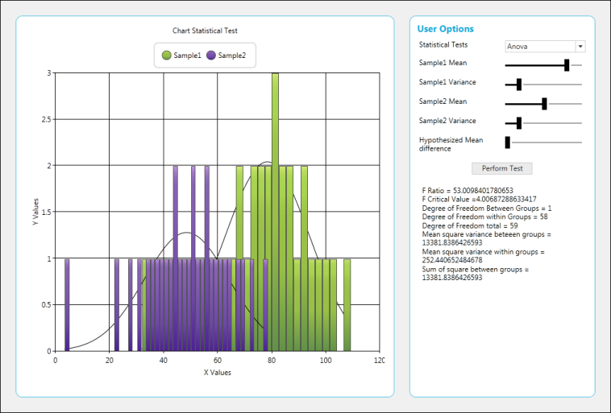
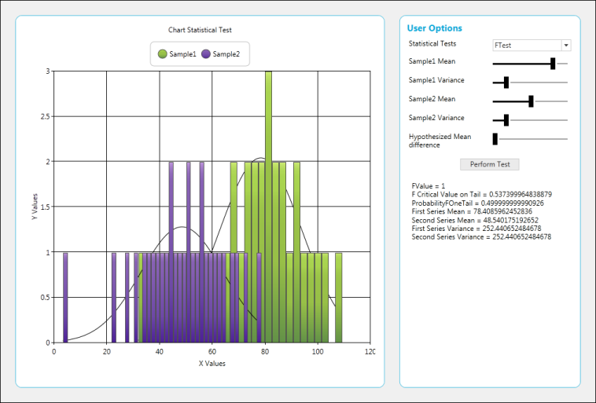
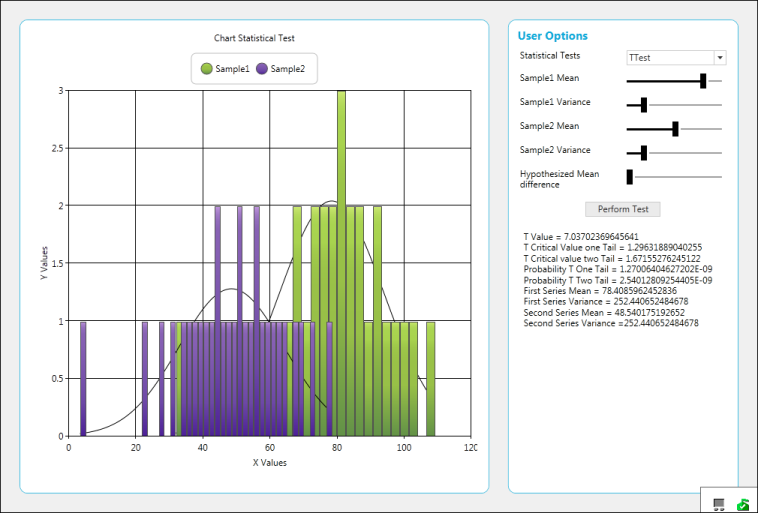
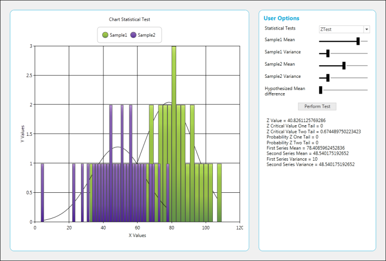
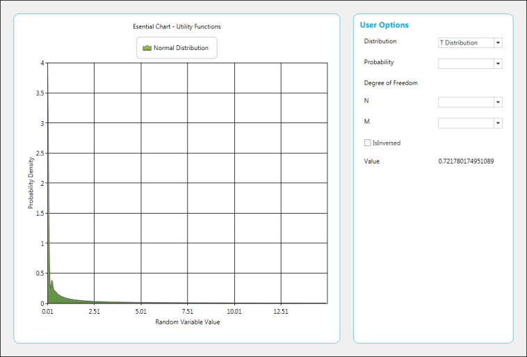

# Statistical-Formula-and-Utility-Functions in WPF Chart (Classic)

This feature allows the user to calculate basic statistical functions that include mean, median, standard deviation, variance, variance based estimator, variance unbased estimator, correlation coefficient and covariance, ANOVA, T-test, Z-test, and F-test performed based on sample series, and utility functions like normal distribution, T-cumulative distribution and F-cumulative distribution.

## Use Case Scenarios

1. This feature supports built-in statistical formulas.
2. The curve in the graph can be drawn based on normal distribution, T-cumulative distribution, and F-cumulative distribution.
3. Basic functions like mean, median, and standard deviation can be obtained from the series drawn.

## Methods

<table>
<tr>
<th>
Method</th><th>
Description</th><th>
Parameters</th><th>
Return Type</th></tr>
<tr>
<td>
Mean</td><td>
Returns the mean value of the x values of the series.</td><td>
Series</td><td>
Double</td></tr>
<tr>
<td>
Mean</td><td>
Returns the mean of y values.</td><td>
Series, Yindex(int)</td><td>
Double</td></tr>
<tr>
<td>
VarianceUnbiasedEstimator</td><td>
Estimates the variance for the x values of the series.</td><td>
Series</td><td>
Double</td></tr>
<tr>
<td>
VarianceUnbiasedEstimator</td><td>
Estimates the variance for the y values of the series.</td><td>
Series,Yindex(int)</td><td>
Double</td></tr>
<tr>
<td>
VarianceBiasedEstimator</td><td>
Estimates the variance of the sample.</td><td>
Series</td><td>
Double</td></tr>
<tr>
<td>
VarianceBiasedEstimator</td><td>
Estimates the variance for the y value of the series.</td><td>
Series, Yindex(int)</td><td>
Double</td></tr>
<tr>
<td>
Variance</td><td>
The following code samples demonstrate how to get the variance of the data points in a series.</td><td>
Series,sampleVariance(bool)</td><td>
Double</td></tr>
<tr>
<td>
Variance</td><td>
The following code samples demonstrate how to get the variance of the y-value data points in a series.</td><td>
Series,Yindex(int),sampleVariance(bool)</td><td>
Double</td></tr>
<tr>
<td>
StandardDeviation</td><td>
This method determines the standard Deviation for x values of the series.</td><td>
Series,sampleVariance(bool)</td><td>
Double</td></tr>
<tr>
<td>
StandardDeviation</td><td>
This method determines the standard deviation for y values of the series.</td><td>
SeriesYindex(double)sampleVariance(bool)</td><td>
Double</td></tr>
<tr>
<td>
Covariance</td><td>
Returns the average of the product of deviations of the data points from their respective means.</td><td>
Series1,Series 2</td><td>
Double</td></tr>
<tr>
<td>
Covariance</td><td>
Returns the average of the product of deviations of the data points from their respective means based on y values.</td><td>
Series1,Series 2,Yindex(int)</td><td>
Double</td></tr>
<tr>
<td>
Correlation</td><td>
Measures the relationship between two data sets that are scaled to be independent of the unit of measurement. This correlation method returns the covariance of two data sets divided by the product of their standard deviations, and always ranges from -1 to 1.</td><td>
Series1,Series2</td><td>
Double</td></tr>
<tr>
<td>
Correlation</td><td>
Measures the relationship between two data sets that are scaled to be independent of the unit of measurement. This correlation method returns the covariance of two data sets divided by the product of their standard deviations, and always ranges from -1 to 1.</td><td>
Series1,Series2, yIndex(double)</td><td>
Double</td></tr>
<tr>
<td>
Median</td><td>
Calculates the median of the points stored in a series.</td><td>
Series</td><td>
Double</td></tr>
<tr>
<td>
Median</td><td>
Calculates the median of the points stored in a series.</td><td>
Series,yIndex(int)</td><td>
Double</td></tr>
<tr>
<td>
ZTest</td><td>
This method performs a Z-test for two groups of data and returns the results using a ZTestResult object.</td><td>
(double) hypothesizedMeanDifference, (double) varianceFirstGroup, (double) varianceSecondGroup, (double) probability, (ChartSeries) firstInputSeries, (ChartSeries) secondInputSeries</td><td>
ZTestResult</td></tr>
<tr>
<td>
ZTest</td><td>
This method performs a Z-test for two groups of data and returns the results using a ZTestResult object, for Y values.</td><td>
(double )hypothesizedMeanDifference, (double) varianceFirstGroup, (double) varianceSecondGroup, (double) probability, (ChartSeries )firstInputSeries, (ChartSeries )secondInputSeries,(Int) yIndex</td><td>
ZTestResult</td></tr>
<tr>
<td>
TTestEqualVariances</td><td>
This method performs a T-test for two groups of data and assumes equal variances between the two groups (i.e. series) for the x values.</td><td>
(Double) hypothesizedMeanDifference, (double) probability, (ChartSeries)firstInputSeries, (ChartSeries) secondInputSeries</td><td>
TTestResult</td></tr>
<tr>
<td>
TTestEqualVariances</td><td>
This method performs a T-test for two groups of data and assumes equal variances between the two groups (i.e. series) for the y values.</td><td>
(Double) hypothesizedMeanDifference, (double) probability, (ChartSeries)firstInputSeries, (ChartSeries) secondInputSeries,(int)yIndex</td><td>
TTestResult</td></tr>
<tr>
<td>
TTestUnEqualVariances</td><td>
This method performs a T-test for two groups of data and assumes unequal variances between the two groups (i.e. series).</td><td>
(Double) hypothesizedMeanDifference, (double) probability, (ChartSeries) firstInputSeries, (ChartSeries) secondInputSeries</td><td>
TTestResult</td></tr>
<tr>
<td>
FTest</td><td>
This method returns the results of the F-test using an FTestResult object.</td><td>
(Double) probability, (ChartSeries) firstInputSeries, (ChartSeries) secondInputSeries</td><td>
FTestResult</td></tr>
<tr>
<td>
FTest</td><td>
This method returns the results of the F-test for the y values using an FTestResult object.</td><td>
(Double) probability, (ChartSeries) firstInputSeries, (ChartSeries) secondInputSeries,(Int) yIndex</td><td>
FTestResult</td></tr>
<tr>
<td>
Anova</td><td>
An ANOVA test is used to test the difference between the means of two or more groups of data.</td><td>
double probability, ChartSeries[] inputSeries</td><td>
AnovaResult</td></tr>
<tr>
<td>
Anova</td><td>
An ANOVA test is used to test the difference between the means of two or more groups of data for y values.</td><td>
double probability, ChartSeries[] inputSeries,int Yindex</td><td>
AnovaResult</td></tr>
<tr>
<td>
GammaLn</td><td>
Natural logarithm of gamma function (for y>0).</td><td>
Double</td><td>
Double</td></tr>
<tr>
<td>
Factorial</td><td>
Factorial n! (for n >= 0).</td><td>
Double</td><td>
Double</td></tr>
<tr>
<td>
FactorialLn</td><td>
Logarithm of factorial n! (for n >= 0).</td><td>
Int</td><td>
Double</td></tr>
<tr>
<td>
BetaLn</td><td>
Logarithm of beta function.</td><td>
Double a, double b</td><td>
Double</td></tr>
<tr>
<td>
Beta</td><td>
Beta function.</td><td>
double a, double b</td><td>
Double</td></tr>
</table>

## Sample Link

1. Open the Sample Browser samples
2. Select the Chart control 
3. Statistical Analysis > Statistical Formula
4. Statistical Analysis > Utility Functions

Adding Statistical Formula and Utility Functions to an Application

## Statistical Formulas



string val = "";

            val += "Mean = " + BasicStatisticalFormulas.Mean(series).ToString() + "\r\n";

            val += "Median = " + BasicStatisticalFormulas.Median(series).ToString() + "\r\n";

            val += "Standard Deviation = " + BasicStatisticalFormulas.StandardDeviation(series, true).ToString() + "\r\n";

            val += "Variance = " + BasicStatisticalFormulas.Variance(series, true).ToString() + "\r\n";

            val += "Variance Based Estimator = " + BasicStatisticalFormulas.VarianceBiasedEstimator(series).ToString() + "\r\n";

            val += "Variance UnBased Estimator = " + BasicStatisticalFormulas.VarianceUnbiasedEstimator(series).ToString() + "\r\n";

            val += "Correlation Co-efficient = " + BasicStatisticalFormulas.Correlation(this.chartControl1.Series[0], this.chartControl1.Series[1]).ToString() + "\r\n";

            val += "Covariance = " + BasicStatisticalFormulas.Covariance(this.chartControl1.Series[0], this.chartControl1.Series[1]).ToString() + "\r\n";

            this.richTextBox1.Text = val;



## Perform ANOVA Test



AnovaResult anova = BasicStatisticalFormulas.Anova(0.05, new ChartSeries[] { series1, series2 });

            result.Text = "F Ratio = " + anova.FRatio + "\n" +

                           "F Critical Value =" + anova.FCriticalValue + "\n" +

                           "Degree of Freedom Between Groups = " + anova.DegreeOfFreedomBetweenGroups + "\n" +

                           "Degree of Freedom within Groups = " + anova.DegreeOfFreedomWithinGroups + "\n" +

                           "Degree of Freedom total = " + anova.DegreeOfFreedomTotal + "\n" +

                           "Mean square variance beteeen groups = " + anova.MeanSquareVarianceBetweenGroups + "\n" +

                           "Mean square variance within groups = " + anova.MeanSquareVarianceWithinGroups + "\n" +

                           "Sum of square between groups = " + anova.SumOfSquaresBetweenGroups + "\n";



## Perfrom F-Test


FTestResult ftest = BasicStatisticalFormulas.FTest(0.05, series1, series2);

            result.Text = "FValue = " + ftest.FValue.ToString() + "\n" +

                            "F Critical Value on Tail = " + ftest.FCriticalValueOneTail.ToString() + "\n" +

                            "ProbabilityFOneTail = " + ftest.ProbabilityFOneTail.ToString() + "\n" +

                            "First Series Mean = " + ftest.FirstSeriesMean.ToString() + "\n" +

                            "Second Series Mean = " + ftest.SecondSeriesMean.ToString() + "\n" +

                            "First Series Variance = " + ftest.FirstSeriesVariance.ToString() + "\n" +

                            "Second Series Variance = " + ftest.SecondSeriesVariance.ToString() + "\n";



## Perform T-Test



TTestResult ttest = BasicStatisticalFormulas.TTestEqualVariances(meandiff.Value, 0.1, series1, series2);

            result.Text = "T Value = " + ttest.TValue.ToString() + "\n" +

                            "T Critical Value one Tail = " + ttest.TCriticalValueOneTail.ToString() + "\n" +

                            "T Critical value two Tail = " + ttest.TCriticalValueTwoTail.ToString() + "\n" +

                            "Probability T One Tail = " + ttest.ProbabilityTOneTail.ToString() + "\n" +

                            "Probability T Two Tail = " + ttest.ProbabilityTTwoTail.ToString() + "\n" +

                            "First Series Mean = " + ttest.FirstSeriesMean.ToString() + "\n" +

                            "First Series Variance = " + ttest.FirstSeriesVariance.ToString() + "\n" +

                            "Second Series Mean = " + ttest.SecondSeriesMean.ToString() + "\n" +

                            "Second Series Variance =" + ttest.SecondSeriesVariance.ToString() + "\n";



## Perform Z-Test


ZTestResult ztest = BasicStatisticalFormulas.ZTest(meandiff.Value, 10, 5, 0.5, series1, series2);

            result.Text = "Z Value = " + ztest.ZValue.ToString() + "\n" +

                            "Z Critical Value One Tail = " + ztest.ZCriticalValueOneTail.ToString() + "\n" +

                            "Z Critical Value Two Tail = " + ztest.ZCriticalValueTwoTail.ToString() + "\n" +

                            "Probability Z One Tail = " + ztest.ProbabilityZOneTail.ToString() + "\n" +

                            "Probability Z Two Tail = " + ztest.ProbabilityZTwoTail.ToString() + "\n" +

                            "First Series Mean = " + ztest.FirstSeriesMean.ToString() + "\n" +

                            "Second Series Mean = " + ztest.SecondSeriesMean.ToString() + "\n" +

                            "First Series Variance = " + ztest.FirstSeriesVariance.ToString() + "\n" +

                            "Second Series Variance = " + ztest.SecondSeriesMean.ToString() + "\n";



## Normal Distribution



value.Text = UtilityFunctions.NormalDistribution((double)probability.SelectedItem).ToString();



## F-Cumulative Distribution



value.Text = UtilityFunctions.FCumulativeDistribution((double)probability.SelectedItem, (double)n.SelectedItem, (double)m.SelectedItem).ToString();



## T-Cumulative Distribution



value.Text = UtilityFunctions.TCumulativeDistribution((double)probability.SelectedItem, (double)n.SelectedItem, true).ToString();



