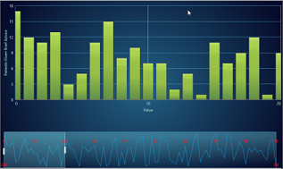

# Timeline in WPF Chart (Classic)

TimeLine control can be added to other controls like Chart, Grid, etc. It is mainly used to set the ViewPort for a limited time to view the selected data. Following are the list of characteristics of TimeLine Control:

* It gets the DataSource from the user and produces a limited set of data using the SelectedData property
* It includes the ViewPort to select the limited data
* The ViewPort can be dragged and dropped at any position inside the TimeLineControl
* It also includes the TimeLine indicator to change the size of the TimeLine Control
* The ViewPort and TimeLine Control can be customized

## Use Case Scenario

TimeLine Control has been designed to visualize large number of data and to handle the selected data for instance, in StockMarket analysis; the stock price and volume of the selected data can be handled.

## Appearance and Structure

## Feature Summary

The features of TimeLine Control are:

* Panning of selected data can be done by using drag and drop in view port
* View port can also be resized to modify the selected data
* Double-clicking the view port displays the minimum time line interval
* When there is an unselected area in TimeLine control, the view port is automatically dragged to the selected area
* When mouse over is done on the view port it displays the minimum TimeLine interval

## Adding TimeLine Control

The following code illustrates how to add TimeLine control:


<sync:TimeLineControl Height="100" x:Name="rangeIndicator" Grid.Row="1" DataSource="{Binding}" BindingPathX="X" BindingPathsY="Y"

TimeLineInterior ="{Binding ElementName=timelineInterior, Path=SelectedItem, Mode=TwoWay}"

ViewPortInterior="{Binding ElementName=viewport, Path=SelectedItem, Mode=TwoWay}"

ViewLineInterior="{Binding ElementName=viewline, Path=SelectedItem, Mode=TwoWay}"/>


Samples Link

To view sample,

1. Open the WPF sample browser from the dashboard. 
2. Navigate to WPF Chart-> TimeLine Control>TimeLine Control Demo.

## Properties

<table>
<tr>
<th>
Property </th><th>
Description </th><th>
Type </th><th>
Data Type </th><th>
Reference links </th></tr>
<tr>
<td>
SelectedData</td><td>
It returns the selected data in the ViewPort.</td><td>
Dependency Property</td><td>
Object</td><td>
NA</td></tr>
<tr>
<td>
DataSource</td><td>
To give the input data for the TimeLineControl.</td><td>
Dependency Property</td><td>
IEnumerable</td><td>
NA</td></tr>
<tr>
<td>
BindingPathX</td><td>
To set the X binding to the data. </td><td>
Dependency Property</td><td>
String</td><td>
NA</td></tr>
<tr>
<td>
BindingPathsY</td><td>
To set the Y value binding to the Data.</td><td>
Dependency Property</td><td>
IEnumerable&lt;string&gt;</td><td>
NA</td></tr>
<tr>
<td>
StartDate</td><td>
Specifies the starting date of the TimeLine.</td><td>
Attached Property</td><td>
Double</td><td>
NA</td></tr>
<tr>
<td>
EndDate</td><td>
Specifies the ending date of the TimeLine.</td><td>
Attached Property</td><td>
Double</td><td>
NA</td></tr>
<tr>
<td>
StartValue</td><td>
Specifies the starting value of the TimeLine.</td><td>
DependencyProperty</td><td>
Double</td><td>
NA</td></tr>
<tr>
<td>
EndValue</td><td>
Specifies the ending value of the TimeLine.</td><td>
DependencyProperty</td><td>
Double</td><td>
NA</td></tr>
<tr>
<td>
ViewPortInterior</td><td>
Sets the interior for the View Port.</td><td>
Dependency Property</td><td>
Brush</td><td>
NA</td></tr>
<tr>
<td>
ViewLineInterior</td><td>
Sets the interior for the TimeLine.</td><td>
Dependency Property</td><td>
Brush</td><td>
NA</td></tr>
<tr>
<td>
TimeLineInterior</td><td>
Sets the interior for the Timeline. series</td><td>
Dependency property</td><td>
Brush</td><td>
NA</td></tr>
<tr>
<td>
MinimumTimeLineInterval</td><td>
To set the minimum interval for the view port.</td><td>
Dependency property</td><td>
Double </td><td>
NA</td></tr>
</table>

## Setting the Starting and Ending Date

You can specify the starting date and ending date for the TimeLine control by using the StartDate and EndDate attached properties. This is applicable when the ValueType property of PrimayAxis is set to _DateTime_. The following code example illustrates this.




<sync:TimeLineControl x:Name='timelineControl' sync:TimeLineControl.StartDate='9/27/2006' sync:TimeLineControl.EndDate='12/7/2007'>

<sync:TimeLineControl.PrimaryAxis>

<sync:ChartAxis ValueType='DateTime'/>

</sync:TimeLineControl.PrimaryAxis>

</sync:TimeLineControl




TimeLineControl.SetStartDate(timelineControl, datalist[20].TimeStamp);

TimeLineControl.SetEndDate(timelineControl, datalist[40].TimeStamp);




## Setting the Starting and Ending Value

You can specify the starting value and ending value for the TimeLine control by using the StartValue and EndValue attached properties. This is applicable when the ValueType property of the PrimayAxis is set to Double. The following code example illustrates this.




<sync:TimeLineControl x:Name='timelineControl' sync:TimeLineControl.StartValue='0' sync:TimeLineControl.EndValue='20'>

<sync:TimeLineControl.PrimaryAxis>

<sync:ChartAxis ValueType='Double'/>

</sync:TimeLineControl.PrimaryAxis>

</sync:TimeLineControl



TimeLineControl.SetStartValue(timelineControl, 0);

TimeLineControl.SetEndValue(timelineControl, 20);





