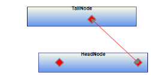
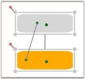

# Connection Port in WPF Diagram (classic)

Essential Diagram WPF provides the ability to define custom ports for making connections. The ConnectionPort class can be used for defining custom ports on the nodes. Any number of ports can be defined on a node. By default every node has a center port.  

ConnectionPort has the following properties:

<table>
<tr>
<th>
Property</th><th>
Description </th><th>
Type of the property</th><th>
Value it accepts</th><th>
Any other dependencies/ sub properties associated</th></tr>
<tr>
<td>
Left</td><td>
Gets or sets the position of the port in the x coordinate.Default value: 0</td><td>
Dependency property</td><td>
Double</td><td>
No</td></tr>
<tr>
<td>
Top</td><td>
Gets or sets the position of the port in the y coordinate.Default value: 0</td><td>
Dependency property</td><td>
Double</td><td>
No</td></tr>
<tr>
<td>
Node</td><td>
The Node property specifies the container of the port.</td><td>
CLR property</td><td>
Node</td><td>
No</td></tr>
<tr>
<td>
PortShape</td><td>
The PortShape property specifies the shape to be used for the port. Three types of shapes are provided: Arrow, Circle, Diamond.Default Value is PortShapes.Diamond</td><td>
CLR property</td><td>
PortShapes.NonePortShapes.ArrowPortShapes.DiamondPortShapes.Circle</td><td>
No</td></tr>
<tr>
<td>
PortStyle</td><td>
The PortStyle property provides option for the customization of the ports.</td><td>
CLR property</td><td>
PortStyle</td><td>
No</td></tr>
</table>

Node properties related to Connection Ports are:

<table>
<tr>
<th>
Property</th><th>
Description </th><th>
Type of the property</th><th>
Value it accepts</th><th>
Any other dependencies/ sub properties associated</th></tr>
<tr>
<td>
PortVisibility</td><td>
Gets or sets a value indicating whether all the ports of  the node are visible or not.Default value is Visibility.Visible</td><td>
Dependency property</td><td>
Visibility.HiddenVisibility.CollapsedVisibility.Visible</td><td>
No</td></tr>
<tr>
<td>
AllowPortDrag</td><td>
Gets or sets a value indicating whether the ports can be dragged or not.Default value is True.</td><td>
Dependency property</td><td>
Boolean (true/ false)</td><td>
No</td></tr>
</table>

LineConnector properties related to Connection Port are:

<table>
<tr>
<th>
Property</th><th>
Description </th><th>
Type of the property</th><th>
Value it accepts</th><th>
Any other dependencies/ sub properties associated</th></tr>
<tr>
<td>
ConnectionHeadPort</td><td>
Gets or sets the head port of the connection.While specifying the ConnectionHeadPort, the node containing the port should be specified as the HeadNode of the connection.Default value is Null.</td><td>
Dependency property</td><td>
ConnectionPort</td><td>
No</td></tr>
<tr>
<td>
ConnectionTailPort</td><td>
Gets or sets the head port of the connection.While specifying the ConnectionTailPort, the node containing the port should be specified as the TailNode of the connection.Default value is Null.</td><td>
Dependency property</td><td>
ConnectionPort</td><td>
No</td></tr>
</table>



* Create Connection Port Refer Concepts and Features -> Connection Port -> Create Connection Port
* PortShape Refer Concepts and Features -> Connection Port -> PortShape
* PortStyle Refer Concepts and Features -> Connection Port -> PortStyle
* PortVisibility Refer Concepts and Features -> Connection Port -> PortVisibility
* AllowPortDrag Refer Concepts and Features -> Connection Port -> AllowPortDrag
* Connections to Port Refer Concepts and Features -> Connection Port -> Connections to Port



## Create Connection Port on Node

To add a port to the node, the port's position has to be specified using the Left and Top properties. The node which hosts the port should then be specified using the Node property. Finally the port should be added to the node's Ports collection.

The following code shows how to add a connection port to the node.



Node node = new Node(Guid.NewGuid(), "Node1");

node.Shape = Shapes.RoundedSquare;

node.Width = 150;

node.Height = 50;

node.OffsetX = 250;

node.OffsetY = 100;

ConnectionPort port = new ConnectionPort();

port.Left = 50;

port.Top = 0;

port.Node = node;

node.Ports.Add(port);

diagramModel.Nodes.Add(node);




Dim node As New Node(Guid.NewGuid(), "Node1")

node.Shape = Shapes.RoundedSquare

node.Width = 150

node.Height = 50

node.OffsetX = 250

node.OffsetY = 100

Dim port As New ConnectionPort()

port.Left = 50

port.Top = 0

port.Node = node

node.Ports.Add(port)

diagramModel.Nodes.Add(node)


This adds a port to the node at the location (50,0) with respect to the node.

Connection Port
{:.caption}

N> The ports location should always be specified to be within the node's boundary. Therefore the values of the Left and Top property should always be less than the width and height of the node respectively.

## Adding Connection Port at Runtime

This feature provides an option to add connection ports at runtime through mouse operations. Similarly, connection ports can be removed from a node through mouse operations. 

### Properties

<table>
<tr>
<th>
Property</th><th>
Description</th><th>
Type</th><th>
Data Type</th></tr>
<tr>
<td>
AddConnectionPortEnabled</td><td>
Property used to enable/disable the adding connection port dynamically. </td><td>
SL</td><td>
boolean</td></tr>
</table>

### Adding Connection Ports at Runtime to an Application

#### Adding a Connection Port at Runtime

To allow connection ports to be added to a node dynamically, set the AddConnectionPortEnabled property of the node to true, then select the node. Hold CTRL+SHIFT and click on the node. The connection port will be added in the position where you clicked on the node.



Node node = new Node();

//Set True value to AddConnectionPortEnabled property.

node.AddConnectionPortEnabled = true;




Dim node As New Node()

'Set True value to AddConnectionPortEnabled property.

node.AddConnectionPortEnabled = True



#### Deleting a Connection Port at Runtime

A connection port can be deleted from the node dynamically. With the AllowDelete property of a port set to true, hold CTRL+SHIFT and click on the connection port to delete it. The default value of the AllowDelete property is set to true. This can be disabled by setting the AllowDelete property to false.



Node node = new Node();

//Set false value to Connection Port disable Delete a port dynamically.

(node.Ports[1] as ConnectionPort).AllowDelete = false;




Dim node As New Node()

'Set false value to Connection Port disable Delete a port dynamically.

TryCast(node.Ports(1), ConnectionPort).AllowDelete = False



N> Removing a port directly from a node’s Ports collection property will not be affected by setting the AllowDelete property of the connection port to false.

## Create Connection Port on Line Connector

Connection ports for line connectors can be specified by using the Edge property. Multiple ports can be added to the line connectors by using the Ports property.


 

LineConnector line = new LineConnector();

ConnectionPort port = new ConnectionPort();

port.PortStyle.Stroke = new SolidColorBrush(Colors.OrangeRed);

port.PortStyle.Fill = new SolidColorBrush(Colors.OrangeRed);

port.Width = 10;

port.Height = 10;

port.PortOffset = 0.5;

port.PortVisibility = PortVisibility.AlwaysVisible;

line.Ports.Add(port);

       port.Edge = line;

       diagramModel.Connections.Add(line); 



## PortShape

Several predefined shapes have been provided for the ports. They are,

* Arrow
* Circle
* Diamond

<table>
<tr>
<th>
Property</th><th>
Description </th><th>
Type of the property</th><th>
Value it accepts</th><th>
Any other dependencies/ sub properties associated</th></tr>
<tr>
<td>
PortShape</td><td>
The PortShape property specifies the shape to be used for the port. Three types of shapes are provided: Arrow, Circle, Diamond.Default Value: PortShapes.Diamond</td><td>
CLR property</td><td>
PortShapes.NonePortShapes.ArrowPortShapes.DiamondPortShapes.Circle</td><td>
No</td></tr>
</table>

The following code shows how a port shape can be selected for the port.



Node node = new Node(Guid.NewGuid(), "Node1");

node.Shape = Shapes.RoundedSquare;

node.Width = 150;

node.Height = 50;

node.OffsetX = 250;

node.OffsetY = 100;

ConnectionPort port = new ConnectionPort();

port.Left = 50;

port.Top = 0;

port.Node = node;

port.PortShape = PortShapes.Arrow;

node.Ports.Add(port);

diagramModel.Nodes.Add(node);




Dim node As New Node(Guid.NewGuid(), "Node1")

node.Shape = Shapes.RoundedSquare

node.Width = 150

node.Height = 50

node.OffsetX = 250

node.OffsetY = 100

Dim port As New ConnectionPort()

port.Left = 50

port.Top = 0

port.Node = node

port.PortShape = PortShapes.Arrow

node.Ports.Add(port)

diagramModel.Nodes.Add(node)



Port Shapes

{:.caption}

## Port Visibility

The PortVisibility property is used to set the visibility of connection ports on a node in one of three ways. This PortVisibility Enum class provides 3 types of enum.

1. OnMouseOver
2. AlwaysHidden
3. AlwaysVisible

### Properties

<table>
<tr>
<th>
Property</th><th>
Description</th><th>
Type</th><th>
Data Type</th></tr>
<tr>
<td>
PortVisibility</td><td>
Gets and sets on which action the port will be visible or not. </td><td>
Dependency</td><td>
Enum</td></tr>
</table>

### Adding PortVisibility to an Application 

### MouseOverNode

When the PortVisibility property of the node is set to MouseOverNode, the connection port will be visible only on mouse-over of the node. This is the default value of this property.

### AlwaysHidden

The connection port will always be hidden, when PortVisibility property of the Node is set to AlwaysHidden.

### AlwaysVisible

ConnectionPort will be visible always, when PortVisibility property of the Node is set to AlwaysVisible.

I> Changes: For versions 10.2 and later, the type of PortVisibility property of nodes has been changed from ‘Visibility’ to ’PortVisibility‘ Enum.

## Customize PortStyle

The port shapes can be customized by specifying the property values under the PortStyle property.

<table>
<tr>
<th>
Property</th><th>
Description </th><th>
Type of the property</th><th>
Value it accepts</th><th>
Any other dependencies/ sub properties associated</th></tr>
<tr>
<td>
PortStyle</td><td>
The PortStyle property provides option for the customization of ports.</td><td>
CLR property</td><td>
PortStyle</td><td>
No</td></tr>
</table>

The various properties under the PortStyle property are,

* Fill—specifies the color to be used to fill the port.
* StrokeThickness—specifies the thickness value of the port's border.
* Stroke—specifies the color to be used for the border of the port.
* StrokeStartLineCap—Specifies the shape used at the start of a line or segment.
* StrokeEndLineCap—specifies the shape at the end of a line or segment.
* StrokeLineJoin—specifies the shape that joins two lines or segments.

The following code shows how to set some of these properties.



Node node = new Node(Guid.NewGuid(), "Node1");

node.Shape = Shapes.RoundedSquare;

node.Width = 150;

node.Height = 50;

node.OffsetX = 250;

node.OffsetY = 100;

ConnectionPort port = new ConnectionPort();

port.Left = 50;

port.Top = 0;

port.Node = node;

port.PortShape = PortShapes.Diamond;

port.PortStyle.Fill = Brushes.Orange;

port.PortStyle.Stroke = Brushes.Red;

node.Ports.Add(port);

diagramModel.Nodes.Add(node);




Dim node As New Node(Guid.NewGuid(), "Node1")

node.Shape = Shapes.RoundedSquare

node.Width = 150

node.Height = 50

node.OffsetX = 250

node.OffsetY = 100

Dim port As New ConnectionPort()

port.Left = 50

port.Top = 0

port.Node = node

port.PortShape = PortShapes.Diamond

port.PortStyle.Fill = Brushes.Orange

port.PortStyle.Stroke = Brushes.Red

node.Ports.Add(port)

diagramModel.Nodes.Add(node)



Port Style

{:.caption}

## CustomPathStyle

The CustomPathStyle property enables you to customize the appearance of ConnectionPort. 

### Properties

<table>
<tr>
<th>
Property </th><th>
Description </th><th>
Type </th><th>
Data Type </th><th>
Reference links </th></tr>
<tr>
<td>
CustomPathStyle </td><td>
Get or Set CustomPathStyle for ConnectionPort</td><td>
Dependency Property </td><td>
Style </td><td>
NA</td></tr>
</table>

### Adding CustomPathStyle for ConnectionPort to an Application 

Appearance of the ConnectionPort can be customized by applying style for the CustomPathStyle property. Style can be applied for CustomPathStyle as illustrated in the following code:

### Through XAML



         

                </Setter.Value>

            </Setter>

          </Style>



Custom ConnectionPort using CustomPathStyle
{:.caption}

## AllowPortDrag

It is possible to move the ports on the node to a different location on the node. All that is needed to do is to drag the respective port to the desired location. The connections (if any) which are already connected to the nodes will also get updated accordingly. The node drag can be enabled/disabled using the AllowPortDrag property. By default it is set to ‘False’.

The following code shows how to set the AllowPortDrag property.



Node nodeObject = new Node(Guid.NewGuid(), "Node1");

diagramModel.Nodes.Add(nodeObject);

nodeObject.AllowPortDrag = true;




Dim nodeObject As New Node(Guid.NewGuid(), "Node1")

diagramModel.Nodes.Add(nodeObject)

nodeObject.AllowPortDrag = True



## Connections to Ports

### Connection to Ports on Node

Head and tail ends of a line connector can be connected to a connection port that exists in a node.

Make connection to the port through code behind

The ConnectionHeadPort and ConnectionTailPort properties can be used to specify the ports to be used for connecting them to the nodes. The HeadNode and TailNode should still be specified.

The following code shows how to connect to the ports.



Node nodeObject = new Node(Guid.NewGuid(), "Node1");

diagramModel.Nodes.Add(nodeObject);

nodeObject.AllowPortDrag = true;Node node = new Node(Guid.NewGuid(), "Node1");

node.Shape = Shapes.RoundedSquare;

node.Width = 150;

node.Height = 50;

node.OffsetX = 250;

node.OffsetY = 100;

ConnectionPort port = new ConnectionPort();

port.Left = 50;

port.Top = 20;

port.Node = node;

node.Ports.Add(port);

diagramModel.Nodes.Add(node);

Node node1 = new Node(Guid.NewGuid(), "Node1");

node1.Shape = Shapes.RoundedSquare;

node1.Width = 150;

node1.Height = 50;

node1.OffsetX = 250;

node1.OffsetY = 200;

ConnectionPort port1 = new ConnectionPort();

port1.Left = 20;

port1.Top = 20;

port1.Node = node1;

node1.Ports.Add(port1);

diagramModel.Nodes.Add(node1);

diagramModel.Nodes.Add(node1);

LineConnector o = new LineConnector();

o.ConnectorType = ConnectorType.Straight;

o.TailNode = node;

o.HeadNode = node1;

o.HeadDecoratorShape = DecoratorShape.None;

o.TailDecoratorShape = DecoratorShape.None;

o.ConnectionTailPort = port;

o.ConnectionHeadPort = port1;

LineConnector o1 = new LineConnector();

o1.ConnectorType = ConnectorType.Straight;

o1.TailNode = node;

o1.HeadNode = node1;

o1.HeadDecoratorShape = DecoratorShape.None;

o1.TailDecoratorShape = DecoratorShape.None;

diagramModel.Connections.Add(o);

diagramModel.Connections.Add(o1);




Dim nodeObject As New Node(Guid.NewGuid(), "Node1")

diagramModel.Nodes.Add(nodeObject)

nodeObject.AllowPortDrag = True

Dim node As New Node(Guid.NewGuid(), "Node1")

node.Shape = Shapes.RoundedSquare

node.Width = 150

node.Height = 50

node.OffsetX = 250

node.OffsetY = 100

Dim port As New ConnectionPort()

port.Left = 50

port.Top = 20

port.Node = node

node.Ports.Add(port)

diagramModel.Nodes.Add(node)

Dim node1 As New Node(Guid.NewGuid(), "Node1")

node1.Shape = Shapes.RoundedSquare

node1.Width = 150

node1.Height = 50

node1.OffsetX = 250

node1.OffsetY = 200

Dim port1 As New ConnectionPort()

port1.Left = 20

port1.Top = 20

port1.Node = node1

node1.Ports.Add(port1)

diagramModel.Nodes.Add(node1)

diagramModel.Nodes.Add(node1)

Dim o As New LineConnector()

o.ConnectorType = ConnectorType.Straight

o.TailNode = node

o.HeadNode = node1

o.HeadDecoratorShape = DecoratorShape.None

o.TailDecoratorShape = DecoratorShape.None

o.ConnectionTailPort = port

o.ConnectionHeadPort = port1

Dim o1 As New LineConnector()

o1.ConnectorType = ConnectorType.Straight

o1.TailNode = node

o1.HeadNode = node1

o1.HeadDecoratorShape = DecoratorShape.None

o1.TailDecoratorShape = DecoratorShape.None

diagramModel.Connections.Add(o)

diagramModel.Connections.Add(o1)



Connecting to Port
{:.caption}

Make connection to the port at run time

The following steps illustrate how to create a connection to the port at run time.

* To connect to a port on the node at run time, click the desired line icon and start dragging the mouse from the desired port on the node to the target node or port. 
* As the mouse pointer moves over the ports, a red border will appear on the respective ports indicating that the mouse is over the port.
* To make a connection, drop the other end of the line on the desired port or node.
* Connecting to the center port will make the connection to the boundary of the node.
* If the node does not contain any port other than the default center port and if the end of line connector is dropped on the node, then the connection will take place on the node's boundary.
* In case the node contains a port, then the line connector should be dropped on the center port to connect to the node's boundary. A red border will appear around the node indicating that the connection will be made to the node's boundary.

### Connection to Ports on Line Connector

Connections can be created between line connectors through connection ports. The connection ports can be added to the line connectors and dragged on the path lines.

Creating Connections between Line Connectors Programmatically

To make a connection between two lines, use the ConnectionTailPort or ConnectionHeadPort property of LineConnector and set a particular port.


 

LineConnector line = new LineConnector();

ConnectionPort port = new ConnectionPort();

port.PortStyle.Stroke = new SolidColorBrush(Colors.OrangeRed);

port.PortStyle.Fill = new SolidColorBrush(Colors.OrangeRed);

port.Width = 10;

port.Height = 10;

port.PortOffset = 0.5;

port.PortVisibility = PortVisibility.AlwaysVisible;

line.Ports.Add(port);

       port.Edge = line;

       diagramModel.Connections.Add(line);

LineConnector line1 = new LineConnector();

line1.LineStyle.Stroke = new SolidColorBrush(Colors.Brown);

line1.TailDecoratorStyle.Stroke = new SolidColorBrush(Colors.Brown);

line1.TailDecoratorStyle.Fill = new SolidColorBrush(Colors.Brown);

line1.TailDecoratorShape = Syncfusion.Windows.Diagram.DecoratorShape.None;

line1.ConnectionTailPort = port;

diagramModel.Connections.Add(line1);




 

Dim line As New LineConnector()

Dim port As New ConnectionPort()

port.PortStyle.Stroke = New SolidColorBrush(Colors.OrangeRed)

port.PortStyle.Fill = New SolidColorBrush(Colors.OrangeRed)

port.Width = 10

port.Height = 10

port.PortOffset = 0.5

port.PortVisibility = PortVisibility.AlwaysVisible

line.Ports.Add(port)

port.Edge = line

diagramModel.Connections.Add(line)

Dim line1 As New LineConnector()

line1.LineStyle.Stroke = New SolidColorBrush(Colors.Brown)

line1.TailDecoratorStyle.Stroke = New SolidColorBrush(Colors.Brown)

line1.TailDecoratorStyle.Fill = New SolidColorBrush(Colors.Brown)

line1.TailDecoratorShape = Syncfusion.Windows.Diagram.DecoratorShape.None

line1.ConnectionTailPort = port

diagramModel.Connections.Add(line1)



### Creating Connections between Line Connectors at Run Time

The connections can be created at run time using mouse operations. Drag one of the line connectors to a target line connector. It will automatically create a connection port on a dropped position to make a connection between the two line connectors. The automatically added connection port will be removed when disconnecting the line connectors from it.

