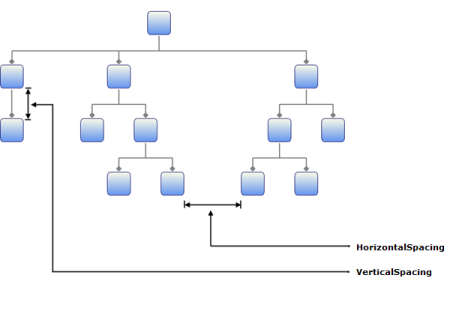
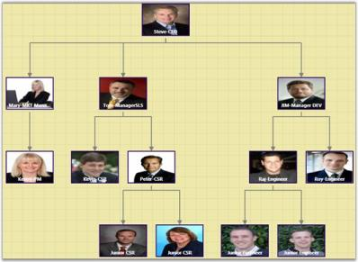
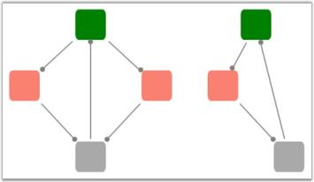

# Diagram Model in WPF Diagram (classic)

A model represents data for an application and contains the logic for adding, accessing, and manipulating the data. Nodes and connectors are added to the Diagram control using the Model property. A predefined layout can be applied using the LayoutType property of the DiagramModel. The position of the nodes can be manually specified.



* Bind data to Diagram Control Refer Concepts and Features -> Diagram Model -> Bind data to Diagram Control
* Tree Spacing Refer Concepts and Features -> Diagram Model -> Tree Spacing
* Tree Orientation Refer Concepts and Features -> Diagram Model -> Tree Orientation
* Table Expand Mode Refer Concepts and Features -> Diagram Model -> Table Expand Mode


<table>
<tr>
<th>
Name</th><th>
Parameters </th><th>
Return Type</th><th>
Description</th><th>
Reference Links</th></tr>
<tr>
<td>
Nodes.Add(object)</td><td>
object,object should be of type Node</td><td>
Void</td><td>
To add a node into the Model.</td><td>
Add a Node</td></tr>
<tr>
<td>
Connections.Add(object)</td><td>
object,object should be of type LineConnector</td><td>
Void</td><td>
To add a line connector into the Model.</td><td>
Add a LineConnector</td></tr>
<tr>
<td>
Layers.Add(Layer)</td><td>
Layer</td><td>
Void</td><td>
To add a layer into the model.</td><td>
Add a Layer</td></tr>
</table>

## Layout

The following are general spacing properties used in many automatic layouts. Spacing refers to spaces between the nodes that lies in different levels of the tree layout and space between each node with their sibling.

<table>
<tr>
<th>
Property</th><th>
Description </th><th>
Type of the property</th><th>
Value it accepts</th><th>
Any other dependencies/ sub properties associated</th></tr>
<tr>
<td>
VerticalSpacing</td><td>
Gets or sets the Vertical spacing between nodes.</td><td>
CLR property</td><td>
Double</td><td>
No</td></tr>
<tr>
<td>
HorizontalSpacing</td><td>
Gets or sets the Horizontal spacing between nodes.</td><td>
CLR property</td><td>
Double</td><td>
No</td></tr>
<tr>
<td>
SpaceBetweenSubTrees</td><td>
Gets or sets the space between sub trees.</td><td>
CLR property</td><td>
Double</td><td>
No</td></tr>
<tr>
<td>
LayoutVerticalAlignment</td><td>
Specifies the vertical alignment for layout. The default value is Center.</td><td>
Dependency property</td><td>
VerticalAlignment.CenterVerticalAlignment.TopVerticalAlignment.BottomVerticalAlignment.Stretch</td><td>
No</td></tr>
<tr>
<td>
LayoutHorizontalAlignment</td><td>
Specifies horizontal alignment for the layout.</td><td>
Dependency property</td><td>
HorizontalAlignment.CenterHorizontalAlignment.LeftHorizontalAlignment.RightHorizontalAlignment.Stretch</td><td>
No</td></tr>
<tr>
<td>
LayoutRoot</td><td>
Gets or sets the layout root.</td><td>
CLR property</td><td>
IShape</td><td>
No</td></tr>
</table>

You can set the horizontal and the vertical distance between the nodes in a tree layout using the HorizontalSpacing and VerticalSpacing properties. The spaces between sub-trees are specified using the SpaceBetweenSubTrees property.

N> In case of Table layout, only the HorizontalSpacing and VerticalSpacing properties should be specified. 

The following code illustrates these settings.



    <!--Diagram Control-->

    <syncfusion:DiagramControl  Name="diagramControl">

        <!-- Model to add nodes and connections-->

<syncfusion:DiagramControl.Model>

    <syncfusion:DiagramModel LayoutType="DirectedTreeLayout" HorizontalSpacing="50" VerticalSpacing="50" SpaceBetweenSubTrees="100"

    x:Name="diagramModel">

    </syncfusion:DiagramModel>

</syncfusion:DiagramControl.Model>

        <!--View to display nodes and connections added through model.-->

        <syncfusion:DiagramControl.View>

            <syncfusion:DiagramView Name="diagramView">

            </syncfusion:DiagramView>

        </syncfusion:DiagramControl.View>

    </syncfusion:DiagramControl>




DiagramModel diagramModel = new DiagramModel();diagramModel.VerticalSpacing = 50;diagramModel.HorizontalSpacing = 50;diagramModel.SpaceBetweenSubTrees = 100;



Dim diagramModel As New DiagramModel()diagramModel.VerticalSpacing = 50diagramModel.HorizontalSpacing = 50diagramModel.SpaceBetweenSubTrees = 100


## Pictorial Representation of Spacing Properties

The following are general spacing properties used in Directed and Hierarchical tree layouts:

* VerticalSpacing
* HorizontalSpacing
* SpaceBetweenSubTrees

Representation for Horizontal and Vertical Spacing Properties

Horizontal Spacing refers to the spaces between the edges of the adjacent nodes (Siblings) and the Vertical Spacing refers to spaces between the nodes that lie at the next levels of the tree layout.

Horizontal and Vertical Spacing Properties
{:.caption}

Representation for SpaceBetweenSubTrees properties

SpaceBetweenSubTrees refers to the spaces between adjacent Subtrees.

SpaceBetweenSubTrees property
{:.caption}

## Tree Orientation

The Layout Manager lets you orient the tree in many directions and can be used for the creation of many sophisticated arrangements. The Orientation property of Diagram Model can be used to specify the tree orientation.

<table>
<tr>
<th>
Property</th><th>
Description</th><th>
Type of the property</th><th>
Value it accepts</th><th>
Any other dependencies/ sub properties associated</th></tr>
<tr>
<td>
Orientation</td><td>
Gets or sets the orientation.</td><td>
CLR property</td><td>
TreeOrientation.LeftRightTreeOrientation.RightLeftTreeOrientation.TopBottomTreeOrientation.BottomTop</td><td>
No</td></tr>
</table>

Following are the four orientations supported.

* TopBottom—Places the root node at the top and the child nodes are arranged below the root node.
* BottomTop—Places the root node at the Bottom and the child nodes are arranged above the root node.
* LeftRight—Places the root node at the Left and the child nodes are arranged on the right side of the root node.
* RightLeft—Places the root node at the Right and the child nodes are arranged on the left side of the root node.

The Bounds property of the DiagramView class can be used to specify the position of the root node based on which the entire tree gets generated.

The tree orientation can be set using the following code.



    <!--Diagram Control-->

    <syncfusion:DiagramControl  Name="diagramControl">

        <!-- Model to add nodes and connections-->

<syncfusion:DiagramControl.Model>

    <syncfusion:DiagramModel LayoutType="DirectedTreeLayout" Orientation="BottomTop" x:Name="diagramModel">

    </syncfusion:DiagramModel>

</syncfusion:DiagramControl.Model>

        <!--View to display nodes and connections added through model.-->

        <syncfusion:DiagramControl.View>

            <syncfusion:DiagramView Name="diagramView">

            </syncfusion:DiagramView>

        </syncfusion:DiagramControl.View>

    </syncfusion:DiagramControl>




DiagramModel diagramModel = new DiagramModel();

diagramModel.Orientation = TreeOrientation.BottomTop;




Dim diagramModel As New DiagramModel()

diagramModel.Orientation = TreeOrientation.BottomTop

The tree orientation can be changed dynamically at run time using the following code for corresponding orientation types.

The following code may be specified in a Combobox SelectionChanged event.



DirectedTreeLayout tree = new DirectedTreeLayout(diagramModel, diagramView);

diagramModel.Orientation = TreeOrientation.RightLeft;

tree.PrepareActivity(tree);

tree.StartNodeArrangement();

(diagramView.Page as DiagramPage).InvalidateMeasure();

(diagramView.Page as DiagramPage).InvalidateArrange();




Dim tree As New DirectedTreeLayout(diagramModel, DiagramView)

diagramModel.Orientation = TreeOrientation.RightLeft

tree.PrepareActivity(tree)

tree.StartNodeArrangement()

TryCast(diagramView.Page, DiagramPage).InvalidateMeasure()

TryCast(diagramView.Page, DiagramPage).InvalidateArrange()



The orientations are illustrated below.

BottomTop Orientation
{:.caption}

TopBottom Orientation
{:.caption}

LeftRight Orientation
{:.caption}

RightLeft Orientation
{:.caption}

## Clear Nodes and Connections

Essential Diagram WPF allows you to clear the nodes and connections added to the diagram. It can be done by clearing the collections of nodes and connections from DiagramModel.

<table>
<tr>
<th>
Property</th><th>
Description</th><th>
Type of the property</th><th>
Value it accepts</th><th>
Any other dependencies/ sub properties associated</th></tr>
<tr>
<td>
Connections</td><td>
Gets the connections.</td><td>
CLR property</td><td>
CollectionExt</td><td>
No</td></tr>
<tr>
<td>
Nodes</td><td>
Gets the shapes.</td><td>
CLR property</td><td>
CollectionExt</td><td>
No</td></tr>
</table>

The following lines of code can be used to clear nodes and connections.



DiagramModel diagramModel = new DiagramModel();

diagramModel.Nodes.Clear();

diagramModel.Connections.Clear();




Dim diagramModel As New DiagramModel()

diagramModel.Nodes.Clear()

diagramModel.Connections.Clear()



## Bind Data to Diagram Control

DiagramModel supports binding with business objects. Nodes will be created and added into the model depending upon the business object and template provided. 

<table>
<tr>
<th>
Property</th><th>
Description </th><th>
Type of the property</th><th>
Value it accepts</th><th>
Any other dependencies/ sub properties associated</th></tr>
<tr>
<td>
ItemsSource</td><td>
Gets or sets the source for the list of the items, the containers about to represent.</td><td>
DependencyProperty</td><td>
IEnumerable</td><td>
No</td></tr>
<tr>
<td>
HierarchicalDataTemplate</td><td>
Gets or sets the HierarchicalDataTemplate for items.</td><td>
DependencyProperty</td><td>
HierarchicalDataTemplate</td><td>
No</td></tr>
<tr>
<td>
ItemTemplate</td><td>
Gets or sets the ItemTemplate for items.</td><td>
DependencyProperty</td><td>
DataTemplate</td><td>
No</td></tr>
</table>

### HierarchicalDataTemplate and ItemsSource Properties

The ItemsSource property gets the source for the list of nodes to be added to the tree. The ItemTemplate property uses the items specified through the ItemsSource property specified in the data type.

The following code illustrates this.



<Window x:Class="WpfApplication1.Window1" xmlns="http://schemas.microsoft.com/winfx/2006/xaml/presentation"

xmlns:x="http://schemas.microsoft.com/winfx/2006/xaml" Title="EssentialDiagramWPF" Height="420" Width="600"

xmlns:sfdiagram="clr-namespace:Syncfusion.Windows.Diagram;assembly=Syncfusion.Diagram.WPF" xmlns:local="clr-namespace:WpfApplication1">

    <Window.Resources>

        <ResourceDictionary>

            <local:CountrySalesList x:Key="myList"/>

                <HierarchicalDataTemplate x:Key="myHierTemp" ItemsSource="{Binding Path=RegionalSales}"

                DataType="{x:Type local:CountrySale}">

                </HierarchicalDataTemplate>

        </ResourceDictionary>

</Window.Resources>

    <Grid Name="diagramgrid">

        <sfdiagram:DiagramControl IsSymbolPaletteEnabled="True">

            <sfdiagram:DiagramModel x:Name="diagramModel" LayoutType="DirectedTreeLayout"

            HierarchicalDataTemplate="{StaticResource myHierTemp}"></sfdiagram:DiagramModel>

        </sfdiagram:DiagramControl.Model>

        <sfdiagram:DiagramControl.View >

            <sfdiagram:DiagramView Bounds="0,0,500,500"></sfdiagram:DiagramView>

        </sfdiagram:DiagramControl.View>

        </sfdiagram:DiagramControl>

    </Grid>

</Window>




this.Add(new CountrySale() { Name = "US", Sales = 28092 });

this[0].RegionalSales.Add(new RegionSale() { Name = "New York", Revenue = 2353 });

this[0].RegionalSales.Add(new RegionSale() { Name = "Los Angeles", Revenue = 3453 });

this[0].RegionalSales.Add(new RegionSale() { Name = "San Fransico", Revenue = 8456 });




Me.Add(New CountrySale() With {.Name = "US", .Sales = 28092})

Me(0).RegionalSales.Add(New RegionSale() With {.Name = "New York", .Revenue = 2353})

Me(0).RegionalSales.Add(New RegionSale() With {.Name = "Los Angeles", .Revenue = 3453})

Me(0).RegionalSales.Add(New RegionSale() With {.Name = "San Fransico", .Revenue = 8456})



 This creates a tree view with CountrySale as the root node and region sales as the child nodes.

Data bound to the Diagram Control
{:.caption}

## Cyclic path in Hierarchical-Tree Layout

The Hierarchical-Tree layout provides support for creating cyclic paths. A cycle is said to exist if nodes are connected in a chain such that the last node in the chain is connected back to the first node. For example, if there are four nodes namely n1, n2, n3 and n4, such that n1 is connected to n2, n2 is connected to n3, n3 is connected to n4, and n4 is again connected to n1 (n1-->n2-->n3-->n4), then these nodes are said to form a cycle.

<table>
<tr>
<th>
Property</th><th>
Description</th><th>
Type of the property</th><th>
Value it accepts</th><th>
Any other dependencies/ sub properties associated</th></tr>
<tr>
<td>
EnableCycleDetection</td><td>
Gets or sets a value indicating whether Cycle detection is enabled or not.</td><td>
DependencyProperty</td><td>
Boolean (true/ false)</td><td>
No</td></tr>
</table>

To specify a cyclic path is as giving input to the Hierarchical-Tree layout. EnableCycleDetection property must be set to ‘True’. Enabling this property checks for cycles and makes connections accordingly.

N> The EnableCycleDetection property takes effect only for the Hierarchical-Tree layout type of the Diagram Model.

The following code example illustrates how to set the EnableCycleDetection property.



    <!--Diagram Control-->

    <syncfusion:DiagramControl  Name="diagramControl">

        <!-- Model to add nodes and connections-->

 <syncfusion:DiagramControl.Model>

<syncfusion:DiagramModel x:Name="diagramModel" LayoutType="HierarchicalTreeLayout" EnableCycleDetection="True"

Orientation="TopBottom" >

</syncfusion:DiagramModel>

 </syncfusion:DiagramControl.Model>

        <!--View to display nodes and connections added through model.-->

        <syncfusion:DiagramControl.View>

            <syncfusion:DiagramView Name="diagramView">

            </syncfusion:DiagramView>

        </syncfusion:DiagramControl.View>

    </syncfusion:DiagramControl>





DiagramModel diagramModel = new DiagramModel();

diagramModel.Orientation = TreeOrientation.TopBottom;

diagramModel.LayoutType = LayoutType.HierarchicalTreeLayout;

diagramModel.EnableCycleDetection = true;

diagramControl.Model = diagramModel;




Dim diagramModel As New DiagramModel()

diagramModel.Orientation = TreeOrientation.TopBottom

diagramModel.LayoutType = LayoutType.HierarchicalTreeLayout

diagramModel.EnableCycleDetection = True

diagramControl.Model = diagramModel


The following screenshot illustrates Cyclic Paths in the Hierarchical-Tree layout.

Cyclic Paths In Hierarchical-Tree Layout
{:.caption}

N> If a cyclic path is specified as input when the EnableCycleDetection property is set to False, then a stack overflow exception is thrown as the loop goes on forever.

### Advantages

Cyclic paths are very useful to demonstrate work flows which involve repeated processes.



Automatic Layout Refer Getting Started -> Automatic Layout


## Table Expand Mode

The TableExpandMode property is an enumeration which takes two values, Horizontal and Vertical. Default value is Horizontal. It specifies how the table gets expanded when more items are added to the model.
Property

<table>
<tr>
<th>
Property</th><th>
Description </th><th>
Type of the property</th><th>
Value it accepts</th><th>
Any other dependencies/ sub properties associated</th></tr>
<tr>
<td>
TableExpandMode</td><td>
Gets or sets the table expand mode.</td><td>
DependencyProperty</td><td>
ExpandMode.HorizontalExpandMode.Vertical</td><td>
No</td></tr>
</table>

* When TableExpandMode is set to Horizontal, the row count is automatically calculated based on the number of nodes. The ColumnCount must be specified and the nodes will be arranged in the specified number of columns. When the maximum column count is reached, it starts placing the nodes in a new row.
* When TableExpandMode is set to Vertical, the column count is automatically calculated based on the number of nodes. The row count must be specified and the nodes will be arranged in the specified number of rows. When the maximum row count is reached, the nodes are placed in a new column.

The TableExpandMode can be set in the following way,



DiagramControl dc = new DiagramControl();

DiagramModel diagramModel = new DiagramModel();

dc.Model = diagramModel;

diagramModel.TableExpandMode=TableExpandMode.Horizontal;



Dim dc As New DiagramControl()

Dim diagramModel As New DiagramModel()

dc.Model = diagramModel

diagramModel.TableExpandMode=TableExpandMode.Horizontal




    <!--Diagram Control-->

    <syncfusion:DiagramControl  Name="diagramControl">

        <!-- Model to add nodes and connections-->

<syncfusion:DiagramModel

    LayoutType="TableLayout" 

    TableExpandMode="Horizontal" 

    HorizontalSpacing="50" 

    VerticalSpacing="50" 

    RowCount="4" 

    ColumnCount="4"  

    x:Name="diagramModel">

</syncfusion:DiagramModel>

        <!--View to display nodes and connections added through model.-->

        <syncfusion:DiagramControl.View>

            <syncfusion:DiagramView Name="diagramView">

            </syncfusion:DiagramView>

        </syncfusion:DiagramControl.View>

    </syncfusion:DiagramControl>



Table layout with TableExpandMode as Horizontal and ColumnCount 
{:.caption}

Table layout with TableExpandMode as Vertical and RowCount 
{:.caption}

## Row Count and Column Count

RowCount and ColumnCount properties are used to specify the maximum number of rows and columns allowed in the table. Refer TableExpandMode property for more details.

<table>
<tr>
<th>
Property</th><th>
Description </th><th>
Type of the property</th><th>
Value it accepts</th><th>
Any other dependencies/ sub properties associated</th></tr>
<tr>
<td>
RowCount</td><td>
Gets or sets the Row Count for the table layout.</td><td>
DependencyProperty</td><td>
int</td><td>
No</td></tr>
<tr>
<td>
ColumnCount</td><td>
Gets or sets the Column Count for the table layout.</td><td>
DependencyProperty</td><td>
int</td><td>
No</td></tr>
</table>

The RowCount and ColumnCount can be set in the following way:



DiagramControl dc = new DiagramControl();

DiagramModel diagramModel = new DiagramModel();

dc.Model = diagramModel;

diagramModel.RowCount=6;

diagramModel.ColumnCount=5;




Dim dc As New DiagramControl()

Dim diagramModel As New DiagramModel()

dc.Model = diagramModel

diagramModel.RowCount=6

diagramModel.ColumnCount=5




    <!--Diagram Control-->

    <syncfusion:DiagramControl  Name="diagramControl">

        <!-- Model to add nodes and connections-->        

<syncfusion:DiagramModel

    LayoutType="TableLayout" 

    TableExpandMode="Horizontal" 

    HorizontalSpacing="50" 

    VerticalSpacing="50" 

    RowCount="3" 

    ColumnCount="5"  

    x:Name="diagramModel">

</syncfusion:DiagramModel>

        <!--View to display nodes and connections added through model.-->

        <syncfusion:DiagramControl.View>

            <syncfusion:DiagramView Name="diagramView">

            </syncfusion:DiagramView>

        </syncfusion:DiagramControl.View>

    </syncfusion:DiagramControl>



RowCount specified as 3
{:.caption}

ColumnCount specified as 5
{:.caption}

## Enable Table Layout with Varied Node Sizes

When the EnableLayoutWithVariedSizes property is set to True, center aligns the content of each cell so that all the nodes in that row and column in the table get aligned with respect to the larger cell size. This property can be set to true, if the nodes are of different sizes (width and height). 

<table>
<tr>
<th>
Property</th><th>
Description</th><th>
Type of the property</th><th>
Value it accepts</th><th>
Any other dependencies/ sub properties associated</th></tr>
<tr>
<td>
EnableLayoutWithVariedSizes</td><td>
Gets or sets a value indicating whether to enable the varied size algorithm. In case the Model consists of the nodes of different sizes, this property can be set to true. This will align the differently sized nodes with respect to the center.</td><td>
DependencyProperty</td><td>
Boolean (true/ false)</td><td>
No</td></tr>
</table>

The EnableLayoutWithVariedSizes can be set in the following way:



DiagramControl dc = new DiagramControl();

DiagramModel diagramModel = new DiagramModel();

dc.Model = diagramModel;

diagramModel.EnableLayoutWithVariedSizes = true;




Dim dc As New DiagramControl()

Dim diagramModel As New DiagramModel()

dc.Model = diagramModel

diagramModel.EnableLayoutWithVariedSizes = True




    <!--Diagram Control-->

    <syncfusion:DiagramControl  Name="diagramControl">

        <!-- Model to add nodes and connections-->

<syncfusion:DiagramModel

    LayoutType="TableLayout" 

    TableExpandMode="Horizontal" 

    HorizontalSpacing="50" 

    VerticalSpacing="50" 

    RowCount="3" 

    ColumnCount="5"  

    EnableLayoutWithVariedSizes="True"

    x:Name="diagramModel">

</syncfusion:DiagramModel>

        <!--View to display nodes and connections added through model.-->

        <syncfusion:DiagramControl.View>

            <syncfusion:DiagramView Name="diagramView">

            </syncfusion:DiagramView>

        </syncfusion:DiagramControl.View>

    </syncfusion:DiagramControl>



EnableLayoutWithVariedSize set to false
{:.caption}

EnableLayoutWithVariedSize set to true
{:.caption}

